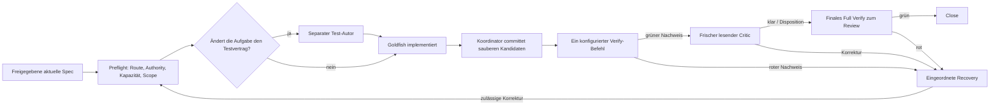

# Pipeline-Flow — der V3-Optionenführer

Diese Datei ist der **eine gepflegte visuelle Leitfaden für den nutzerseitigen
V3-Ablauf**. Sie hilft dir, einen Weg zu wählen und zu verstehen, wer was tut.
Sie erlaubt nicht, ein Gate zu überspringen oder ein Projekt zu verändern. Das
aktive PRD und die Spec definieren die Arbeit; das
[Operating Model](docs/operating-model.md), die `pipeline.user.yaml` des
Projekts, die optionale `.claude/pipeline.yaml` und die Projektkalibrierung auf ihrer
aufgelösten Autoritätsstufe (`project/pipeline.json`, sonst
`.claude/pipeline.json`) definieren den anwendbaren Vertrag. Bei einem
Widerspruch mit einer dieser Authority-Quellen gilt die jeweilige Authority.

## Hier beginnen: eine Änderung, ein ehrlicher Weg

Du bringst ein Ergebnis in klarer Sprache ein: einen Bugfix, ein Feature oder
ein sichereres Refactoring. Der **Elephant** formt daraus eine begrenzte
schriftliche Aufgabe; frische **Goldfish**-Kontexte implementieren begrenzte
Pakete; ein lesender **Critic** prüft das Ergebnis unabhängig. Du bleibst an den
Freigabe- und Eskalationspunkten menschlicher Entscheider.

Vier Begriffe verhindern die meisten Missverständnisse:

- Ein **Profil** (`epic`, `feature` oder `mini`) ist die V3-*Session-Hülle*. Es
  wählt die registrierte Route und die erlaubte Lifecycle-Zeremonie. Es ist kein
  Prioritätslabel und ersetzt keine Risikobewertung.
- **Rigor** (0, 1 oder 2) bestimmt, wie viel schriftliche Spezifikation eine
  Änderung verdient. **Risiko** (niedrig, mittel oder hoch) bestimmt, wie viel
  unabhängiges Review sie braucht. Eine winzige Guardrail-Änderung kann deshalb
  hohes Risiko haben.
- Ein **Sprint** ist eine Planungsgruppe für zusammenhängende Arbeit. Er ist
  kein Profil, wählt kein Modell und umgeht kein Gate.
- Eine **Phase** ist eine Lebenszyklusstelle: `design_phase` formt und
  genehmigt Arbeit, `execution_phase` liefert sie. Eine Phase ist kein Profil.

Bestätige zuerst das aktive Profil für diese Aufgabe und nutze dann vor der
Lieferarbeit `/pipeline-core:pipeline-start`. Seine Bestätigungszeile ist
der Bootstrap-Nachweis: Sie validiert V3-Quelle und Runtime-Projektion,
Kalibrierung, anwendbaren Status und das verfügbare Verify-Gate. Sie nutzt Profil
und Phase der aktiven Aufgabe; ein angefragtes Modell ist kein Nachweis des
tatsächlich gelaufenen Modells.

## Die Hauptreise

```mermaid
flowchart TD
    I[Absicht: Feature, Fix oder Refactoring] --> P{Aktives V3-Profil bestätigen}
    P --> B[Session mit diesem Profil bootstrappen]
    B -->|Epic oder Feature| A[Modellfreier Advisor-Capability-Preflight]
    B -->|Mini| T[Triage]
    A --> T
    T --> D{Design sinnvoll oder nötig?}
    D -->|ja| DS[Design-Phase: Optionen, gegebenenfalls UI und Akzeptanzkriterien]
    D -->|nein| RR[Rigor und Risiko festhalten]
    DS --> RR
    RR --> EL{Epic oder Feature?}
    EL -->|ja| AQ{Konkrete Advisor-Frage und Grund?}
    EL -->|nein (Mini)| S
    AQ -->|ja| AC[Bedarfsgebundene frische lesende Beratung]
    AQ -->|nein| S
    AC --> S
    S[PRD und Spec soweit nötig]
    S --> R{Readiness nötig oder gewählt?}
    R -->|ja| RD[Frisches lesendes Readiness-Review]
    RD -->|Lücken| S
    RD -->|reif| G{Explizite menschliche PRD-Freigabe nötig?}
    R -->|nein| G
    G -->|ja, freigegeben| X[Execution-Preflight und Dispatch]
    G -->|nein, gültiger Schnellweg| X
    X --> TA{Separate Test-Autorenaufgabe nötig?}
    TA -->|ja| TT[Test-Autor und Testvertrag]
    TA -->|nein| IM[Goldfish implementiert ein begrenztes Paket]
    TT --> IM
    IM --> CM[Koordinator integriert und committet; sauberer Kandidat]
    CM --> V[Konfiguriertes Verify liefert Maschinen-Nachweis]
    V -->|rot| RC[Ursache einordnen und recovern]
    V -->|grün| SQ{Security erforderlich?}
    SQ -->|ja| SEC[Security-Nachweis]
    SQ -->|nein| GQ{Governance erforderlich?}
    SEC --> GQ
    GQ -->|ja| GOV[Guideline- oder Policy-Prüfung]
    GQ -->|nein| C[Frischer unabhängiger Critic]
    GOV --> C
    C --> CR[Critic-Ergebnis und Disposition]
    CR -->|Korrektur nötig| RC
    CR -->|klar oder Disposition festgehalten| FV[Finales Full Verify zum reviewten Kandidaten]
    FV -->|rot| RC
    FV -->|grün| HA{Menschliche Abnahme erforderlich?}
    HA -->|nein| CL[Feature-Lifecycle abschließen]
    HA -->|ja| HD[Menschliche Entscheidung zum gelieferten Kandidaten]
    HD -->|angenommen| CL
    HD -->|abgelehnt| RC
    CL --> REL{Release-Phase deklariert?}
    REL -->|ja| RP[Release-Nachweis und menschliches Promotion-Gate]
    REL -->|nein| DONE[Änderung abgeschlossen]
    RP --> DONE
    RC -->|begrenzte Korrektur| X
    RC -->|Limit, Unklarheit oder Konflikt| PO[Menschliche Kursentscheidung oder Stopp]
    PO -->|neue Richtung freigegeben| T
```

Die Pfeile versprechen nicht, dass jede Änderung jede Box besucht. Die Tabellen
sagen, wann ein Zweig existiert, wer ihn besitzt, welcher Nachweis ihn real macht
und wo er wieder einmündet.

Skills machen Bootstrap, Beratung, Observation Intake, Review und Close
auffindbar; ein Skill genehmigt weder Plan noch Commit oder Release. Eine
V3-Route benennt Runner, Pflichtnachweis und Verhalten bei Nichtverfügbarkeit.
Prüfe ihre tatsächliche Verfügbarkeit auf dem aktuellen Host: eine deklarierte
Route ist noch kein erfolgreicher Dispatch, und ein angefragtes Modell belegt
nicht das effektiv gelaufene Modell. Die englische Fassung enthält die
[ausführliche Routen- und Evidenzgrenze](PIPELINE_FLOW.md#1-confirm-the-v3-profile-before-bootstrap).

## 1. Zuerst das V3-Profil wählen

| Profil | Einstieg, wenn | Owner | Nachweis / Schutz | Wiedereinstieg oder Stopp |
|---|---|---|---|---|
| `epic` | Die Arbeit Architektur, mehrere Blöcke oder ein breites koordiniertes Ergebnis umfasst. | Elephant; der Mensch entscheidet materiellen Scope. | Registrierte V3-`epic`-Route sowie modellfreier V2-Capability-Status und Assurance. Beratung erfolgt nur für eine konkrete Frage. | Direkt zur Triage. `unknown` oder `unavailable` dokumentiert den Capability-Status; es ist weder ein Bootstrap-Timeout noch ein Beratungsergebnis. |
| `feature` | Eine begrenzte Produktänderung trotzdem normale Design- und Lieferdisziplin braucht. | Elephant. | Registrierte V3-`feature`-Route sowie modellfreier V2-Capability-Status und Assurance. Beratung erfolgt nur für eine konkrete Frage. | Direkt zur Triage. SessionStart, Resume und Compact starten keinen Advisor. |
| `mini` | Es wirklich ein kleines, eng begrenztes Feature oder ein Hotfix ist. | Elephant. | V3-`mini`-Route; Beratung ist absichtlich deaktiviert. Die leichte Grenze umfasst etwa fünf Dateien, keine Guardrail-/Canon-Dateien und keine neue Abhängigkeit. | Leichten Pfad fortsetzen. Wächst der Scope oder erscheint eine geschützte Oberfläche, zu `feature` oder `epic` eskalieren und den vollen Pfad erneut betreten. |

Das Profil kommt aus aktivem Feature und Aufgabenform, nicht aus einem alten
`advisor`-, `design-first`- oder `speed`-Label. Das sind keine V3-Profile.

## 2. Umfang von Design und Review entscheiden

| Entscheidung | Einstiegsbedingung | Owner | Nachweis | Wiedereinstieg |
|---|---|---|---|---|
| Optionale Design-Phase | Problem, Alternativen, User Experience, Architektur oder Aufgabenschnitt brauchen bewusste Exploration. | Elephant; der Mensch entscheidet materielle Abwägungen. | Schriftliche Optionen, gewählte Richtung, Nicht-Ziele und Akzeptanzkriterien. | Rigor-/Risiko-Triage, dann PRD/Spec. |
| Rigor 0 | Eine echte kleine, reversible Änderung ohne Architektur-, Schema-, öffentliche API-, Test-, Guardrail-, Abhängigkeits- oder Security-Oberflächenwirkung. | Elephant. | Kurzes begrenztes Briefing und normaler Verify-Nachweis. | Execution-Preflight; kein voller PRD-Pfad, außer das Risiko verlangt ihn trotzdem. |
| Rigor 1 | Eine normale Änderung braucht eine Delta-Spec mit prüfbaren Akzeptanzkriterien. | Elephant. | Aktuelles PRD/Spec und nötigenfalls ausdrückliche Freigabe. | Readiness/Freigabe, dann Execution. |
| Rigor 2 | Architektur-, Guardrail-, Core-Contract- oder sonst substanzielle Arbeit. | Elephant und Mensch am Freigabe-Gate. | Gepflegte Spec, verpflichtendes Readiness-Ergebnis, ausdrückliche PRD-Freigabe und aktuelle Bindungen. | Execution erst nach allen erforderlichen Nachweisen. |
| Hohes Risiko | Sensible Security-, Guardrail-, Architektur-, irreversible, kostspielige oder extern sichtbare Wirkung — unabhängig von Zeilenzahl. | Elephant klassifiziert; Mensch klärt unklare Stakes. | Festgehaltenes Risiko, stärkere Critic-Route und konfigurierte Security-Nachweise. | Critic- und menschliche Gates gelten vor Close. |

**PRD, Spec und Readiness.** Ein PRD beschreibt Produktabsicht; eine Spec den
implementierbaren Vertrag und die Akzeptanzkriterien. Ausdrückliche menschliche
PRD-Freigabe ist bei Rigor 1 oder 2 sowie bei hohem Risiko Pflicht. Ein
Readiness-Review ist bei Rigor 2, Architektur-/Guardrail-/Core-Contract-Arbeit
oder hohem Risiko Pflicht; sonst kann der Elephant es wählen. Ein frischer
lesender Reviewer muss das Dokument allein verstehen und umsetzen können. Lücken
gehen zurück in die Spec, dann prüft ein *neuer* Reviewer erneut. Weder eine
optionale Readiness-Entscheidung noch ein `mini`-Profil umgehen eine verpflichtende
Freigabe.

## 3. In unabhängig prüfbaren Paketen liefern

Für eine auditrelevante Lieferung wird der kandidatengebundene Verify-Receipt
mit dem Paket aufbewahrt: Er benennt Befehl, Kandidat, Tree, Suites und
Ergebnis. Ein roter, übersprungener, veralteter oder nicht passender Receipt
ist Nachweis seiner Grenze, kein grünes Ergebnis. [Audit und
Evidenz](docs/audit-and-evidence.md) erklärt Paketinhalt und Nicht-Claims.



| Schritt | Owner | Bedeutung | Nachweis und Grenze |
|---|---|---|---|
| Guardrails | Installierte Runner-Integration und Projektkonfiguration. | Konfigurierte Command- und Write-Path-Schutzmaßnahmen können unsichere Aktionen verweigern. | Claude und Antigravity haben die dokumentierte Hook-Integration; daraus folgen keine solchen Hooks auf Codex. |
| Codex-Host-Bridge | Codex-Host und Plugin-Integration. | Die Bridge wendet nur die Command- und Write-Path-Policy an, die ihr Host anbietet. | Host-Lifecycle-Evidenz bleibt erforderlich; weder hostunabhängiges Enforcement noch Modellidentität werden behauptet. |
| Preflight | Elephant und deterministische Checks. | Aktuelles PRD/Spec, Profil-/Phasenroute, Kapazität, Scope und Authority-Bindungen passen weiterhin zusammen. | Ein Mismatch vertagt oder öffnet eine Kursentscheidung; er wird nie zum informellen Dispatch. |
| Test-Autor — optional | Eine separat gebriefte Test-Autoren-Duty. | Nutze sie, wenn sich Test- oder Gate-Vertrag selbst ändern muss. | Der Implementierende schwächt oder schreibt die Tests nicht um, die seine Umsetzung bewerten. Sein Ergebnis ist separat prüfbar. |
| Implementieren | Goldfish. | Ein frisches, eigenständiges Implementierungspaket. Unabhängige Pakete dürfen parallel laufen, wenn Dateien und Daten nicht überlappen. | Ein Sechs-Felder-Briefing liefert Ziel, Kontext, Definition of Done, Verbote, Stopp-Bedingungen und Dispatch-Metadaten. |
| Kandidaten-Commit | Koordinator oder autorisierter Host nach Prüfung der Rückgabe. | Begrenztes Ergebnis integrieren und vor kandidatengebundenem Verify einen sauberen Commit-Kandidaten schaffen. | Tatsächlichen Commit und Tree festhalten; ein vorgeschlagener Child-Commit oder schmutziger Checkout ersetzt sie nicht. |
| Verify — Pflicht | Der Koordinator ruft den konfigurierten Evidence-Producer für den committeten Kandidaten auf. | Für Releases fährt der Producer den einen konfigurierten Projektbefehl; dokumentierte grenzbewusste Modi fahren die feste Baseline plus registrierte Befehle für geänderte Bereiche. Der Projektbefehl allein erzeugt keinen Verify-Receipt. | Grün heißt: Der Producer hat ein exaktes maschinell geschriebenes Nachweis-Artefakt für den Kandidaten geschrieben. Rot ist Fehlernachweis, kein Teilerfolg. |
| Critic — Pflicht | Frischer lesender Critic; Elephant besitzt die Disposition. | Der Critic bekommt Verweise auf Kandidat, Spec, Guardrails und Nachweis — nicht den Implementierungschat oder dessen Begründung. | Er läuft nach deterministischen Checks. Befunde brauchen Nachweis, Regel/Kriterium und Konsequenz. Eine Korrektur erhält ein frisches Delta-Re-Gate. Die Goldfish-Lieferung bleibt ohne unabhängigen Critic-Nachweis als Review-ausstehend markiert. |
| Finales Verify — Pflicht für Releases | Der Koordinator führt nach dem substanziellen Critic-Review den vollständigen Evidence-Producer aus. | Der Release-Receipt bindet den reviewten Kandidaten und das konsumierte Critic-Paket; Korrekturen gehen erneut durch das Review. | Vor Close oder Promotion braucht der exakte Commit einen grünen finalen Receipt. |

Jedes Projekt verwendet den einen vollständigen `verify`-Befehl seiner eigenen
Kalibrierung. Für Nicht-Release-Grenzen darf der Evidence-Producer seine feste
Baseline plus registrierte Impact-Befehle ausführen; dies erlaubt nicht, einen
vollständigen Befehl durch einen bequemen Teilbefehl zu ersetzen. [Passenden Modus und geprüfte Basis
wählen](docs/usage.md#verify-a-consumer-project).
Maintainer finden den Release-Ablauf dieses Source-Checkouts im
[Push- und Release-Ablauf](docs/push-release-flow.md).

## 4. Optionale Zweige sind explizit, nicht implizit

| Zweig | Er existiert nur, wenn | Owner | Nachweis | Wiedereinstieg / Terminalzustand |
|---|---|---|---|---|
| Security | Das Manifest die Security-Phase deklariert oder Aufgabenrisiko die konfigurierten Checks verlangt. | Deterministischer Security-Harness; Elephant besitzt die Disposition. | Scanner-Status und exakter Kandidaten-Nachweis. `SKIPPED` ist nicht `PASS`; `ERROR` schlägt fail-closed fehl. | Policy-akzeptables Ergebnis mündet in Critic/Close ein. Befunde oder nicht verfügbare Pflicht-Checks gehen in Recovery oder Stopp. |
| UI-Design | Das Projekt UI-Arbeit (`has_ui`) hat oder die Aufgabe UI-Design deklariert. | Elephant und zuständiger Design-Owner; Mensch entscheidet materielle Experience-Abwägungen. | Design-Entscheidung und UI-Akzeptanzkriterien, nicht nur eine visuelle Behauptung. | Vor der Umsetzung wieder in Spec/Readiness einmünden. Kein UI-Zweig impliziert kein UI-Review. |
| Governance | Das Projekt Guidelines oder Policies unter seinen Governance-Pfaden konfiguriert. | Projekt-/Team-Owner liefert Regeln; Elephant wendet sie auf die Aufgabe an. | Gültige konfigurierte Inputs, deklarierter Policy-Modus und daraus entstehender Review-/Gate-Nachweis. | Beratende Guidelines informieren Design; erzwingende Vorgaben münden im passenden Gate ein oder blocken. Das ist kein zentrales IAM und keine Control Plane. |
| Release / Promotion | Das Projekt eine `release`-Sektion deklariert. | Release-Adapter und menschliches Promotion-Gate. | Nachweis je Umgebung, Rollback-Anker und Deploy-Log-Eintrag. | Test-Promotion geht Produktionsfreigabe voraus. Ohne `release`-Sektion existiert der Zweig nicht und kostet nichts. |
| Menschliche Abnahme | Kalibrierung oder Stakes finale Abnahme verlangen. | Menschlicher Entscheider. | Ausdrückliche Abnahme des gelieferten Kandidaten. | Lieferung und Abnahme bleiben getrennt; Ablehnung startet einen neuen Kandidaten oder Kursentscheidung. |

## Integrations- und Update-Grenzen

Unabhängige Pakete dürfen nur parallel laufen, wenn Dateien und State nicht
überlappen. Die Integration hebt den ausdrücklich ausgewählten merge-bereiten
Sprint vor; geschützte oder überlappende Baseline-Änderungen brauchen zuvor eine
begrenzte Auswirkungsprüfung. Siehe [parallele Arbeit](docs/parallel-work.md).

Update-Kanäle wählen einen deklarierten Alpha-, Beta- oder Stable-Kanal und
einen sanktionierten lokalen Override. Verfügbarkeit ist read-only Information;
die Auswahl installiert, aktiviert oder verifiziert kein Update.

## 5. Bewusst abschließen; begrenzt recovern

**Close** heißt nicht nur „der Code ist gemergt“. Es synchronisiert
Verify-Nachweis, Result/State, Handover, Dokumentation, Telemetrie und
Selbst-Retro. Ist der aktive Feature-Lifecycle vollständig beendet, dient
`/pipeline-core:close-feature` seinem Abschluss. `/pipeline-core:close-block`
ist ausschließlich für ein gestopptes Thema oder einen echten Runtime-Transfer
vorgesehen. Hat ein Projekt einen Release-Zweig, folgt Release/Promotion der
Close-Grenze unter eigenen Nachweis- und Freigaberegeln.

| Situation | Owner | Zulässige Recovery | Wiedereinstieg / Stopp |
|---|---|---|---|
| Deterministisches Gate ist rot mit bekannter Produktursache | Goldfish, dann Elephant. | Ein automatischer Produkt-Retry für dieselbe Ursache (insgesamt zwei Versuche). | Ein bestandener Retry kehrt zum deterministischen Gate/normalen Review zurück. Der zweite Fehlschlag öffnet eine menschliche Kursentscheidung. |
| Vertrauenswürdiger Umgebungsfehler vor Produktarbeit | Elephant. | Ein enger frischer Umgebungs-Failover mit eingefrorener Authority und ohne Delegation. | Bei Erfolg begrenzte Arbeit fortsetzen; bei weiterem Fehler oder unbewiesener Ursache für Kursentscheidung stoppen. |
| Critic-Befund braucht semantische Korrektur | Elephant dispatcht eine frische Korrektur. | Eine frische Nachprüfung nach dem ersten blockierenden Ergebnis. | Eine bestandene Nachprüfung führt zu Close zurück. Bleibt ein blockierender Befund, prüft der Elephant die nächste Korrektur selbst; keine dritte Critic-Runde. |
| Spec-, Scope-, Nachweis- oder Authority-Drift | Elephant und nötigenfalls Mensch. | Neu planen oder freigeben; alte Freigabe nie in einen veränderten Vertrag tragen. | Zur Triage, Spec, Readiness oder Freigabe zurück — je nachdem, was veraltet ist. |
| Unbekannte Ursache, wiederholte Signatur, erschöpftes Budget oder Konflikt | Menschlicher Entscheider. | Mit neuer Richtung fortsetzen, verschieben oder stoppen. | Keine endlose Retry-Schleife und kein Erfolg ohne erforderliche Nachweise. |

Migrationsbefehle für die Pipeline-Source gehören in den gelegentlichen
Maintainer-Pfad und nicht in diesen Consumer-Lifecycle. [SETUP](SETUP.md)
beschreibt diesen Pfad sowie die geordnete Runner-Bindung, den Neustart, die
Klassifizierung und die Übernahme eines Projekts.

## Optionale Ausführungs- und Host-Grenzen

Der Claude-spezifische AFK-Worker kann nach Aktivierung einen begrenzten
Analyse-Vorschlag aus freigegebenen Repository-Eingaben liefern. Er führt
keine Befehle aus, ändert keine Dateien und erteilt keine Freigaben.
Lokale Worker-Aufsicht ist ein optionaler Host-Vorgang; ein Provider-Worker
braucht ein eigenes ausdrückliches Flag. Daraus folgt weder OS-Isolation noch
ein Standard für Hintergrundausführung.

Bewahre für prüfbare Lieferungen den kandidatengebundenen Verify-Beleg auf.
Rot, übersprungen, veraltet oder nicht passend bedeutet nicht grün; die
[Audit- und Evidenzgrenzen](docs/audit-and-evidence.md) gelten weiter. Wo
Claude- oder Antigravity-Hooks aktiv installiert sind, prüfen konfigurierte
Guards Host-Aktionen. Codex nutzt nur die Command- und Write-Path-Kontrollen,
die sein Host-Bridge tatsächlich bereitstellt; gleiche Hook-Ereignisse oder
universelle Durchsetzung sind damit nicht behauptet. Einzelheiten stehen in
der [englischen Host-Grenzen-Referenz](PIPELINE_FLOW.md#optional-execution-and-host-boundary-reference).

## Supportgrenze und aktueller Scope

Dieser Leitfaden beschreibt den V3-Prozess und seine
Konfigurationspunkte. Er macht aus einer Repository-Regel keine hostweite
Durchsetzung, aus einem Governance-Pfad kein IAM, aus einer angefragten Route
keine beobachtete Modellidentität und aus einem Maschinen-Gate keinen Beweis
jeder semantischen Eigenschaft.

`0.7.0` beschreibt ein noch nicht veröffentlichtes Source- und Plugin-
Release, keinen verfügbaren Tag oder Installationspfad. Nutze die freigegebene
veröffentlichte Version und prüfe die geladene Host-Version, bevor du eine
Route wählst. Den detaillierten Implementierungs- und Abnahmestand hält der
[Überblick](docs/overview.md) fest.

Normative Details stehen im [Operating Model](docs/operating-model.md). Für
Adoption und Migration nutze [SETUP.md](SETUP.md) und
[docs/migration.md](docs/migration.md). Für den optionalen Deploy-Ausklang siehe
[docs/deploy/README.md](docs/deploy/README.md).
