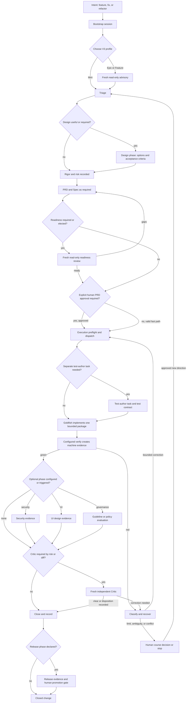
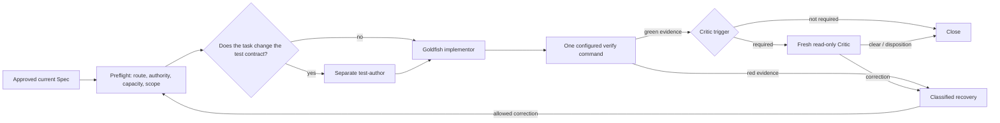
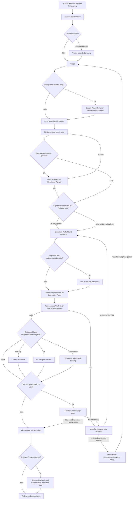
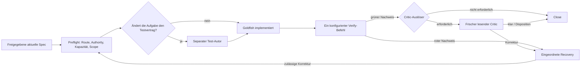

# Pipeline Flow — the V3 option guide

> _A German reader version follows below · Eine deutsche Lesefassung folgt weiter unten._

This is the **one maintained visual guide to the user-facing V3 flow**. It helps
you choose a route and understand who does what. It is not permission to skip a
gate or change a project. The active PRD and Spec define the work; the
[Operating Model](docs/operating-model.md), the project's `pipeline.user.yaml`,
`.claude/pipeline.yaml`, and `.claude/pipeline.json` define the applicable
contract. If this guide disagrees with one of them, use that source.

## Start here: one change, one honest route

Bring an outcome in plain language: a bug to fix, a feature to add, or a
refactor to make safer. The **Elephant** turns it into a bounded written task;
fresh **Goldfish** contexts implement bounded packages; a read-only **Critic**
checks the result independently. You remain the human decision-maker at the
approval and escalation points.

Four terms prevent most confusion:

- A **profile** (`epic`, `feature`, or `mini`) is the V3 *session envelope*. It
  selects the registered route and allowable lifecycle ceremony. It is not a
  priority label and it does not replace risk assessment.
- **Rigor** (0, 1, or 2) decides how much written specification a change earns.
  **Risk** (low, medium, or high) decides how much independent review it needs.
  A tiny guardrail change can therefore be high risk.
- A **Sprint** is a planning grouping for related work. It is not a profile and
  does not select a model or bypass a gate.
- A **Phase** is a lifecycle position: `design_phase` shapes and approves work;
  `execution_phase` delivers it. A phase is not a profile.

Use `/pipeline-core:pipeline-start` before work. Its confirmation is bootstrap
evidence: it validates the V3 source/runtime projection, calibration, applicable
state, and available verify gate. It uses the active profile and phase; a
requested model is not proof of the model that actually ran.

## The primary journey



The arrows do not promise that every change visits every box. The tables state
when a branch exists, who owns it, the evidence that makes it real, and where it
returns.

## 1. Choose the V3 profile first

| Profile | Enter it when | Owner | Evidence / guard | Rejoin or stop |
|---|---|---|---|---|
| `epic` | Work spans architecture, several blocks, or a broad coordinated outcome. | Elephant; human decides material scope. | Registered V3 `epic` route and an answered fresh read-only advisory receipt. | Continue to triage. Missing or stale advisory evidence stops writable work. |
| `feature` | A bounded product change still needs normal design and delivery discipline. | Elephant. | Registered V3 `feature` route and an answered fresh read-only advisory receipt. | Continue to triage. Missing or stale advisory evidence stops writable work. |
| `mini` | A genuinely small, tightly bounded feature or hotfix. | Elephant. | V3 `mini` route; advisory is deliberately disabled. The light boundary is about five files, no guardrail/canonical files, and no new dependency. | Continue on the light path. If scope grows or a protected surface appears, escalate to `feature` or `epic` and re-enter the full path. |

Profile comes from the active feature and task shape, not from an old
`advisor`, `design-first`, or `speed` label. Those are not V3 profiles.

## 2. Decide the amount of design and review

| Decision | Enter condition | Owner | Evidence | Rejoin |
|---|---|---|---|---|
| Optional design phase | The problem, alternatives, user experience, architecture, or task cut needs deliberate exploration. | Elephant; human decides material trade-offs. | Written options, chosen direction, non-goals, and acceptance criteria. | Rigor/risk triage, then PRD/Spec. |
| Rigor 0 | A genuine tiny, reversible change with no architecture, schema, public API, test, guardrail, dependency, or security-surface impact. | Elephant. | Short bounded brief and normal verify evidence. | Execution preflight; no full PRD path unless risk still requires it. |
| Rigor 1 | A normal change needs a delta Spec with checkable acceptance criteria. | Elephant. | Current PRD/Spec and explicit approval where required. | Readiness/approval, then execution. |
| Rigor 2 | Architecture, guardrail, core-contract, or otherwise substantial work. | Elephant and human at the approval gate. | Maintained Spec, mandatory readiness result, explicit PRD approval, and current bindings. | Execution only after all required evidence is current. |
| High risk | Sensitive security, guardrail, architecture, irreversible, costly, or externally visible impact — regardless of line count. | Elephant classifies; human resolves ambiguous stakes. | Recorded risk, stronger Critic route, and configured security evidence. | Critic and human gates apply before close. |

**PRD, Spec, and readiness.** A PRD expresses product intent; a Spec expresses
the implementable contract and acceptance criteria. Explicit human PRD approval
is mandatory for rigor 1 or 2, and for high risk. A readiness review is mandatory
for rigor 2, architecture/guardrail/core-contract work, or high risk; otherwise
the Elephant may elect it. A fresh, read-only reviewer must be able to understand
and implement the document from the document alone. Gaps return to the Spec, then
a *new* reviewer checks it again. Neither an optional readiness decision nor a
`mini` profile bypasses a mandatory approval.

## 3. Deliver in independently checkable packages



| Step | Owner | Meaning | Evidence and boundary |
|---|---|---|---|
| Preflight | Elephant and deterministic checks. | Current PRD/Spec, profile/phase route, capacity, scope, and authority bindings still match. | A mismatch defers or opens a course decision; it never becomes an informal dispatch. |
| Test author — optional | A separately briefed test-author duty. | Use it when the test or gate contract itself must change. | The implementor does not weaken or rewrite the tests that judge its own implementation. Its output is separately reviewable. |
| Implement | Goldfish. | One fresh-context, self-contained implementation package. Independent packages may run in parallel when files and data do not overlap. | A six-field briefing supplies goal, context, Definition of Done, prohibitions, stop conditions, and dispatch metadata. |
| Verify — mandatory | Goldfish runs the configured project gate. | The one project command runs the deterministic chain that applies to that project. | Green means an exact machine-written evidence artifact exists. Red is evidence of failure, not partial success. |
| Critic — conditional | Fresh read-only Critic; Elephant owns disposition. | The Critic receives references to candidate, Spec, guardrails, and evidence — not implementation chat or rationale. | It runs after deterministic checks. Findings need evidence, a rule/criterion, and a consequence. A correction gets a fresh delta re-gate. |

In this repository the configured full gate is
`node harness/scripts/verify.mjs`. Adopting projects use the one `verify` command
named by their own calibration; do not substitute a convenient partial command and
call it equivalent.

## 4. Optional branches are explicit, not implied

| Branch | It exists only when | Owner | Evidence | Rejoin / terminal state |
|---|---|---|---|---|
| Security | The manifest declares the security phase or task risk requires its configured checks. | Deterministic security harness; Elephant owns disposition. | Scanner status and exact-candidate evidence. `SKIPPED` is not `PASS`; `ERROR` fails closed. | A policy-acceptable result rejoins Critic/close. Findings or unavailable required checks enter recovery or stop. |
| UI design | The project has UI work (`has_ui`) or the task declares UI design. | Elephant and the appropriate design owner; human decides material experience trade-offs. | Design decision and UI acceptance criteria, not a visual assertion alone. | Rejoin Spec/readiness before implementation. No UI branch means no implied UI review. |
| Governance | The project configures guidelines or policies under its governance paths. | Project/team owner supplies rules; Elephant applies them to the task. | Valid configured inputs, declared policy mode, and resulting review/gate evidence. | Advisory guidance informs design; enforcing requirements rejoin the relevant gate or block. This is not central IAM or a control plane. |
| Release / promotion | The project declares a `release` section. | Release adapter and human promotion gate. | Per-environment evidence, rollback anchor, and deploy-log record. | Test promotion precedes production approval. Without a `release` section, this branch does not exist and adds no cost. |
| Human acceptance | Calibration or stakes require final acceptance. | Human decision-maker. | Explicit acceptance of the delivered candidate. | Delivery and acceptance remain distinct; rejection starts a new candidate or course decision. |

## 5. Close deliberately; recover with a bound

**Close** is not merely “the code merged.” It synchronizes verify evidence,
result/state, handover, documentation, telemetry, and a self-retro.
`/pipeline-core:close-block` is the supported close ritual. If a project has a
release branch, release/promotion follows the close boundary under its own
evidence and approval rules.

| Situation | Owner | Allowed recovery | Rejoin / stop |
|---|---|---|---|
| Deterministic gate is red with a known product cause | Goldfish, then Elephant. | One automatic product retry at the same cause (two total attempts). | A passing retry returns to the deterministic gate/normal review. A second failure opens a human course decision. |
| Trusted environment fault before product work | Elephant. | One narrow, fresh environment failover with frozen authority and no delegation. | On success resume bounded work; on another fault or an unproven cause, stop for a course decision. |
| Critic finding needs semantic correction | Elephant dispatches a fresh correction. | At most three local rework cycles, each followed by an independent delta re-gate. | A green delta returns to close. A fourth correction is not automatic: human course decision. |
| Spec, scope, evidence, or authority drift | Elephant and human as needed. | Re-plan or re-approve; never carry stale approval into a changed contract. | Return to triage, Spec, readiness, or approval — whichever became stale. |
| Unknown cause, repeated signature, exhausted budget, or conflict | Human decision-maker. | Continue with a new direction, defer, or stop. | No unbounded retry loop and no success claim without required evidence. |

## Configure V3 without hand-editing projections

`pipeline.user.yaml` is the V3 source of routing intent. Generated runtime
projection files are not a second configuration surface. When a V3 source needs
the sanctioned migration/apply path, review the plan, activate it, then read it
back:

```sh
node plugins/pipeline-core/scripts/runner-profile-migration-v3.mjs plan --root "$PWD"
node plugins/pipeline-core/scripts/runner-profile-migration-v3.mjs apply --root "$PWD" --activate
node setup.mjs
```

The first command lets you inspect the planned projection; the second is explicit
activation; `node setup.mjs` confirms that source and generated runtime projection
are current and performs no writes. If a step reports drift or an invalid source,
stop rather than editing generated `.claude` bytes by hand.

## Support boundary and current scope

This guide describes the released V3 process and its configuration points. It does
not turn a repository rule into host-wide enforcement, a governance path into IAM,
a requested route into observed model identity, or a machine gate into proof of
every semantic property.

The in-progress Hawkeye packages are not release claims in this document:

- **HAW-S** is a candidate for Codex sandbox-compatibility selection; it is not
  claimed as released merely because a local candidate or its tests exist.
- **HAW-U** (the display-only `roles.po.display_label`) and **HAW-B** (the
  bounded, descriptor-bound session keep-awake controller) are implemented
  candidate slices. They become a support promise only with the Hawkeye
  release that carries them; neither changes authority or bypasses a host
  boundary.
- **HAW-C** currently provides public policy validation, private immutable
  binding storage, and a candidate-bound lifecycle evaluation. A complete
  regulated-document adapter, renderer, and release evidence chain are still
  not a user-facing support promise.

For normative detail, see the [Operating Model](docs/operating-model.md). For
adoption and migration, use [SETUP.md](SETUP.md) and
[docs/migration.md](docs/migration.md). For the optional deploy tail, see
[docs/deploy/README.md](docs/deploy/README.md).
---

<!-- DE-REFERENCE-BELOW | agents: skip everything below this line; it is a full German reference translation (redundant, wastes context). The authoritative content is the English above. Convention: CLAUDE.md (Language). -->

# Pipeline-Flow — der V3-Optionenführer

Diese Datei ist der **eine gepflegte visuelle Leitfaden für den nutzerseitigen
V3-Ablauf**. Sie hilft dir, einen Weg zu wählen und zu verstehen, wer was tut.
Sie erlaubt nicht, ein Gate zu überspringen oder ein Projekt zu verändern. Das
aktive PRD und die Spec definieren die Arbeit; das
[Operating Model](docs/operating-model.md), die `pipeline.user.yaml` des
Projekts, `.claude/pipeline.yaml` und `.claude/pipeline.json` definieren den
anwendbaren Vertrag. Bei einem Widerspruch gilt diese Quelle.

## Hier beginnen: eine Änderung, ein ehrlicher Weg

Du bringst ein Ergebnis in klarer Sprache ein: einen Bugfix, ein Feature oder
ein sichereres Refactoring. Der **Elephant** formt daraus eine begrenzte
schriftliche Aufgabe; frische **Goldfish**-Kontexte implementieren begrenzte
Pakete; ein lesender **Critic** prüft das Ergebnis unabhängig. Du bleibst an den
Freigabe- und Eskalationspunkten menschlicher Entscheider.

Vier Begriffe verhindern die meisten Missverständnisse:

- Ein **Profil** (`epic`, `feature` oder `mini`) ist die V3-*Session-Hülle*. Es
  wählt die registrierte Route und die erlaubte Lifecycle-Zeremonie. Es ist kein
  Prioritätslabel und ersetzt keine Risikobewertung.
- **Rigor** (0, 1 oder 2) bestimmt, wie viel schriftliche Spezifikation eine
  Änderung verdient. **Risiko** (niedrig, mittel oder hoch) bestimmt, wie viel
  unabhängiges Review sie braucht. Eine winzige Guardrail-Änderung kann deshalb
  hohes Risiko haben.
- Ein **Sprint** ist eine Planungsgruppe für zusammenhängende Arbeit. Er ist
  kein Profil, wählt kein Modell und umgeht kein Gate.
- Eine **Phase** ist eine Lebenszyklusstelle: `design_phase` formt und
  genehmigt Arbeit, `execution_phase` liefert sie. Eine Phase ist kein Profil.

Nutze vor der Arbeit `/pipeline-core:pipeline-start`. Seine Bestätigungszeile ist
der Bootstrap-Nachweis: Sie validiert V3-Quelle und Runtime-Projektion,
Kalibrierung, anwendbaren Status und das verfügbare Verify-Gate. Sie nutzt Profil
und Phase der aktiven Aufgabe; ein angefragtes Modell ist kein Nachweis des
tatsächlich gelaufenen Modells.

## Die Hauptreise



Die Pfeile versprechen nicht, dass jede Änderung jede Box besucht. Die Tabellen
sagen, wann ein Zweig existiert, wer ihn besitzt, welcher Nachweis ihn real macht
und wo er wieder einmündet.

## 1. Zuerst das V3-Profil wählen

| Profil | Einstieg, wenn | Owner | Nachweis / Schutz | Wiedereinstieg oder Stopp |
|---|---|---|---|---|
| `epic` | Die Arbeit Architektur, mehrere Blöcke oder ein breites koordiniertes Ergebnis umfasst. | Elephant; der Mensch entscheidet materiellen Scope. | Registrierte V3-`epic`-Route und ein beantworteter frischer lesender Beratungsbeleg. | Weiter zur Triage. Fehlender oder veralteter Beratungsnachweis stoppt schreibende Arbeit. |
| `feature` | Eine begrenzte Produktänderung trotzdem normale Design- und Lieferdisziplin braucht. | Elephant. | Registrierte V3-`feature`-Route und ein beantworteter frischer lesender Beratungsbeleg. | Weiter zur Triage. Fehlender oder veralteter Beratungsnachweis stoppt schreibende Arbeit. |
| `mini` | Es wirklich ein kleines, eng begrenztes Feature oder ein Hotfix ist. | Elephant. | V3-`mini`-Route; Beratung ist absichtlich deaktiviert. Die leichte Grenze umfasst etwa fünf Dateien, keine Guardrail-/Canon-Dateien und keine neue Abhängigkeit. | Leichten Pfad fortsetzen. Wächst der Scope oder erscheint eine geschützte Oberfläche, zu `feature` oder `epic` eskalieren und den vollen Pfad erneut betreten. |

Das Profil kommt aus aktivem Feature und Aufgabenform, nicht aus einem alten
`advisor`-, `design-first`- oder `speed`-Label. Das sind keine V3-Profile.

## 2. Umfang von Design und Review entscheiden

| Entscheidung | Einstiegsbedingung | Owner | Nachweis | Wiedereinstieg |
|---|---|---|---|---|
| Optionale Design-Phase | Problem, Alternativen, User Experience, Architektur oder Aufgabenschnitt brauchen bewusste Exploration. | Elephant; der Mensch entscheidet materielle Abwägungen. | Schriftliche Optionen, gewählte Richtung, Nicht-Ziele und Akzeptanzkriterien. | Rigor-/Risiko-Triage, dann PRD/Spec. |
| Rigor 0 | Eine echte kleine, reversible Änderung ohne Architektur-, Schema-, öffentliche API-, Test-, Guardrail-, Abhängigkeits- oder Security-Oberflächenwirkung. | Elephant. | Kurzes begrenztes Briefing und normaler Verify-Nachweis. | Execution-Preflight; kein voller PRD-Pfad, außer das Risiko verlangt ihn trotzdem. |
| Rigor 1 | Eine normale Änderung braucht eine Delta-Spec mit prüfbaren Akzeptanzkriterien. | Elephant. | Aktuelles PRD/Spec und nötigenfalls ausdrückliche Freigabe. | Readiness/Freigabe, dann Execution. |
| Rigor 2 | Architektur-, Guardrail-, Core-Contract- oder sonst substanzielle Arbeit. | Elephant und Mensch am Freigabe-Gate. | Gepflegte Spec, verpflichtendes Readiness-Ergebnis, ausdrückliche PRD-Freigabe und aktuelle Bindungen. | Execution erst nach allen erforderlichen Nachweisen. |
| Hohes Risiko | Sensible Security-, Guardrail-, Architektur-, irreversible, kostspielige oder extern sichtbare Wirkung — unabhängig von Zeilenzahl. | Elephant klassifiziert; Mensch klärt unklare Stakes. | Festgehaltenes Risiko, stärkere Critic-Route und konfigurierte Security-Nachweise. | Critic- und menschliche Gates gelten vor Close. |

**PRD, Spec und Readiness.** Ein PRD beschreibt Produktabsicht; eine Spec den
implementierbaren Vertrag und die Akzeptanzkriterien. Ausdrückliche menschliche
PRD-Freigabe ist bei Rigor 1 oder 2 sowie bei hohem Risiko Pflicht. Ein
Readiness-Review ist bei Rigor 2, Architektur-/Guardrail-/Core-Contract-Arbeit
oder hohem Risiko Pflicht; sonst kann der Elephant es wählen. Ein frischer
lesender Reviewer muss das Dokument allein verstehen und umsetzen können. Lücken
gehen zurück in die Spec, dann prüft ein *neuer* Reviewer erneut. Weder eine
optionale Readiness-Entscheidung noch ein `mini`-Profil umgehen eine verpflichtende
Freigabe.

## 3. In unabhängig prüfbaren Paketen liefern



| Schritt | Owner | Bedeutung | Nachweis und Grenze |
|---|---|---|---|
| Preflight | Elephant und deterministische Checks. | Aktuelles PRD/Spec, Profil-/Phasenroute, Kapazität, Scope und Authority-Bindungen passen weiterhin zusammen. | Ein Mismatch vertagt oder öffnet eine Kursentscheidung; er wird nie zum informellen Dispatch. |
| Test-Autor — optional | Eine separat gebriefte Test-Autoren-Duty. | Nutze sie, wenn sich Test- oder Gate-Vertrag selbst ändern muss. | Der Implementierende schwächt oder schreibt die Tests nicht um, die seine Umsetzung bewerten. Sein Ergebnis ist separat prüfbar. |
| Implementieren | Goldfish. | Ein frisches, eigenständiges Implementierungspaket. Unabhängige Pakete dürfen parallel laufen, wenn Dateien und Daten nicht überlappen. | Ein Sechs-Felder-Briefing liefert Ziel, Kontext, Definition of Done, Verbote, Stopp-Bedingungen und Dispatch-Metadaten. |
| Verify — Pflicht | Goldfish fährt das konfigurierte Projekt-Gate. | Der eine Projektbefehl fährt die deterministische Kette, die für dieses Projekt gilt. | Grün heißt: Ein exaktes maschinell geschriebenes Nachweis-Artefakt existiert. Rot ist Fehlernachweis, kein Teilerfolg. |
| Critic — bedingt | Frischer lesender Critic; Elephant besitzt die Disposition. | Der Critic bekommt Verweise auf Kandidat, Spec, Guardrails und Nachweis — nicht den Implementierungschat oder dessen Begründung. | Er läuft nach deterministischen Checks. Befunde brauchen Nachweis, Regel/Kriterium und Konsequenz. Eine Korrektur erhält ein frisches Delta-Re-Gate. |

In diesem Repository ist das konfigurierte volle Gate
`node harness/scripts/verify.mjs`. Übernehmende Projekte verwenden den einen
`verify`-Befehl ihrer Kalibrierung; ersetze ihn nicht durch einen bequemen
Teilbefehl und nenne ihn gleichwertig.

## 4. Optionale Zweige sind explizit, nicht implizit

| Zweig | Er existiert nur, wenn | Owner | Nachweis | Wiedereinstieg / Terminalzustand |
|---|---|---|---|---|
| Security | Das Manifest die Security-Phase deklariert oder Aufgabenrisiko die konfigurierten Checks verlangt. | Deterministischer Security-Harness; Elephant besitzt die Disposition. | Scanner-Status und exakter Kandidaten-Nachweis. `SKIPPED` ist nicht `PASS`; `ERROR` schlägt fail-closed fehl. | Policy-akzeptables Ergebnis mündet in Critic/Close ein. Befunde oder nicht verfügbare Pflicht-Checks gehen in Recovery oder Stopp. |
| UI-Design | Das Projekt UI-Arbeit (`has_ui`) hat oder die Aufgabe UI-Design deklariert. | Elephant und zuständiger Design-Owner; Mensch entscheidet materielle Experience-Abwägungen. | Design-Entscheidung und UI-Akzeptanzkriterien, nicht nur eine visuelle Behauptung. | Vor der Umsetzung wieder in Spec/Readiness einmünden. Kein UI-Zweig impliziert kein UI-Review. |
| Governance | Das Projekt Guidelines oder Policies unter seinen Governance-Pfaden konfiguriert. | Projekt-/Team-Owner liefert Regeln; Elephant wendet sie auf die Aufgabe an. | Gültige konfigurierte Inputs, deklarierter Policy-Modus und daraus entstehender Review-/Gate-Nachweis. | Beratende Guidelines informieren Design; erzwingende Vorgaben münden im passenden Gate ein oder blocken. Das ist kein zentrales IAM und keine Control Plane. |
| Release / Promotion | Das Projekt eine `release`-Sektion deklariert. | Release-Adapter und menschliches Promotion-Gate. | Nachweis je Umgebung, Rollback-Anker und Deploy-Log-Eintrag. | Test-Promotion geht Produktionsfreigabe voraus. Ohne `release`-Sektion existiert der Zweig nicht und kostet nichts. |
| Menschliche Abnahme | Kalibrierung oder Stakes finale Abnahme verlangen. | Menschlicher Entscheider. | Ausdrückliche Abnahme des gelieferten Kandidaten. | Lieferung und Abnahme bleiben getrennt; Ablehnung startet einen neuen Kandidaten oder Kursentscheidung. |

## 5. Bewusst abschließen; begrenzt recovern

**Close** heißt nicht nur „der Code ist gemergt“. Es synchronisiert
Verify-Nachweis, Result/State, Handover, Dokumentation, Telemetrie und
Selbst-Retro. `/pipeline-core:close-block` ist das unterstützte Close-Ritual. Hat
ein Projekt einen Release-Zweig, folgt Release/Promotion der Close-Grenze unter
eigenen Nachweis- und Freigaberegeln.

| Situation | Owner | Zulässige Recovery | Wiedereinstieg / Stopp |
|---|---|---|---|
| Deterministisches Gate ist rot mit bekannter Produktursache | Goldfish, dann Elephant. | Ein automatischer Produkt-Retry für dieselbe Ursache (insgesamt zwei Versuche). | Ein bestandener Retry kehrt zum deterministischen Gate/normalen Review zurück. Der zweite Fehlschlag öffnet eine menschliche Kursentscheidung. |
| Vertrauenswürdiger Umgebungsfehler vor Produktarbeit | Elephant. | Ein enger frischer Umgebungs-Failover mit eingefrorener Authority und ohne Delegation. | Bei Erfolg begrenzte Arbeit fortsetzen; bei weiterem Fehler oder unbewiesener Ursache für Kursentscheidung stoppen. |
| Critic-Befund braucht semantische Korrektur | Elephant dispatcht eine frische Korrektur. | Höchstens drei lokale Nacharbeitszyklen, jeder mit unabhängigem Delta-Re-Gate. | Ein grünes Delta kehrt zu Close zurück. Eine vierte Korrektur ist nicht automatisch: menschliche Kursentscheidung. |
| Spec-, Scope-, Nachweis- oder Authority-Drift | Elephant und nötigenfalls Mensch. | Neu planen oder freigeben; alte Freigabe nie in einen veränderten Vertrag tragen. | Zur Triage, Spec, Readiness oder Freigabe zurück — je nachdem, was veraltet ist. |
| Unbekannte Ursache, wiederholte Signatur, erschöpftes Budget oder Konflikt | Menschlicher Entscheider. | Mit neuer Richtung fortsetzen, verschieben oder stoppen. | Keine endlose Retry-Schleife und kein Erfolg ohne erforderliche Nachweise. |

## V3 konfigurieren, ohne Projektionen von Hand zu editieren

`pipeline.user.yaml` ist die V3-Quelle der Routing-Absicht. Generierte
Runtime-Projektionsdateien sind keine zweite Konfigurationsoberfläche. Braucht
eine V3-Quelle den sanktionierten Migrations-/Apply-Pfad, prüfe den Plan,
aktiviere ihn und lies ihn dann zurück:

```sh
node plugins/pipeline-core/scripts/runner-profile-migration-v3.mjs plan --root "$PWD"
node plugins/pipeline-core/scripts/runner-profile-migration-v3.mjs apply --root "$PWD" --activate
node setup.mjs
```

Der erste Befehl zeigt die geplante Projektion; der zweite ist ausdrückliche
Aktivierung; `node setup.mjs` bestätigt, dass Quelle und generierte
Runtime-Projektion aktuell sind, und schreibt nichts. Meldet ein Schritt Drift
oder eine ungültige Quelle, halte dort an, statt generierte `.claude`-Bytes von
Hand zu bearbeiten.

## Supportgrenze und aktueller Scope

Dieser Leitfaden beschreibt den veröffentlichten V3-Prozess und seine
Konfigurationspunkte. Er macht aus einer Repository-Regel keine hostweite
Durchsetzung, aus einem Governance-Pfad kein IAM, aus einer angefragten Route
keine beobachtete Modellidentität und aus einem Maschinen-Gate keinen Beweis
jeder semantischen Eigenschaft.

Die laufenden Hawkeye-Pakete sind in diesem Dokument keine Release-Behauptungen:

- **HAW-S** ist ein Kandidat für Codex-Sandbox-Kompatibilitätsauswahl; er wird
  nicht als veröffentlicht behauptet, nur weil ein lokaler Kandidat oder dessen
  Tests existieren.
- **HAW-U** (das reine Anzeige-Label `roles.po.display_label`) und **HAW-B**
  (der begrenzte, descriptor-gebundene Session-Wachhaltecontroller) sind
  implementierte Kandidatenscheiben. Ein Supportversprechen werden sie erst mit
  dem Hawkeye-Release, das sie trägt; keines von beiden ändert Autorität oder
  umgeht eine Host-Grenze.
- **HAW-C** enthält derzeit öffentliche Policy-Validierung, privaten
  unveränderlichen Binding-Speicher und eine kandidatengebundene
  Lifecycle-Auswertung. Ein vollständiger Adapter für regulierte Dokumente,
  Renderer und die Release-Evidenzkette sind noch kein user-facing
  Supportversprechen.

Normative Details stehen im [Operating Model](docs/operating-model.md). Für
Adoption und Migration nutze [SETUP.md](SETUP.md) und
[docs/migration.md](docs/migration.md). Für den optionalen Deploy-Ausklang siehe
[docs/deploy/README.md](docs/deploy/README.md).
