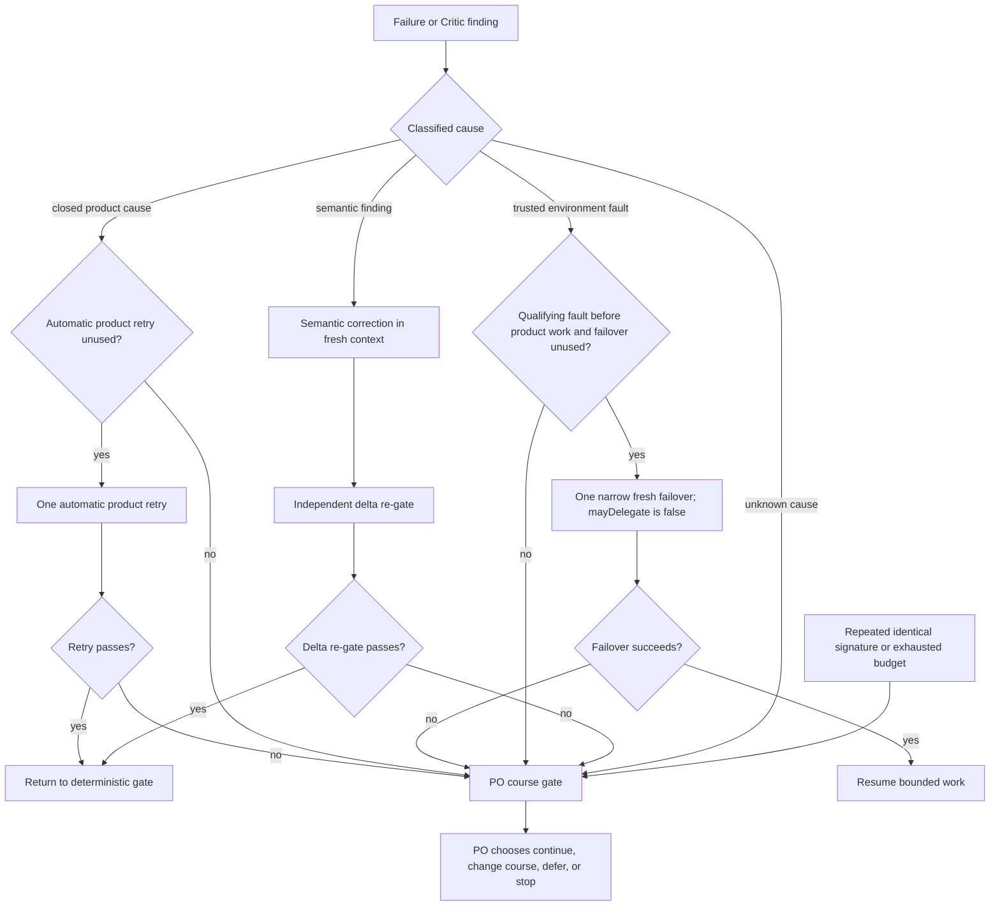
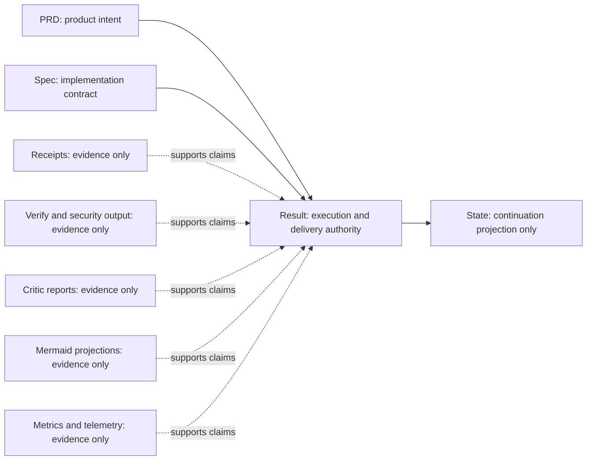

# Pipeline Flow

This document is a living explanatory projection of the pipeline. It is not an
authority and cannot grant permission, weaken a gate, or replace an active
artifact. If it conflicts with the [operating model](docs/operating-model.md),
the [current project manifest](.claude/pipeline.yaml) or
[calibration](.claude/pipeline.json), or the active PRD, Spec, or Result,
resolve the conflict in favor of those sources.

**Last reconciled:** 2026-07-16

The invariant across every path is **deterministic before semantic**: the
applicable machine gates must complete before a Critic performs semantic
review. Evidence supports a decision; it does not become decision authority.

## End-to-end flow

Optional phases drop out only when their declared trigger or calibration does
not apply. A failed branch does not silently become green; it enters bounded
recovery or stops at a course gate.

```mermaid
flowchart TD
    IDEA["Idea"] --> TRIAGE["Rigor and risk triage"]
    IDEA -.->|"optional"| DESIGN["Design pre-stage"]
    DESIGN --> TRIAGE
    TRIAGE --> PLAN{"PRD and Spec required?"}
    PLAN -->|"yes"| DOCS["Create PRD and Spec"]
    DOCS --> READY["Readiness check"]
    READY --> APPROVE["PO plan approval"]
    APPROVE --> PREFLIGHT["Route, capacity, and authority preflight"]
    PLAN -->|"no"| PREFLIGHT
    PREFLIGHT --> GF["Fresh Goldfish"]
    GF --> WORK["Bounded work package"]
    WORK --> VERIFY["Stage 1 Verify"]
    VERIFY --> VOK{"Green machine evidence?"}
    VOK -->|"no"| RECOVERY["Bounded recovery"]
    VOK -->|"yes"| SECREQ{"Security phase declared?"}
    SECREQ -->|"no"| CTRIGGER{"Risk-based Critic required?"}
    SECREQ -->|"yes"| SECURITY["Security status: PASS, FINDINGS, SKIPPED, or ERROR"]
    SECURITY --> HONEST["SKIPPED is not PASS"]
    HONEST --> SOK{"Security disposition permits review?"}
    SOK -->|"no"| RECOVERY
    SOK -->|"yes"| CTRIGGER
    CTRIGGER -->|"no"| INTENT["Persist Result-first transition intent"]
    CTRIGGER -->|"yes"| CRITIC["Fresh risk-based Critic"]
    CRITIC --> FIX{"Semantic correction required?"}
    FIX -->|"yes"| CORRECT["Fresh semantic correction"]
    CORRECT --> DELTA["Independent delta re-gate"]
    DELTA --> DOK{"Delta re-gate green?"}
    DOK -->|"no"| RECOVERY
    DOK -->|"yes"| INTENT
    FIX -->|"no"| INTENT
    RECOVERY --> CONTINUE{"Bounded continuation authorized?"}
    CONTINUE -->|"yes"| PREFLIGHT
    CONTINUE -->|"no"| COURSE["PO course gate or stop"]
    COURSE -.->|"approved continuation"| PREFLIGHT
    INTENT --> STATE["Recoverable State CAS and matching receipt"]
    STATE --> FINAL["Final exact-commit Full Verify"]
    FINAL --> FOK{"Exact commit green?"}
    FOK -->|"no"| RECOVERY
    FOK -->|"yes"| BOUNDARY["Delivery boundary"]
    BOUNDARY --> PUSH["Push exact OID and fetch back into a fresh repository"]
    PUSH --> MATCH{"Fetched OID matches?"}
    MATCH -->|"no"| BLOCKED["Unfinished or blocked"]
    MATCH -->|"yes"| CLOSE["No-mutation close"]
    CLOSE --> ACCEPT{"Human acceptance required?"}
    ACCEPT -->|"yes"| POACCEPT["PO accepts delivered result"]
    ACCEPT -->|"no"| PROMOTE{"Test-to-production promotion configured?"}
    POACCEPT --> PROMOTE
    PROMOTE -->|"yes"| TESTENV["Promote to test and verify"]
    TESTENV --> PRODAPPROVE["PO approves production promotion"]
    PRODAPPROVE --> PROD["Promote to production and record evidence"]
    PROD --> RETRO["Retro and documentation sync"]
    PROMOTE -->|"no"| RETRO
```

`SKIPPED` records that a configured scanner did not run; it is never rewritten
as `PASS`. `ERROR` fails closed. Findings follow the thresholds and disposition
rules in the current manifest and calibration.

## Bounded recovery

Recovery is classified before another attempt. Product retries and environment
failover are separate budgets, and neither authorizes an open-ended loop.

The environment failover is allowed only for a trusted, qualifying fault before
product work. It freezes the authority bindings, narrows the task, and forbids
delegation. A second environment failure, an unproven cause, a repeated product
signature, or an exhausted budget goes directly to the course gate. There is no
third automatic product attempt.

## Authority and evidence

Only the active PRD, Spec, and Result carry the task-level authority described
below. State is deliberately recoverable and bounded: it projects how to
continue, but it cannot redefine intent or the implementation contract.

The active PRD owns product intent and scope. The active Spec owns the
implementation contract and acceptance criteria. The active Result owns
recorded execution, course-decision, and delivery authority. Receipts, machine
verification, Critic findings, rendered flow projections, and metrics can prove
or challenge claims, but none can authorize work by itself.

## Gate reference

| Gate | Owner | Trigger | Pass condition | Failure disposition |
|---|---|---|---|---|
| Rigor and risk triage | Elephant | Every new item or material scope change | Rigor, risk, phase conditions, and required authority artifacts are explicit | Refine scope, use the optional design pre-stage, or create the required PRD and Spec |
| Readiness and plan approval | Fresh readiness reviewer, then PO | Rigor or risk requires PRD and Spec | Readiness is green and the PO explicitly approves the plan | Revise the artifacts or stop before implementation dispatch |
| Route, capacity, and authority preflight | Elephant and deterministic harness | Every fresh dispatch | Current authority digests, approved route, available reserved capacity, bounded scope, and non-delegation contract all match | Defer, select a pre-authorized route, repair authority, or open a course gate; do not dispatch |
| Stage 1 Verify | Goldfish and deterministic harness | Every implementation or correction candidate | The configured full machine chain is green and produced commit-bound evidence | Classify the failure; allow at most one qualifying product retry, otherwise course-gate it |
| Security | Deterministic security harness | The current manifest declares the phase | Required scanners report policy-acceptable status and exact-commit evidence; `SKIPPED` is not `PASS`, and `ERROR` fails closed | Correct findings, restore the scanner, or stop according to manifest thresholds and policy |
| Risk-based Critic | Fresh Critic; Elephant owns disposition | The rigor, risk, or diff trigger matrix requires semantic review | The independent review is complete and every admissible finding has a recorded disposition | Dispatch semantic correction, reject with recorded justification, or escalate to the PO |
| Independent delta re-gate | Fresh Critic; Elephant owns the gate | A semantic correction changes the reviewed candidate | The exact correction delta is independently reviewed against affected invariants and has no unresolved blocker | Re-correct within budget or open a course gate |
| Course-decision transaction | PO selects; deterministic harness records | Repeated signature, unknown cause, exhausted budget, scope conflict, or recovery limit | Result-first intent, State CAS, and durable matching receipt agree on one idempotent transition | Recover the exact durable stage or remain blocked; never infer or replay a different choice |
| Final exact-commit Full Verify | Deterministic harness and Elephant | A candidate reaches the delivery boundary | Full Verify is green for the exact commit and all required privacy or security checks have policy-acceptable exact-commit dispositions, with `SKIPPED` remaining explicitly `SKIPPED` | Correct and repeat the applicable gates; the candidate is not delivered |
| Delivery boundary | Elephant, with PO consent where required | Any push or externally effective action | Target, identity, ref, authority, and consent match the calibrated delivery contract | Perform no external action and report unfinished or blocked |
| Push and exact fetch-back | Deterministic harness and Elephant | The delivery contract requires a remote push | The approved exact OID is pushed and a fresh fetch-back resolves to the same OID | Remain unfinished or blocked; never substitute another branch, merge, tag, or force operation |
| No-mutation close | Elephant and deterministic close checks | Delivery evidence is complete | Candidate, authority bindings, and evidence remain unchanged while Result, State, and documentation are synchronized | Re-enter at the earliest invalidated gate and regenerate affected evidence |
| Human acceptance | PO | Calibration or risk requires acceptance | The PO explicitly accepts the delivered result | Keep delivered and accepted states distinct; rework, defer, or reject as directed |
| Test-to-production promotion | PO and project release adapter | A declared release phase requests promotion | Test evidence is green; production has explicit approval, rollback anchor, deploy evidence, and log entry | Stop or roll back under the project policy and keep the release incomplete |

## Maintenance contract

Update this file in the **same change** whenever any of the following changes:

- pipeline steps, names, or gate order;
- retry limits, course-gate conditions, or failover eligibility;
- phase activation conditions, including security, human acceptance, and release;
- evidence semantics, Result-first decisions, State recovery, or close rules;
- the delivery boundary, push and fetch-back contract, or release/promotion tail.

The same change must reconcile all three diagrams and the gate table, then
advance the reconciliation date. A stale diagram is evidence of documentation
drift, not an alternate process.
