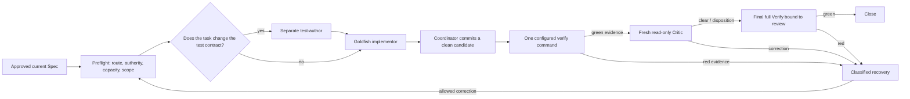

# Pipeline Flow — the V3 option guide

> _German reader version: [Pipeline Flow auf Deutsch](PIPELINE_FLOW.de.md)._

This is the **one maintained visual guide to the user-facing V3 flow**. It helps
you choose a route and understand who does what. It is not permission to skip a
gate or change a project. The active PRD and Spec define the work; the
[Operating Model](docs/operating-model.md), the project's `pipeline.user.yaml`,
optional `.claude/pipeline.yaml` manifest, and project calibration at its
resolved authority tier (`project/pipeline.json`, else
`.claude/pipeline.json`) define the applicable contract. If this guide
disagrees with one of them, use that source.

## Start here: one change, one honest route

<!-- capability:specialist-agent-roles -->

Bring an outcome in plain language: a bug to fix, a feature to add, or a
refactor to make safer. The **Elephant** turns it into a bounded written task;
fresh **Goldfish** contexts implement bounded packages; a read-only **Critic**
checks the result independently. You remain the human decision-maker at the
approval and escalation points.

Four terms prevent most confusion:

- A **profile** (`epic`, `feature`, or `mini`) is the V3 *session envelope*. It
  selects the registered route and allowable lifecycle ceremony. It is not a
  priority label and it does not replace risk assessment.
- **Rigor** (0, 1, or 2) decides how much written specification a change earns.
  **Risk** (low, medium, or high) decides how much independent review it needs.
  A tiny guardrail change can therefore be high risk.
- A **Sprint** is a planning grouping for related work. It is not a profile and
  does not select a model or bypass a gate.
- A **Phase** is a lifecycle position: `design_phase` shapes and approves work;
  `execution_phase` delivers it. A phase is not a profile.

Confirm the active profile for this task, then use
`/pipeline-core:pipeline-start` before delivery work. Its confirmation is bootstrap
evidence: it validates the V3 source/runtime projection, calibration, applicable
state, and available verify gate. It uses the active profile and phase; a
requested model is not proof of the model that actually ran.

## The primary journey

```mermaid
flowchart TD
    I[Intent: feature, fix, or refactor] --> P{Confirm active V3 profile}
    P --> B[Bootstrap session using that profile]
    B -->|Epic or Feature| A[Model-free Advisor capability preflight]
    B -->|Mini| T[Triage]
    A --> T
    T --> D{Design useful or required?}
    D -->|yes| DS[Design phase: options, UI when applicable, and acceptance criteria]
    D -->|no| RR[Rigor and risk recorded]
    DS --> RR
    RR --> EL{Epic or Feature?}
    EL -->|yes| AQ{Concrete Advisor question and reason?}
    EL -->|no (Mini)| S
    AQ -->|yes| AC[Demand-bound fresh read-only consultation]
    AQ -->|no| S
    AC --> S
    S[PRD and Spec as required]
    S --> R{Readiness required or elected?}
    R -->|yes| RD[Fresh read-only readiness review]
    RD -->|gaps| S
    RD -->|ready| G{Explicit human PRD approval required?}
    R -->|no| G
    G -->|yes, approved| X[Execution preflight and dispatch]
    G -->|no, valid fast path| X
    X --> TA{Separate test-author task needed?}
    TA -->|yes| TT[Test-author task and test contract]
    TA -->|no| IM[Goldfish implements one bounded package]
    TT --> IM
    IM --> CM[Coordinator integrates and commits; clean candidate]
    CM --> V[Configured verify creates machine evidence]
    V -->|red| RC[Classify and recover]
    V -->|green| SQ{Security required?}
    SQ -->|yes| SEC[Security evidence]
    SQ -->|no| GQ{Governance required?}
    SEC --> GQ
    GQ -->|yes| GOV[Guideline or policy evaluation]
    GQ -->|no| C[Fresh independent Critic]
    GOV --> C
    C --> CR[Critic result and disposition]
    CR -->|correction needed| RC
    CR -->|clear or disposition recorded| FV[Final full Verify bound to the reviewed candidate]
    FV -->|red| RC
    FV -->|green| HA{Human acceptance required?}
    HA -->|no| CL[Close feature lifecycle]
    HA -->|yes| HD[Human decision on delivered candidate]
    HD -->|accepted| CL
    HD -->|rejected| RC
    CL --> REL{Release phase declared?}
    REL -->|yes| RP[Release evidence and human promotion gate]
    REL -->|no| DONE[Closed change]
    RP --> DONE
    RC -->|bounded correction| X
    RC -->|limit, ambiguity, or conflict| PO[Human course decision or stop]
    PO -->|approved new direction| T
```

The arrows do not promise that every change visits every box. The tables state
when a branch exists, who owns it, the evidence that makes it real, and where it
returns.

<!-- capability:session-and-delivery-skills -->

The plugin ships skills for starting a session, bounded advice and observation
intake, technical and reader-facing review, and deliberate closeout. They make
those steps discoverable, but a skill does not itself approve a plan, commit,
or release.
In a consuming repository, use the relevant skill at its named lifecycle step;
its output still needs the repository's configured checks and any applicable
human decision before the next protected action.

## 1. Confirm the V3 profile before bootstrap

<!-- capability:v3-routed-duties -->

V3 routes name the duty, selected runner, required evidence and declared
unavailability behavior before work is dispatched. The route is a declared
contract; availability still has
to be observed on the current host, and an unavailable route is not silently
replaced with a different provider.
Check the route's runner capability and evidence requirements for the current
repository and host before relying on it. A route declaration alone is neither
a successful dispatch nor proof that the selected model actually ran.

<!-- capability:v3-work-profiles -->

| Profile | Enter it when | Owner | Evidence / guard | Rejoin or stop |
|---|---|---|---|---|
| `epic` | Work spans architecture, several blocks, or a broad coordinated outcome. | Elephant; human decides material scope. | Registered V3 `epic` route plus model-free V2 capability state and assurance. Consultation exists only for one concrete demand. | Continue to triage immediately; capability `unknown` or `unavailable` is honest evidence, not a bootstrap timeout or consultation result. |
| `feature` | A bounded product change still needs normal design and delivery discipline. | Elephant. | Registered V3 `feature` route plus model-free V2 capability state and assurance. Consultation exists only for one concrete demand. | Continue to triage immediately; session start, resume and Compact never launch an Advisor. |
| `mini` | A genuinely small, tightly bounded feature or hotfix. | Elephant. | V3 `mini` route; advisory is deliberately disabled. The light boundary is about five files, no guardrail/canonical files, and no new dependency. | Continue on the light path. If scope grows or a protected surface appears, escalate to `feature` or `epic` and re-enter the full path. |

Profile comes from the active feature and task shape, not from an old
`advisor`, `design-first`, or `speed` label. Those are not V3 profiles.

## 2. Decide the amount of design and review

| Decision | Enter condition | Owner | Evidence | Rejoin |
|---|---|---|---|---|
| Optional design phase | The problem, alternatives, user experience, architecture, or task cut needs deliberate exploration. | Elephant; human decides material trade-offs. | Written options, chosen direction, non-goals, and acceptance criteria. | Rigor/risk triage, then PRD/Spec. |
| Rigor 0 | A genuine tiny, reversible change with no architecture, schema, public API, test, guardrail, dependency, or security-surface impact. | Elephant. | Short bounded brief and normal verify evidence. | Execution preflight; no full PRD path unless risk still requires it. |
| Rigor 1 | A normal change needs a delta Spec with checkable acceptance criteria. | Elephant. | Current PRD/Spec and explicit approval where required. | Readiness/approval, then execution. |
| Rigor 2 | Architecture, guardrail, core-contract, or otherwise substantial work. | Elephant and human at the approval gate. | Maintained Spec, mandatory readiness result, explicit PRD approval, and current bindings. | Execution only after all required evidence is current. |
| High risk | Sensitive security, guardrail, architecture, irreversible, costly, or externally visible impact — regardless of line count. | Elephant classifies; human resolves ambiguous stakes. | Recorded risk, stronger Critic route, and configured security evidence. | Critic and human gates apply before close. |

**PRD, Spec, and readiness.** A PRD expresses product intent; a Spec expresses
the implementable contract and acceptance criteria. Explicit human PRD approval
is mandatory for rigor 1 or 2, and for high risk. A readiness review is mandatory
for rigor 2, architecture/guardrail/core-contract work, or high risk; otherwise
the Elephant may elect it. A fresh, read-only reviewer must be able to understand
and implement the document from the document alone. Gaps return to the Spec, then
a *new* reviewer checks it again. Neither an optional readiness decision nor a
`mini` profile bypasses a mandatory approval.

## 3. Deliver in independently checkable packages

```mermaid
flowchart LR
    SP[Approved current Spec] --> PF[Preflight: route, authority, capacity, scope]
    PF --> TD{Does the task change the test contract?}
    TD -->|yes| T[Separate test-author]
    TD -->|no| G[Goldfish implementor]
    T --> G
    G --> CM[Coordinator commits a clean candidate]
    CM --> VE[One configured verify command]
    VE -->|green evidence| CR[Fresh read-only Critic]
    VE -->|red evidence| RE[Classified recovery]
    CR -->|clear / disposition| FV[Final full Verify bound to review]
    FV -->|green| CO[Close]
    FV -->|red| RE
    CR -->|correction| RE
    RE -->|allowed correction| PF
```

| Step | Owner | Meaning | Evidence and boundary |
|---|---|---|---|
| Guardrails | Installed runner integration and project configuration. | Configured command and write-path safeguards may refuse unsafe actions before delivery proceeds. | Claude and Antigravity have the documented hook integration; this does not claim those hooks on Codex. |
| Codex host bridge | Codex host and plugin integration. | The bridge applies only the command and write-path policy its host exposes. | Host lifecycle evidence remains required; no host-independent enforcement or model identity is implied. |
| Preflight | Elephant and deterministic checks. | Current PRD/Spec, profile/phase route, capacity, scope, and authority bindings still match. | A mismatch defers or opens a course decision; it never becomes an informal dispatch. |
| Test author — optional | A separately briefed test-author duty. | Use it when the test or gate contract itself must change. | The implementor does not weaken or rewrite the tests that judge its own implementation. Its output is separately reviewable. |
| Implement | Goldfish. | One fresh-context, self-contained implementation package. Independent packages may run in parallel when files and data do not overlap. | A six-field briefing supplies goal, context, Definition of Done, prohibitions, stop conditions, and dispatch metadata. |
| Candidate commit | Coordinator or authorized host, after validating the returned package. | Integrate the bounded result and create a clean committed candidate before candidate-bound Verify. | Record the actual commit and tree; a Child's proposed commit or a dirty checkout is not a substitute. |
| Verify — mandatory | Coordinator invokes the configured evidence producer on the committed candidate. | For release, the producer runs the one configured project command; documented boundary-aware modes run the fixed baseline plus registered changed-area commands. Running the project command alone does not create the Verify receipt. | Green means the producer wrote an exact machine-written evidence artifact for the candidate. Red is evidence of failure, not partial success. |
| Critic — mandatory | Fresh read-only Critic; Elephant owns disposition. | The Critic receives references to candidate, Spec, guardrails, and evidence — not implementation chat or rationale. | It runs after deterministic checks. Findings need evidence, a rule/criterion, and a consequence. A correction gets a fresh delta re-gate. Goldfish delivery stays review-pending until independent Critic evidence exists. |
| Final Verify — mandatory for release | Coordinator runs the configured full evidence producer after the substantive Critic review. | The release-mode receipt binds the reviewed candidate and consumed Critic packet; corrections return through review. | The exact committed candidate needs a passing final receipt before close or promotion. |

Each project uses the one full `verify` command named by its own calibration.
For non-release boundaries, the evidence producer may run its fixed baseline
plus registered impact commands; it does not authorize substituting a convenient
partial command. [Choose the appropriate mode and reviewed base](docs/usage.md#verify-a-consumer-project).
> **Maintainer reference only:** the release procedure for the distributed
> plugin itself is [push and release flow](docs/push-release-flow.md). It is
> not a delivery step for a repository that merely uses the installed plugin.

## 4. Optional branches are explicit, not implied

<!-- capability:release-planning-controls -->

| Branch | It exists only when | Owner | Evidence | Rejoin / terminal state |
|---|---|---|---|---|
| Security | The manifest declares the security phase or task risk requires its configured checks. | Deterministic security harness; Elephant owns disposition. | Scanner status and exact-candidate evidence. `SKIPPED` is not `PASS`; `ERROR` fails closed. | A policy-acceptable result rejoins Critic/close. Findings or unavailable required checks enter recovery or stop. |
| UI design | The project has UI work (`has_ui`) or the task declares UI design. | Elephant and the appropriate design owner; human decides material experience trade-offs. | Design decision and UI acceptance criteria, not a visual assertion alone. | Rejoin Spec/readiness before implementation. No UI branch means no implied UI review. |
| Governance | The project configures guidelines or policies under its governance paths. | Project/team owner supplies rules; Elephant applies them to the task. | Valid configured inputs, declared policy mode, and resulting review/gate evidence. | Advisory guidance informs design; enforcing requirements rejoin the relevant gate or block. This is not central IAM or a control plane. |
| Release / promotion | The project declares a `release` section. | Release adapter and human promotion gate. | Per-environment evidence, rollback anchor, and deploy-log record. | Test promotion precedes production approval. Without a `release` section, this branch does not exist or add a release gate. |
| Human acceptance | Calibration or stakes require final acceptance. | Human decision-maker. | Explicit acceptance of the delivered candidate. | Delivery and acceptance remain distinct; rejection starts a new candidate or course decision. |

## Integration and update boundaries

<!-- capability:parallel-sprint-promotion-gates -->

Independent packages can run in parallel only when their files and state do
not overlap. Integration advances the explicitly selected merge-ready Sprint;
protected or overlapping baseline changes require bounded impact review before
promotion. See [parallel work](docs/parallel-work.md).

<!-- capability:pipeline-update-channels -->

Update channels provide a declared alpha, beta, or stable selection and a
sanctioned repository-local override. Availability is read-only information;
choosing an update does not itself install, activate, or verify it.

## 5. Close deliberately; recover with a bound

<!-- capability:continuity-and-handover -->

**Close** is not merely “the code merged.” It synchronizes verify evidence,
result/state, handover, documentation, telemetry, and a self-retro. Use
`/pipeline-core:close-feature` when the active feature lifecycle is complete.
`/pipeline-core:close-block` is reserved for finalizing a stopped topic or a
real runtime transfer. If a project has a release branch, release/promotion
follows the close boundary under its own evidence and approval rules.

| Situation | Owner | Allowed recovery | Rejoin / stop |
|---|---|---|---|
| Deterministic gate is red with a known product cause | Goldfish, then Elephant. | One automatic product retry at the same cause (two total attempts). | A passing retry returns to the deterministic gate/normal review. A second failure opens a human course decision. |
| Trusted environment fault before product work | Elephant. | One narrow, fresh environment failover with frozen authority and no delegation. | On success resume bounded work; on another fault or an unproven cause, stop for a course decision. |
| Critic finding needs semantic correction | Elephant dispatches a fresh correction. | One fresh re-review after the initial blocking result. | A passing re-review returns to close. If it still reports a blocking finding, the Elephant self-verifies the next correction directly; no third Critic round. |
| Spec, scope, evidence, or authority drift | Elephant and human as needed. | Re-plan or re-approve; never carry stale approval into a changed contract. | Return to triage, Spec, readiness, or approval — whichever became stale. |
| Unknown cause, repeated signature, exhausted budget, or conflict | Human decision-maker. | Continue with a new direction, defer, or stop. | No unbounded retry loop and no success claim without required evidence. |

<!-- capability:handover-hard-size-gate -->

For a proposed handover write, the configured cap refuses when the computed
post-write size—or the guard's non-exact `NotebookEdit` size estimate—reaches
its hard limit and is not provably smaller than the current file. A proven
net decrease remains allowed so an oversized handover can be repaired.
Unreadable tool-input shapes are admitted by this guard; it is not a universal
write boundary.
For a refused write, shorten or split the handover and retry with a bounded
replacement. Do not treat a permitted edit as evidence that every other
handover or repository policy has passed.

Pipeline-source migration commands belong to the occasional maintainer path,
not this consumer lifecycle. See [SETUP](SETUP.md) for that path and for the
ordered runner binding, restart, classification, and adoption procedure.

## Optional execution and host-boundary reference

<!-- capability:afk-capability-workers -->

The Claude-only AFK worker can return one bounded analysis proposal from
allowlisted repository inputs after activation. It cannot run commands,
change files, approve, commit or dispatch more workers.
The orchestrating session remains responsible for checking the proposal
against current project evidence and deciding whether to act. No background
proposal becomes project authority merely because the worker returned it.

<!-- capability:local-worker-supervision -->

Local worker supervision is an opt-in host operation for planning, inspecting,
cancelling and cleaning up worker leases. Running a provider-backed worker
requires a separate explicit flag; the supervisor does not claim OS isolation
or make background execution the default.
Use its status and recovery receipts to distinguish a finished worker from
one that is still running or requires cleanup. A completed process does not by
itself establish that the product result was verified or delivered.

<!-- capability:deterministic-verification -->

For an audit-facing delivery, retain the candidate-bound Verify receipt with
the package: it identifies the command, candidate, tree, suites, and result.
A red, skipped, stale, or mismatched receipt is evidence of its limitation,
not a green result. [Audit and evidence](docs/audit-and-evidence.md) explains
what a review package can contain and what it cannot prove.

<!-- capability:claude-hook-safety -->

Where the Claude or Antigravity hook integration is installed and active,
configured guards check command, write-path, plan, test-path, push and
lifecycle-readiness actions at the host boundary. These controls do not imply
that a different runner exposes the same hook events.
Confirm the installed plugin copy and the host's active hook registration
before relying on a denial or approval. Repository source code alone cannot
prove that a particular user's runner enforced the hook during a session.

<!-- capability:codex-host-hook-bridge -->

Codex's host bridge applies only the command and write-path policy exposed by
that host. It does not imply Claude-style hook delivery or universal enforcement.

## Support boundary and current scope

This guide describes the V3 process and its configuration points. A repository
rule is not host-wide enforcement; a governance path is not IAM; a requested
route is not observed model identity; and a machine gate does not prove every
semantic property.

`0.7.0` describes a pending source and plugin release, not an available
tag or installation source. Use the approved published plugin and check the
loaded host version before following a route. The [overview](docs/overview.md)
maintains the detailed implementation and candidate-acceptance status.

For the normative details, read the [Operating Model](docs/operating-model.md).
For adoption and migration, use [SETUP](SETUP.md) and
[migration](docs/migration.md). For optional deployment, see
[deploy](docs/deploy/README.md).

[Deutsche Lesefassung](PIPELINE_FLOW.de.md)
