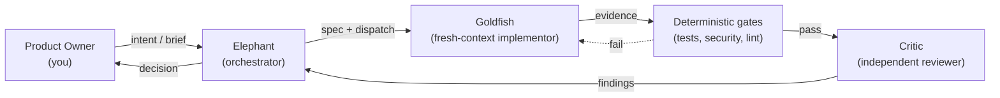
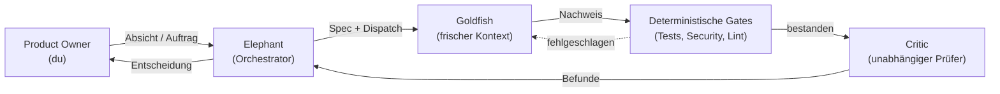

# Agent-Pipeline

A versioned operating model for agentic software development — clone it, run one
setup script, and adopt a battle-tested set of roles, review gates, and guardrails
for your own projects.

## The problem

Teams building with coding agents tend to reinvent the same conventions per repo —
review rituals, git guardrails, handover files — and copy them by hand from project
to project. Copies drift. There is no independent reviewer separate from whoever
wrote the code, and no shared discipline over which model does which kind of work
at what cost. This repo is that missing shared layer: one versioned source, adopted
by reference instead of copy-pasted.

## What you get

Four deliberately separated roles carry the model:

- **Product Owner (you)** — the human gate. Sets direction, reviews outcomes, holds
  final sign-off.
- **Elephant** — the long-lived orchestrator session. Turns your intent into a spec,
  breaks it into small tasks, dispatches them, and makes the go/no-go call.
- **Goldfish** — a fresh-context implementor subagent. Executes exactly one clearly
  defined task and reports back only with evidence, never a bare claim.
- **Critic** — an independent, read-only reviewer with a fresh context. Never sees
  chat history or reasoning — only the result, judged on its own.

Around those roles:

- **Two-stage review** — deterministic gates (tests, security scan, lint) run
  *before* any LLM judgment; only what survives the gates reaches a Critic.
- **Specs with checkable acceptance criteria** — no task is "done" on a feeling;
  every task has a Definition of Done something or someone can actually check.
- **Git guardrails** — a hook layer that blocks force-pushes, history rewrites,
  deleted protected branches, and skipped hooks, regardless of what any agent asks
  for.
- **A model/token policy** — role-tiered model routing (design / implement /
  mechanic / review / optional advisor) you configure to your own subscription, so
  cost tracks task complexity instead of one model doing everything.
- **Evidence discipline** — "done" means a machine-written log or output, the exact
  command, and its exit code — never a model-formulated claim that something
  "should work."

## How it works

Everything ships as a Claude Code plugin plus a small set of `.claude/` runtime
configs. You don't hand-edit those configs: you fill in **one** file,
`pipeline.user.yaml` (your name, your repo, your language, your subscription tier,
your autonomy preset), and `node setup.mjs` compiles it into the three
runtime-canonical files Claude Code actually reads
(`.claude/settings.json`, `.claude/pipeline.json`, `.claude/pipeline.yaml`). Re-run
it any time you change your mind — it's drift-safe: files it hasn't touched since
get recompiled freely, but a file you hand-edited yourself triggers a confirmation
before it's overwritten.

## Quick start

See [`SETUP.md`](SETUP.md) for the full walkthrough: clone, run `node setup.mjs`,
bind the plugin, start your first session.

## Runtime

Built for [Claude Code](https://claude.com/claude-code) — the git-guard hooks, the
session-bootstrap check, and gate enforcement all rely on its hook and plugin
system. The underlying methodology (roles, SDLC, review contract) is portable to
other agent runtimes without that enforcement layer; see
[`docs/runtime-boundary.md`](docs/runtime-boundary.md) for the boundary between
what's always portable and what's Claude-Code-specific.

## Learn more

- [`SETUP.md`](SETUP.md) — onboarding: prerequisites, setup steps, troubleshooting.
- [`docs/overview.md`](docs/overview.md) — the model in one read: how the roles,
  gates, and close ritual fit together end to end.
- [`docs/usage.md`](docs/usage.md) — a day in the pipeline: what an ordinary
  working session looks like from the inside.
- [`docs/migration.md`](docs/migration.md) — bringing an existing repo under the
  pipeline, one gate at a time.
- [`docs/design-decisions.md`](docs/design-decisions.md) — the "why" behind the
  model, in plain language.
- [`docs/operating-model.md`](docs/operating-model.md) — the full normative
  document: roles, SDLC, review system, session lifecycle, handover, project
  calibration.
- [`LICENSE`](LICENSE) — MIT.

---

# Agent-Pipeline (Deutsch)

Ein versioniertes Operating Model für agentische Softwareentwicklung — klonen,
ein Setup-Skript ausführen und ein erprobtes Set aus Rollen, Review-Gates und
Guardrails für die eigenen Projekte übernehmen.

## Das Problem

Teams, die mit Coding-Agents arbeiten, erfinden dieselben Konventionen in jedem
Repo neu — Review-Rituale, git-Guardrails, Handover-Dateien — und kopieren sie
von Hand zwischen Projekten. Kopien driften auseinander. Es gibt keine
unabhängige Prüfinstanz, die getrennt von den Autoren des Codes urteilt, und
keine gemeinsame Linie dafür, welches Modell welche Art von Arbeit zu welchen
Kosten übernimmt. Dieses Repo ist genau diese fehlende, gemeinsame Schicht:
eine versionierte Quelle, per Referenz übernommen statt kopiert.

## Was du bekommst

Vier bewusst getrennte Rollen tragen das Modell:

- **Product Owner (du)** — das menschliche Gate. Gibt die Richtung vor, prüft
  Ergebnisse, erteilt die finale Freigabe.
- **Elephant** — die langlebige Orchestrator-Sitzung. Formt aus deiner Absicht eine
  Spezifikation, zerlegt sie in kleine Aufgaben, delegiert sie und entscheidet am
  Ende über Go/No-Go.
- **Goldfish** — ein Subagent mit frischem Kontext. Führt genau eine klar
  umrissene Aufgabe aus und meldet sich nur mit Nachweis zurück, nie mit einer
  bloßen Behauptung.
- **Critic** — ein unabhängiger Prüfer mit reinem Lesezugriff und frischem
  Kontext. Sieht nie Chat-Verlauf oder Begründungen — nur das Ergebnis, das er
  für sich beurteilt.

Ergänzend dazu:

- **Zweistufiges Review** — deterministische Gates (Tests, Security-Scan, Lint)
  laufen *vor* jedem LLM-Urteil; nur was die Gates übersteht, erreicht einen
  Critic.
- **Specs mit prüfbaren Akzeptanzkriterien** — keine Aufgabe ist „fertig" nach
  Gefühl; jede Aufgabe hat eine Definition of Done, die sich tatsächlich prüfen
  lässt.
- **Git-Guardrails** — eine Hook-Schicht, die Force-Pushes, History-Rewrites,
  gelöschte geschützte Branches und übersprungene Hooks blockiert, unabhängig
  davon, worum ein Agent bittet.
- **Eine Modell-/Token-Policy** — rollenabgestuftes Modell-Routing (Design /
  Implementierung / Mechanik / Review / optionaler Advisor), die du auf dein
  eigenes Abo einstellst, sodass sich die Kosten nach der Aufgabenkomplexität
  richten, statt dass ein einziges Modell alles übernimmt.
- **Nachweispflicht** — „fertig" heißt: ein maschinell geschriebenes Log oder
  Ergebnis, dazu der exakte Befehl und dessen Exit-Code — nie eine vom Modell
  formulierte Behauptung, etwas „sollte funktionieren".

## Wie es funktioniert

Alles wird als Claude-Code-Plugin plus ein kleines Set an
`.claude/`-Laufzeit-Configs ausgeliefert. Du bearbeitest diese Configs nicht von
Hand: Du füllst **eine** Datei aus, `pipeline.user.yaml` (dein Name, dein Repo,
deine Sprache, deine Abo-Stufe, dein Autonomie-Preset), und `node setup.mjs`
kompiliert daraus die drei laufzeit-kanonischen Dateien, die Claude Code
tatsächlich liest (`.claude/settings.json`, `.claude/pipeline.json`,
`.claude/pipeline.yaml`). Führe es jederzeit erneut aus, wenn sich deine
Antworten ändern — es ist driftsicher: unveränderte Dateien werden frei neu
kompiliert, aber eine von Hand bearbeitete kompilierte Datei löst vor dem
Überschreiben eine Rückfrage aus.

## Schnellstart

Der vollständige Ablauf steht in [`SETUP.md`](SETUP.md): klonen, `node setup.mjs`
ausführen, Plugin binden, erste Session starten.

## Laufzeitumgebung

Gebaut für [Claude Code](https://claude.com/claude-code) — die git-Guard-Hooks, der
Session-Bootstrap-Check und die Gate-Durchsetzung setzen auf dessen Hook- und
Plugin-System auf. Die zugrunde liegende Methodik (Rollen, SDLC, Review-Vertrag)
ist auf andere Agent-Laufzeitumgebungen übertragbar, allerdings ohne diese
Durchsetzungsschicht; siehe [`docs/runtime-boundary.md`](docs/runtime-boundary.md)
für die Grenze zwischen dem, was immer übertragbar ist, und dem, was
Claude-Code-spezifisch ist.

## Mehr erfahren

- [`SETUP.md`](SETUP.md) — Onboarding: Voraussetzungen, Setup-Schritte,
  Fehlerbehebung.
- [`docs/overview.md`](docs/overview.md) — das Modell in einem Durchgang: wie
  Rollen, Gates und Abschluss-Ritual von Anfang bis Ende zusammenspielen.
- [`docs/usage.md`](docs/usage.md) — ein Tag in der Pipeline: wie eine gewöhnliche
  Arbeitssitzung von innen aussieht.
- [`docs/migration.md`](docs/migration.md) — ein bestehendes Repo Schritt für
  Schritt unter die Pipeline bringen.
- [`docs/design-decisions.md`](docs/design-decisions.md) — das „Warum" hinter dem
  Modell, in einfacher Sprache.
- [`docs/operating-model.md`](docs/operating-model.md) — das vollständige
  normative Dokument: Rollen, SDLC, Review-System, Session-Lifecycle, Handover,
  Projekt-Kalibrierung.
- [`LICENSE`](LICENSE) — MIT.

---

Die deutsche Fassung ist eine Übersetzung des englischen Originals.
