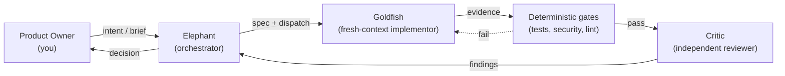
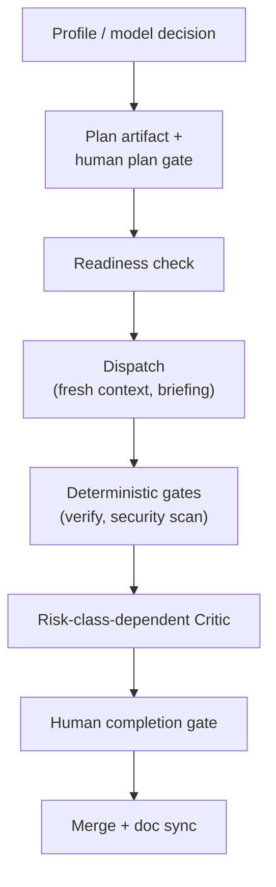
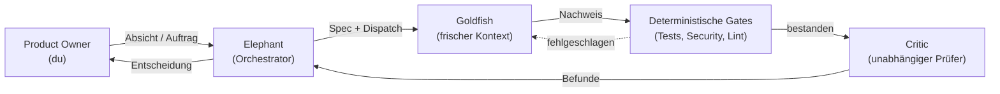
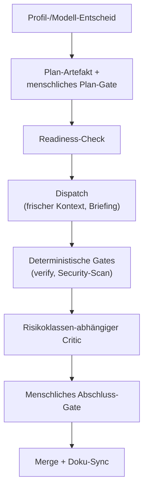

# Agent-Pipeline

A versioned operating model for agentic software development — clone it, run one
setup script, and adopt a battle-tested set of roles, review gates, and guardrails
for your own projects.

*Where this stands: v0.1.0 — roughly a week of build time, a solo project, one
dogfooding round so far. Feedback welcome.*

> **A note on language.** This operating model was first built in German and then
> made English-first for release. The docs are English-primary — bilingual files
> keep a full German reference below a skip marker — but because of that origin,
> stray German may still surface here and there (a comment, an example, an internal
> label, or the odd directive). It's harmless, corrections/PRs are welcome, and you
> pick the language the pipeline works in for you (commits, reviews, PRDs) via the
> `language.human_facing` setting.

> _A German version follows below · Eine deutsche Fassung folgt weiter unten._

## The problem

Teams building with coding agents tend to reinvent the same conventions per repo —
review rituals, git guardrails, handover files — copied by hand and drifting
project to project. There's no independent reviewer separate from whoever wrote
the code, and no shared discipline over which model does which kind of work at
what cost. This repo is that missing shared layer: one versioned source, adopted
by reference instead of copy-pasted.

## What you get

Four deliberately separated roles carry the model:

- **Product Owner (you)** — the human gate. Sets direction, reviews outcomes, holds
  final sign-off.
- **Elephant** — the long-lived orchestrator session. Turns your intent into a spec,
  breaks it into small tasks, dispatches them, and makes the go/no-go call.
- **Goldfish** — a fresh-context implementor subagent. Executes exactly one clearly
  defined task and reports back only with evidence, never a bare claim.
- **Critic** — an independent, read-only reviewer with a fresh context. Never sees
  chat history or reasoning — only the result, judged on its own.

Around those roles:

- **Two-stage review** — deterministic gates (tests, security scan, lint) run
  *before* any LLM judgment; only what survives the gates reaches a Critic.
- **Specs with checkable acceptance criteria** — every task has a Definition of
  Done something or someone can actually check, not a "done"-on-a-feeling.
- **Git guardrails** — a hook layer that blocks force-pushes, history rewrites,
  deleted protected branches, and skipped hooks, regardless of what any agent asks
  for.
- **A model/token policy** — role-tiered model routing (design / implement /
  mechanic / review / optional advisor) configured to your own subscription, so
  cost tracks task complexity instead of one model doing everything.
- **Evidence discipline** — "done" means a machine-written log or output, the exact
  command, and its exit code — never a model-formulated claim that something
  "should work."
- **Two human gates, not a stream of approvals** — plan sign-off up front and
  completion sign-off at the end are the only two required stops for you.
  Deliberately few and deliberately placed: your attention is the scarce
  resource, and a long queue of small approvals trains reflexive clicking, not
  actual review.

## How it works

Everything ships as a Claude Code plugin plus a small set of `.claude/` runtime
configs, which you never hand-edit. You fill in **one** file, `pipeline.user.yaml`
(your name, your repo, your language, your subscription tier, your autonomy
preset), and `node setup.mjs` compiles it into the three runtime-canonical files
Claude Code actually reads (`.claude/settings.json`, `.claude/pipeline.json`,
`.claude/pipeline.yaml`). Re-run it any time you change your mind — it's
drift-safe: untouched files recompile freely, but a file you hand-edited yourself
triggers a confirmation before it's overwritten.

Model routing per work method lives in its own block, `pipeline.user.yaml` →
`worktypes` — one entry per session profile (design-first / advisor / speed),
each with its own model, effort, and advisor setting.

## How a run flows end to end

Order matters: deterministic gates always run *before* any LLM judgment — a
Critic never reviews a diff that hasn't already cleared the machine chain.

## Bring your own architecture rules & guardrails

A project can bring its own house rules, split into two classes: **guidelines**
are recommended principles you may deliberately deviate from, as long as the
deviation is named; **policies** are binding rules that block a gate the moment
they're violated. Both live under
[`governance/examples/`](governance/examples/README.md), wired in through the
`governance` block in `.claude/pipeline.yaml`.

Enforcement differs by class: guidelines feed into every plan and are the
Critic's review benchmark — an unnamed deviation is the finding, not the
deviation itself. Machine-checkable policies automatically fail the
security-scan gate; the non-machine-checkable checklist gets ticked off by the
Critic before every push. A pattern played all the way through — from house
rule to enforced rule — lives in the
[worked example](governance/examples/worked-example.md).

## Three dials, not one size fits all

Same method, calibrated strictness — from a weekend hack to an enterprise
codebase. Three independent dials set that:

- **Rigor per task** — issue-only / delta-spec / spec-anchored
- **Governance mode per rule set** — advisory / enforcing / off
- **Session profile per session** — design / advisor / speed (model, effort,
  and advisor per profile: `pipeline.user.yaml` → `worktypes`)

## Why this holds up at enterprise scale

What comes together here is more than an agent setup: a repeatable architecture
through the governance layer, machine-checkable gates instead of promises,
mandatory documentation artifacts instead of word-of-mouth knowledge, an
independent review kept separate from the executing context, and a model/cost
policy that scales effort to risk. The reasoning behind it: attention is the
scarcest resource — so strictness gets invested where mistakes are expensive,
and consciously spared elsewhere. The final judgment still always stays with the
human.

## Quick start

See [`SETUP.md`](SETUP.md) for the full walkthrough: clone, run `node setup.mjs`,
bind the plugin, start your first session.

## Runtime

Built for [Claude Code](https://claude.com/claude-code) — the git-guard hooks, the
session-bootstrap check, and gate enforcement all rely on its hook and plugin
system. The underlying methodology (roles, SDLC, review contract) is portable to
other agent runtimes without that enforcement layer; see
[`docs/runtime-boundary.md`](docs/runtime-boundary.md) for the boundary between
what's always portable and what's Claude-Code-specific.

## Learn more

- [`SETUP.md`](SETUP.md) — onboarding: prerequisites, setup steps, troubleshooting.
- [`docs/overview.md`](docs/overview.md) — the model in one read: how the roles,
  gates, and close ritual fit together end to end.
- [`docs/usage.md`](docs/usage.md) — a day in the pipeline: what an ordinary
  working session looks like from the inside.
- [`docs/migration.md`](docs/migration.md) — bringing an existing repo under the
  pipeline, one gate at a time.
- [`docs/design-decisions.md`](docs/design-decisions.md) — the "why" behind the
  model, in plain language.
- [`docs/operating-model.md`](docs/operating-model.md) — the full normative
  document: roles, SDLC, review system, session lifecycle, handover, project
  calibration.
- [`LICENSE`](LICENSE) — MIT.

---

<!-- DE-REFERENCE-BELOW | agents: skip everything below this line; it is a full German reference translation (redundant, wastes context). The authoritative content is the English above. Convention: CLAUDE.md (Language). -->

# Agent-Pipeline (Deutsch)

Ein versioniertes Operating Model für agentische Softwareentwicklung — klonen,
ein Setup-Skript ausführen und ein erprobtes Set aus Rollen, Review-Gates und
Guardrails für die eigenen Projekte übernehmen.

*Wo das gerade steht: v0.1.0 — rund eine Woche Bauzeit, ein Soloprojekt, bisher
eine Dogfooding-Runde. Feedback willkommen.*

> **Zur Sprache.** Dieses Operating Model entstand zuerst auf Deutsch und wurde für
> die Veröffentlichung auf Englisch-first umgestellt. Die Doku ist englisch-primär —
> zweisprachige Dateien führen unterhalb eines Skip-Markers eine vollständige
> deutsche Referenz —, aber durch diese Herkunft können vereinzelt noch deutsche
> Reste auftauchen (ein Kommentar, ein Beispiel, ein internes Label oder mal eine
> Direktive). Das ist unkritisch, Korrekturen/PRs sind willkommen, und welche
> Sprache die Pipeline für dich verwendet (Commits, Reviews, PRDs), wählst du über
> die Einstellung `language.human_facing`.

## Das Problem

Teams, die mit Coding-Agents arbeiten, erfinden dieselben Konventionen in jedem
Repo neu — Review-Rituale, git-Guardrails, Handover-Dateien — und kopieren sie
von Hand zwischen Projekten. Kopien driften auseinander. Es gibt keine
unabhängige Prüfinstanz, die getrennt von den Autoren des Codes urteilt, und
keine gemeinsame Linie dafür, welches Modell welche Art von Arbeit zu welchen
Kosten übernimmt. Dieses Repo ist genau diese fehlende, gemeinsame Schicht:
eine versionierte Quelle, per Referenz übernommen statt kopiert.

## Was du bekommst

Vier bewusst getrennte Rollen tragen das Modell:

- **Product Owner (du)** — das menschliche Gate. Gibt die Richtung vor, prüft
  Ergebnisse, erteilt die finale Freigabe.
- **Elephant** — die langlebige Orchestrator-Sitzung. Formt aus deiner Absicht eine
  Spezifikation, zerlegt sie in kleine Aufgaben, delegiert sie und entscheidet am
  Ende über Go/No-Go.
- **Goldfish** — ein Subagent mit frischem Kontext. Führt genau eine klar
  umrissene Aufgabe aus und meldet sich nur mit Nachweis zurück, nie mit einer
  bloßen Behauptung.
- **Critic** — ein unabhängiger Prüfer mit reinem Lesezugriff und frischem
  Kontext. Sieht nie Chat-Verlauf oder Begründungen — nur das Ergebnis, das er
  für sich beurteilt.

Ergänzend dazu:

- **Zweistufiges Review** — deterministische Gates (Tests, Security-Scan, Lint)
  laufen *vor* jedem LLM-Urteil; nur was die Gates übersteht, erreicht einen
  Critic.
- **Specs mit prüfbaren Akzeptanzkriterien** — keine Aufgabe ist „fertig" nach
  Gefühl; jede Aufgabe hat eine Definition of Done, die sich tatsächlich prüfen
  lässt.
- **Git-Guardrails** — eine Hook-Schicht, die Force-Pushes, History-Rewrites,
  gelöschte geschützte Branches und übersprungene Hooks blockiert, unabhängig
  davon, worum ein Agent bittet.
- **Eine Modell-/Token-Policy** — rollenabgestuftes Modell-Routing (Design /
  Implementierung / Mechanik / Review / optionaler Advisor), die du auf dein
  eigenes Abo einstellst, sodass sich die Kosten nach der Aufgabenkomplexität
  richten, statt dass ein einziges Modell alles übernimmt.
- **Nachweispflicht** — „fertig" heißt: ein maschinell geschriebenes Log oder
  Ergebnis, dazu der exakte Befehl und dessen Exit-Code — nie eine vom Modell
  formulierte Behauptung, etwas „sollte funktionieren".
- **Zwei menschliche Gates statt eines Freigabe-Dauerstroms** — die Plan-Freigabe
  vorn und die Abnahme am Ende sind die einzigen zwei Pflichthalte für dich.
  Bewusst wenige, bewusst platziert: Deine Aufmerksamkeit ist die knappe
  Ressource, und eine lange Schlange kleiner Freigaben trainiert reflexartiges
  Wegklicken, kein echtes Prüfen.

## Wie es funktioniert

Alles wird als Claude-Code-Plugin plus ein kleines Set an
`.claude/`-Laufzeit-Configs ausgeliefert. Du bearbeitest diese Configs nicht von
Hand: Du füllst **eine** Datei aus, `pipeline.user.yaml` (dein Name, dein Repo,
deine Sprache, deine Abo-Stufe, dein Autonomie-Preset), und `node setup.mjs`
kompiliert daraus die drei laufzeit-kanonischen Dateien, die Claude Code
tatsächlich liest (`.claude/settings.json`, `.claude/pipeline.json`,
`.claude/pipeline.yaml`). Führe es jederzeit erneut aus, wenn sich deine
Antworten ändern — es ist driftsicher: unveränderte Dateien werden frei neu
kompiliert, aber eine von Hand bearbeitete kompilierte Datei löst vor dem
Überschreiben eine Rückfrage aus.

Modell-Routing je Arbeitsmethode lebt in einem eigenen Block,
`pipeline.user.yaml` → `worktypes` — ein Eintrag je Session-Profil
(Design-first / Advisor / Speed), jeweils mit eigenem Modell, Effort und
Advisor-Einstellung.

## Wie ein Durchlauf abläuft

Entscheidend ist die Reihenfolge: Die maschinellen Gates laufen immer VOR jedem
Urteil eines LLM — ein Critic bewertet nie einen Diff, der die deterministische
Kette noch nicht durchlaufen hat.

## Eigene Architekturvorgaben & Guardrails

Ein Projekt kann eigene Hausregeln mitbringen — getrennt in zwei Klassen:
**Guidelines** sind empfohlene Prinzipien, von denen bewusst und benannt
abgewichen werden darf; **Policies** sind verbindliche Regeln, die ein Gate
blockieren, sobald sie verletzt werden. Beide leben unter
[`governance/examples/`](governance/examples/README.md) und werden über den
`governance`-Block in `.claude/pipeline.yaml` eingebunden.

Durchgesetzt wird jede Klasse unterschiedlich: Guidelines fließen in jeden Plan
ein und sind der Prüf-Maßstab des Critic — eine unbenannte Abweichung ist der
Befund, nicht die Abweichung selbst. Maschinell prüfbare Policies blockieren
automatisch das Security-Scan-Gate; die nicht-maschinelle Checkliste hakt der
Critic vor jedem Push ab. Ein Muster komplett durchgespielt — von der
Hausregel bis zur erzwungenen Regel — steht im
[Worked Example](governance/examples/worked-example.md).

## Drei Drehregler statt einer Einheitsgröße

Gleiche Methode, kalibrierte Strenge — vom Wochenend-Hack bis zur
Enterprise-Codebasis. Drei unabhängige Regler stellen das ein:

- **Rigor pro Aufgabe** — Issue-only / Delta-Spec / Spec-verankert
- **Governance-Modus pro Regelwerk** — advisory / enforcing / off
- **Session-Profil pro Sitzung** — Design / Advisor / Speed (Modell, Effort
  und Advisor je Profil: `pipeline.user.yaml` → `worktypes`)

## Warum das auch im Unternehmenskontext trägt

Was hier zusammenkommt, ist mehr als ein Agent-Setup: eine wiederholbare
Architektur durch die Governance-Schicht, maschinell prüfbare Gates statt
Versprechen, Pflicht-Dokumentationsartefakte statt Zuruf-Wissen, ein
unabhängiges Review getrennt vom ausführenden Kontext und eine
Modell-/Kosten-Policy, die Aufwand nach Risiko staffelt. Der Grund dahinter:
Aufmerksamkeit ist die knappste Ressource — Strenge wird also dort
investiert, wo Fehler teuer sind, und woanders bewusst gespart. Das letzte
Urteil bleibt trotzdem immer beim Menschen.

## Schnellstart

Der vollständige Ablauf steht in [`SETUP.md`](SETUP.md): klonen, `node setup.mjs`
ausführen, Plugin binden, erste Session starten.

## Laufzeitumgebung

Gebaut für [Claude Code](https://claude.com/claude-code) — die git-Guard-Hooks, der
Session-Bootstrap-Check und die Gate-Durchsetzung setzen auf dessen Hook- und
Plugin-System auf. Die zugrunde liegende Methodik (Rollen, SDLC, Review-Vertrag)
ist auf andere Agent-Laufzeitumgebungen übertragbar, allerdings ohne diese
Durchsetzungsschicht; siehe [`docs/runtime-boundary.md`](docs/runtime-boundary.md)
für die Grenze zwischen dem, was immer übertragbar ist, und dem, was
Claude-Code-spezifisch ist.

## Mehr erfahren

- [`SETUP.md`](SETUP.md) — Onboarding: Voraussetzungen, Setup-Schritte,
  Fehlerbehebung.
- [`docs/overview.md`](docs/overview.md) — das Modell in einem Durchgang: wie
  Rollen, Gates und Abschluss-Ritual von Anfang bis Ende zusammenspielen.
- [`docs/usage.md`](docs/usage.md) — ein Tag in der Pipeline: wie eine gewöhnliche
  Arbeitssitzung von innen aussieht.
- [`docs/migration.md`](docs/migration.md) — ein bestehendes Repo Schritt für
  Schritt unter die Pipeline bringen.
- [`docs/design-decisions.md`](docs/design-decisions.md) — das „Warum" hinter dem
  Modell, in einfacher Sprache.
- [`docs/operating-model.md`](docs/operating-model.md) — das vollständige
  normative Dokument: Rollen, SDLC, Review-System, Session-Lifecycle, Handover,
  Projekt-Kalibrierung.
- [`LICENSE`](LICENSE) — MIT.

---

Die deutsche Fassung ist eine Übersetzung des englischen Originals.
