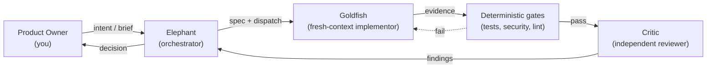
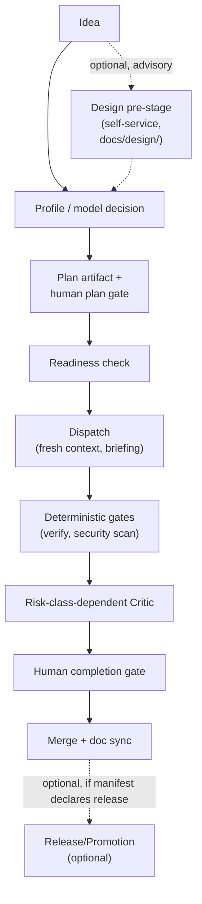
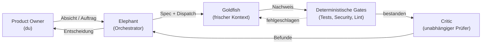
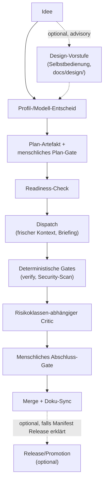

# Agent-Pipeline

A versioned operating model for teams that need agent-assisted delivery to be
reviewable, traceable, and measurable. It turns a change into a bounded task,
machine evidence, independent review, and a durable record that a team can
inspect later.

> **A note on language.** This operating model was first built in German and then
> made English-first for release. The docs are English-primary — bilingual files
> keep a full German reference below a skip marker — but because of that origin,
> stray German may still surface here and there (a comment, an example, an internal
> label, or the odd directive). It's harmless, corrections/PRs are welcome, and you
> pick the language the pipeline works in for you (commits, reviews, PRDs) via the
> `language.human_facing` setting.

> _A German version follows below · Eine deutsche Fassung folgt weiter unten._

> **Newcomer path:** Read this page, then follow [SETUP](SETUP.md) for the
> normal consumer adoption flow. [PIPELINE_FLOW](PIPELINE_FLOW.md) explains the
> lifecycle; the links below are optional reference.

> **Documentation line: `0.6.2`.** This is the next release's documented scope,
> not a tag, installation recommendation, production-availability claim, or
> evidence that a local candidate has passed its release gates.

> **What you can inspect:** a candidate-bound Verify receipt, security-scan
> status, review and approval records where the project requires them, and a
> validated Feature Package or offline Audit Bundle. These artifacts support an
> audit trail; they do not certify compliance or replace an auditor. Start with
> [audit and evidence](docs/audit-and-evidence.md).

> **What it costs:** the [cost page](docs/cost-and-measurement.md) gives four
> historical full-Verify examples, including two red receipts. They are
> observations, not an onboarding estimate or a promise for your project.
> Consumer administration overhead has not yet been measured across runners.

## The problem

Teams with audit obligations often need more than a chat transcript or a claim
that a test passed. They need a repeatable delivery record: who made a decision,
what was checked against which candidate, what was refused, and what remained
outside the evidence. Agent-Pipeline supplies that shared method without making
it a compliance certification or a claim about every host's enforcement.

## What you get

Four deliberately separated roles carry the model:

<!-- capability:human-accountability-roles -->

- **Product Owner (you)** — the human gate. Sets direction, reviews outcomes, holds
  final sign-off.
- **Elephant** — the long-lived orchestrator session. Turns your intent into a spec,
  breaks it into small tasks, dispatches them, and makes the go/no-go call.
- **Goldfish** — a fresh-context implementor subagent. Executes exactly one clearly
  defined task and reports back only with evidence, never a bare claim.
- **Critic** — an independent, read-only reviewer with a fresh context. Never sees
  chat history or reasoning — only the result, judged on its own.

Around those roles:

- **Two-stage review** — deterministic gates (tests, security scan, lint) run
  *before* any LLM judgment; only what survives the gates reaches a Critic.
- **Specs with checkable acceptance criteria** — every task has a Definition of
  Done something or someone can actually check, not a "done"-on-a-feeling.
- **Git and write-path guardrails** — configured integrations can refuse unsafe
  commands, protected-path writes, force-pushes, history rewrites, and skipped
  hooks. The exact live controls depend on the installed runner and project
  configuration; see [enforcement](docs/enforcement.md).
- **A model/token policy** — role-tiered model routing (design / implement /
  mechanic / review / optional advisor) configured to your own subscription, so
  cost tracks task complexity instead of one model doing everything.
- **Evidence discipline** — "done" means a machine-written log or output, the exact
  command, and its exit code — never a model-formulated claim that something
  "should work."
- **Explicit human authority** — plan, acceptance, and remote-action decisions
  remain with the human where the project calibration and action require them;
  evidence never creates that authority.

## Quick start

For a project that will consume the pipeline, go to [SETUP](SETUP.md) and
follow **Adopt a project**. It starts with prerequisites and the runner's
public onboarding path; it does not ask a consumer to run this repository's
source-maintainer setup. Then use [PIPELINE_FLOW](PIPELINE_FLOW.md) to choose
the delivery route and [the documentation map](docs/README.md) for evidence,
security, cost, and runtime-boundary reference.

## How it works

### Three roots, one direction of dependency

**Public Core** is the portable, committed contract: methodology, plugin,
templates, and the public `pipeline.user.yaml` authority. Develop it on public
feature branches. A separately versioned, ignored **Private Extension** (also
called the Private Overlay) consumes one pinned, immutable Public-Core SHA; it
does not feed account, owner, repository, or path coordinates back into the
core. **Local user, PC, and runtime-data roots** hold credentials, marketplace
and account mappings, absolute paths, local settings, caches, and session data.
They stay ignored and are never compiled into a public projection. This keeps a
second device reproducible from the public snapshot plus its matching private
pin, without copying secrets or local history.

In a **pipeline-source checkout**, `pipeline.user.yaml` is the public source of
setup intent and `node setup.mjs` compiles its owned runtime projections. A
consumer project must not copy or run a root `setup.mjs`; its loaded plugin
classifies fresh, legacy, and partial roots through `pipeline-start` and owns
the official onboarding/migration path. **Never hand-edit generated runtime
configuration.** The compiler detects drift rather than silently treating a
local edit as authority. The maintained consumer guide documents the ordered
Codex lifecycle — portable seed → runtime initialization → restart/native
readback → sanctioned kickoff → ready — together with host-managed limits and
the goal-and-plan-digest-bound kickoff apply contract:
[`docs/v3-consumer-onboarding.md`](docs/v3-consumer-onboarding.md).

V3 has registered routes for Claude, Codex, and Antigravity. Claude Code is
the full-enforcement runtime: its plugin and hooks can enforce configured
guards. Codex, Antigravity, and other CLIs can use the same roles, evidence,
and review methodology, but this does not claim Claude hooks, plugin
installation, automatic guards, or model identity — a requested route is not
proof of observed model identity, and one runner's evidence does not prove
another's behavior. Route selection comes from `pipeline.user.yaml`; consult
the current source rather than treating a document label as a model promise.
See [`docs/runtime-boundary.md`](docs/runtime-boundary.md) for the exact
division of responsibility and [`docs/runner-support.md`](docs/runner-support.md)
for the per-runner boundary table.

The native Codex selected-sandbox route remains the preferred, attested route;
this README does **not** claim that its current host limitation is fixed. After
exactly one typed `no-child` or `unavailable` result, a PO-authorized exception
may run one fresh, internal, hard-read-only consult on the same single question.
It permits no handover, memory, mutation, network export, raw-answer retention,
auto-apply, second question, or retry. A successful exception is only a
functional-equivalent pass, never native sandbox success: `no attested
selected-sandbox execution; OS isolation and model identity are not asserted`.

Model routing lives in V3 profiles (`epic`, `feature`, `mini`), with model and
effort selected per phase and runner.
Session bootstrap observes Advisor capability locally without a model request.
An actual Advisor runs only on demand for one concrete, reasoned and
digest-bound question; start, resume, re-entry and Compact never launch it.

```mermaid
flowchart LR
    PO["Product Owner<br/>(you)"] -->|"intent / brief"| Elephant["Elephant<br/>(orchestrator)"]
    Elephant -->|"spec + dispatch"| Goldfish["Goldfish<br/>(fresh-context implementor)"]
    Goldfish -->|"evidence"| Gates["Deterministic gates<br/>(tests, security, lint)"]
    Gates -.->|"fail"| Goldfish
    Gates -->|"pass"| Critic["Critic<br/>(independent reviewer)"]
    Critic -->|"findings"| Elephant
    Elephant -->|"decision"| PO
```

## How a run flows end to end

```mermaid
flowchart TD
    ID["Idea"] --> P
    ID -.->|"optional, advisory"| DS["Design pre-stage<br/>(self-service,<br/>docs/design/)"]
    DS -.-> P
    P["Profile / model decision"] --> PL["Plan artifact +<br/>human plan gate"]
    PL --> R["Readiness check"]
    R --> D["Dispatch<br/>(fresh context, briefing)"]
    D --> G["Deterministic gates<br/>(verify, security scan)"]
    G --> C["Risk-class-dependent Critic"]
    C --> H["Human completion gate"]
    H --> M["Merge + doc sync"]
    M -.->|"optional, if manifest declares release"| REL["Release/Promotion<br/>(optional)"]
```

Order matters: deterministic gates always run *before* any LLM judgment — a
Critic never reviews a diff that hasn't already cleared the machine chain.

An optional Release/Promotion tail can hook in after the merge (`REL` above) once
a project's manifest declares a `release` section — detail in
[`docs/deploy/README.md`](docs/deploy/README.md).

## The front door: optional design pre-stage

Before the pipeline itself there's deliberately no mandatory step, just a
front door (the dotted branch in the diagram above): idea → optional design
brainstorming with any chat AI (guide + standard prompt + lean export
template under [`docs/design/README.md`](docs/design/README.md)) →
requirements export → feeds the pipeline. If a requirement looks large at
triage (multiple modules/projects affected, new architecture, several
plausible options, a larger security/data surface), the Elephant flags it
**non-blocking** and links the guide — you can always skip the design
pre-stage and go straight to work. An external design export never gets a
free pass: the Elephant challenges it and re-derives it through the normal
path (interview → spec → readiness) instead of adopting it as an
already-approved design. For large topics, the Elephant also proposes a cut
into several self-contained backlog items and waits for confirmation or
correction — the existing per-item PRD review stays the only check point,
nothing new is added. Details: [`docs/operating-model.md`](docs/operating-model.md) — *The lifecycle*.

## Bring your own architecture rules & guardrails

A project can bring its own house rules, split into two classes: **guidelines**
are recommended principles you may deliberately deviate from, as long as the
deviation is named; **policies** are binding rules that block a gate the moment
they're violated. Both live under
[`governance/examples/`](governance/examples/README.md), wired in through the
`governance` block in `.claude/pipeline.yaml`.

Enforcement differs by class: guidelines feed into every plan and are the
Critic's review benchmark — an unnamed deviation is the finding, not the
deviation itself. Machine-checkable policies automatically fail the
security-scan gate; the non-machine-checkable checklist gets ticked off by the
Critic before every push. A pattern played all the way through — from house
rule to enforced rule — lives in the
[worked example](governance/examples/worked-example.md).

## Three dials, not one size fits all

The method uses calibrated strictness: teams can match the written contract
and review depth to the delivery's actual stakes. Three independent dials set
that:

- **Rigor per task** — issue-only / delta-spec / spec-anchored
- **Governance mode per rule set** — advisory / enforcing / off
- **Work profile per topic** — epic / feature / mini (model and effort per
  phase/runner in `pipeline.user.yaml`; Advisor capability is model-free at
  bootstrap and consultation is on demand)

## Why this holds up at enterprise scale

What comes together here is more than an agent setup: a repeatable architecture
through the governance layer, machine-checkable gates instead of promises,
mandatory documentation artifacts instead of word-of-mouth knowledge, an
independent review kept separate from the executing context, and a model/cost
policy that scales effort to risk. The reasoning behind it: attention is the
scarcest resource — so strictness gets invested where mistakes are expensive,
and consciously spared elsewhere. The final judgment still always stays with the
human.

## Source-maintainer command reference

Routine adopters should use [SETUP](SETUP.md) rather than these source-checkout
commands. A fresh consumer root never copies or runs this repository's root
`setup.mjs`.

### Command lifecycle

Run these commands from the indicated checkout; they are the concise, normal
lifecycle rather than a replacement for the detailed setup guide.

| When | Exact command |
| --- | --- |
| Initial pipeline-source setup | `node setup.mjs` |
| Normal session start | `/pipeline-core:pipeline-start` |
| Verify the current change | `node harness/scripts/verify.mjs` |
| Close a completed block | `/pipeline-core:close-block` |
| Update a Claude Code binding, then reload the running host | `claude plugin marketplace update agent-pipeline` `claude plugin update pipeline-core@agent-pipeline --scope project` `/reload-plugins` |
| Test a local Codex plugin candidate | Follow [`docs/codex-local-plugin-development.md`](docs/codex-local-plugin-development.md); use the isolated `pipeline-core@agent-pipeline-local` identity |
| Inspect a V3 authority (pipeline source only) | `node plugins/pipeline-core/scripts/runner-profile-migration-v3.mjs inspect --root "$PWD"` |
| Plan its V3-owned changes (pipeline source only) | `node plugins/pipeline-core/scripts/runner-profile-migration-v3.mjs plan --root "$PWD"` |
| Explicitly activate the reviewed V3 plan (pipeline source only) | `node plugins/pipeline-core/scripts/runner-profile-migration-v3.mjs apply --root "$PWD" --activate` |

The V3 sequence is deliberately inspect → plan → explicit activation; `apply
--activate` is its only write step. Read it back with `node setup.mjs`. Do not
use these source-authority commands in an arbitrary application repository.

Before your first big feature, a quick look at
[`docs/design/README.md`](docs/design/README.md) pays off — a self-service
guide for brainstorming a solid requirement before it enters the pipeline
(optional, recommended).

## Operational controls in context

The adoption flow uses a small set of connected controls; their detailed local
contracts live in the linked reference pages, rather than in a second catalog
here.

<!-- capability:plugin-distribution-and-publication -->
<!-- anchor:capability-plugin-distribution-and-publication -->
<!-- capability:session-and-delivery-skills -->
<!-- anchor:capability-session-and-delivery-skills -->
<!-- capability:specialist-agent-roles -->
<!-- anchor:capability-specialist-agent-roles -->
<!-- capability:starter-templates -->
<!-- anchor:capability-starter-templates -->
<!-- capability:generated-agent-obligations -->
<!-- anchor:capability-generated-agent-obligations -->
<!-- capability:v3-routed-duties -->
<!-- anchor:capability-v3-routed-duties -->
<!-- capability:v3-work-profiles -->
<!-- anchor:capability-v3-work-profiles -->
**Plan and delivery.** Distributed plugins, starter templates, V3 profiles and
routed duties, named specialist roles, generated obligations, and bounded
session skills make a task and its delivery record explicit. Publication is a
separate evidence-bound action; a selected route is not an effective-model
attestation.

<!-- capability:handover-hard-size-gate -->
<!-- anchor:capability-handover-hard-size-gate -->
<!-- capability:governance-event-ledger -->
<!-- anchor:capability-governance-event-ledger -->
<!-- capability:agent-decision-journal -->
<!-- anchor:capability-agent-decision-journal -->
<!-- capability:continuity-and-handover -->
<!-- anchor:capability-continuity-and-handover -->
**Continuity.** Size-bounded handovers and explicit continuity, journal, and
event-ledger tools preserve inspectable state. A library or record does not
automatically activate a runner integration or create authority.

<!-- capability:audit-and-evidence-cli -->
<!-- anchor:capability-audit-and-evidence-cli -->
<!-- capability:change-control-cli -->
<!-- anchor:capability-change-control-cli -->
<!-- capability:security-control-catalog -->
<!-- anchor:capability-security-control-catalog -->
<!-- capability:supply-chain-provenance -->
<!-- anchor:capability-supply-chain-provenance -->
<!-- capability:ai-assisted-hardening -->
<!-- anchor:capability-ai-assisted-hardening -->
**Assurance evidence.** Audit, change-control, security-catalog, provenance,
and hardening tools are explicit local operations. Their receipts inform
review; they do not publish externally, install a scanner, or certify security
or compliance.

<!-- capability:critical-human-authorization -->
<!-- anchor:capability-critical-human-authorization -->
<!-- capability:repair-guidance-cli -->
<!-- anchor:capability-repair-guidance-cli -->
<!-- capability:human-override-and-maintenance-window -->
<!-- anchor:capability-human-override-and-maintenance-window -->
**Human boundaries.** Critical authorization, refusal repair, override, and
maintenance-window paths require an attended, declared procedure. Asking for
guidance or preparing a request never grants an agent an override.

<!-- capability:afk-capability-workers -->
<!-- anchor:capability-afk-capability-workers -->
<!-- capability:local-worker-supervision -->
<!-- anchor:capability-local-worker-supervision -->
<!-- capability:cost-and-benchmark-cli -->
<!-- anchor:capability-cost-and-benchmark-cli -->
<!-- capability:error-register-quality-gate -->
<!-- anchor:capability-error-register-quality-gate -->
<!-- capability:organization-policy-packs -->
<!-- anchor:capability-organization-policy-packs -->
<!-- capability:external-traceability-adapters -->
<!-- anchor:capability-external-traceability-adapters -->
**Operations.** Claude-only analysis workers, explicit local-worker
supervision, cost/benchmark and quality checks, policy packs, and traceability
adapters retain their stated boundaries: provider execution, external writes,
and cross-runner cost comparisons need separate inputs and evidence.

## Runtime

Claude Code is the documented full-enforcement environment for its hook and
plugin layer. Codex has a host-dependent bridge, and Antigravity has native
plugin/hook integration for the runner-specific controls their evidence
documents. Those routes do not imply identical hooks, universal enforcement,
OS isolation, or model identity. The methodology remains portable; see
[`docs/runtime-boundary.md`](docs/runtime-boundary.md) and
[`docs/runner-support.md`](docs/runner-support.md) for the current boundaries.

## Learn more

Follow the canonical [documentation map](docs/README.md): it keeps adoption,
enforcement, evidence, security, cost, and maintainer references in one order.
For the normative contract, read [`docs/operating-model.md`](docs/operating-model.md).
- [`LICENSE`](LICENSE) and [`LICENSE-DOCS`](LICENSE-DOCS) use the source-available Sustainable Use License 1.0 (SUL-1.0) with the Agent-Pipeline Additional Permission; see [`docs/licensing.md`](docs/licensing.md).

## Acknowledgments

This operating model is a synthesis, not an invention. It adapts and builds on
the ideas in three published works, and we thank their authors for the thinking
that shaped it:

- [Dave Rensin, **“Elephants, Goldfish and the New Golden Age of Software Engineering”**](https://research.google/pubs/elephants-goldfish-and-the-new-golden-age-of-software-engineering/) — source of the Elephant and Goldfish roles and the principle that the document, not the session, carries the knowledge;
- [Addy Osmani, Shubham Saboo, Sokratis Kartakis, **“The New SDLC With Vibe Coding”**](https://addyosmani.com/blog/new-sdlc-vibe-coding/) — source of *Agent = Model + Harness*, the orchestrator capability model, and stakes-driven discipline;
- [Google/Kaggle, **“Spec-Driven Production Grade Development in the Age of Vibe Coding”**](https://www.kaggle.com/whitepaper-spec-driven-production-grade-development-in-the-age-of-vibe-coding) — source of the approval-fatigue analysis behind the deliberately minimal set of human gates.

Where this repository departs from these sources — for example, recasting the
Goldfish as an executor rather than a checker — it says so, and why, in
[`docs/operating-model.md`](docs/operating-model.md) and
[`docs/design-decisions.md`](docs/design-decisions.md).

---

<!-- DE-REFERENCE-BELOW | agents: skip everything below this line; it is a full German reference translation (redundant, wastes context). The authoritative content is the English above. Convention: CLAUDE.md (Language). -->

# Agent-Pipeline (Deutsch)

Ein versioniertes Operating Model für Teams, die agentische Lieferung
prüfbar, nachvollziehbar und messbar machen müssen. Es formt eine Änderung zu
einer begrenzten Aufgabe, Maschinenevidenz, unabhängiger Prüfung und einem
dauerhaften, später einsehbaren Nachweis.

> **Zur Sprache.** Dieses Operating Model entstand zuerst auf Deutsch und wurde für
> die Veröffentlichung auf Englisch-first umgestellt. Die Doku ist englisch-primär —
> zweisprachige Dateien führen unterhalb eines Skip-Markers eine vollständige
> deutsche Referenz —, aber durch diese Herkunft können vereinzelt noch deutsche
> Reste auftauchen (ein Kommentar, ein Beispiel, ein internes Label oder mal eine
> Direktive). Das ist unkritisch, Korrekturen/PRs sind willkommen, und welche
> Sprache die Pipeline für dich verwendet (Commits, Reviews, PRDs), wählst du über
> die Einstellung `language.human_facing`.

> **Einstieg für Neue:** Lies diese Seite und folge dann [SETUP](SETUP.md) für
> den normalen Consumer-Ablauf. [PIPELINE_FLOW](PIPELINE_FLOW.md) erklärt den
> Lifecycle; die weiteren Links sind Nachschlagewerk.

> **Dokumentationslinie: `0.6.2`.** Sie beschreibt den dokumentierten Umfang
> des nächsten Releases, keinen Tag, keine Installationsempfehlung, keine
> Produktivverfügbarkeit und keinen Nachweis bestandener lokaler Release-Gates.

> **Was du prüfen kannst:** kandidatengebundene Verify-Receipts,
> Security-Scan-Status sowie erforderliche Review- und Freigabe-Nachweise. Ein
> validiertes Feature Package oder Offline-Audit-Bundle kann diese Artefakte
> zusammenstellen. Das unterstützt eine Audit-Spur, ersetzt aber weder Auditor
> noch Compliance-Zertifizierung. Siehe [Audit und Evidenz](docs/audit-and-evidence.md).

> **Was es kostet:** Die [Kostenseite](docs/cost-and-measurement.md) zeigt vier
> historische vollständige Verify-Beispiele, darunter zwei rote Receipts. Das
> sind Beobachtungen, keine Onboarding-Schätzung oder Zusage für dein Projekt.
> Consumer-Verwaltungsaufwand über Runner hinweg ist noch nicht gemessen.

## Das Problem

Teams mit Audit-Pflichten brauchen oft mehr als einen Chat-Verlauf oder die
Behauptung, ein Test sei grün. Sie brauchen einen wiederholbaren
Delivery-Nachweis: Wer hat entschieden, was wurde gegen welchen Kandidaten
geprüft, was wurde verweigert und was bleibt außerhalb der Evidenz.
Agent-Pipeline liefert diese gemeinsame Methode, aber keine Compliance-
Zertifizierung und keine Aussage über Enforcement auf jedem Host.

## Was du bekommst

Vier bewusst getrennte Rollen tragen das Modell:

- **Product Owner (du)** — das menschliche Gate. Gibt die Richtung vor, prüft
  Ergebnisse, erteilt die finale Freigabe.
- **Elephant** — die langlebige Orchestrator-Sitzung. Formt aus deiner Absicht eine
  Spezifikation, zerlegt sie in kleine Aufgaben, delegiert sie und entscheidet am
  Ende über Go/No-Go.
- **Goldfish** — ein Subagent mit frischem Kontext. Führt genau eine klar
  umrissene Aufgabe aus und meldet sich nur mit Nachweis zurück, nie mit einer
  bloßen Behauptung.
- **Critic** — ein unabhängiger Prüfer mit reinem Lesezugriff und frischem
  Kontext. Sieht nie Chat-Verlauf oder Begründungen — nur das Ergebnis, das er
  für sich beurteilt.

Ergänzend dazu:

- **Zweistufiges Review** — deterministische Gates (Tests, Security-Scan, Lint)
  laufen *vor* jedem LLM-Urteil; nur was die Gates übersteht, erreicht einen
  Critic.
- **Specs mit prüfbaren Akzeptanzkriterien** — keine Aufgabe ist „fertig" nach
  Gefühl; jede Aufgabe hat eine Definition of Done, die sich tatsächlich prüfen
  lässt.
- **Git- und Write-Path-Guardrails** — konfigurierte Integrationen können
  unsichere Befehle, geschützte Writes, Force-Pushes, History-Rewrites und
  übersprungene Hooks verweigern. Die aktiven Kontrollen hängen von Runner und
  Projektkonfiguration ab; siehe [Enforcement](docs/enforcement.md).
- **Eine Modell-/Token-Policy** — rollenabgestuftes Modell-Routing (Design /
  Implementierung / Mechanik / Review / optionaler Advisor), die du auf dein
  eigenes Abo einstellst, sodass sich die Kosten nach der Aufgabenkomplexität
  richten, statt dass ein einziges Modell alles übernimmt.
- **Nachweispflicht** — „fertig" heißt: ein maschinell geschriebenes Log oder
  Ergebnis, dazu der exakte Befehl und dessen Exit-Code — nie eine vom Modell
  formulierte Behauptung, etwas „sollte funktionieren".
- **Explizite menschliche Autorität** — Plan-, Abnahme- und Remote-Aktionen
  bleiben dort beim Menschen, wo Projektkalibrierung und Aktion dies verlangen;
  Evidenz erzeugt diese Autorität nicht.

## Schnellstart

Für ein Consumer-Projekt gehe zu [SETUP](SETUP.md) und folge **Adopt a
project**. Dieser Weg beginnt mit Voraussetzungen und dem öffentlichen
Onboarding-Pfad des Runners; er verlangt nicht die source-maintainer-`setup.mjs`.
Danach erklärt [PIPELINE_FLOW](PIPELINE_FLOW.md) die Lieferroute und die
[Dokumentationskarte](docs/README.md) verweist auf Evidenz, Security, Kosten und
Runner-Grenzen.

## Wie es funktioniert

### Drei Wurzeln, eine Abhängigkeitsrichtung

Der **Public Core** ist der portable, committete Vertrag: Methodik, Plugin,
Templates und die öffentliche `pipeline.user.yaml`-Autorität. Seine Entwicklung
findet auf öffentlichen Feature-Branches statt. Eine separat versionierte,
ignorierte **Private Extension** (auch Private Overlay genannt) konsumiert genau
einen gepinnten, unveränderlichen Public-Core-SHA; sie liefert keine Account-,
Owner-, Repository- oder Pfadkoordinaten zurück in den Core. **Lokale User-,
PC- und Runtime-Datenwurzeln** enthalten Zugangsdaten, Marketplace- und
Account-Mappings, absolute Pfade, lokale Einstellungen, Caches und Session-Daten.
Sie bleiben ignoriert und werden nie in eine öffentliche Projektion kompiliert.
So ist ein zweites Gerät aus dem öffentlichen Snapshot plus passendem Private-Pin
reproduzierbar, ohne Secrets oder lokale Historie zu kopieren.

In einem **Pipeline-Source-Checkout** ist `pipeline.user.yaml` die öffentliche
Quelle der Setup-Absicht, und `node setup.mjs` kompiliert die zugehörigen
Runtime-Projektionen. Ein Consumer-Projekt darf weder eine Root-`setup.mjs`
kopieren noch ausführen; sein geladenes Plugin klassifiziert frische, Legacy-
und partielle Roots durch `pipeline-start` und besitzt den offiziellen
Onboarding-/Migrationspfad. **Generierte Runtime-Konfiguration wird nie von
Hand bearbeitet.** Der Compiler erkennt Drift, statt eine lokale Änderung
stillschweigend zur Autorität zu machen.

V3 hat registrierte Routen für Claude, Codex und Antigravity. Claude Code ist
die Full-Enforcement-Laufzeit: Plugin und Hooks können konfigurierte
Guardrails durchsetzen. Codex, Antigravity und andere CLIs können dieselbe
Rollen-, Evidenz- und Review-Methodik nutzen, aber daraus folgt weder ein
Anspruch auf Claude-Hooks, Plugin-Installation, automatische Guardrails noch
Modellidentität — eine angefragte Route ist kein Beweis für beobachtete
Modellidentität, und die Evidenz eines Runners belegt nicht das Verhalten
eines anderen. Die Routenauswahl folgt `pipeline.user.yaml`; ein
Dokumentlabel ist keine Modellzusage. Die genaue Zuständigkeitsgrenze steht in
[`docs/runtime-boundary.md`](docs/runtime-boundary.md),
die Boundary-Tabelle je Runner in [`docs/runner-support.md`](docs/runner-support.md).

Die native Codex-Selected-Sandbox-Route bleibt der bevorzugte, attestierte Weg;
diese README behauptet **nicht**, dass die aktuelle Host-Einschränkung behoben
ist. Nach genau einem typisierten Ergebnis `no-child` oder `unavailable` darf
eine PO-autorisierte Ausnahme genau einen frischen, internen,
hard-read-only-Consult zur selben einzelnen Frage ausführen. Sie erlaubt weder
Handover noch Memory, Mutation, Netzwerkexport, Rohantwort-Aufbewahrung,
Auto-Apply, zweite Frage oder Retry. Ein erfolgreicher Ausnahmefall ist nur ein
Funktionsäquivalenz-Pass, nie ein nativer Sandbox-Erfolg: `keine attestierte
Selected-Sandbox-Ausführung; OS-Isolation und Modellidentität werden nicht
behauptet`.

Das Modellrouting liegt in V3-Profilen (`epic`, `feature`, `mini`); Modell und
Effort werden je Phase und Runner ausgewählt.
Der Session-Bootstrap beobachtet Advisor-Capability lokal ohne Modellrequest.
Ein echter Advisor läuft nur on demand für genau eine konkrete, begründete und
Digest-gebundene Frage; Start, Resume, Re-entry und Compact starten ihn nie.

```mermaid
flowchart LR
    PO["Product Owner<br/>(du)"] -->|"Absicht / Auftrag"| Elephant["Elephant<br/>(Orchestrator)"]
    Elephant -->|"Spec + Dispatch"| Goldfish["Goldfish<br/>(frischer Kontext)"]
    Goldfish -->|"Nachweis"| Gates["Deterministische Gates<br/>(Tests, Security, Lint)"]
    Gates -.->|"fehlgeschlagen"| Goldfish
    Gates -->|"bestanden"| Critic["Critic<br/>(unabhängiger Prüfer)"]
    Critic -->|"Befunde"| Elephant
    Elephant -->|"Entscheidung"| PO
```

## Wie ein Durchlauf abläuft

```mermaid
flowchart TD
    ID["Idee"] --> P
    ID -.->|"optional, advisory"| DS["Design-Vorstufe<br/>(Selbstbedienung,<br/>docs/design/)"]
    DS -.-> P
    P["Profil-/Modell-Entscheid"] --> PL["Plan-Artefakt +<br/>menschliches Plan-Gate"]
    PL --> R["Readiness-Check"]
    R --> D["Dispatch<br/>(frischer Kontext, Briefing)"]
    D --> G["Deterministische Gates<br/>(verify, Security-Scan)"]
    G --> C["Risikoklassen-abhängiger Critic"]
    C --> H["Menschliches Abschluss-Gate"]
    H --> M["Merge + Doku-Sync"]
    M -.->|"optional, falls Manifest Release erklärt"| REL["Release/Promotion<br/>(optional)"]
```

Entscheidend ist die Reihenfolge: Die maschinellen Gates laufen immer VOR jedem
Urteil eines LLM — ein Critic bewertet nie einen Diff, der die deterministische
Kette noch nicht durchlaufen hat.

Ein optionaler Release/Promotion-Ausklang kann nach dem Merge andocken (`REL`
oben), sobald das Manifest eines Projekts einen `release`-Abschnitt erklärt —
Details in [`docs/deploy/README.md`](docs/deploy/README.md).

## Die Vordertür: optionale Design-Vorstufe

Vor der eigentlichen Pipeline steht bewusst kein Pflichtschritt, sondern eine
Vordertür (im Diagramm oben der gestrichelte Zweig): Idee → optionales
Design-Brainstorming mit einer beliebigen Chat-KI (Guide + Standard-Prompt +
schlankes Export-Template unter [`docs/design/README.md`](docs/design/README.md))
→ Requirements-Export → speist die Pipeline. Wirkt eine Anforderung bei der
Triage umfangreich (mehrere Module/Projekte betroffen, neue Architektur,
mehrere plausible Optionen, größere Security-/Datenfläche), weist der
Elephant **nicht-blockierend** darauf hin und verlinkt den Guide — wer sofort
ohne Design weiterarbeiten will, kann das jederzeit tun. Ein externer
Design-Export bekommt dabei nie einen Vertrauensvorschuss: Der Elephant
challenged ihn und leitet ihn über den normalen Weg (Interview → Spec →
Readiness) neu her, statt ihn als fertig genehmigtes Design zu übernehmen.
Bei großen Themen schlägt der Elephant zusätzlich einen Schnitt in mehrere
eigenständige Backlog-Items vor und wartet auf Bestätigung oder Korrektur —
das bestehende PRD-Review pro Item bleibt der einzige Prüfpunkt, es kommt
nichts Neues hinzu. Details: [`docs/operating-model.md`](docs/operating-model.md) — *The lifecycle*.

## Eigene Architekturvorgaben & Guardrails

Ein Projekt kann eigene Hausregeln mitbringen — getrennt in zwei Klassen:
**Guidelines** sind empfohlene Prinzipien, von denen bewusst und benannt
abgewichen werden darf; **Policies** sind verbindliche Regeln, die ein Gate
blockieren, sobald sie verletzt werden. Beide leben unter
[`governance/examples/`](governance/examples/README.md) und werden über den
`governance`-Block in `.claude/pipeline.yaml` eingebunden.

Durchgesetzt wird jede Klasse unterschiedlich: Guidelines fließen in jeden Plan
ein und sind der Prüf-Maßstab des Critic — eine unbenannte Abweichung ist der
Befund, nicht die Abweichung selbst. Maschinell prüfbare Policies blockieren
automatisch das Security-Scan-Gate; die nicht-maschinelle Checkliste hakt der
Critic vor jedem Push ab. Ein Muster komplett durchgespielt — von der
Hausregel bis zur erzwungenen Regel — steht im
[Worked Example](governance/examples/worked-example.md).

## Drei Drehregler statt einer Einheitsgröße

Die Methode nutzt kalibrierte Strenge: Teams können schriftlichen Vertrag und
Review-Tiefe an die tatsächlichen Stakes einer Lieferung anpassen. Drei
unabhängige Regler stellen das ein:

- **Rigor pro Aufgabe** — Issue-only / Delta-Spec / Spec-verankert
- **Governance-Modus pro Regelwerk** — advisory / enforcing / off
- **Arbeitsprofil pro Thema** — Epic / Feature / Mini (Modell und Effort je
  Phase/Runner in `pipeline.user.yaml`; Advisor-Capability ist im Bootstrap
  modellfrei und Consultation läuft on demand)

## Warum das auch im Unternehmenskontext trägt

Was hier zusammenkommt, ist mehr als ein Agent-Setup: eine wiederholbare
Architektur durch die Governance-Schicht, maschinell prüfbare Gates statt
Versprechen, Pflicht-Dokumentationsartefakte statt Zuruf-Wissen, ein
unabhängiges Review getrennt vom ausführenden Kontext und eine
Modell-/Kosten-Policy, die Aufwand nach Risiko staffelt. Der Grund dahinter:
Aufmerksamkeit ist die knappste Ressource — Strenge wird also dort
investiert, wo Fehler teuer sind, und woanders bewusst gespart. Das letzte
Urteil bleibt trotzdem immer beim Menschen.

## Source-Maintainer-Befehlsreferenz

Normale Consumer-Übernahmen folgen [SETUP](SETUP.md), nicht diesen
Source-Checkout-Befehlen. Ein frischer Consumer-Root kopiert oder startet die
root-`setup.mjs` dieses Repositories nie.

### Befehls-Lebenszyklus

Führe die Befehle im jeweils genannten Checkout aus; sie bilden den kompakten
normalen Ablauf ab und ersetzen nicht den detaillierten Setup-Guide.

| Wann | Exakter Befehl |
| --- | --- |
| Initiales Pipeline-Source-Setup | `node setup.mjs` |
| Normaler Session-Start | `/pipeline-core:pipeline-start` |
| Aktuelle Änderung verifizieren | `node harness/scripts/verify.mjs` |
| Fertigen Block abschließen | `/pipeline-core:close-block` |
| Claude-Code-Binding aktualisieren und laufenden Host neu laden | `claude plugin marketplace update agent-pipeline` `claude plugin update pipeline-core@agent-pipeline --scope project` `/reload-plugins` |
| Lokalen Codex-Plugin-Kandidaten testen | Folge [`docs/codex-local-plugin-development.md`](docs/codex-local-plugin-development.md); nutze die getrennte Identität `pipeline-core@agent-pipeline-local` |
| V3-Autorität inspizieren (nur Pipeline Source) | `node plugins/pipeline-core/scripts/runner-profile-migration-v3.mjs inspect --root "$PWD"` |
| Ihre V3-eigenen Änderungen planen (nur Pipeline Source) | `node plugins/pipeline-core/scripts/runner-profile-migration-v3.mjs plan --root "$PWD"` |
| Geprüften V3-Plan explizit aktivieren (nur Pipeline Source) | `node plugins/pipeline-core/scripts/runner-profile-migration-v3.mjs apply --root "$PWD" --activate` |

Die V3-Reihenfolge ist bewusst Inspect → Plan → explizite Aktivierung;
`apply --activate` ist ihr einziger Write-Schritt. Lies anschließend mit `node
setup.mjs` zurück. Nutze diese Source-Autoritätsbefehle nicht in einem beliebigen
Anwendungs-Repository.

Vor dem ersten großen Feature lohnt ein kurzer Blick in
[`docs/design/README.md`](docs/design/README.md) — der Selbstbedienungs-Guide
zum Brainstorming einer soliden Anforderung, bevor sie in die Pipeline geht
(optional, empfohlen).

## Operative Kontrollen im Zusammenhang

Der Übernahme-Ablauf verbindet wenige Kontrollen; ihre detaillierten lokalen
Verträge stehen in den verlinkten Referenzen statt in einem zweiten Katalog.

**Plan und Lieferung.** Verteilte Plugins, Starter-Templates, V3-Profile und
geroutete Duties, benannte Spezialrollen, generierte Pflichten und begrenzte
Session-Skills machen Aufgabe und Liefernachweis explizit. Veröffentlichung
bleibt eine getrennte evidenzgebundene Aktion; eine gewählte Route attestiert
kein effektives Modell.

**Kontinuität.** Größenbegrenzte Handover sowie explizite Kontinuitäts-,
Journal- und Event-Ledger-Werkzeuge erhalten prüfbaren State. Eine Bibliothek
oder ein Record aktiviert weder automatisch eine Runner-Integration noch
erzeugt sie Autorität.

**Assurance-Evidenz.** Audit-, Change-Control-, Security-Katalog-,
Provenance- und Hardening-Werkzeuge sind explizite lokale Operationen. Ihre
Receipts informieren das Review; sie veröffentlichen nicht extern, installieren
keinen Scanner und zertifizieren weder Security noch Compliance.

**Menschliche Grenzen.** Critical Authorization, Refusal Repair, Override und
Maintenance-Window-Pfade verlangen ein betreutes, deklariertes Verfahren. Eine
Anleitung oder vorbereitete Anfrage verleiht einem Agenten keine Ausnahme.

**Betrieb.** Claude-only Analyse-Worker, explizite Local-Worker-Supervision,
Kosten-/Benchmark- und Qualitätschecks, Policy Packs und Traceability-Adapter
behalten ihre genannten Grenzen: Provider-Ausführung, externe Writes und
runnerübergreifende Kostenvergleiche benötigen getrennte Inputs und Evidenz.

## Laufzeitumgebung

Claude Code ist die dokumentierte Full-Enforcement-Umgebung für seine Hook- und
Plugin-Schicht. Codex hat eine hostabhängige Bridge, Antigravity eine native
Plugin-/Hook-Integration für die runnerspezifischen Kontrollen, die ihre Evidenz
belegt. Daraus folgen weder identische Hooks noch universelles Enforcement,
OS-Isolation oder Modellidentität. Die Methodik bleibt übertragbar; die aktuellen
Grenzen stehen in [`docs/runtime-boundary.md`](docs/runtime-boundary.md) und
[`docs/runner-support.md`](docs/runner-support.md).

## Mehr erfahren

Folge der kanonischen [Dokumentationskarte](docs/README.md): Sie ordnet
Übernahme, Enforcement, Evidenz, Security, Kosten und Maintainer-Referenzen.
Den normativen Vertrag beschreibt [`docs/operating-model.md`](docs/operating-model.md).
- [`LICENSE`](LICENSE) und [`LICENSE-DOCS`](LICENSE-DOCS) verwenden die source-available Sustainable Use License 1.0 (SUL-1.0) mit der Agent-Pipeline Additional Permission; siehe [`docs/licensing.md`](docs/licensing.md).

## Danksagung

Dieses Operating Model ist eine Synthese, keine Erfindung. Es adaptiert die
Ideen aus drei veröffentlichten Arbeiten und baut auf ihnen auf; wir danken
ihren Autorinnen und Autoren für die Denkarbeit, die es geprägt hat:

- [Dave Rensin, **„Elephants, Goldfish and the New Golden Age of Software Engineering“**](https://research.google/pubs/elephants-goldfish-and-the-new-golden-age-of-software-engineering/) — Quelle der Elephant- und Goldfish-Rollen und des Prinzips, dass das Dokument, nicht die Session, das Wissen trägt;
- [Addy Osmani, Shubham Saboo, Sokratis Kartakis, **„The New SDLC With Vibe Coding“**](https://addyosmani.com/blog/new-sdlc-vibe-coding/) — Quelle von *Agent = Model + Harness*, des Orchestrator-Capability-Modells und der stakes-getriebenen Disziplin;
- [Google/Kaggle, **„Spec-Driven Production Grade Development in the Age of Vibe Coding“**](https://www.kaggle.com/whitepaper-spec-driven-production-grade-development-in-the-age-of-vibe-coding) — Quelle der Approval-Fatigue-Analyse hinter dem bewusst minimalen Satz an Human-Gates.

Wo dieses Repository von diesen Quellen abweicht — etwa indem der Goldfish als
Ausführender statt als Prüfer neu geschnitten wird —, sagt es das und warum, in
[`docs/operating-model.md`](docs/operating-model.md) und
[`docs/design-decisions.md`](docs/design-decisions.md).

---

Die deutsche Fassung ist eine Übersetzung des englischen Originals.
