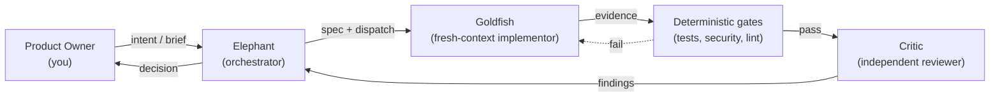
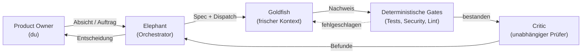

# Agent-Pipeline

A versioned operating model for teams that need agent-assisted delivery to be
reviewable, traceable, and measurable. It turns a change into a bounded task,
machine evidence, independent review, and a durable record that a team can
inspect later.

> _A German version follows below · Eine deutsche Fassung folgt weiter unten._

> **Newcomer path:** Read this page, then follow [SETUP](SETUP.md) for the
> normal consumer adoption flow, continue with [Usage](docs/usage.md), and use
> [PIPELINE_FLOW](PIPELINE_FLOW.md) for the lifecycle. The links below are
> optional reference.

> **Documentation line: `0.6.2`.** This is the next release's documented scope,
> not a tag, installation recommendation, production-availability claim, or
> evidence that a local candidate has passed its release gates.

> **What you can inspect:** a candidate-bound Verify receipt, security-scan
> status, review and approval records where the project requires them, and a
> validated Feature Package or offline Audit Bundle. These artifacts support an
> audit trail; they do not certify compliance or replace an auditor. Start with
> [audit and evidence](docs/audit-and-evidence.md).

> **What it costs:** the [cost page](docs/cost-and-measurement.md) gives four
> historical full-Verify examples, including two red receipts. They are
> observations, not an onboarding estimate or a promise for your project.
> Consumer administration overhead has not yet been measured across runners.

## The problem

Teams with audit obligations often need more than a chat transcript or a claim
that a test passed. They need a repeatable delivery record: who made a decision,
what was checked against which candidate, what was refused, and what remained
outside the evidence. Agent-Pipeline supplies that shared method without making
it a compliance certification or a claim about every host's enforcement.

## What you get

Four deliberately separated roles carry the model:

<!-- capability:human-accountability-roles -->

- **Product Owner (you)** — the human gate. Sets direction, reviews outcomes, holds
  final sign-off.
- **Elephant** — the long-lived orchestrator session. Turns your intent into a spec,
  breaks it into small tasks, dispatches them, and makes the go/no-go call.
- **Goldfish** — a fresh-context implementor subagent. Executes exactly one clearly
  defined task and reports back only with evidence, never a bare claim.
- **Critic** — an independent, read-only reviewer with a fresh context. Never sees
  chat history or reasoning — only the result, judged on its own.

Around those roles:

- **Two-stage review** — deterministic gates (tests, security scan, lint) run
  *before* any LLM judgment; only what survives the gates reaches a Critic.
- **Specs with checkable acceptance criteria** — every task has a Definition of
  Done something or someone can actually check, not a "done"-on-a-feeling.
- **Git and write-path guardrails** — configured integrations can refuse unsafe
  commands, protected-path writes, force-pushes, history rewrites, and skipped
  hooks. The exact live controls depend on the installed runner and project
  configuration; see [enforcement](docs/enforcement.md).
- **A model/token policy** — role-tiered model routing (design / implement /
  mechanic / review / optional advisor) configured to your own subscription, so
  cost tracks task complexity instead of one model doing everything.
- **Evidence discipline** — "done" means a machine-written log or output, the exact
  command, and its exit code — never a model-formulated claim that something
  "should work."
- **Explicit human authority** — plan, acceptance, and remote-action decisions
  remain with the human where the project calibration and action require them;
  evidence never creates that authority.

## Quick start

For a project that will consume the pipeline, go to
[Activate the pipeline in one project repository](SETUP.md#a-activate-the-pipeline-in-one-project-repository).
It starts with prerequisites and the runner's
public onboarding path; it does not ask a consumer to run this repository's
source-maintainer setup. Continue with [Usage](docs/usage.md), then use
[PIPELINE_FLOW](PIPELINE_FLOW.md) to choose the delivery route and
[the documentation map](docs/README.md) for evidence, security, cost, and
runtime-boundary reference.

## How it works

```mermaid
flowchart LR
    PO["Product Owner<br/>(you)"] -->|"intent / brief"| Elephant["Elephant<br/>(orchestrator)"]
    Elephant -->|"spec + dispatch"| Goldfish["Goldfish<br/>(fresh-context implementor)"]
    Goldfish -->|"evidence"| Gates["Deterministic gates<br/>(tests, security, lint)"]
    Gates -.->|"fail"| Goldfish
    Gates -->|"pass"| Critic["Critic<br/>(independent reviewer)"]
    Critic -->|"findings"| Elephant
    Elephant -->|"decision"| PO
```

## The front door: optional design pre-stage

Before the pipeline itself there's deliberately no mandatory step, just a
front door (the dotted branch in the diagram above): idea → optional design
brainstorming with any chat AI (guide + standard prompt + lean export
template under [`docs/design/README.md`](docs/design/README.md)) →
requirements export → feeds the pipeline. If a requirement looks large at
triage (multiple modules/projects affected, new architecture, several
plausible options, a larger security/data surface), the Elephant flags it
**non-blocking** and links the guide — you can always skip the design
pre-stage and go straight to work. An external design export never gets a
free pass: the Elephant challenges it and re-derives it through the normal
path (interview → spec → readiness) instead of adopting it as an
already-approved design. For large topics, the Elephant also proposes a cut
into several self-contained backlog items and waits for confirmation or
correction — the existing per-item PRD review stays the only check point,
nothing new is added. Details: [`docs/operating-model.md`](docs/operating-model.md) — *The lifecycle*.

## Bring your own architecture rules & guardrails

A project can bring its own house rules, split into two classes: **guidelines**
are recommended principles you may deliberately deviate from, as long as the
deviation is named; **policies** are binding rules that block a gate the moment
they're violated. Both live under
[`governance/examples/`](governance/examples/README.md), wired in through the
`governance` block in `.claude/pipeline.yaml`.

Enforcement differs by class: guidelines feed into every plan and are the
Critic's review benchmark — an unnamed deviation is the finding, not the
deviation itself. Machine-checkable policies automatically fail the
security-scan gate; the non-machine-checkable checklist gets ticked off by the
Critic before every push. A pattern played all the way through — from house
rule to enforced rule — lives in the
[worked example](governance/examples/worked-example.md).

## Three dials, not one size fits all

The method uses calibrated strictness: teams can match the written contract
and review depth to the delivery's actual stakes. Three independent dials set
that:

- **Rigor per task** — issue-only / delta-spec / spec-anchored
- **Governance mode per rule set** — advisory / enforcing / off
- **Work profile per topic** — epic / feature / mini (model and effort per
  phase/runner in `pipeline.user.yaml`; Advisor capability is model-free at
  bootstrap and consultation is on demand)

## Why this holds up at enterprise scale

What comes together here is more than an agent setup: a repeatable architecture
through the governance layer, machine-checkable gates instead of promises,
mandatory documentation artifacts instead of word-of-mouth knowledge, an
independent review kept separate from the executing context, and a model/cost
policy that scales effort to risk. The reasoning behind it: attention is the
scarcest resource — so strictness gets invested where mistakes are expensive,
and consciously spared elsewhere. The final judgment still always stays with the
human.

## Source-maintainer reference

Source maintainers can find the checkout commands and V3 authority sequence in
[Maintain a shared pipeline source](SETUP.md).
Routine adopters should follow the consumer path above.

Before your first big feature, a quick look at
[`docs/design/README.md`](docs/design/README.md) pays off — a self-service
guide for brainstorming a solid requirement before it enters the pipeline
(optional, recommended).

## Runtime

Supported runner integrations can enforce configured guards. The methodology
remains portable; see [`docs/runtime-boundary.md`](docs/runtime-boundary.md)
for current runner boundaries and setup requirements.

## Learn more

Follow the canonical [documentation map](docs/README.md): it keeps adoption,
enforcement, evidence, security, cost, and maintainer references in one order.
For the normative contract, read [`docs/operating-model.md`](docs/operating-model.md).
- [`LICENSE`](LICENSE) and [`LICENSE-DOCS`](LICENSE-DOCS) use the source-available Sustainable Use License 1.0 (SUL-1.0) with the Agent-Pipeline Additional Permission; see [`docs/licensing.md`](docs/licensing.md).

## Acknowledgments

This operating model is a synthesis, not an invention. It adapts and builds on
the ideas in three published works, and we thank their authors for the thinking
that shaped it:

- [Dave Rensin, **“Elephants, Goldfish and the New Golden Age of Software Engineering”**](https://research.google/pubs/elephants-goldfish-and-the-new-golden-age-of-software-engineering/) — source of the Elephant and Goldfish roles and the principle that the document, not the session, carries the knowledge;
- [Addy Osmani, Shubham Saboo, Sokratis Kartakis, **“The New SDLC With Vibe Coding”**](https://addyosmani.com/blog/new-sdlc-vibe-coding/) — source of *Agent = Model + Harness*, the orchestrator capability model, and stakes-driven discipline;
- [Google/Kaggle, **“Spec-Driven Production Grade Development in the Age of Vibe Coding”**](https://www.kaggle.com/whitepaper-spec-driven-production-grade-development-in-the-age-of-vibe-coding) — source of the approval-fatigue analysis behind the deliberately minimal set of human gates.

Where this repository departs from these sources — for example, recasting the
Goldfish as an executor rather than a checker — it says so, and why, in
[`docs/operating-model.md`](docs/operating-model.md) and
[`docs/design-decisions.md`](docs/design-decisions.md).

---

<!-- DE-REFERENCE-BELOW | agents: skip everything below this line; it is a full German reference translation (redundant, wastes context). The authoritative content is the English above. Convention: CLAUDE.md (Language). -->

# Agent-Pipeline (Deutsch)

Ein versioniertes Operating Model für Teams, die agentische Lieferung
prüfbar, nachvollziehbar und messbar machen müssen. Es formt eine Änderung zu
einer begrenzten Aufgabe, Maschinenevidenz, unabhängiger Prüfung und einem
dauerhaften, später einsehbaren Nachweis.

> **Einstieg für Neue:** Lies diese Seite und folge dann [SETUP](SETUP.md) für
> den normalen Consumer-Ablauf, lies danach [Usage](docs/usage.md) und nutze
> [PIPELINE_FLOW](PIPELINE_FLOW.md) für den Lifecycle. Die weiteren Links sind
> Nachschlagewerk.

> **Dokumentationslinie: `0.6.2`.** Sie beschreibt den dokumentierten Umfang
> des nächsten Releases, keinen Tag, keine Installationsempfehlung, keine
> Produktivverfügbarkeit und keinen Nachweis bestandener lokaler Release-Gates.

> **Was du prüfen kannst:** kandidatengebundene Verify-Receipts,
> Security-Scan-Status sowie erforderliche Review- und Freigabe-Nachweise. Ein
> validiertes Feature Package oder Offline-Audit-Bundle kann diese Artefakte
> zusammenstellen. Das unterstützt eine Audit-Spur, ersetzt aber weder Auditor
> noch Compliance-Zertifizierung. Siehe [Audit und Evidenz](docs/audit-and-evidence.md).

> **Was es kostet:** Die [Kostenseite](docs/cost-and-measurement.md) zeigt vier
> historische vollständige Verify-Beispiele, darunter zwei rote Receipts. Das
> sind Beobachtungen, keine Onboarding-Schätzung oder Zusage für dein Projekt.
> Consumer-Verwaltungsaufwand über Runner hinweg ist noch nicht gemessen.

## Das Problem

Teams mit Audit-Pflichten brauchen oft mehr als einen Chat-Verlauf oder die
Behauptung, ein Test sei grün. Sie brauchen einen wiederholbaren
Delivery-Nachweis: Wer hat entschieden, was wurde gegen welchen Kandidaten
geprüft, was wurde verweigert und was bleibt außerhalb der Evidenz.
Agent-Pipeline liefert diese gemeinsame Methode, aber keine Compliance-
Zertifizierung und keine Aussage über Enforcement auf jedem Host.

## Was du bekommst

Vier bewusst getrennte Rollen tragen das Modell:

- **Product Owner (du)** — das menschliche Gate. Gibt die Richtung vor, prüft
  Ergebnisse, erteilt die finale Freigabe.
- **Elephant** — die langlebige Orchestrator-Sitzung. Formt aus deiner Absicht eine
  Spezifikation, zerlegt sie in kleine Aufgaben, delegiert sie und entscheidet am
  Ende über Go/No-Go.
- **Goldfish** — ein Subagent mit frischem Kontext. Führt genau eine klar
  umrissene Aufgabe aus und meldet sich nur mit Nachweis zurück, nie mit einer
  bloßen Behauptung.
- **Critic** — ein unabhängiger Prüfer mit reinem Lesezugriff und frischem
  Kontext. Sieht nie Chat-Verlauf oder Begründungen — nur das Ergebnis, das er
  für sich beurteilt.

Ergänzend dazu:

- **Zweistufiges Review** — deterministische Gates (Tests, Security-Scan, Lint)
  laufen *vor* jedem LLM-Urteil; nur was die Gates übersteht, erreicht einen
  Critic.
- **Specs mit prüfbaren Akzeptanzkriterien** — keine Aufgabe ist „fertig" nach
  Gefühl; jede Aufgabe hat eine Definition of Done, die sich tatsächlich prüfen
  lässt.
- **Git- und Write-Path-Guardrails** — konfigurierte Integrationen können
  unsichere Befehle, geschützte Writes, Force-Pushes, History-Rewrites und
  übersprungene Hooks verweigern. Die aktiven Kontrollen hängen von Runner und
  Projektkonfiguration ab; siehe [Enforcement](docs/enforcement.md).
- **Eine Modell-/Token-Policy** — rollenabgestuftes Modell-Routing (Design /
  Implementierung / Mechanik / Review / optionaler Advisor), die du auf dein
  eigenes Abo einstellst, sodass sich die Kosten nach der Aufgabenkomplexität
  richten, statt dass ein einziges Modell alles übernimmt.
- **Nachweispflicht** — „fertig" heißt: ein maschinell geschriebenes Log oder
  Ergebnis, dazu der exakte Befehl und dessen Exit-Code — nie eine vom Modell
  formulierte Behauptung, etwas „sollte funktionieren".
- **Explizite menschliche Autorität** — Plan-, Abnahme- und Remote-Aktionen
  bleiben dort beim Menschen, wo Projektkalibrierung und Aktion dies verlangen;
  Evidenz erzeugt diese Autorität nicht.

## Schnellstart

Für ein Consumer-Projekt folge in [SETUP dem Abschnitt „Activate the pipeline
in one project repository“](SETUP.md#a-activate-the-pipeline-in-one-project-repository).
Dieser Weg beginnt mit Voraussetzungen und dem öffentlichen
Onboarding-Pfad des Runners; er verlangt nicht die source-maintainer-`setup.mjs`.
Danach folgt [Usage](docs/usage.md); [PIPELINE_FLOW](PIPELINE_FLOW.md) erklärt
die Lieferroute, und die [Dokumentationskarte](docs/README.md) verweist auf
Evidenz, Security, Kosten und Runner-Grenzen.

## Wie es funktioniert

```mermaid
flowchart LR
    PO["Product Owner<br/>(du)"] -->|"Absicht / Auftrag"| Elephant["Elephant<br/>(Orchestrator)"]
    Elephant -->|"Spec + Dispatch"| Goldfish["Goldfish<br/>(frischer Kontext)"]
    Goldfish -->|"Nachweis"| Gates["Deterministische Gates<br/>(Tests, Security, Lint)"]
    Gates -.->|"fehlgeschlagen"| Goldfish
    Gates -->|"bestanden"| Critic["Critic<br/>(unabhängiger Prüfer)"]
    Critic -->|"Befunde"| Elephant
    Elephant -->|"Entscheidung"| PO
```

## Die Vordertür: optionale Design-Vorstufe

Vor der eigentlichen Pipeline steht bewusst kein Pflichtschritt, sondern eine
Vordertür (im Diagramm oben der gestrichelte Zweig): Idee → optionales
Design-Brainstorming mit einer beliebigen Chat-KI (Guide + Standard-Prompt +
schlankes Export-Template unter [`docs/design/README.md`](docs/design/README.md))
→ Requirements-Export → speist die Pipeline. Wirkt eine Anforderung bei der
Triage umfangreich (mehrere Module/Projekte betroffen, neue Architektur,
mehrere plausible Optionen, größere Security-/Datenfläche), weist der
Elephant **nicht-blockierend** darauf hin und verlinkt den Guide — wer sofort
ohne Design weiterarbeiten will, kann das jederzeit tun. Ein externer
Design-Export bekommt dabei nie einen Vertrauensvorschuss: Der Elephant
challenged ihn und leitet ihn über den normalen Weg (Interview → Spec →
Readiness) neu her, statt ihn als fertig genehmigtes Design zu übernehmen.
Bei großen Themen schlägt der Elephant zusätzlich einen Schnitt in mehrere
eigenständige Backlog-Items vor und wartet auf Bestätigung oder Korrektur —
das bestehende PRD-Review pro Item bleibt der einzige Prüfpunkt, es kommt
nichts Neues hinzu. Details: [`docs/operating-model.md`](docs/operating-model.md) — *The lifecycle*.

## Eigene Architekturvorgaben & Guardrails

Ein Projekt kann eigene Hausregeln mitbringen — getrennt in zwei Klassen:
**Guidelines** sind empfohlene Prinzipien, von denen bewusst und benannt
abgewichen werden darf; **Policies** sind verbindliche Regeln, die ein Gate
blockieren, sobald sie verletzt werden. Beide leben unter
[`governance/examples/`](governance/examples/README.md) und werden über den
`governance`-Block in `.claude/pipeline.yaml` eingebunden.

Durchgesetzt wird jede Klasse unterschiedlich: Guidelines fließen in jeden Plan
ein und sind der Prüf-Maßstab des Critic — eine unbenannte Abweichung ist der
Befund, nicht die Abweichung selbst. Maschinell prüfbare Policies blockieren
automatisch das Security-Scan-Gate; die nicht-maschinelle Checkliste hakt der
Critic vor jedem Push ab. Ein Muster komplett durchgespielt — von der
Hausregel bis zur erzwungenen Regel — steht im
[Worked Example](governance/examples/worked-example.md).

## Drei Drehregler statt einer Einheitsgröße

Die Methode nutzt kalibrierte Strenge: Teams können schriftlichen Vertrag und
Review-Tiefe an die tatsächlichen Stakes einer Lieferung anpassen. Drei
unabhängige Regler stellen das ein:

- **Rigor pro Aufgabe** — Issue-only / Delta-Spec / Spec-verankert
- **Governance-Modus pro Regelwerk** — advisory / enforcing / off
- **Arbeitsprofil pro Thema** — Epic / Feature / Mini (Modell und Effort je
  Phase/Runner in `pipeline.user.yaml`; Advisor-Capability ist im Bootstrap
  modellfrei und Consultation läuft on demand)

## Warum das auch im Unternehmenskontext trägt

Was hier zusammenkommt, ist mehr als ein Agent-Setup: eine wiederholbare
Architektur durch die Governance-Schicht, maschinell prüfbare Gates statt
Versprechen, Pflicht-Dokumentationsartefakte statt Zuruf-Wissen, ein
unabhängiges Review getrennt vom ausführenden Kontext und eine
Modell-/Kosten-Policy, die Aufwand nach Risiko staffelt. Der Grund dahinter:
Aufmerksamkeit ist die knappste Ressource — Strenge wird also dort
investiert, wo Fehler teuer sind, und woanders bewusst gespart. Das letzte
Urteil bleibt trotzdem immer beim Menschen.

## Source-Maintainer-Referenz

Source-Maintainer finden die Checkout-Befehle und die V3-Autoritätsreihenfolge
unter [Maintain a shared pipeline source](SETUP.md).
Normale Consumer-Übernahmen folgen dem oben beschriebenen Consumer-Pfad.

Vor dem ersten großen Feature lohnt ein kurzer Blick in
[`docs/design/README.md`](docs/design/README.md) — der Selbstbedienungs-Guide
zum Brainstorming einer soliden Anforderung, bevor sie in die Pipeline geht
(optional, empfohlen).

## Laufzeitumgebung

Unterstützte Runner-Integrationen können konfigurierte Guards durchsetzen. Die
Methodik bleibt übertragbar; die aktuellen Runner-Grenzen und Voraussetzungen
stehen in [`docs/runtime-boundary.md`](docs/runtime-boundary.md).

## Mehr erfahren

Folge der kanonischen [Dokumentationskarte](docs/README.md): Sie ordnet
Übernahme, Enforcement, Evidenz, Security, Kosten und Maintainer-Referenzen.
Den normativen Vertrag beschreibt [`docs/operating-model.md`](docs/operating-model.md).
- [`LICENSE`](LICENSE) und [`LICENSE-DOCS`](LICENSE-DOCS) verwenden die source-available Sustainable Use License 1.0 (SUL-1.0) mit der Agent-Pipeline Additional Permission; siehe [`docs/licensing.md`](docs/licensing.md).

## Danksagung

Dieses Operating Model ist eine Synthese, keine Erfindung. Es adaptiert die
Ideen aus drei veröffentlichten Arbeiten und baut auf ihnen auf; wir danken
ihren Autorinnen und Autoren für die Denkarbeit, die es geprägt hat:

- [Dave Rensin, **„Elephants, Goldfish and the New Golden Age of Software Engineering“**](https://research.google/pubs/elephants-goldfish-and-the-new-golden-age-of-software-engineering/) — Quelle der Elephant- und Goldfish-Rollen und des Prinzips, dass das Dokument, nicht die Session, das Wissen trägt;
- [Addy Osmani, Shubham Saboo, Sokratis Kartakis, **„The New SDLC With Vibe Coding“**](https://addyosmani.com/blog/new-sdlc-vibe-coding/) — Quelle von *Agent = Model + Harness*, des Orchestrator-Capability-Modells und der stakes-getriebenen Disziplin;
- [Google/Kaggle, **„Spec-Driven Production Grade Development in the Age of Vibe Coding“**](https://www.kaggle.com/whitepaper-spec-driven-production-grade-development-in-the-age-of-vibe-coding) — Quelle der Approval-Fatigue-Analyse hinter dem bewusst minimalen Satz an Human-Gates.

Wo dieses Repository von diesen Quellen abweicht — etwa indem der Goldfish als
Ausführender statt als Prüfer neu geschnitten wird —, sagt es das und warum, in
[`docs/operating-model.md`](docs/operating-model.md) und
[`docs/design-decisions.md`](docs/design-decisions.md).

---

Die deutsche Fassung ist eine Übersetzung des englischen Originals.
