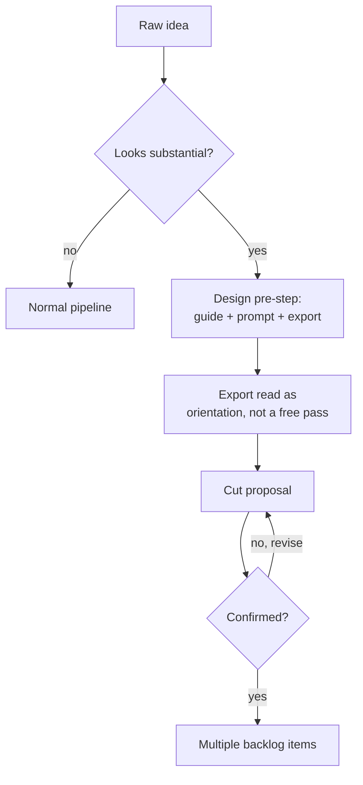

# Export Template (lean)

The target format for the design export produced by the
[facilitator prompt](design-facilitator-prompt.md). Eight lean sections — not a
mandatory schema for the pipeline, but the recommended shape if you want a structured
export. Background and techniques: [`README.md`](README.md).

## The template

```
1. Context & problem
2. Goals / non-goals
3. Affected projects/components
4. Architecture options (min. 2) + chosen option + brief rationale
5. Diagrams (Mermaid): context/component + flow/sequence
6. Risks & assumptions
7. Open questions
8. Rough cut idea → possible backlog items, incl. dependencies between the
   proposed items
```

Section 8 is the handoff to the pipeline: if your topic consists of several items, name
here already which item builds on which — that saves a round of clarifying questions
once the cut is proposed later.

## Short example: Mermaid with self-check

Section 5 asks for diagrams with self-verification (see the facilitator prompt's
diagram rules). Here's what that looks like in practice — a short, adapted example for
a flow with a branch and a loop:



Mermaid check: passed

Two conventions from the example you should adopt:

- **Line breaks in node labels** using `<br/>` (not `\n`) — this renders reliably in
  Mermaid, both in mermaid.live and in most Markdown viewers.
- **Self-check line** directly below each diagram: briefly note that you checked the
  block mentally (or via a tool) before exporting it.

## Format note

Markdown is the most pipeline-friendly form (directly readable, versionable, diffable).
PDF is also accepted as an input form if your path leads there (e.g. export from a
diagramming/whiteboard tool) — the pipeline then only loses diff capability, not
readability.

## Local Mermaid check (optional)

For an actual syntax check instead of just mental parsing: [mermaid.live](https://mermaid.live)
(copy-paste, instant rendering) or `mmdc` (Mermaid CLI) locally, if installed. Both are
optional — the self-check in the prompt is sufficient for this asset's advisory purpose.
