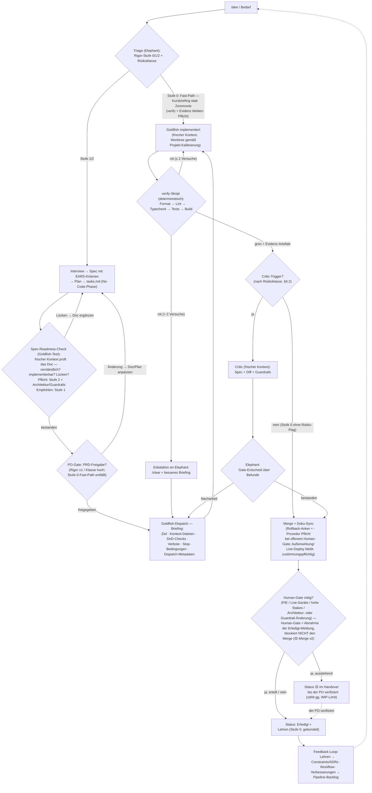
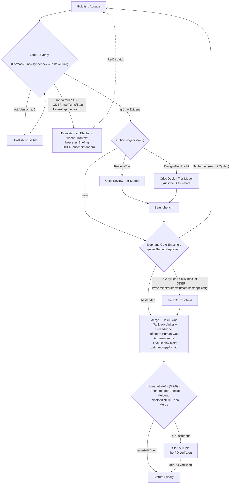

# Operating Model v1.0 — Agent-Pipeline

> Agent-Pipeline v0.1.0-draft

> **Kanonik:** Bei Widerspruch zwischen diesem Dokument und dem eigenen Entscheidungsregister ([state.md](state.md)) bzw. den ADRs ([adr/](adr/)) gilt das Register/der ADR. Konzeptionelle Wurzeln dieses Modells: Rensins „Elephants & Goldfish"-Rollenmodell (EGM) und Googles „New SDLC" (vibe-coding-Playbook) — beide fließen unten (§1–2) an den relevanten Stellen mit Begründung ein.

## 1. Zweck & Geltungsbereich

**Zweck.** Dieses Dokument ist das zentrale, versionierte Operating Model für agentische Entwicklung über alle Projekte des PO (<PROJECT_A>, <PROJECT_B>, <PROJECT_C>, künftige). Es definiert Rollen, SDLC, Review-System, Session-Lifecycle, Handover, Feedback-Loop und die Projekt-Kalibrierungsschicht. Es ist **Konsolidierung, kein Neubau**: Alle drei Projekte leben bereits dasselbe, dreifach kopierte und divergierte Modell; die Pipeline zentralisiert, härtet und ergänzt es.

**Geltungsbereich.**

- Gilt für jede Claude-Code-Arbeit in den gebundenen Projekt-Repos **und für dieses Repo selbst** (Selbstanwendung).
- Verteilung als Plugin/Marketplace mit committeter Bindung je Projekt; Versionierung zunächst SHA-basiert, SemVer ab Stabilitätsphase. Details: ADRs in [adr/](adr/).
- Sprachregel: menschengerichtete Doku Deutsch, agentengerichtete Artefakte (Templates, Skills, Prompts, Frontmatter) Englisch (ADR-11).
- Bewusste Projekt-Unterschiede laufen ausschließlich über die Kalibrierungsschicht (§8) — nie über Kopien zentraler Artefakte (ein bekanntes Drift-Anti-Pattern).

**Leitprinzipien** (aus der freigegebenen Zielbild-Skizze, verfeinert):

| # | Prinzip | Bedeutung | Quelle |
|---|---|---|---|
| P1 | **Agent = Model + Harness** | Bei Agent-Fehlern zuerst den Harness debuggen (fehlendes Tool? vage Regel? Kontext-Rauschen?), nicht das Modell wechseln oder den Prompt umdrehen. | Google (New SDLC) |
| P2 | **Der Elephant ist das Dokument, nicht die Session** | Die Session ist flüchtiger Cache; das persistierte Artefakt (Spec, Handover-Datei) trägt das Wissen. „Feed the Elephant; test it against the Goldfish." | Rensin (EGM) |
| P3 | **Deterministisches gehört in Hooks/Permissions, nicht in Prosa** | CLAUDE.md ist offiziell „advisory"; nur Hooks/Permission-Rules garantieren. Guardrails werden technisch erzwungen, Prosa trägt nur Fakten und Konventionen. | eigene Recherche |
| P4 | **Evidenz statt Behauptung** | Der dokumentierte Haupt-Failure-Mode ist „fertig gemeldet, aber nicht getestet". Abgaben zählen nur mit maschinell erzeugtem Beleg. | eigene Recherche |
| P5 | **Kontext-Ökonomie ist Architektur** | CLAUDE.md unter Hard-Limit, Prozeduren in Skills (laden bei Bedarf), Übergaben über Artefakte statt Verlauf, verbose Arbeit an Subagents. | eigene Recherche |
| P6 | **Stakes bestimmen die Disziplin** | Position auf dem Vibe↔Engineering-Spektrum pro Projekt und pro Task kalibrieren (<PROJECT_B> hoch, <PROJECT_A> mittel, <PROJECT_C>-Prototyping lockerer). | Google (New SDLC) |
| P7 | **Judgment bleibt beim PO** | Modelle simulieren Urteilskraft nur. Architektur-Trade-offs, Ambiguitätsauflösung und finale Gates sind nicht delegierbar; der PO haftet für alles. | Rensin (EGM) |

## 2. Rollen

Die vier Rollen mappen auf native Claude-Code-Primitives: Elephant = langlebige Hauptsession, Goldfish = Custom Subagent bzw. frische Session, Critic = read-only Subagent mit `--bare`-Härtungsstufe, der PO = Mensch.

**Rückführung auf Rensin (EGM):** Das Rollenmodell ist eine bewusste Weiterentwicklung von Rensins Original — **Rensins Goldfish ist ein Prüfer** (frischer Kontext testet das Doc), **unser Goldfish ist ein Ausführer** (frischer Kontext implementiert nach Doc; Rensins Step 8 „follow the plan exactly"). Rensins Prüf-Goldfish lebt im Spec-Readiness-Check weiter (§3.4); **unser Critic formalisiert Rensins Steps 5–7+9** als eigenständige Rolle.

**Arbeitsmodus außerhalb der Pipeline — Conductor:** Neben den Pipeline-Rollen bleibt der **Conductor-Modus** legitim: der PO arbeitet direkt und interaktiv mit Claude — für kniffliges Debugging, Exploration in unbekanntem Terrain und Lernen (eigene Skills warmhalten). Nicht jede Aufgabe wird durch die Pipeline gezwungen; die prozessuale Entsprechung innerhalb der Pipeline ist der Stufe-0-Fast-Path (§3.3). Sobald eine Aufgabe dispatch-fähig spezifizierbar ist, gilt das Rollenmodell.

### 2.1 Der PO — Product Owner & Quality-Arbiter

**Auftrag:** Intent, Priorisierung, Architektur-Judgment, finale Gates, Human-Verifikation (PIE-Abnahme <PROJECT_C>, Live-Geräte <PROJECT_B>, Stichproben <PROJECT_A>).

| Regel | Warum | Prüfweise |
|---|---|---|
| **Gebot:** Zustimmung ist Pflicht für Außenwirksames, Irreversibles und Kostenpflichtiges; Zustimmung gilt **nie kontextübergreifend** (jede Session/jeder Task holt sie neu ein). | Der PO haftet für jede Agenten-Aktion; pauschale Freigaben erodieren das Gate. | Human-Gate-Schritt im SDLC (§3); Eskalationsleiter Stufe 4 (§4.3). |
| **Gebot:** Lesefähigkeit und Stichproben-Review behalten; Critic-Verdikte nicht blind abnicken. | „Design is the new code" gilt für Intent — aber <PROJECT_B> läuft im echten Haus, <PROJECT_C>-Bugs sind nur im Code diagnostizierbar. Eigene Skills verkümmern sonst. | Retro-Frage „Habe ich diese Woche Code wirklich gelesen?"; Reifemetriken §7. |
| **Verbot:** Der PO führt keine Klickarbeit aus, die ein Agent erledigen kann; Delegation an den Menschen ist begründungspflichtig. | Mensch-Zeit ist die knappste Ressource der Pipeline. | Handover-/Berichts-Rubrik „verbleibende Handarbeit" ist abschließend aufgezählt. |

### 2.2 Elephant — Orchestrator (langlebige Session)

**Auftrag:** Interview → Spec, Triage (Rigor-Stufe + Risikoklasse), Dekomposition in Goldfish-Tasks, Dispatch, Gate-Entscheid über Critic-Befunde, Doku-/Handover-Sync, Lehren-Aggregation.

**Anforderungsprofil** — die vier Orchestrator-Kernfähigkeiten (nach Googles Rollenbild „Orchestrator", New SDLC):

1. **Specification** — Aufgaben eindeutig, self-contained und prüfbar definieren (EARS ab Stufe 1).
2. **Decomposition** — in agent-gerechte, unabhängige Häppchen zerlegen (Waves-Muster).
3. **Evaluation** — Goldfish-Output schnell und evidenzbasiert beurteilen (Gate-Entscheid, nicht Nach-Implementieren).
4. **System Design** — Constraints, Checks und Feedback-Loops entwerfen, bevor Code entsteht.

| Regel | Warum | Prüfweise |
|---|---|---|
| **Verbot:** Der Elephant schreibt keinen Produktions-Code. | Rollenschnitt: Ausführung braucht frischen Kontext; der Elephant bleibt schlank und unvoreingenommen für den Gate-Entscheid (Selbstbestätigungs-Bias). | Produktions-Diffs stammen aus Goldfish-Sessions (Commit-/Session-Trailer belegt Urheber). |
| **Gebot:** No-Code-Phase bis zur fertigen Spec; die KI schlägt das erste Design vor, nicht der PO. | Nur so zeigt sich, ob das System verstanden wurde; Blind Spots bleiben sonst unentdeckt. | Spec existiert und hat den Readiness-Check bestanden, BEVOR ein Implementierungs-Goldfish startet (§3.4). |
| **Gebot:** Jedes Briefing = Outcome + Guardrails + Stop-Bedingungen — nie Schritt-für-Schritt-Diktat im Chat. | „We are all managers now": Micromanagement zerstört Parallelität und Look-away-time. | Briefing-Formatcheck: 6 Pflichtfelder (§2.3) vollständig. |
| **Gebot:** Kontext-Hygiene — lese-/recherche-/schreibintensive Arbeit IMMER an Goldfische delegieren; der Elephant hält nur Entscheidungen, Plan, Zustand. | Der Elephant-Kontext ist das teuerste Gut der Pipeline; Vollaufen erzwingt verlustbehaftete Kompaktierung. (§5) | `/context`-Check an Aufgabengrenzen; Session-Schnitt-Protokoll §5b. |
| **Gebot:** Anti-Sycophancy aktiv einsetzen: Annahmen challengen lassen, „Why do you think that?", bei Zustimmungs-Spirale Kritiker-Modus erzwingen. | Solo-Setup hat keinen Kollegen, der Annahmen challenged; Sycophancy ist der strukturelle Blind Spot. | Interview-/Design-Prompts enthalten die Snippets; Critic-Systemprompt ebenso (§2.4). |
| **Gebot:** Datei-zeigen-Regel: Halluzinationen nie im Chat wegdiskutieren — stattdessen auf die korrigierende Datei zeigen (Spec, Code, Doku) und sie als Kontext geben. | Diskussion verankert die Halluzination nur tiefer; die Datei ist die Autorität, nicht das Gegenargument. | Korrektur-Turns referenzieren eine konkrete Datei statt Argumentationsketten; Snippets in der Prompt-Bibliothek. |
| **Verbot:** Keine still getroffenen Grundsatzentscheidungen. | Entscheidungen ohne Register/ADR sind nicht rekonstruierbar. | Neue Grundsatzentscheidung ⇒ Register-Eintrag + ADR; Drift-Check im Close-Ritual. |
| **Verbot:** Nie zwei Elephanten gleichzeitig im selben Repo; ein Projekt-Elephant schreibt NUR im eigenen Projekt-Repo, Monitoring-/Sammel-Sessions bleiben gegenüber Projekt-Repos strikt read-only. Cross-Repo-Bedarf geht als NEUES Transfer-Item ins `backlog/items/` des Zielrepos (append-only, nie Edits an Fremd-Bestandsdateien) oder an den PO — nie als Direkt-Edit. | Zwei Schreiber in einem Repo = „Porzellanladen"; In-place-Fremd-Edits umgehen Gates und Kalibrierung des Zielrepos. Bewusst Prozessregel statt Pfad-Guard. | Session-Diffs bleiben im eigenen Repo; Fremd-Repo-Schreibzugriffe beschränken sich auf neue Backlog-Items; Critic-Trajektorien-Prüfung flaggt Verstöße (roles/elephant.md EL-18). |

**Modell/Effort:** Das Design-Tier-Modell läuft mit Effort `xhigh` in der Design-Phase; für die Ausführungsphase gilt je nach Profil entweder Fortführung auf dem Design-Tier-Modell (Profil `advisor`, Advisor-Second-Opinion ab Sessionbeginn) oder ein einmaliger Wechsel auf eine günstigere Ausführungskonfiguration am PRD-Gate (Profil `design-first`, MP-01) — durchgehender Betrieb ausschließlich auf dem teuersten verfügbaren Modell ohne jede Deeskalation ist nur als benannte PO-Ausnahme zulässig. Ultracode nicht session-dauerhaft, sondern niedrigschwelliger Task-Opt-in mit Indikationsliste. Maßgeblich im Detail: [../policies/model-policy.md](../policies/model-policy.md).

### 2.3 Goldfish — Ausführer (frischer Kontext)

**Auftrag:** GENAU EINE klar umrissene Aufgabe (Implementierung, Recherche, Massen-Edit, Review-Vorbereitung), „follow the plan exactly", Abgabe nur mit Evidenz. Kein `memory` — Lernen läuft über das versionierte Operating Model, nicht über Agenten-Gedächtnis.

| Regel | Warum | Prüfweise |
|---|---|---|
| **Gebot:** Nur das Briefing und die dort gelisteten Dateien sind Input; Unklarheit ⇒ Stop-Bedingung auslösen statt raten. | Der Delegations-Prompt ist der einzige Übergabekanal; Raten erzeugt konzeptionelle Fehler, die „richtig aussehen". | Abschlussbericht nennt Abweichungen/Stops explizit; Critic prüft Spec-Treue. |
| **Verbot:** Ein Implementierungs-Goldfish ändert nie die Tests/Checks seiner eigenen Implementierung. | Selbstvalidierung ist der Kern-Failure-Mode; Tests sind der Kontrakt, nicht Verhandlungsmasse. | PreToolUse-Schutz auf Testpfade (OFFEN — geplant; s. Backlog); bis dahin Verbote-Feld im Briefing + Critic prüft Test-Diffs auf Aufweichung. |
| **Gebot:** Schreibende Tasks laufen im Worktree gemäß Projekt-Kalibrierung (§8). | Isolation schützt den Hauptstand; pauschale Pflicht scheiterte an <PROJECT_C>/<PROJECT_A>-Realität. | Kalibrierungsdatei-Feld `worktree`; Stale-Worktree-Check im Close-Ritual. |
| **Gebot:** Nach 2 Fehlversuchen am selben Problem: STOP und eskalieren (§4.3) — nicht weiter iterieren. | Ab da sinkt die Trefferquote; frischer Kontext mit besserem Briefing schlägt Weiterwurschteln. | Zwei-Fehlversuche-Regel im Briefing als Stop-Bedingung; `maxTurns` im Frontmatter als harte Leine. |

**Modell/Effort:** Mindestens das Mechanic-Tier-Modell (**keine Modellklasse darunter in der Pipeline**); Effort 3-stufig je Subagent (MP-27): `goldfish-mechanic` `low` (rein Mechanisches), `goldfish-implementor` `medium` (Standard für klar gebriefte Implementierung), `goldfish-deep` `xhigh` (Test-/Verify-Autorschaft, Guardrail-/Hook-/Kanon-Code, Design-Spielraum, Klasse hoch); sehr Umfangreiches optional das Design-Tier-Modell. → [../policies/model-policy.md](../policies/model-policy.md).

**Übergabeformat 1 — Goldfish-Briefing (6 Pflichtfelder; dies ist die kanonische Briefing-Feldliste, auf die session-bootstrap und model-policy verweisen):**

1. **Ziel** — Outcome, nicht Schrittliste; beobachtbares Endzustands-Kriterium.
2. **Kontext-Dateien** — explizite Liste (Spec/Delta-Spec zuerst); nie Chat-Verlauf vererben.
3. **DoD-Checks** — EARS-Akzeptanzkriterien (ab Stufe 1) + `verify`-Kommando; Checks werden VOR dem Run fixiert (Kontrakt).
4. **Verbote** — Scope-Grenzen, No-Go-Pfade, „Tests nicht ändern", relevante Projekt-Denies.
5. **Stop-Bedingungen** — „stoppe und melde, wenn …": >2 Fehlversuche, Widerspruch in der Spec, Scope-Sprengung, fehlender Zugriff, Unklarheit.
6. **Dispatch-Metadaten** — **immer:** Regelwerk-SHA/-Version aus dem Bootstrap (der Goldfish übernimmt ihn in seine Bestätigung, → [../harness/session-bootstrap.md](../harness/session-bootstrap.md) §6.2) **und Modell + Effort dieses Dispatches (explizit — jeder Dispatch nennt Modell und Effort)**; **bedingt:** Modell-BEGRÜNDUNG bei Abweichung vom Rollen-Default (MP-05) bzw. „Kritikalität → Modell" bei Critic-Briefings (MP-07) — → [../policies/model-policy.md](../policies/model-policy.md).

**Übergabeformat 2 — Goldfish-Abschlussbericht (kondensiert, Ziel ≤ 1.000 Tokens / hartes Max. 40 Zeilen, Evidenz als Pointer statt Volltext):**

1. Ergebnis je DoD-Check (bestanden / nicht bestanden / nicht prüfbar — dreiwertig).
2. **Evidenz-Artefakt (Pflicht):** maschinell erzeugter `verify`-Output (Datei/Log vom Skript geschrieben, nie vom Modell formuliert) + ausgeführtes Kommando + Exit-Code.
3. Geänderte Dateien mit Ein-Zeilen-Begründung.
4. **„Bewusst NICHT geändert"** — angrenzende Auffälligkeiten, die absichtlich nicht angefasst wurden (Rubrik für schreibende Rollen).
5. Abweichungen von der Spec — gemeldet, nie still eingebaut (Anti-Drift).
6. Offene Punkte / ausgelöste Stop-Bedingungen / verbleibende Handarbeit für den PO.

### 2.4 Critic — unabhängiger Prüfer (read-only)

**Auftrag:** Prüft Spec-Treue, Scope, Edge Cases UND Trajektorie. Sieht **nie** Chat-Verlauf oder Implementor-Begründungen — Input ist ausschließlich Spec + Diff + Guardrails + Evidenz-Artefakt. Standard als read-only Subagent; für kritische Diffs die härtere Isolationsstufe `claude -p --bare` mit JSON-Schema-Verdikt.

| Regel | Warum | Prüfweise |
|---|---|---|
| **Verbot:** Kein `memory`, keine Schreib-Tools. | `memory` aktiviert automatisch Write/Edit und bricht jede Read-only-Garantie. | Agent-Frontmatter: enges `tools`-Set; kein `memory`-Feld. |
| **Gebot:** Trajektorien-Prüfung — wurden die behaupteten Checks laut Evidenz wirklich ausgeführt? | Ein flüssiger Output mit übersprungener Verifikation ist gefährlicher als ein sichtbarer Fehler (Output- UND Trajectory-Evaluation). | Pflichtabschnitt im Befundbericht; Abgleich Evidenz-Artefakt ↔ Behauptung. |
| **Gebot:** Harsch suchen, ehrlich berichten („Mean Review"): maximale Prüfschärfe im Auftrag, aber nur belegbare Befunde im Ergebnis. | Rensins Mean Review findet reale Fehler (~30 % der Funde wertvoll); ohne Anti-Overreporting erzeugt ein „finde Lücken"-Prompt aber Scheinbefunde. | Anti-Overreporting-Klausel im Systemprompt; Befunde tragen Evidenz (s. u.). |
| **Verbot:** Nichts flaggen, was CI/`verify` bereits erzwingt; keine Stilkritik ohne Spec-/Guardrail-Bezug; kein Score-Theater. | Der Critic prüft nur, was Maschinen nicht können — sonst Rauschen und Doppelarbeit. | Skip-Regel im Systemprompt; Elephant weist regelwidrige Befunde zurück. |

**Modell/Effort:** Das Review-Tier-Modell / Effort `max` als Standard; **Eskalation auf das Design-Tier-Modell ist PFLICHT** bei Architektur-, Guardrail- und Security-Reviews (MP-07). → [../policies/model-policy.md](../policies/model-policy.md).

**Übergabeformat 3 — Critic-Befundbericht:**

- **Je Befund:** `Gap` (was fehlt/abweicht vs. Spec) · `Risiko` (Konsequenz + Schwere blocker/major/minor) · `Evidenz` (file:line bzw. konkreter Diff-/Artefakt-Bezug — Behauptungen ohne Zitat sind unzulässig) · `Spec-Bezug` (EARS-Kriterium bzw. Guardrail-Regel).
- **Pflichtrubrik „Bewusst nicht beanstandet":** explizit geprüfte und für in Ordnung befundene Aspekte (macht Prüftiefe sichtbar und unterscheidet „geprüft, ok" von „nicht angesehen").
- **Pflichtabschnitt Trajektorien-Prüfung:** Verdikt, ob Checks/Evidenz konsistent sind.
- **Anti-Overreporting-Klausel:** „Keine Befunde" ist ein gültiges und erwünschtes Ergebnis; jeder Befund muss die Evidenz-Bar bestehen.
- Kein Gesamtscore; binäres Pass/Fail nur, wo der Elephant ein Gesamturteil anfordert.

## 3. SDLC v1.0

### 3.1 Fluss

Übernommen aus der freigegebenen Zielbild-Skizze (inkl. Spec-Readiness-Check und Stufe-0-Fast-Path):



### 3.2 Schritte im Detail

| # | Schritt | Eingang | Ausgang | Verantwortlich | Gate-Kriterium |
|---|---|---|---|---|---|
| 1 | Triage | Idee / Bedarf / Backlog-Item | Rigor-Stufe (0/1/2) + Risikoklasse (§4.2) + Task-Zuschnitt | Elephant | Stufe und Klasse sind explizit im Auftrag/Spec-Kopf notiert; im Zweifel höhere Klasse. |
| 2 | Interview → Spec | Triage-Ergebnis | Spec mit EARS-Kriterien + Plan + `tasks.md`; **ab Stufe 1 mit Pflichtsektion Alternatives** (Erwogenes-aber-Verworfenes; Stufe 1: Kurzform zulässig — 1–3 Bullets „erwogen und verworfen"; Begründung: Solo-Gedächtnis) | PO + Elephant | EARS-Kriterien vorhanden (ab Stufe 1); No-Code-Regel eingehalten. |
| 3 | Spec-Readiness-Check | Spec-Doc + referenzierte Dateien | „bestanden" oder Lückenliste | Readiness-Goldfish (frisch, read-only) | Bestehenskriterium §3.4; Pflicht bei Stufe 2, Architektur-/Guardrail-/Kernvertrags-Paketen ODER Risikoklasse hoch; sonst optional nach Elephant-Judgment (empfohlen bei mehrteiligen Wellen). |
| 3b | PO-Gate: PRD-Freigabe | geprüfte Spec/Plan + `prd_<topic>.md` (deutsch) | das „freigegeben" des PO oder Änderungsauftrag | PO | **Pflicht bei Rigor ≥1 ODER Klasse hoch; echter Stufe-0-Fast-Path entfällt.** PRD trägt Produkt-Rationale (Was/Warum/Scope/Nicht-Ziele/Risiken/Alternativen); der Elephant legt es PROAKTIV lesbar vor (kein bloßer Datei-Pfad) und wartet explizit auf das Wort „freigegeben" (EL-19); Freigabe-Mechanik EL-17a. Detail in der Anmerkung unter der Tabelle / EL-19. |
| 3c | Modellwechsel-Punkt (nur Profil `design-first`) | das „freigegeben" des PO (Schritt 3b) | Elephant präsentiert den Wechsel-Befehl (Modell + Effort der konfigurierten Ausführungskonfiguration, z. B. `/model <modell>` + `/effort <stufe>`) als EIN Copy-Paste-Block; wartet; verifiziert die neue Modell-Identität aus beobachteter Evidenz | Elephant (EL-24) | Verifikation VOR dem ersten Implementierungs-Dispatch; Auslassen = Prozessvorfall. Profil `advisor` überspringt diesen Schritt (Design-Tier-Modell + Advisor läuft bereits seit Sessionbeginn). |
| 4 | Goldfish-Dispatch | geprüfte Spec / `tasks.md` | Briefing (6 Pflichtfelder, §2.3) | Elephant | Briefing-Formatcheck vollständig; Task self-contained. |
| 5 | Implementierung | Briefing | Diff + Abschlussbericht + Evidenz-Artefakt | Goldfish | `verify` grün; Stop-Bedingungen respektiert. |
| 6 | verify (Stufe-1-Review) | Arbeitsstand | maschinell erzeugtes Evidenz-Artefakt | Harness (deterministisch) | Gesamte Gate-Kette grün (§4.1); Artefakt vom Skript geschrieben. |
| 6b | Security-Scan-Phase (manifest-gesteuert) | Arbeitsstand nach `verify` | maschinell erzeugtes Security-Evidenz-Artefakt (`evidence/security-latest.json`) | Harness (deterministisch, Adapter gitleaks/osv-scanner/semgrep/license-check) | Vier-wertiger Status je Scanner `PASS \| FINDINGS \| SKIPPED \| ERROR` — SKIPPED ≠ PASS (QG-05-Ehrlichkeit), ERROR fail-closed; Schwellen aus Manifest `security.thresholds.block_on` (Default `[critical, high]`); nur aktiv, wenn das Manifest die Phase deklariert (kein Manifest → No-Op). Detail unter der Tabelle. |
| 6c | UI-Design-Phase (konditional) | Arbeitsstand nach Implementierung; bei UI-Redesign eines Hauptfeatures zusätzlich die bestätigte Sketch-Gate-Skizze (s. u.) VOR Implementierungsbeginn | UI-Review-Ergebnis (Kalibrierungssache) | Elephant/Goldfish je Projekt-Kalibrierung | Läuft NUR, wenn das Manifest `flags.has_ui: true` deklariert (Condition-Grammatik `always\|never\|<flag>\|!<flag>`, [ADR-0028](adr/0028-manifest-ansatz.md)); ohne Manifest oder `has_ui: false` entfällt der Schritt vollständig — kein Gate, keine Pflicht. Bei aktivem `has_ui: true` gilt zusätzlich die Sketch-Gate-Pflicht (Detail unten) für jedes UI-Redesign eines Hauptfeatures. Detail unter der Tabelle. |
| 7 | Critic-Review (Stufe 2) | Spec + Diff + Guardrails + Evidenz | Befundbericht (§2.4) | Critic | Trigger-Matrix §4.2 befolgt; Befundformat vollständig. |
| 8 | Gate-Entscheid | Befundbericht + Abschlussbericht | „bestanden" oder Nacharbeits-Dispatch | Elephant | Jeder Blocker-/Major-Befund ist disponiert (fixen / begründet ablehnen / an den PO). |
| 9 | Human-Gate | Elephant-Empfehlung + Evidenz | Abnahme der Erledigt-Meldung / Entscheid / Nacharbeit | PO | Pflicht bei: PIE-Abnahme, Live-Geräten, hohen Stakes, Architektur-/Guardrail-Änderung, Irreversiblem/Kostenpflichtigem. **Blockiert seit 🟡-Merge v2 nicht mehr den Merge (Schritt 10) — nur die Erledigt-Meldung.** |
| 10 | Merge + Doku-Sync | Elephant-Gate-Entscheid „bestanden" (Schritt 8); **Human-Gate-Abnahme (Schritt 9) ist KEINE Voraussetzung**, wenn bei offenem Human-Gate gilt: (a) Rollback-Anker existiert (Pre-Merge-Tag/Commit-Referenz im Handover), (b) Rollback-Prozedur je Projekt in der Kalibrierung dokumentiert (§8), (c) 🟡 bleibt im Handover bis der PO verifiziert (zählt weiter gegen WIP-Limit), (d) Außenwirkung/Live-Deploy bleibt zustimmungspflichtig | Merge/Abschluss + aktualisierte Handover-Datei + HISTORY-Eintrag + Lehren (Status ggf. 🟡 statt Erledigt bis zur Human-Gate-Abnahme) | Elephant (Ausführung ggf. Goldfish) | Merge-Abschluss-Gate: Handover aktualisiert (deterministischer Check, §6); CLAUDE.md-Längen-Gate grün; bei offenem Human-Gate zusätzlich Rollback-Anker + -Prozedur nachgewiesen. |
| 11 | Retro / Feedback | abgeschlossener Block | Lehren, `workflow-improvement`-Items, Telemetrie-Eintrag | Elephant | Session-Elephant hat das Close-Retro selbst verfasst (§7): konkrete Items oder explizites „nichts"; Drei-Artefakte-Ablage erfolgt. |

**Schritt 3b (PO-Gate: PRD-Freigabe) — Detail:** Nach bestandenem Readiness-Check und VOR dem ersten Implementierungs-Dispatch legt der Elephant ein deutsches `prd_<topic>.md` vor — Produkt-Rationale (Was/Warum/Scope/Nicht-Ziele/Risiken/betrachtete Alternativen), NICHT die Akzeptanzkriterien (die stehen agent-facing englisch in der Spec; PRD und Spec referenzieren einander, keine Doppelung). Ablage: `specs/<task>/prd_<topic>.md` (Drei-Artefakte-Paket mit Spec + Readiness + Review). **Pflicht bei Rigor ≥1 ODER Klasse hoch; ein echter Stufe-0-Fast-Path (§3.3) entfällt** — kleine Hotfixe brauchen kein Produkt-Review. Freigabe per EL-17a (nummerierte Inline-Zusammenfassung + Datei-Verweis); das „freigegeben" des PO ist das Gate, kein UI-Dialog. **Optionales Begleitartefakt OHNE Gate:** `sdp_<topic>.md` (Software Development Plan) je Thema — dokumentiert, aber kein Pflicht-Bestätigungspunkt (Enterprise-Vorbehalt, Wiedervorlage bei Bedarf). Nach dem „freigegeben" des PO wird die Freigabe zusätzlich deterministisch verbucht via `node harness/scripts/pipeline-state.mjs approve-plan --by po` (Grundlage des Dev-Plan-Gate-Hooks).

**Schritt 3c (Modellwechsel-Punkt, Profil `design-first`) — Detail:** Direkt nach dem „freigegeben" des PO (Schritt 3b) präsentiert der Elephant im Profil `design-first` GENAU EINMAL die Wechsel-Kommandos (Modell + Effort der konfigurierten Ausführungskonfiguration, z. B. `/model <modell>` dann `/effort <stufe>`) als EIN Copy-Paste-Block und wartet. Danach verifiziert er die neue Modell-Identität aus BEOBACHTETER Evidenz (`/model`-Ausgabe oder explizite PO-Bestätigung) — BEVOR der erste Implementierungs-Dispatch startet (EL-24, `roles/elephant.md`). Profil `advisor` kennt diesen Schritt nicht: dort läuft die Session bereits seit Sessionbeginn auf dem Design-Tier-Modell mit aktivem Advisor.

**Schritt 6b (Security-Scan-Phase) — Detail:** Läuft manifest-gesteuert als eigener Schritt nach `verify`: vier Adapter (gitleaks, osv-scanner, semgrep, license-check) liefern je einen vier-wertigen Status `PASS | FINDINGS | SKIPPED | ERROR` — `SKIPPED` (Tool nicht installiert) zählt NIE als `PASS` (QG-05-Ehrlichkeit); `ERROR` ist fail-closed. Ein Fund blockt nur, wenn seine Schwere in `security.thresholds.block_on` liegt (Manifest-Default `[critical, high]`). Evidenz: `evidence/security-latest.json` (Schema `pipeline.security-evidence.v0`); der Push-Gate-Hook prüft nur deren Frische (exitCode 0, `commit == HEAD`), rechnet nie selbst ([ADR-0029](adr/0029-file-handoffs-status.md)). Ohne Manifest bzw. ohne deklarierte `security`-Gate: Schritt entfällt (Opt-in, [ADR-0028](adr/0028-manifest-ansatz.md)).

**Schritt 6c (UI-Design-Phase, konditional) — Detail:** Eine optionale Phase für Projekte mit UI-Anteil, aktiv NUR wenn das Manifest `flags.has_ui: true` setzt (winzige Condition-Grammatik `always|never|<flag>|!<flag>`, [ADR-0028](adr/0028-manifest-ansatz.md)). Dieses Repo selbst ist docs+guardrails-only (kein Live-UI) und deklariert die Phase deshalb zwar, hält `has_ui: false` — die Phase bleibt inaktiv, bis ein Projekt mit echter UI sie über sein eigenes Manifest scharf schaltet. Der Stop-Hook (`stop-suggest.mjs`) gibt für Phasen ohne eigenen Gate-Eintrag (wie `design`/`ui-design` heute) bewusst keine Gate-Klausel aus.

**Sketch-Gate:** Ein UI-REDESIGN eines HAUPTfeatures (nicht: Kleinkorrektur/Copy-/Farbfix) braucht VOR Implementierungsbeginn eine bestätigte ASCII-/Wireframe-Skizze — der PO (oder stellvertretend der Elephant, wenn der PO das Judgment vorab delegiert hat) bestätigt die Skizze, bevor der erste UI-Goldfish dispatcht wird; keine Implementierung „auf Verdacht" parallel zur Skizzen-Diskussion. Gilt ausschließlich in Projekten mit `flags.has_ui: true` (s. o.); entfällt in diesem Repo (`has_ui: false`).

### 3.3 Prozess-Toll je Rigor-Stufe

Invariant auf ALLEN Stufen: **`verify` + Evidenz-Artefakt sind Pflicht** — es gibt keinen Weg an den deterministischen Gates vorbei. Alles andere skaliert mit der Stufe, damit der Prozess-Overhead proportional zur Taskgröße bleibt (Kern-Kritik: Prozess-Overhead ∝ 1/Taskgröße):

| Element | Stufe 0 (Issue-only) | Stufe 1 (Delta-Spec, spec-first) | Stufe 2 (spec-anchored) |
|---|---|---|---|
| Typische Tasks | Bugfix, Konfig-Kleinkram, Doku | mittlere Features | Kernverträge: <PROJECT_A>-API, <PROJECT_B>-Schema/Invarianten, <PROJECT_C>-Kernsysteme |
| Spec | Kurzbriefing im Issue/Prompt (trotzdem: Ziel, Verbote, Stop-Bedingungen) | Delta-Spec (nur die Änderung) + EARS | volle Spec + EARS; evolviert mit dem Code („maintenance tax" bewusst bezahlt) |
| Spec-Readiness-Check | entfällt | empfohlen; **Pflicht bei Architektur-/Guardrail-/Kernvertrags-Paketen ODER Risikoklasse hoch** | **Pflicht** |
| PO-Gate: PRD-Freigabe (§3.2 Schritt 3b) | entfällt | **Pflicht** | **Pflicht** |
| `verify` + Evidenz | **Pflicht** | **Pflicht** | **Pflicht** |
| Critic | nur bei Risiko-Flag (dann nach §4.2) | nach Risikoklasse (§4.2) | Pflicht (Standard: Review-Tier-Modell); Eskalation auf das Design-Tier-Modell nach dem Trigger-Wortlaut unten |
| Worktree | nach Schreib-Scope gemäß Projekt-Kalibrierung (§8) | gemäß Projekt-Kalibrierung | gemäß Projekt-Kalibrierung (Regelfall: ja) |
| Human-Gate | nur bei Risiko-Flag | nach Kriterien (§3.2 Schritt 9) | Regelfall: ja |
| Lehren/Doku-Sync | gebündelt (Sammel-Eintrag mehrerer Stufe-0-Tasks) | je Block | je Block |
| Spec-Pflege nach Merge | — | Spec darf veralten (spec-first) | Abweichung melden + Spec VOR Merge aktualisieren (Anti-Drift) |

**Stufe-0-Kleinfix-Definition (kanonisch):** Ein Task ist nur dann Stufe-0-Fast-Path-fähig, wenn ALLE folgenden Kriterien zutreffen:

- ≤ 2 Dateien und ≤ ~25 Zeilen Diff.
- Keine Änderung an: Architektur, Datenmodell/Schema, öffentlichen APIs, Tests, Guardrails/Hooks/CI, Dependencies, Security-Oberfläche.
- Trivial per `git revert` rückrollbar.
- `verify` grün + Evidenz bleibt Pflicht (Invariante, s. o.).

**Risiko-Flag (= KEIN Fast-Path)** bei Live-/Deploy-Wirkung (<PROJECT_B>), Spielmechanik (<PROJECT_C>), Auth-/Zahlungs-Pfaden (<PROJECT_A>) — auch wenn alle Größenkriterien erfüllt sind.

**Beispiele ✅ (Fast-Path-fähig):** <PROJECT_A>: Tippfehler/Label-Text, CSS-Abstand · <PROJECT_B>: Icon/Farbe einer Lovelace-Karte (keine Automations-/Geräte-Logik) · <PROJECT_C>: Tooltip-/String-Fix.
**Gegenbeispiele ❌ (kein Fast-Path):** neue <PROJECT_B>-Automation · Dependency-Bump · jede Zeile an Hooks/Guards.

**Selbstausführungs-Klausel:** Erfüllt ein Task die Stufe-0-Definition oben vollständig, darf die interaktive Elephant-Session den Fix selbst ausführen — eng begrenzte Ausnahme von EL-01 (`roles/elephant.md`, „Der Elephant schreibt keinen Produktions-Code"). `verify` + Evidenz-Artefakt bleiben Pflicht; ein Critic-Lauf ist nur bei gesetztem Risiko-Flag erforderlich. Maßgeblich ist ausschließlich diese OM-Definition — keine Einzelfall-Interpretation im Zweifel.

Das Risiko-Flag setzt der Elephant in der Triage, sobald ein Stufe-0-Task eine Risikozone berührt (§4.2) — Größe schützt nicht vor Prüfung: Auch ein 3-Zeilen-Hook-Diff ist eine Guardrail-Änderung.

**Critic-Trigger-Wortlaut (kanonisch, inhaltlich deckungsgleich in §4.2, ADR-0003 und ADR-0014):** „Jeder Architektur-/Guardrail-/Security-Diff läuft mit dem Critic auf dem Design-Tier-Modell UND zusätzlich in `--bare`-Isolation. Rigor-Stufe 2 macht den Critic zur Pflicht (Standard: Review-Tier-Modell); das Design-Tier-Modell gilt dort nur, wenn zusätzlich die Risikoklasse hoch ist ODER ein Architektur-/Guardrail-/Security-Diff vorliegt."

**Light-Dispatch-Profil (Speed-Hebel für Stufe-0-/Mechanik-Dispatches; NICHT für Klasse hoch/Guardrails):** Für gebriefte Stufe-0- oder gleichförmige Mechanik-Tasks darf der Elephant im Briefing `Profil: light` setzen. Das Profil trimmt ausschließlich die *Zeremonie-Oberfläche*, nie die Substanz:

- **Kompakter 3-Feld-Report** statt der 6 Sektionen (`roles/goldfish.md` §6): (1) DoD-Ergebnis + Evidenz-Artefakt, (2) geänderte Dateien, (3) Abweichungen/offene Punkte. Ziel ≤ 600 Tokens.
- **Referenz-Inlining:** das Briefing inlinet die 3–5 wirklich nötigen Regelsätze wörtlich, statt auf große Kanon-Dateien zu verweisen — sonst liest jeder Goldfish denselben Kanon neu.
- **Kein Pre-Edit-Baseline-verify** — `verify` läuft nur gegen den Endstand.
- **Effort `xhigh`** als Default (MP-06); `high` nur bei wirklich trivialen/gleichförmigen Tasks. **Revidiert (MP-27):** Genau die hier gemeinten mechanischen/gleichförmigen Stufe-0-Dispatches laufen inzwischen regulär über den eigenen Subagenten `goldfish-mechanic` (Effort `low`) statt separat konfiguriertem `xhigh` — Details/Rück-Revisions-Pfad: `../policies/model-policy.md` MP-27.

**Invariant unangetastet:** `verify` + maschinelles Evidenz-Artefakt (GF-08) und die Stop-Bedingungs-Ehrlichkeit (GF-07) bleiben Pflicht — das Light-Profil kürzt die Report-Prosa, nie die Prüfung. Bei Klasse hoch, Architektur/Guardrails/Security gilt immer das Standard-Profil.

**Ein-Turn-Recon:** Read-only-Recon mit vorab bekannten Fragen läuft als EIN Elephant-Turn — ein gebündelter Dispatch oder paralleler Fan-out in einer Nachricht; N sequenzielle Einzel-Dispatches für vorab bekannte Fragen sind ein Kontext-Ökonomie-Verstoß (`roles/elephant.md` EL-05).

**Parallel-first:** Unabhängige Arbeit läuft im SELBEN Turn (parallel/gebündelt), sequenziell nur mit benannter Abhängigkeit (Daten, Datei-Überlappung, Gate) — Ein-Turn-Recon senkt die Report-Zahl, Parallel-first die Wanduhrzeit; zusammen weniger Turns × kleinerer Kontext, nie „mehr kleine Dispatches, hauptsache parallel" (`roles/elephant.md` EL-22).

### 3.4 Spec-Readiness-Check im Detail

Verankert Rensins Goldfish-Protokoll (Steps 5–7: Comprehension / Critic / Readiness) VOR der Implementierung.

**Ablauf:**

1. Elephant dispatcht einen **frischen, read-only Goldfish**. Input: NUR das Spec-Doc + die darin referenzierten Dateien. Verboten als Input: Chat-Verlauf, Elephant-Begründungen, frühere Readiness-Läufe.
2. Drei Prüfschritte in dieser Reihenfolge:
   - **Comprehension:** „Erkläre das System und die geplante Änderung ausschließlich aus dem Doc." — prüft Verständlichkeit.
   - **Critic-Pass:** „Finde Lücken, falsche Annahmen, Widersprüche, fehlende Edge Cases." — Erwartungswert: ~30 % der Funde sind wertvoll; das genügt als ROI.
   - **Readiness:** „Reicht das Doc für eine fehlerfreie First-Pass-Implementierung? Welche Fragen müsstest du vorher stellen?" — jede Frage ist eine Lücke im Doc.
3. Ergebnis geht als strukturierte Lückenliste an den Elephant. Die Erklärung und Lückenliste des Prüf-Goldfish bewertet der Elephant gegen das Spec-Doc; bei Unklarheit entscheidet der PO.

**Bestehenskriterium (alle drei):** (a) Erklärung sachlich richtig ohne Rückfragen; (b) kein offener Major-Fund aus dem Critic-Pass; (c) Readiness-Antwort „ja" ohne wesentliche Fragen.

**Wiederholungsregel:** Lücken → Elephant ergänzt das Doc → **neuer** frischer Goldfish (nie derselbe Kontext erneut — er kennt das Doc schon). Iterieren, bis nur noch Nitpicks kommen (Rensins Abbruchkriterium). Ab der 3. Runde gilt der Zuschnitt als Problem: zurück zur Triage/Dekomposition statt weiter am Doc zu schleifen.

**Warum:** Ein Doc, das nur dank aufgebautem Elephant-Kontext „funktioniert", ist wertlos — genau die Kontext-Illusion, die der Goldfish-Test aufdeckt. **Prüfweise:** Readiness-Ergebnis wird beim Dispatch referenziert; der Critic (Stufe 2) flaggt Implementierungen ohne bestandenen Pflicht-Check.

## 4. Review-System (zweistufig)

Grundsatz: **deterministisch vor probabilistisch**. Stufe 1 ist Maschine und blockierend; Stufe 2 ist LLM-Judgment und liefert Befunde für den Gate-Entscheid des Elephant.

### 4.1 Stufe 1 — deterministische Gate-Kette

**Gebot:** Feste Kette `Format → Lint → Typecheck → Tests → Build`, gekapselt in **EINEM `verify`-Skript je Projekt** (Single Source of Truth). Stop-Hook, Goldfish-Abgabe und CI führen dasselbe Skript aus. **Warum:** Drei divergierende Prüfwege = drei Wahrheiten (ein bekanntes Drift-Anti-Pattern); ein Skript ist der einzige Weg, „grün" eindeutig zu machen. **Prüfweise:** Evidenz-Artefakt nennt Skript + Commit-Stand + Exit-Code; CI ruft nachweislich dasselbe Kommando.

- Die konkreten Checker sind Projektsache (<PROJECT_A>: pnpm-Kette; <PROJECT_B>: yamllint + `check_config`; <PROJECT_C>: Build/Compile-Gate) — kalibriert über §8.
- **Gate-Ehrlichkeit:** Jedes Gate dokumentiert, was es NICHT prüft. Gates sind binär — scharf oder gelöscht; warn-only nur mit Ablaufdatum (ein bekanntes Anti-Pattern).
- **Evidenzpflicht:** Abgabe ohne maschinell erzeugtes Artefakt gilt als nicht verifiziert — unabhängig davon, was der Bericht behauptet (P4).

### 4.2 Stufe 2 — Critic mit Trigger-Matrix nach Risikoklasse

**Risikoklassen** (= „Risikostufe" im Wortlaut von ADR-0014; der Elephant stuft in der Triage ein; im Zweifel höher; Projekt-Risikozonen präzisiert die Kalibrierung §8):

| Klasse | Kriterien |
|---|---|
| **hoch** | Architektur-Grundsätze; Guardrails (Hooks, Permissions, Policies — auch in diesem Repo); Security/Secrets; live-wirksame <PROJECT_B>-Änderungen (reale Geräte); Irreversibles/Außenwirksames/Kostenpflichtiges; Stufe-2-Vertragsbereiche (namentlich einschließlich der Dispatch-Kontrakt-Templates `templates/prompts/critic-review.md` und `templates/prompts/goldfish-task.md`). |
| **mittel** | Prod-nahe Änderungen (z. B. <PROJECT_A> `main` = Prod-Deploy); Datenmodell/Migrationen; Refactors über Modulgrenzen; neue Abhängigkeiten. |
| **niedrig** | Lokal begrenzte, revertierbare Änderungen ohne Berührung der obigen Zonen. |

**Trigger-Matrix:**

| Situation | Critic-Pflicht |
|---|---|
| **Mechanischer/deterministischer Diff** (Lockfiles, generierte Artefakte, reine Formatierung ohne semantisches Delta) | **kein Critic — Auto-Pass.** Evidenz = das erzeugende Kommando + das `verify`-Gate; eine stets strengere Zeile unten (z. B. A/G/S) sticht diese Zeile trotzdem, falls sie zusätzlich zutrifft. |
| Rigor 0 + Klasse niedrig, kein Risiko-Flag | **kein Critic** — `verify` + Evidenz genügen (Fast-Path). |
| Rigor 0 mit Risiko-Flag; Rigor 1 Standard; Klasse mittel; **Rigor 2 Standard (Critic ist dort Pflicht)** | **Das Review-Tier-Modell** als read-only Subagent ZUERST. Bei Klasse mittel (Kaskade): Eskalation auf das Design-Tier-Modell NUR bei (a) Befund ≥ major, (b) im Review entdecktem Architektur-/Guardrail-/Security-Bezug, oder (c) strittigem Verdikt (Zeile unten) — das höhere Tier ist bei Klasse mittel ohne A/G/S NIE der Erstlauf. **Klasse-mittel-Critics DÜRFEN nicht-blockierend parallel zur nächsten Welle laufen** (Wellen-Pipelining, Zeile unten; Dispositionspflicht vor Wellen-Abschluss/Push unverändert). Klasse hoch/A-G-S bleibt ausnahmslos blockierend. |
| Klasse niedrig ODER mittel (non-A/G/S), Critic sonst durch eine der obigen Zeilen ausgelöst (**Wellen-Pipelining: Nicht-Blockierung gilt für Klasse niedrig UND mittel**) | Der Critic-Lauf **darf nicht-blockierend** parallel zum nächsten Paket laufen — ALLE Befunde werden trotzdem vor Wellen-Abschluss/Push disponiert (Dispositionspflicht unverändert). Klasse hoch bleibt blockierend (A-G-S unangetastet). |
| Klasse hoch (auch bei Rigor 2) | **Eskalation auf das Design-Tier-Modell Pflicht**. |
| JEDER Architektur-/Guardrail-/Security-Diff (unabhängig von Diff-Größe und Rigor-Stufe) | **Eskalation auf das Design-Tier-Modell Pflicht** UND ZUSÄTZLICH immer die `--bare`-Isolationsstufe mit JSON-Schema-Verdikt. |
| Review-Tier-Befundlage strittig oder widersprüchlich | Option des Elephant: Zweitmeinung auf dem Design-Tier-Modell (frischer Kontext) statt Diskussion im selben Kontext. |

**Bündelung (Default):** Ein gebündelter Critic je Auslieferungswelle ist der Standardfall; Critics je Einzelpaket laufen nur, wenn sich die Risikoklassen innerhalb der Welle unterscheiden.

**Trigger-Wortlaut (kanonisch, inhaltlich deckungsgleich in §3.3, ADR-0003 und ADR-0014):** „Jeder Architektur-/Guardrail-/Security-Diff läuft mit dem Critic auf dem Design-Tier-Modell UND zusätzlich in `--bare`-Isolation. Rigor-Stufe 2 macht den Critic zur Pflicht (Standard: Review-Tier-Modell); das Design-Tier-Modell gilt dort nur, wenn zusätzlich die Risikoklasse hoch ist ODER ein Architektur-/Guardrail-/Security-Diff vorliegt."

**Wellen-Pipelining:** Der nicht-blockierende Critic-Lauf gilt für Klasse NIEDRIG UND MITTEL — ein fertiger Critic-Lauf (Review-Tier-Kaskade) darf parallel zur nächsten Welle laufen, statt den Wellen-Fortschritt zu blockieren. Die Dispositionspflicht vor Wellen-Abschluss/Push bleibt unverändert Pflicht (jeder Befund wird disponiert, §4.3). Klasse HOCH/A-G-S bleibt ausnahmslos blockierend (Eskalation auf das Design-Tier-Modell unangetastet) — diese Zeile lockert NICHTS an der Trigger-Wortlaut-Zeile oben.

**Warum gestaffelt:** Der Critic ist teuer und darf nicht zur Zeremonie verkommen; zugleich sind Architektur/Guardrails/Security genau die Zonen, in denen ein schwächerer Prüfer korrelierte blinde Flecken hat. Beleg für die Kaskaden-/Nicht-blockierend-Lockerung: Die letzten 3 Kanon-Critics nach bestandener Readiness + First-Pass ergaben PASS mit 0 Befunden; echte Blocker traten in der Praxis nur bei riskantem Live-Code auf (beobachtet: 2 Blocker, 1 fail-open Major-Fund über mehrere Live-Sessions). Community-Beleg: Metas risikogestuftes Gating hielt die Qualität bei gelockerten Gates (Incident-Rate 1/50 Baseline). **Prüfweise:** Gate-Entscheid (Schritt 8) dokumentiert die angewandte Trigger-Zeile; der Merge-Schritt verlangt bei Pflicht-Trigger einen vorliegenden Befundbericht.

**Zeitversetztes Selbst-Review bei Irreversiblem:** Vor irreversiblen, außenwirksamen oder kostenpflichtigen Entscheidungen wird zwischen Entwurf und finaler Freigabe bewusst Zeitdistanz gelegt (frischer Blick: anderer Tag oder mindestens deutlich späterer Session-Abschnitt) — der PO bzw. der Elephant liest die Entscheidung erneut gegen Spec und Register, BEVOR das Human-Gate final freigibt. **Warum:** Solo-Ersatz für das Team-Review — Zeitdistanz ersetzt den zweiten Menschen. **Prüfweise:** Bei irreversiblen Gates dokumentiert der Gate-Entscheid den zeitversetzten Zweitblick.

### 4.3 Eskalationsleiter mit Abbruchkriterien



| Stufe | Zuständig | Abbruch-/Eskalationskriterium (hart) |
|---|---|---|
| 1 | Goldfish selbst | `verify` rot: max. **2 Fehlversuche am selben Problem**, dann Stop + Bericht mit Fehlstand. Harte Leinen des Harness: `maxTurns` im Agent-Frontmatter; Stop-Hook-Cap 8 konsekutive Blocks. |
| 2 | Critic | Liefert nur Befunde; **kein Dialog Critic↔Goldfish**, keine eigenen Fixes (read-only). |
| 3 | Elephant | Disponiert jeden Befund (fixen lassen / begründet ablehnen / an the PO). **Vor Re-Dispatch oder Modell-Eskalation: Harness-Checkliste gemäß Leitprinzip P1 / tooling-policy G2 durchgehen (Briefing präzise? Kontext ausreichend? Tools/Permissions da? Hook im Weg?).** Nacharbeit = **neuer Dispatch mit frischem Kontext und präzisiertem Briefing**, nie Weiterarbeit im gescheiterten Kontext. Max. **2 Nacharbeitszyklen je Task**, dann the PO. |
| 4 | the PO | Pflicht-Eskalation bei: Blockern, >2 Nacharbeitszyklen, Irreversiblem/Außenwirksamem/Kostenpflichtigem, Zielkonflikt Spec↔Realität, Budget-Überschreitung (→ ../policies/model-policy.md). |

## 5. Session-Lifecycle & Kontext-Politik

Pflichtwissen jeder Elephant-Session — jede Session muss die folgenden Regeln auskunftsfähig beherrschen und auf Nachfrage (des PO) erklären können.

### 5.1 Grundsatz: Der Elephant ist NICHT die Session

Der Elephant besteht aus zwei Teilen: dem **persistierten Artefakt** (Handover-/State-Datei, Specs, Register) und der **laufenden Session als flüchtigem Cache** darauf. Stirbt die Session (Crash, Kontext voll, Rechnerwechsel), verliert die Pipeline nichts, was den Regeln nach persistiert wurde — Re-Bootstrapping aus dem Artefakt ist eine **30-Sekunden-Operation**. Umkehrschluss als Gebot: **Was nur im Chat-Verlauf existiert, existiert nicht.** Erkenntnisse, Entscheidungen und Standänderungen werden sofort in Dateien persistiert. **Prüfweise:** Handover-Datei nach jeder Phase/jedem Block aktualisiert (Close-Ritual); Stichprobe „könnte eine frische Session hier übernehmen?".

### 5.2 Elephant-Erhalt: Kontext-Hygiene & geplanter Session-Schnitt

| Regel | Warum | Prüfweise |
|---|---|---|
| **Gebot:** Lese-, recherche- und schreibintensive Arbeit IMMER an Goldfische delegieren. Der Elephant hält nur Entscheidungen, Plan, Zustand. | Jedes in den Elephant geladene Datei-Listing/Log verdrängt Orchestrierungswissen; Subagents haben eigene Kontexte und eigenen Cache. | Elephant-Turns enthalten Dispatches und Entscheide, keine Massen-Reads; Selbstcheck in der FAQ (§5.4). |
| **Gebot:** Reports selektiv konsumieren — Goldfish-/Critic-Abschlussberichte im gedeckelten Format lesen, Volltext nur bei Anomalie (kein First-Pass, Stop-Bedingung, Critic-Befund ≥ major). | Der Report-Cap (`roles/goldfish.md` GF-09) zahlt sich nur aus, wenn der Elephant ihn auch gedeckelt konsumiert — sonst frisst die Ingestion denselben Kontext wie zuvor. | `roles/elephant.md` EL-20; Anomalie-Trigger ist im Gate-Entscheid dokumentiert. |
| **Gebot:** Kommunikations-Ökonomie — the PO-Chat auf vier Ereignisklassen begrenzen (Befund · Entscheidungsbedarf/Gate · Inzident/Stop · Block-Ergebnis), Ergebnis zuerst, kompakt; keine mechanische Fortschritts-Narration. | Chat-Prosa wird jeden Turn erneut gelesen — derselbe Mechanismus wie beim Report-Ingestion (Kontext × Turns). | `roles/elephant.md` EL-23; Sichtbarkeit über Harness-Task-Anzeige + Dispatch-Ledger (EL-21) statt Chat-Prosa. |
| **Gebot:** Füllstands-Telemetrie — `/context` an Aufgabengrenzen prüfen. | Kontextstand ist messbar; ohne Messung entscheidet der Zufall über den Schnittzeitpunkt. | `/context`-Check ist Schritt im Close-/Blockwechsel-Ritual. |
| **Gebot:** **Geplanter Session-Schnitt statt Not-Kompaktierung:** bei ~70–80 % Füllstand ODER an natürlicher Phasen-/Blockgrenze ODER sobald eine Session ~10 Dispatches ODER ~2 h Wanduhrzeit ODER ≥ 50 % Füllstand erreicht → Handover-Datei aktualisieren → committen → frische Session bootstrappt daraus ([../harness/session-bootstrap.md](../harness/session-bootstrap.md)). Die Implementierungsphase darf als FRISCHE Session weiterlaufen, gestartet aus Spec + PRD + Handover per Kurz-Bootstrap ([../harness/session-bootstrap.md](../harness/session-bootstrap.md) §6.4). **Compact-Checkpoint:** zusätzlich zum Session-Schnitt prüft der Elephant an JEDER Aufgabengrenze (Paket-/Wellen-Grenze mit Critic PASS + Commit/Push, PRD-Gate bestanden, vor dem ersten Dispatch eines neuen Pakets) den Kontext-Füllstand; bei ≥ ~100k Tokens MUSS er the PO einen Compact-Block präsentieren (wörtliches `/compact` plus eine Fokus-Zeile für die nächste Phase). Zielfenster: 100–150k; >150k gilt als überfälliger Schnitt, ehrlich zu benennen (EL-25). | Der geplante Schnitt ist verlustfrei (das Artefakt ist vollständig); die Auto-Compaction des Harness ist verlustbehaftet und unkontrolliert. Jeder Turn liest den vollen Kontext erneut (Cache-Read-Volumen = Kontext × Turns; gemessener Elephant-Kostenanteil 78–89 %) — der kostenbasierte Trigger fängt das ab, bevor der Füllstand-Trigger allein greift. Der Compact-Checkpoint fängt zusätzlich den Fall ab, in dem eine lange Welle die 150k-Marke ungeplant überschreitet (<PROJECT_C>-Beleg: 69 % Nutzung > 150k). | Session-Ende-Commit mit aktualisierter Handover-Datei existiert; neue Session startet mit Bootstrap-Check. An Aufgabengrenzen mit Füllstand ≥ 100k ist ein Compact-Block sichtbar (präsentiert oder ausgeführt). |
| **Verbot:** Auto-Compaction/Auto-Summary als Strategie einplanen. Sie ist NUR Sicherheitsnetz für den Unfallfall. | Unkontrollierter Informationsverlust genau dort, wo der Elephant sein Gedächtnis braucht; was die Kompaktierung wegwirft, entscheidet nicht the PO. | Sessions, die in Auto-Compaction laufen, gelten als Prozessfehler → Retro-Frage „warum wurde der Schnitt verpasst?". |
| **Gebot:** `/compact <fokus>` nur an Aufgabengrenzen und mit explizitem Fokus — UND an jeder Aufgabengrenze bei Kontextfüllstand ≥ ~100k Tokens PFLICHT (Zielfenster 100–150k; >150k = überfälliger Schnitt, ehrlich benennen; EL-25); `/clear` + `/rename` bei Themenwechsel. | Kompaktierung mitten in der Aufgabe verliert Arbeitszustand; Themenwechsel im vollen Kontext mischt Scopes (Anti-Pattern AP6); die proaktive Fensterpflicht schließt die Lücke, in der der Elephant „läuft noch" fühlt, während der Füllstand längst überfällig ist. | Session-Verlauf: `/compact` nur zwischen Blöcken; je Session EIN Thema; Compact-Block an Aufgabengrenzen mit Füllstand ≥ 100k sichtbar präsentiert. |
| **Richtwert:** >80 Messages → frischer Fork/Schnitt prüfen (<PROJECT_A>-Erfahrungsregel). | Empirisch bewährte Heuristik als zweiter Indikator neben `/context`. | Selbstcheck an Blockgrenzen. |
| **Gebot:** Modell + Effort am Sessionanfang fixieren; kein Modellwechsel in laufender Session — AUSSER der EINEN sanktionierten Ausnahme: der Wechsel auf das Design-Tier-Modell am PRD-Freigabe-Gate im Profil `design-first` (MP-17/MP-18, EL-24, Schritt 3c). Der Rück-Wechsel vom Design-Tier-Modell weg bleibt mid-session ausnahmslos verboten. | Jeder Wechsel invalidiert den kompletten Prompt-Cache; Delegation an Goldfische ersetzt den Modellwechsel. | Session-Start-Protokoll (Bootstrap) notiert Modell/Effort (+ Profil/Advisor); der sanktionierte Wechsel erscheint als dokumentiertes Ledger-Ereignis, nicht als Auffälligkeit (MP-18). |
| **Gebot:** In langen Ausführungsphasen zusätzlich explizite Compact-Punkte an WELLEN-Grenzen setzen (`/compact <fokus>`), im Zielfenster 100–150k Kontextfüllstand (>150k gilt als überfälliger Schnitt) — ergänzt, ersetzt NICHT die bestehenden Trigger (~10 Dispatches / ~2h / ≥ 50 % Füllstand, s. o.). | Lange Wellen ohne Zwischen-Compact lassen den Cache-Read-Anteil unnötig wachsen, obwohl an der Wellen-Grenze ohnehin ein natürlicher Fokus-Wechsel ansteht. | Wellen-Ende-Turns zeigen eine `/compact <fokus>`-Empfehlung oder -Ausführung, wenn der Kontext im Fenster 100–150k liegt (bzw. als überfällig benannt, wenn > 150k). |

**Automatisierte Stufen-Mechanik:** Der judgment-getriebene Füllstands-Trigger aus der Tabelle oben wird zusätzlich technisch UNTERSTÜTZT durch eine Hook-Kette (kein Ersatz, nur Absicherung): `plugins/pipeline-core/scripts/statusline-context.mjs` liest die Statusline-Eingabe (`context_window.used_percentage`, Tokens, Modell, Session-ID) und schreibt eine gitignorte Nutzungsdatei `.claude/.usage-<session_id>.json`; `plugins/pipeline-core/hooks/stop-suggest.mjs` liest diese Datei und gibt GESTUFTE deutsche Warnungen aus: ab ~100k Tokens „Kontext {tokens}k — /compact-Übergabefenster" (100–150k, an Aufgabengrenze schneiden); ab ~150k „ÜBERFÄLLIG"-Wortlaut; ab ~170k ein hartes `decision:block` (Notbremse) MIT Nag-Cap (blockt max. 2 aufeinanderfolgende Turns, danach Downgrade auf Warnung — Schutz vor dem Stop-Hook-Block-Cap-8-Session-Abbruch, Auto-Mode-Sicherheit). Unterhalb 170k wird NIE geblockt; jeder Lese-/Parsing-Fehler ist fail-open (leere Zeile, kein Block). Die AUFGABENGRENZE bleibt der PRIMÄRE Auslöser dieser Regel (Compact-Checkpoint, Zeile oben) — die Füllstands-Schwellen sind der sekundäre, hook-gestützte Absicherungs-Trigger für den Fall, dass eine Welle die Grenze ungeplant überschreitet.

**Post-Compact-Re-Ground:** Direkt nach jedem `/compact` feuert ein SessionStart-Hook (`plugins/pipeline-core/hooks/post-compact-reground.mjs`, Matcher `compact`) einen deutschen Re-Ground-Hinweis: Chat-Sprache DEUTSCH (ADR-0011 — schließt die Beobachtung „/compact zog die Chat-Sprache nach Englisch"), aktive Rolle/Profil, Verweis auf `state.md` + aktuelle Phase/Feature aus `pipeline-state.json` (read-only). Fail-open.

**`/compact`-Aufrufdisziplin (verschärft, 2026-07-07):** Ein blankes `/compact` OHNE Instruktion ist ausdrücklich UNERWÜNSCHT — jeder Aufruf benennt explizit, was BEHALTEN (keep) und was FALLENGELASSEN (drop) werden soll (z. B. „Behalte: Entscheidungen + offene Punkte; verwirf: Tool-Output-Volltext"), nicht nur ein Themenwort. Die Aufgabengrenze bleibt unverändert der primäre Auslöser (s. o.).

**Small-Session-Playbook & Close-Light (Pointer):** Für kurze Nachtest-/Korrektursessions (Zielwert ≤45 min Wanduhrzeit) gilt das eigene Playbook [../harness/checklists/small-session.md](../harness/checklists/small-session.md) (Same-Day-Light-Bootstrap → EIN gebündeltes Light-Profil-Dispatch oder Stufe-0-Fast-Path → Mechanik-Auto-Pass/Modell-Kaskade entscheidet Critic-Bedarf → verify → push → Close-Light). Der zugehörige verkürzte Abschluss-Ritus ist `close-light` (Eligibilität als Checkliste, nicht Ermessensfrage) im [Close-Block-Skill](../plugins/pipeline-core/skills/close-block/SKILL.md).

### 5.3 Goldfish-Kadenz: Wann startet ein Goldfish?

- **Regelfall:** Jede abgrenzbare Ausführungsaufgabe läuft als Goldfish — Implementierung, Recherche, Massen-Edits, Review-Vorbereitung. Der Elephant arbeitet selbst nur an: Interview/Spec, Triage/Dekomposition, Gate-Entscheiden, Handover/Doku-Kernpflege.
- **Trigger-Kriterium „80%-Gate":** Sobald eine Aufgabe self-contained spezifizierbar ist (Briefing mit 6 Pflichtfeldern formulierbar), ist sie Goldfish-reif. Kann der Elephant sie NICHT eindeutig spezifizieren, ist sie nicht dispatch-fähig — dann fehlt Interview-/Dekompositionsarbeit, kein besserer Prompt (Goldfish bekommt nur Aufgaben, bei denen die 80 % reichen; die 20 % Ambiguität gehören zu the PO/Elephant).
- **Parallel-Limit: 3–5 gleichzeitige Goldfische** („ramp slowly" — schrittweise steigern). Warum: Die Aufmerksamkeit des PO ist der Engpass; mehr Parallelität erzeugt Review-Stau statt Durchsatz. Prüfweise: Dispatch-Zählung; Erhöhung nur nach nachweislich sitzendem Briefing-/Critic-Loop (Reifemetriken §7).
- **WIP-Regel je Projekt:** max. **1 offener Human-Gate-Vorgang** je Projekt; neue Dispatches in diesem Projekt erst nach Abnahme. Warum: parallele Goldfische vs. serielle the PO-Gates erzeugen sonst eine stale Queue (Worktree-Leichen, veraltete Diffs). Prüfweise: WIP-Feld in der Kalibrierung (§8); Stale-Worktree-Check im Ritual.
- **Ultracode/Workflows** sind ein Task-Opt-in für die Indikationsliste (initiale Recherchen, Vorgehensmodell-/Architektur-Exploration, Audits, Migrationen), KEIN Standard-Dispatch-Weg. Schreibende Workflows setzen Hook-Guardrails + enge Bash-Allowlist + Worktree voraus (Workflow-Subagents laufen technisch immer in `acceptEdits`; <PROJECT_B>-Sonderregel bis zur Guard-Migration: nur mit the PO-Freigabe) — Details: Workflow-ADR ([adr/](adr/)) und [../policies/model-policy.md](../policies/model-policy.md).

### 5.4 Kurz-FAQ „Wie führe ich mich selbst" (für Elephant-Sessions)

1. **Woran merke ich, dass mein Kontext zur Neige geht?** `/context` an jeder Aufgabengrenze prüfen; Alarmzone ~70–80 % Füllstand oder >80 Messages. Nicht auf das Gefühl „läuft noch" verlassen.
2. **Was tue ich dann?** Geplanter Session-Schnitt: Handover-Datei aktualisieren → committen → Session beenden → frische Session bootstrappt aus der Datei. Kein Drama: 30-Sekunden-Operation, wenn §5.1 gelebt wurde.
3. **Warum nicht einfach auf Auto-Compaction warten?** Sie ist verlustbehaftet und unkontrolliert — sie entscheidet selbst, was vergessen wird. Sicherheitsnetz ja, Strategie nie.
4. **Darf ich `/compact` benutzen?** Ja, aber nur an Aufgabengrenzen und mit Fokus-Argument (`/compact <fokus>`) — UND an jeder Aufgabengrenze bei Kontextfüllstand ≥ ~100k Tokens PFLICHT (Zielfenster 100–150k; >150k = überfälliger Schnitt, ehrlich benennen; EL-25). Mitten in der Aufgabe: nein. Bei Themenwechsel stattdessen `/clear` + `/rename`.
5. **Wann dispatche ich einen Goldfish statt selbst zu arbeiten?** Sobald die Aufgabe self-contained spezifizierbar ist (80%-Gate) — und grundsätzlich für alles Lese-/Schreib-/Recherche-intensive. Wenn ich sie nicht spezifizieren kann, ist Interview/Dekomposition dran, nicht Selbermachen.
6. **Wie viele Goldfische gleichzeitig?** 3–5 maximal; je Projekt nur 1 offener Human-Gate-Vorgang (WIP-Regel).
7. **Was gehört in meinen Kontext, was nicht?** Rein: Entscheidungen, Plan, Zustand, Gate-Ergebnisse. Raus (delegieren): Datei-Inhalte, Logs, Recherche-Rohmaterial, verbose Tool-Outputs.
8. **Was mache ich nach einem Crash/Rechnerwechsel?** Wie Frage 2 aus der Gegenrichtung: neue Session, Bootstrap-Protokoll ([../harness/session-bootstrap.md](../harness/session-bootstrap.md)), Handover-Datei lesen, weiterarbeiten. Wenn dabei etwas fehlt, war §5.1 verletzt → Lehre festhalten.

## 6. Staffelstab & Handover

| Regel | Warum | Prüfweise |
|---|---|---|
| **Gebot:** Je Projekt existiert **EINE versionierte Handover-Datei** als einzige Stand-Wahrheit (Konvention: `docs/state.md`; dieses Repo lebt sie vor. Endgültiger Template-Name: Phase 3). Inhalt: aktueller Stand, Entscheidungen, offene Punkte, nächster Block, Wiedereinstiegs-Protokoll. | Der dreifach handgepflegte Staffelstab (HISTORY-„Offen" + CLAUDE-Stand + Memory) lügt nachweislich (Anti-Pattern AP3: <PROJECT_C>-Drift belegt). | Genau eine Datei trägt „Offen/Nächstes"; alle anderen Orte referenzieren sie. |
| **Gebot:** Der „Offen / nächster Block"-Abschnitt eines HISTORY-Eintrags wird beim Session-Ende **aus der Handover-Datei generiert oder referenziert sie nur** — nie handgepflegt dupliziert. | Zwei handgepflegte Kopien driften zwangsläufig; Generierung macht Drift technisch unmöglich. | `/close`-Skill erzeugt den Block maschinell (Phase 3); Drift-Check vergleicht nicht mehr zwei Handpflege-Stände. |
| **Rollenteilung:** HISTORY = append-only Vergangenheit (Journal mit Lehren); Handover-Datei = Gegenwart und Zukunft. | Klare Zuständigkeit je Zeitrichtung verhindert die doppelte Wahrheit. | Kein „aktueller Stand"-Prosa-Block in HISTORY außer dem generierten/referenzierten. |
| **Gebot:** Memory (User-/Project-Scope) ist **nur Spiegel** und darf dem Repo nicht widersprechen; bei Widerspruch gewinnt das Repo, Memory wird korrigiert. | Unversioniertes Memory bricht auf frischem Klon/zweitem Rechner (Anti-Pattern AP4); <PROJECT_C>-Regel „Memory = Spiegel" generalisiert. | Bootstrap-Check verifiziert Existenz aller Pflicht-Artefakte im Repo; Memory-Abgleich im Close-Ritual. |
| **Deterministische Gates:** (a) **Merge-Abschluss-Gate** — nach Merge blockt ein Check, bis die Handover-Datei den neuen Stand trägt; (b) **CLAUDE.md-Längen-Gate** — Hard-Limit je Projekt (Kalibrierung; Referenz: <PROJECT_A> hält 220 Zeilen). | Genau am Nach-Merge-Schritt ist die belegte Drift entstanden (<PROJECT_C>); CLAUDE.md-Wucherung frisst jeden Session-Start (Anti-Pattern AP2). | Hook/Skill-Check in Phase 3; bis dahin Pflichtschritt im Close-Ritual. |
| **Gebot (Status-Vokabular):** Abschluss-Status sind registerfest und zweistufig: **GELIEFERT** (Artefakt erstellt, deterministische Gates grün, ggf. Critic PASS) ≠ **ABGENOMMEN** (the PO-Gate bestanden). Chat-Meldungen, Handover und Register verwenden exakt diese Begriffe; „fertig"/„zu"/„done" ohne Registerstatus ist ein Overclaim. | Vorfall 2026-07-04: „Phase 4 ist zu" im Chat, obwohl nur GELIEFERT, nicht ABGENOMMEN (the PO-Catch). Der PO entscheidet auf Statusmeldungen — Chat-Vokabular muss den Registerstand spiegeln. | Handover-/Register-Einträge tragen einen der beiden Begriffe; Critic-/Drift-Check flaggt Abschluss-Meldungen ohne Registerstatus-Begriff. |

## 7. Feedback-Loop

- **Retro-Pflicht:** Die frühere Retro-Pflichtfrage an den PO („Was soll die Pipeline nächstes Mal besser machen?") entfällt ersatzlos — stattdessen verfasst der **Session-Elephant** am Ende jeder Projekt-Session (Bestandteil des `/close`-Rituals) **selbst ein Retro**: ein konkretes Verbesserungs-Item oder ein bewusstes „nichts", als Backlog-Item/Transfer an den Pipeline-Elephant (KVP-Prozess) — Schweigen ist keine Option, dieser Schritt ist Pflichtteil jedes Close und wird nie still ausgelassen. Der PO reicht eigene Beobachtungen nebenbei über einen eigenen Kanal ein, ohne Ritual-Abfrage; die alte Deferred-Retro-Platzhalter-Mechanik (Warten auf die Antwort des PO) ist damit obsolet. **Warum:** Der einzige Lern-Mechanismus über Sessions hinweg ist die Lehren-Destillation; die Verantwortung dafür liegt beim Elephant selbst statt bei einer Ritual-Frage an den PO (wörtlich, der PO, 2026-07-04: „im close ritual mich das zu fragen macht keinen Sinn, ich kann das besser einfach nebenbei festhalten"). **Prüfweise:** Close-Bericht enthält das verfasste Retro (Item oder explizites „nichts") + den Backlog-Item-/Transfer-Pfad.
- **Backlog-Prozess:** Verbesserungen fließen als Items vom Typ **`workflow-improvement`** in `backlog/` dieses Repos (Beschreibung, auslösende Situation, betroffenes Artefakt, Vorschlag). **Triage** durch den Elephant der nächsten Pipeline-Session: annehmen (Phase/Release zuordnen) / ablehnen (mit Begründung im Item) / zurückstellen; Duplikate mergen. **Release-Zyklus:** In der SHA-Phase propagiert jeder Commit sofort in die Projekte — Triage ist damit das eigentliche Release-Gate; ab SemVer-Phase gebündelte Releases mit CHANGELOG. OFFEN (Betrieb): Kriterium für den SemVer-Umstieg („Stabilität wichtiger als Iterationstempo").
- **Reifemetriken**, leichtgewichtig je Block im Close-Ritual erfasst, Ablage im Telemetrie-Instrument der Model-Policy (→ [../policies/model-policy.md](../policies/model-policy.md)):
  - **Look-away-time** — wie lange lief ein Goldfish ohne Eingriff und lieferte Brauchbares. Steigt sie, werden Briefings besser.
  - **First-Pass-/Nacharbeitsquote** — Anteil der Goldfish-Abgaben, die ohne Nacharbeitszyklus durchs Gate gehen. Sinkt sie, zuerst den Harness debuggen (P1).
- **CLAUDE.md-Wachstumsregel** („jedes Mal eine Regel ergänzen"): Jede Agent-Fehlleistung, die auf eine fehlende oder vage Regel zurückgeht, wird zu einer neuen bzw. präzisierten Regel im passenden Artefakt (CLAUDE.md-Fakt, Hook, Skill — Zuordnung nach tooling-policy G1). **Gegengewicht** ist das CLAUDE.md-Längen-Gate (§6): Ergänzen heißt auch Konsolidieren — wächst die Datei ans Limit, werden Regeln zusammengefasst, in Skills/Hooks verschoben oder gestrichen. **Prüfweise:** Der Lehren-Eintrag benennt die geänderte/neue Regel; das Längen-Gate bleibt grün.
- **Drei-Artefakte-Archiv-Regel:** Je größerer Aufgabe werden dauerhaft versioniert abgelegt: (1) Problembeschreibung/Spec, (2) Akzeptanzkriterien, (3) Ergebnis/Abschlussbericht. **Volle Chatlogs werden NICHT archiviert** („mostly token noise"); die Brücke zur Session ist der `Claude-Session:`-Commit-Trailer. **Warum:** Ein durchsuchbares Archiv des eigenen Judgments kompoundiert; Chatlogs tun das nicht. **Prüfweise:** Close-Ritual prüft die Ablage der drei Artefakte ab Rigor-Stufe 1.
- **Error-Register (Community-Pattern, KEIN Zähl-Ranking):** `backlog/error-register.md` führt ein gedeckeltes, kuratiertes Triage-Board (max. ~30 Zeilen, gehalten klein durch semantische Konsolidierung ähnlicher Fehlerklassen — AutoManual-Muster). Der Register ist STRIKT TRIAGE-ONLY: er wird NIE in Briefings injiziert (Community-Anti-Pattern „Rule Blindness"), trägt KEINE numerische Rangfolge und KEINE Zählung als Prioritäts-Signal — die zunächst erwogene Top-100/Top-30-Zählidee ist PO-VERWORFEN. Zweites Auftreten derselben Fehlerklasse löst PFLICHT-TRIAGE aus (Disposition in der Hierarchie Mechanismus > Template > kuratierte Lektion). Der `close-block`-Skill trägt dafür einen eigenen Close-Schritt „Error-Register-Update" (neue Fehlerklassen erfassen, Wiederholungen markieren, jede WIEDERHOLT-Zeile bekommt eine Disposition oder eine explizite Zurückstellungsnotiz) — Details/Seed-Zeilen: [../plugins/pipeline-core/skills/close-block/SKILL.md](../plugins/pipeline-core/skills/close-block/SKILL.md), `backlog/error-register.md`. **Warum:** Der Zähl-Ansatz wurde bewusst verworfen — ein Ranking suggeriert Priorität, wo Semantik zählt (Community-Beleg „rule blindness" bei injizierten Regel-Listen). **Prüfweise:** Register-Header dokumentiert den Triage-only-Kontrakt explizit; Close-Ritual-Schritt ist nicht überspringbar; WIEDERHOLT-Zeilen ohne Disposition fallen im nächsten Close auf.

## 8. Projekt-Kalibrierungsschicht

Zentral ist die Invariante, kalibriert ist die Ausprägung (bewusste Vielfalt ist begründet, nicht Drift):

| Zentral (Plugin + Doku, eine Version) | Projekt-Kalibrierung (dünne, committete Schicht im Projekt-Repo) |
|---|---|
| Rollen-Definitionen + Prompts (Elephant/Goldfish/Critic) inkl. Übergabeformate (§2) | — (Rollen gelten überall identisch) |
| Ritual-Skills Session-Start/-Ende (parametrisiert) | Gate-Kommandos (`verify`: pnpm-Kette / yamllint+`check_config` / UE-Build), Laufzeit-Checks, Hygiene-Einschübe |
| git-guard als **Union** aller drei Inkarnationen | Projekt-Denies (Content-Packs, `secrets.yaml`, `.env`, `.storage`) |
| Stop-Hook-Gate-Framework | konkreter Checker (lint / compile / config-check) |
| Spec-/ADR-/Retro-/Briefing-/Handover-Templates, DoD-Gerüst, EARS-Pflicht | Inhalte, Fach-Constraints, „mentales Kernmodell", Risikozonen |
| Modell-/Effort-/Token-Policy, Eskalationsleiter, Trigger-Matrix | Stakes-Einstufung, Autonomie-Stufe (<PROJECT_C> Auto-Mode ↔ <PROJECT_B> Zustimmungsregeln), Human-Gate-Form (PIE / Live-Verifikation / Stichprobe) |
| Invariante „Merge-Gate + Critic-Trigger nach Risikoklasse" | Gate-Form (PR-Flow ↔ Direkt-Push + staging), Branch-Modell |
| Kontext-Ökonomie-Policy (Hard-Limit, Landkarte) | Limit-Zahl, Landkarten-Inhalt |
| Session-Lifecycle-Regeln (§5), WIP-Grundregel | WIP-Limit-Zahl, Worktree-Modus (je Projekt in Phase 4 validieren — <PROJECT_C>-Editor-Gate ist im Worktree fail-open!) |

**Invariante über alle Autonomie-Stufen:** Scope-Freigabe ≠ Design-Freigabe ≠ Go-Live-Freigabe (EL-03) — auch im Auto-Mode/AFK; nur die Ausführung eines abgenommenen Plans läuft autonom.

**Mechanismus-Skizze:** Die zentralen Ritual-Skills (Plugin `pipeline-core`) lesen beim Start eine **versionierte Projekt-Kalibrierungsdatei** im Projekt-Repo (einheitlich: `.claude/pipeline.json` — Schema-Format **entschieden 2026-07-03 mit der Plugin-Lieferung: JSON**; die Skills `pipeline-start`/`close-block` konsumieren dieses Format, kanonisches Beispiel: `../templates/pipeline.json.example`). Skizze der Felder:

```jsonc
// .claude/pipeline.json (Schema-Format JSON, entschieden 2026-07-03)
{
  "project": "project-a",
  "verify": "pnpm verify",              // EIN Gate-Kommando
  "autonomy": "night-branch-only",      // Autonomie-Stufe (M16-Vokabular)
  "branchModel": "direct-push+staging", // vs. "pr-flow"
  "verification": "tests+browser",      // vs. "live-devices", "pie-human"
  "wipLimit": 1,                        // offene Human-Gate-Vorgänge
  "rollback": "git revert <merge-commit>", // Rollback-Prozedur je Projekt (🟡-Merge v2, später präzisiert, Bedingung b; Anker = Pre-Merge-Tag/Commit-Ref im Handover, Bedingung a)
  "worktree": "on-write",               // vs. "off", "always"
  "stakes": "medium",                   // Stakes-Einstufung des Projekts (P6)
  "constraints": [                      // Projekt-Constraints (Fach-Regeln, „NICHT zurückdrehen")
    "keine Breaking-API-Aenderung ohne ADR"
  ],
  "claudeMdMaxLines": 220,              // Längen-Gate (§6)
  "riskZones": ["app/api/**", "prisma/**"],
  "handover": "docs/state.md",          // optional: Handover-Datei des Projekts (Default docs/state.md)
  "ritualExtensions": {                 // benannte Erweiterungspunkte
    "newBlockReview.post": ["check-db-hygiene"],
    "close.pre": ["sync-changelog"]
  }
}
```

- **Mechanik:** Der zentrale Skill definiert **benannte Erweiterungspunkte** (z. B. `newBlockReview.post`, `close.pre`); die Kalibrierungsdatei hängt dort projektspezifische Schritte (Skill-/Kommando-Referenzen) ein. Fehlt die Datei, läuft der Skill mit sicheren Defaults und meldet sich explizit als „unkalibriert" (fail-safe, kein stilles Raten).
- **Abgrenzung Denies:** Projekt-**Denies** leben NICHT in der Kalibrierungsdatei, sondern in der committeten `.claude/settings.json` bzw. der Guard-Config des git-guard — der Bootstrap-Check prüft sie dort (→ [../harness/session-bootstrap.md](../harness/session-bootstrap.md), Schritt 3).
- **DoD-Kriterium (hart):** Ein projektspezifischer Ritualschritt ist ergänzbar, **OHNE den zentralen Skill zu forken** — sonst beginnt die Copy-Paste-Vererbung von vorn (Anti-Pattern AP1). **Nachweis in Phase 3** an einem realen Beispiel (z. B. <PROJECT_A>-DB-Hygiene-Schritt).
- **Manifest-Ergänzung (optional, additiv, AP1):** Seit AP1 existiert zusätzlich `.claude/pipeline.yaml` (Schema `pipeline.manifest.v0`) als rein additive Schicht NEBEN `pipeline.json` — deckt Phasen/Gates/Security-Schwellen/Modell-Routing/Profile/Governance-Pfade/Flags ab, ohne ein einziges Feld der Kalibrierungsdatei zu berühren (Null-Feld-Überlappung bestätigt, `plugins/pipeline-core/lib/manifest.mjs`). Kein Manifest → Verhalten byte-identisch zu heute. Schema: `plugins/pipeline-core/scripts/pipeline-manifest.schema.json`; Validator: `node harness/scripts/validate-manifest.mjs`; Details/Begründung: [ADR-0028](adr/0028-manifest-ansatz.md).

## 9. Traceability

Die Konzept-Traceability-Matrix (entsteht parallel in Phase 2; Pflicht-Deliverable der Kanonisch-Direktive) weist nach, dass jedes Kernkonzept aus Rensin (EGM) und Google (New SDLC) explizit verbaut oder mit Begründung angepasst/verworfen ist: `Konzept → Quelle → Pipeline-Artefakt/Regel → Status`. Eingangs-Checkliste ist eine verbindliche Auflage; die Anker in diesem Dokument: Alternatives-Sektion (§3.2/2), Mean Review (§2.4), Anti-Sycophancy (§2.2/§2.4), Look-away-Metrik (§7), 3–5-Parallel-Limit (§5.3), Drei-Artefakte-Archiv (§7).

---

*Operating Model v1.0 — Sprint 0 Phase 2 (2026-07-03). Maßgeblich bei Widerspruch: das eigene Entscheidungsregister in [state.md](state.md) bzw. die ADRs in [adr/](adr/); der Prozessstatus lebt ausschließlich in [state.md](state.md).*


