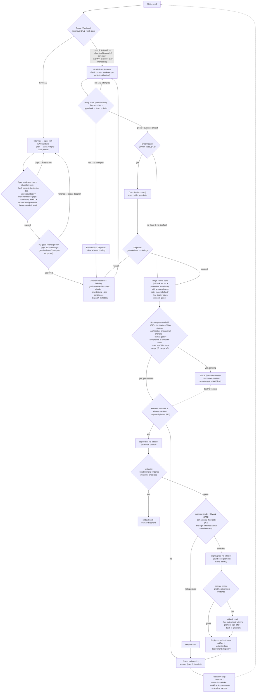
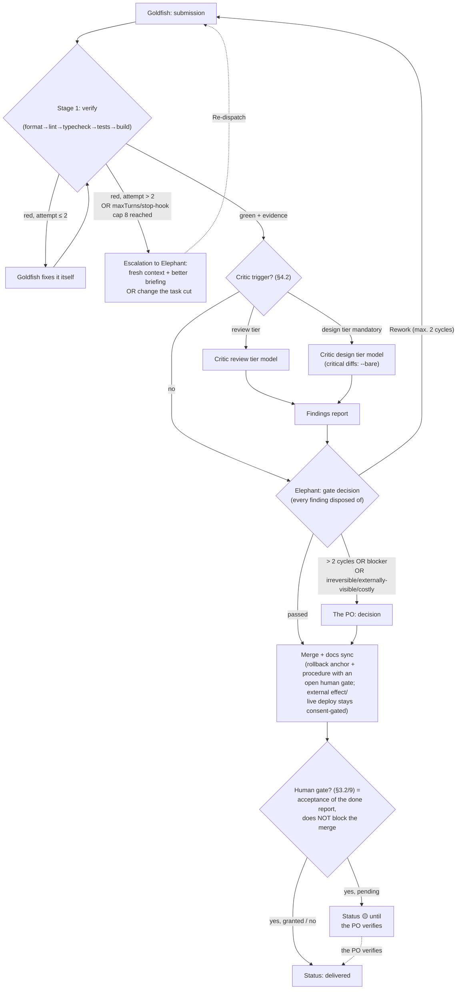
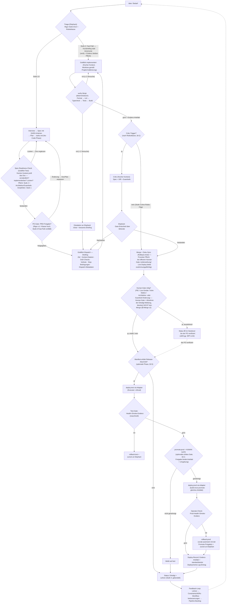
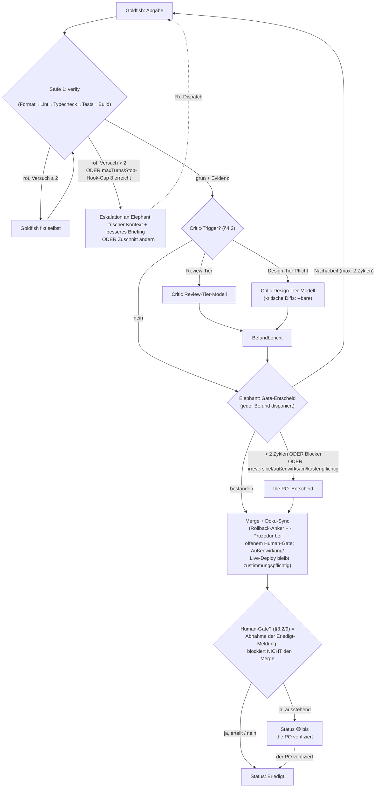

# Operating Model v1.0 — Agent-Pipeline

> _A German version follows below · Eine deutsche Fassung folgt weiter unten._

> Agent-Pipeline v0.1.0-draft

> **Canon:** On disagreement between this document and the decision register ([state.md](state.md)) or the ADRs ([adr/](adr/)), the register/ADR wins. Conceptual roots: Rensin's "Elephants & Goldfish" role model (EGM) and Google's "New SDLC" (vibe-coding playbook) — both feed into the relevant places below (§1–2), with rationale.

## 1. Purpose & Scope

**Purpose.** The central, versioned Operating Model for agentic development across all of the PO's projects (<PROJECT_A>, <PROJECT_B>, <PROJECT_C>, future ones). Defines roles, SDLC, review system, session lifecycle, handover, feedback loop, and the project calibration layer. **Consolidation, not a rebuild**: all three projects already live the same model, three-times copied and diverged; the pipeline centralizes, hardens, and extends it.

**Scope.**

- Applies to every Claude Code work in the bound project repos **and to this repo itself** (self-application).
- Distributed as a plugin/marketplace with a committed binding per project; versioning is SHA-based initially, SemVer from the stability phase on. Details: ADRs in [adr/](adr/).
- Language rule: human-facing docs German, agent-facing artifacts (templates, skills, prompts, frontmatter) English (ADR-11).
- Deliberate project differences run exclusively through the calibration layer (§8) — never through copies of central artifacts (a known drift anti-pattern).

**Guiding principles** (from the approved target-picture sketch, refined):

| # | Principle | Meaning | Source |
|---|---|---|---|
| P1 | **Agent = Model + Harness** | When an agent fails, debug the harness first (missing tool? vague rule? context noise?) — don't switch the model or flip the prompt around. | Google (New SDLC) |
| P2 | **The Elephant is the document, not the session** | The session is a volatile cache; the persisted artifact (spec, handover file) carries the knowledge. "Feed the Elephant; test it against the Goldfish." | Rensin (EGM) |
| P3 | **What's deterministic belongs in hooks/permissions, not in prose** | CLAUDE.md is officially "advisory"; only hooks/permission rules guarantee. Guardrails are enforced technically; prose only carries facts and conventions. | own research |
| P4 | **Evidence over claim** | The documented main failure mode is "reported done but not tested." A submission counts only with machine-generated evidence. | own research |
| P5 | **Context economy is architecture** | CLAUDE.md stays under a hard limit, procedures live in skills (loaded on demand), handovers run through artifacts rather than history, verbose work goes to subagents. | own research |
| P6 | **Stakes determine the discipline** | Calibrate position on the vibe↔engineering spectrum per project and per task (<PROJECT_B> high, <PROJECT_A> medium, <PROJECT_C> prototyping looser). | Google (New SDLC) |
| P7 | **Judgment stays with the PO** | Models only simulate judgment. Architecture trade-offs, ambiguity resolution, and final gates are not delegable; the PO is accountable for everything. | Rensin (EGM) |

## 2. Roles

The four roles map onto native Claude Code primitives: Elephant = long-lived main session, Goldfish = custom subagent or fresh session, Critic = read-only subagent with `--bare` hardening level, the PO = human.

**Derived from Rensin (EGM):** A variant of Rensin's original, adapted to a different role cut — no claim of improvement, just a different split: **Rensin's Goldfish is a checker** (fresh context tests the doc), **our Goldfish is an executor** (fresh context implements from the doc; Rensin's Step 8, "follow the plan exactly"). Rensin's checking Goldfish lives on in the spec readiness check (§3.4); **our Critic formalizes Rensin's Steps 5–7+9** as a standalone role.

**Conductor mode (outside the pipeline):** The PO may still work directly and interactively with Claude — for tricky debugging, exploration on unfamiliar terrain, and keeping one's own skills warm. Not every task is forced through the pipeline; its in-pipeline equivalent is the rigor-level-0 fast path (§3.3). Once a task can be specified in dispatchable form, the role model applies.

### 2.1 The PO — Product Owner & Quality Arbiter

**Mandate:** Intent, prioritization, architecture judgment, final gates, human verification (PIE acceptance <PROJECT_C>, live devices <PROJECT_B>, spot checks <PROJECT_A>).

| Rule | Why | Verification method |
|---|---|---|
| **Must:** Consent is mandatory for anything externally visible, irreversible, or costly; consent **never carries across contexts** (every session/task obtains it anew). | The PO is accountable for every agent action; blanket approvals erode the gate. | Human-gate step in the SDLC (§3); escalation ladder rung 4 (§4.3). |
| **Must:** Keep the ability to read code and to spot-check reviews; never rubber-stamp Critic verdicts. | "Design is the new code" holds for intent — but <PROJECT_B> runs in a real house, and <PROJECT_C> bugs can only be diagnosed in code. Otherwise one's own skills atrophy. | Retro question, "did I actually read code this week?"; maturity metrics §7. |
| **Must not:** The PO does not do clickwork an agent can do; delegating to the human requires a stated reason. | Human time is the pipeline's scarcest resource. | The handover/report rubric "remaining manual work" is an exhaustive list. |

### 2.2 Elephant — Orchestrator (long-lived session)

**Mandate:** Interview → spec, triage (rigor level + risk class), decomposition into Goldfish tasks, dispatch, gate decision over Critic findings, docs/handover sync, lessons aggregation.

**Capability profile** — four core orchestrator capabilities (after Google's "Orchestrator" role, New SDLC):

1. **Specification** — define tasks unambiguously, self-contained, and checkable (EARS from level 1 up).
2. **Decomposition** — break work into agent-sized, independent chunks (wave pattern).
3. **Evaluation** — judge Goldfish output fast and evidence-based (gate decision, not re-implementing).
4. **System Design** — design constraints, checks, and feedback loops before code exists.

| Rule | Why | Verification method |
|---|---|---|
| **Must not:** The Elephant writes no production code. | Role split: execution needs a fresh context; the Elephant stays lean and unbiased for the gate decision (confirmation bias). | Production diffs come from Goldfish sessions (commit/session trailer documents authorship). |
| **Must:** No-code phase until the spec is done; the AI proposes the first design, not the PO. | Only this way shows whether the system was actually understood; blind spots otherwise stay undetected. | The spec exists and has passed the readiness check BEFORE an implementation Goldfish starts (§3.4). |
| **Must:** Every briefing = outcome + guardrails + stop conditions — never a step-by-step dictation in chat. | "We are all managers now": micromanagement destroys parallelism and look-away time. | Briefing format check: all 6 mandatory fields (§2.3) present. |
| **Must:** Context hygiene — ALWAYS delegate read-/research-/write-intensive work to Goldfish; the Elephant holds only decisions, plan, state. | The Elephant's context is the pipeline's most expensive resource; filling it up forces lossy compaction. (§5) | `/context` check at task boundaries; session-cut protocol §5b. |
| **Must:** Actively deploy anti-sycophancy: have assumptions challenged, "Why do you think that?", force critic mode on an agreement spiral. | A solo setup has no colleague to challenge assumptions; sycophancy is the structural blind spot. | Interview/design prompts contain the snippets; the Critic system prompt does too (§2.4). |
| **Must:** File-pointing rule: never argue hallucinations away in chat — instead point at the correcting file (spec, code, docs) and hand it in as context. | Discussion only entrenches the hallucination deeper; the file is the authority, not the counter-argument. | Correction turns reference a concrete file instead of argument chains; snippets live in the prompt library. |
| **Must not:** No silently made policy decisions. | Decisions without a register/ADR entry cannot be reconstructed. | New policy decision ⇒ register entry + ADR; drift check in the close ritual. |
| **Must not:** Never two Elephants at once in the same repo; a project Elephant writes ONLY in its own project repo, monitoring/collection sessions stay strictly read-only toward project repos. Cross-repo needs go as a NEW transfer item into the target repo's `backlog/items/` (append-only, never edits to foreign existing files) or to the PO — never as a direct edit. | Two writers in one repo = "a china shop"; in-place foreign edits bypass the target repo's gates and calibration. A deliberate process rule rather than a path guard. | Session diffs stay in their own repo; foreign-repo write access is limited to new backlog items; Critic trajectory review flags violations (roles/elephant.md EL-18). |

**Model/effort:** The design tier model runs at effort `xhigh` in the design phase. Execution phase, by profile: continuation on the design tier model (profile `advisor`, advisor second opinion from session start) or a one-time switch to a cheaper execution configuration at the PRD gate (profile `design-first`, MP-01) — continuous operation on the most expensive model with no de-escalation is a named PO exception only. Ultracode: not session-persistent, a low-threshold task-level opt-in with an indication list. Authoritative detail: [../policies/model-policy.md](../policies/model-policy.md).

### 2.3 Goldfish — Executor (fresh context)

**Mandate:** EXACTLY ONE clearly-bounded task (implementation, research, bulk edit, review preparation), "follow the plan exactly," delivery only with evidence. No `memory` — learning runs through the versioned Operating Model, not through agent memory.

| Rule | Why | Verification method |
|---|---|---|
| **Must:** Only the briefing and the files listed in it are input; unclarity ⇒ trigger a stop condition instead of guessing. | The dispatch prompt is the only handover channel; guessing produces conceptual errors that "look right." | The completion report explicitly names deviations/stops; the Critic checks spec fidelity. |
| **Must not:** An implementation Goldfish never changes the tests/checks of its own implementation. | Self-validation is the core failure mode; tests are the contract, not negotiable ground. | PreToolUse protection on test paths (OPEN — planned; see backlog); until then the prohibitions field in the briefing + the Critic checks test diffs for weakening. |
| **Must:** Writing tasks run in a worktree per project calibration (§8). | Isolation protects the main state; a blanket requirement failed against <PROJECT_C>/<PROJECT_A> reality. | Calibration file field `worktree`; stale-worktree check in the close ritual. |
| **Must:** After 2 failed attempts at the same problem: STOP and escalate (§4.3) — do not keep iterating. | From there the hit rate drops; a fresh context with a better briefing beats muddling on. | The two-failed-attempts rule appears in the briefing as a stop condition; `maxTurns` in the frontmatter as a hard leash. |

**Model/effort:** Minimum mechanic tier (**no model class below this in the pipeline**); effort 3-staged per subagent (MP-27): `goldfish-mechanic` `low` (purely mechanical), `goldfish-implementor` `medium` (standard, clearly-briefed implementation), `goldfish-deep` `xhigh` (test/verify authorship, guardrail/hook/canon code, design latitude, risk class high); very large scope optionally the design tier model. → [../policies/model-policy.md](../policies/model-policy.md).

**Handover format 1 — Goldfish briefing (6 mandatory fields; this is the canonical briefing field list that session-bootstrap and model-policy reference):**

1. **Goal** — outcome, not a step list; an observable end-state criterion.
2. **Context files** — explicit list (spec/delta-spec first); never inherit chat history.
3. **DoD checks** — EARS acceptance criteria (from level 1 up) + `verify` command; checks are fixed BEFORE the run (contract).
4. **Prohibitions** — scope boundaries, no-go paths, "don't change tests," relevant project denies.
5. **Stop conditions** — "stop and report if …": >2 failed attempts, contradiction in the spec, scope burst, missing access, unclarity.
6. **Dispatch metadata** — **always:** ruleset SHA/version from the bootstrap (the Goldfish carries it into its confirmation, → [../harness/session-bootstrap.md](../harness/session-bootstrap.md) §6.2); **model + effort, explicit for this dispatch**; **tool budget ≤45 tool calls, stated as a number** (briefing/behavior rule, not a technical barrier, → [../guardrails/token-budget.md](../guardrails/token-budget.md) TB-08/TB-09). **Conditional:** model RATIONALE on deviation from the role default (MP-05), or "criticality → model" for Critic briefings (MP-07) — → [../policies/model-policy.md](../policies/model-policy.md).

**Handover format 2 — Goldfish completion report (condensed, target ≤ 1,000 tokens / hard max 40 lines, evidence as a pointer, not full text):**

1. Result per DoD check (passed / failed / not verifiable — three-valued).
2. **Evidence artifact (mandatory):** machine-generated `verify` output (file/log written by the script, never formulated by the model) + the command run + exit code.
3. Changed files with a one-line rationale.
4. **"Deliberately NOT changed"** — adjacent oddities intentionally left untouched (rubric for writing roles).
5. Deviations from the spec — reported, never silently built in (anti-drift).
6. Open items / triggered stop conditions / remaining manual work for the PO.

### 2.4 Critic — independent reviewer (read-only)

**Mandate:** Checks spec fidelity, scope, edge cases AND trajectory. **Never** sees chat history or the implementer's own reasoning — input is exclusively spec + diff + guardrails + evidence artifact. Standard: a read-only subagent; for critical diffs, the harder isolation level `claude -p --bare` with a JSON-schema verdict.

| Rule | Why | Verification method |
|---|---|---|
| **Must not:** No `memory`, no write tools. | `memory` automatically activates Write/Edit and breaks every read-only guarantee. | Agent frontmatter: a tight `tools` set; no `memory` field. |
| **Must:** Trajectory review — did the claimed checks actually run, per the evidence? | Smooth output with skipped verification is more dangerous than a visible error (output AND trajectory evaluation). | Mandatory section in the findings report; cross-check evidence artifact vs. claim. |
| **Must:** Search harshly, report honestly ("mean review"): maximum scrutiny in the mandate, but only evidenced findings in the result. | Rensin's Mean Review finds real errors (~30% of findings are valuable); without an anti-overreporting clause, though, a "find gaps" prompt produces phantom findings. | Anti-overreporting clause in the system prompt; findings carry evidence (see below). |
| **Must not:** Flag nothing that CI/`verify` already enforces; no style critique without a spec/guardrail anchor; no score theater. | The Critic checks only what machines cannot — otherwise noise and duplicated work. | Skip rule in the system prompt; the Elephant rejects out-of-mandate findings. |

**Model/effort:** The review tier model / effort `max` as standard; **escalation to the design tier model is MANDATORY** for architecture, guardrail, and security reviews (MP-07). → [../policies/model-policy.md](../policies/model-policy.md).

**Handover format 3 — Critic findings report:**

- **Per finding:** `Gap` (what's missing/deviates vs. the spec) · `Risk` (consequence + severity blocker/major/minor) · `Evidence` (file:line or a concrete diff/artifact reference — claims without a citation are not allowed) · `Spec reference` (EARS criterion or guardrail rule).
- **Mandatory rubric "deliberately not flagged":** aspects explicitly checked and found fine (makes review depth visible and distinguishes "checked, OK" from "not looked at").
- **Mandatory trajectory-review section:** verdict on whether checks/evidence are consistent.
- **Anti-overreporting clause:** "no findings" is a valid and welcome result; every finding must clear the evidence bar.
- No overall score; binary pass/fail only where the Elephant requests an overall verdict.

## 3. SDLC v1.0

### 3.1 Flow

Adopted from the approved target-picture sketch (incl. spec readiness check and rigor-level-0 fast path; extended with the optional Release/Promotion phase, §3.5):



**Release/Promotion phase (optional — detail §3.5):** From `REL` on, an optional tail phase hooks into the flow — active only if a project declares a `release` section in its own manifest (otherwise the `no` branch: zero added cost, unchanged behavior from today — the anti-bloat guarantee is visible in the diagram itself). The phase is adapter-based (the project delivers the HOW, the pipeline only the WHAT) and counts as complete only once BOTH artifacts exist: a machine-generated evidence artifact AND a standardized `docs/deployments.md` entry. Detail: §3.5, [ADR-0033](adr/0033-release-promotion-phase.md).

### 3.2 Steps in detail

| # | Step | Input | Output | Responsible | Gate criterion |
|---|---|---|---|---|---|
| 1 | Triage | Idea / need / backlog item | Rigor level (0/1/2) + risk class (§4.2) + task cut; for soft size indicators (detail below) additionally a non-blocking design-pre-stage hint (link `docs/design/README.md`) | Elephant | Level and class are noted explicitly in the task/spec header; when in doubt, the higher class. |
| 2 | Interview → spec | Triage result | Spec with EARS criteria + plan + `tasks.md`; **from level 1 up with a mandatory Alternatives section** (considered-but-rejected; level 1: short form allowed — 1–3 bullets "considered and rejected"; rationale: solo memory) | PO + Elephant | EARS criteria present (from level 1 up); no-code rule observed. |
| 3 | Spec readiness check | Spec doc + referenced files | "Passed" or a gap list | Readiness Goldfish (fresh, read-only) | Pass criterion §3.4; mandatory for level 2, architecture/guardrail/core-contract packages, OR risk class high; otherwise optional at Elephant judgment (recommended for multi-part waves). |
| 3b | PO gate: PRD sign-off | Reviewed spec/plan + `prd_<topic>.md` (German) | The PO's "approved" or a change order | PO | **Mandatory at rigor ≥1 OR class high; a genuine level-0 fast path drops out.** The PRD carries product rationale (what/why/scope/non-goals/risks/alternatives); the Elephant presents it PROACTIVELY in readable form (not just a file path) and explicitly waits for the word "approved" (EL-19); sign-off mechanics EL-17a. Detail in the note below the table / EL-19. |
| 3c | Model-switch point (profile `design-first` only) | The PO's "approved" (step 3b) | The Elephant presents the switch command (model + effort of the configured execution configuration, e.g. `/model <model>` + `/effort <level>`) as ONE copy-paste block; waits; verifies the new model identity from observed evidence | Elephant (EL-24) | Verification BEFORE the first implementation dispatch; omitting it = a process incident. Profile `advisor` skips this step (design tier model + advisor is already running since session start). |
| 4 | Goldfish dispatch | Reviewed spec / `tasks.md` | Briefing (6 mandatory fields, §2.3) | Elephant | Briefing format check complete; task self-contained. |
| 5 | Implementation | Briefing | Diff + completion report + evidence artifact | Goldfish | `verify` green; stop conditions respected. |
| 6 | verify (stage-1 review) | Working state | Machine-generated evidence artifact | Harness (deterministic) | The entire gate chain green (§4.1); the artifact written by the script. |
| 6b | Security scan phase (manifest-driven) | Working state after `verify` | Machine-generated security evidence artifact (`evidence/security-latest.json`) | Harness (deterministic, adapters gitleaks/osv-scanner/semgrep/license-check) | Four-valued status per scanner `PASS \| FINDINGS \| SKIPPED \| ERROR` — SKIPPED ≠ PASS (QG-05 honesty), ERROR is fail-closed; thresholds from manifest `security.thresholds.block_on` (default `[critical, high]`); active only if the manifest declares the phase (no manifest → no-op). Detail below the table. |
| 6c | UI design phase (conditional) | Working state after implementation; for a UI redesign of a major feature, additionally the confirmed sketch-gate wireframe (see below) BEFORE implementation starts | UI review result (a calibration matter) | Elephant/Goldfish per project calibration | Runs ONLY if the manifest declares `flags.has_ui: true` (condition grammar `always\|never\|<flag>\|!<flag>`, [ADR-0028](adr/0028-manifest-approach.md)); without a manifest or with `has_ui: false` the step drops entirely — no gate, no requirement. With `has_ui: true` active, the sketch-gate requirement (detail below) additionally applies to every UI redesign of a major feature. Detail below the table. |
| 7 | Critic review (stage 2) | Spec + diff + guardrails + evidence | Findings report (§2.4) | Critic | Trigger matrix §4.2 followed; findings format complete. |
| 8 | Gate decision | Findings report + completion report | "Passed" or a rework dispatch | Elephant | Every blocker/major finding is disposed of (fix / reject with reason / escalate to the PO). |
| 9 | Human gate | Elephant recommendation + evidence | Acceptance of the done report / decision / rework | PO | Mandatory for: PIE acceptance, live devices, high stakes, architecture/guardrail change, irreversible/costly. **Since 🟡 merge v2, no longer blocks the merge (step 10) — only the done report.** |
| 10 | Merge + docs sync | Elephant gate decision "passed" (step 8); **human-gate acceptance (step 9) is NOT a precondition** as long as, with an open human gate: (a) a rollback anchor exists (pre-merge tag/commit reference in the handover), (b) a rollback procedure is documented per project in the calibration (§8), (c) 🟡 stays in the handover until the PO verifies (still counts against the WIP limit), (d) external effect/live deploy stays consent-gated | Merge/completion + updated handover file + HISTORY entry + lessons (status possibly 🟡 instead of delivered until human-gate acceptance) | Elephant (execution possibly Goldfish) | Merge-completion gate: handover updated (deterministic check, §6); CLAUDE.md length gate green; with an open human gate, additionally a rollback anchor + procedure proven. |
| 10b | Release/Promotion phase (conditional, optional) | Merge + docs sync (step 10) complete; manifest declares a `release` section | Deploy evidence artifact + a `docs/deployments.md` entry | Elephant (orchestrates: obtain sign-off, trigger via git/command, verify evidence — never a prod deploy itself, EL-27) | `promote:prod` = human gate (§4.2); without a manifest `release` section the step drops entirely (opt-in, zero-cost). |
| 11 | Retro / feedback | Closed block | Lessons, `workflow-improvement` items, telemetry entry | Elephant | The session Elephant wrote the close retro itself (§7): concrete items or an explicit "nothing"; the three-artifact archive happens. |

**Step 1 (triage) — design pre-stage (advisory, optional) — detail:** Before the pipeline itself, there's deliberately no mandatory step, just a front door: a self-service asset under `docs/design/README.md` (a brainstorming guide with concrete AI techniques + anti-patterns, a standard "design facilitator" prompt, a lean export template with a Mermaid self-check) — deliberately OUTSIDE the pipeline, so raw-idea-kneading happens in a cheap chat session instead of the expensive Elephant session. At triage (row 1 above), the Elephant roughly sizes the request using the SAME indicators named in the table row — multiple modules/projects affected, new architecture, several plausible options, a larger security/data surface — no second, competing size heuristic exists. If a requirement looks large, the Elephant issues a **non-blocking** hint along the lines of: "That sounds like a big one. I'd recommend a design pre-stage before we plan — it's how you get a solid design → `docs/design/README.md`." The human can always continue without the design pre-stage — the hint is orientation, not a gate.

**Epistemic status of external design input (canon sentence):** A design export or any other pre-authored design input is ALWAYS orientation input for the Elephant, which it challenges and re-derives through the normal path (interview → spec → readiness) — never a pre-approved design. A polished external draft must NOT receive less scrutiny than an internally developed one (closes the inversion where a finished look becomes a free pass for less skepticism).

**Persistence convention:** When a design export/roadmap feeds the pipeline, the Elephant persists it verbatim under `specs/<topic>/design-input.md` (or references an equivalent versioned location); every backlog item sliced from it references this file. Convention only — no schema check, no gate.

**Scope-triage principle + slicing mechanics:** For large topics, the Elephant asks itself the guiding question at triage: "Is this requirement a single session, or a roadmap?" — if it looks like the latter, the Elephant **proposes** a cut into several self-contained, **vertically sliced** backlog items (each independently plannable, dependencies between slices named) and **waits** for confirmation or correction — it never cuts autonomously. The proposal is shown briefly, along the lines of: "Here's how I'd split this: XXX / YYY / ZZZ. Agreed, or different?" After confirmation, every item runs the normal flow — including the **existing** PRD review (step 3b) as the ONLY verification point; no additional checks are added. That turns slicing + confirmation into an MVP-first staging of large topics, without its own verification machinery.

**Step 3b (PO gate: PRD sign-off) — detail:** After the readiness check passes and BEFORE the first implementation dispatch, the Elephant presents a German `prd_<topic>.md` — product rationale (what/why/scope/non-goals/risks/alternatives considered), NOT the acceptance criteria (those live agent-facing in English in the spec; PRD and spec reference each other, no duplication). Location: `specs/<task>/prd_<topic>.md` (three-artifact package with spec + readiness + review). **Mandatory at rigor ≥1 OR class high; a genuine level-0 fast path (§3.3) drops out** — small hotfixes need no product review. Sign-off via EL-17a (numbered inline summary + file reference); the PO's "approved" is the gate, not a UI dialog. **Optional companion artifact without a gate:** `sdp_<topic>.md` (Software Development Plan) per topic — documented, not a mandatory confirmation point (enterprise reservation, resurfaced when needed). After "approved," sign-off is additionally booked deterministically via `node harness/scripts/pipeline-state.mjs approve-plan --by po` (basis for the dev-plan gate hook).

**PRD language rule (PO addendum, 2026-07-09):** Binding for every future PRD — intended reader is the PO, not the agent — German, plain language, short sentences; a decision document, not a work order. Every block answers three questions: which problem? What are we changing? What's in it for you? Rule IDs, file paths, and jargon do NOT belong in the main text — compact technical lines or an appendix carry them (the downstream Goldfish briefings do too). Feedback-/review-driven PRDs need a coverage matrix ("your input → where in the PRD") so the PO can verify completeness instead of trusting it. End with numbered decision points, separated from mere acknowledgment. Template: [../templates/prd.md](../templates/prd.md); Elephant requirement: `roles/elephant.md` EL-19.

**Step 3c (model-switch point, profile `design-first`) — detail:** Directly after "approved" (step 3b), the Elephant (profile `design-first`) presents the switch commands EXACTLY ONCE (model + effort of the configured execution configuration, e.g. `/model <model>` then `/effort <level>`) as ONE copy-paste block and waits, then verifies the new model identity from OBSERVED evidence (`/model` output or explicit PO confirmation) — BEFORE the first implementation dispatch (EL-24, `roles/elephant.md`). Profile `advisor` skips this step: it already runs on the design tier model with an active advisor since session start.

**Step 6b (security scan phase) — detail:** Manifest-driven, its own step after `verify`: four adapters (gitleaks, osv-scanner, semgrep, license-check) each deliver a four-valued status `PASS | FINDINGS | SKIPPED | ERROR` — `SKIPPED` (tool not installed) NEVER counts as `PASS` (QG-05 honesty); `ERROR` is fail-closed. A finding blocks only if its severity is in `security.thresholds.block_on` (manifest default `[critical, high]`). Evidence: `evidence/security-latest.json` (schema `pipeline.security-evidence.v0`); the push-gate hook only checks freshness (exitCode 0, `commit == HEAD`), never computes anything itself ([ADR-0029](adr/0029-file-handoffs-status.md)). No manifest or no declared `security` gate: step drops out (opt-in, [ADR-0028](adr/0028-manifest-approach.md)).

**Step 6c (UI design phase, conditional) — detail:** Optional phase for projects with a UI portion, active ONLY if the manifest sets `flags.has_ui: true` (condition grammar `always|never|<flag>|!<flag>`, [ADR-0028](adr/0028-manifest-approach.md)). This repo is docs+guardrails-only (no live UI) — it declares the phase but keeps `has_ui: false`; inactive until a project with a real UI arms it via its own manifest. The stop hook (`stop-suggest.mjs`) deliberately emits no gate clause for phases without their own gate entry (like `design`/`ui-design` today).

**Sketch gate:** A UI REDESIGN of a MAJOR feature (not a minor fix/copy/color tweak) needs a confirmed ASCII/wireframe sketch BEFORE implementation starts — the PO (or, standing in, the Elephant if the PO delegated the judgment in advance) confirms the sketch before the first UI Goldfish is dispatched; no implementation "on spec" parallel to the sketch discussion. Applies only in projects with `flags.has_ui: true`; does not apply in this repo (`has_ui: false`).

**Step 10b (Release/Promotion phase, conditional, optional) — detail:** Runs only if the manifest declares a `release` section (otherwise the step drops entirely — no gate, no requirement, opt-in like steps 6b/6c). The Elephant orchestrates: it obtains the `promote:prod` sign-off (human gate, §4.2), triggers the deploy via sanctioned git state or the local adapter's command, and verifies the resulting evidence — it NEVER executes a prod deploy itself and never handles deploy-target credentials (EL-27, `roles/elephant.md`). This row is DESCRIPTIVE; the binding mechanics (guard extension, evidence schema) ship in follow-up slices of the release/deploy extension. Phase narrative: §3.5; founding decision: [ADR-0033](adr/0033-release-promotion-phase.md).

### 3.3 Process Overhead by Rigor Level

Invariant at ALL levels: **`verify` + the evidence artifact are mandatory** — there is no way around the deterministic gates. Everything else scales with the level, so process overhead stays proportional to task size (core critique: process overhead ∝ 1/task size):

| Element | Level 0 (issue-only) | Level 1 (delta-spec, spec-first) | Level 2 (spec-anchored) |
|---|---|---|---|
| Typical tasks | Bugfix, small config, docs | Medium features | Core contracts: <PROJECT_A> API, <PROJECT_B> schema/invariants, <PROJECT_C> core systems |
| Spec | Short brief in the issue/prompt (still: goal, prohibitions, stop conditions) | Delta-spec (just the change) + EARS | Full spec + EARS; evolves with the code (the "maintenance tax" is deliberately paid) |
| Spec readiness check | Not applicable | Recommended; **mandatory for architecture/guardrail/core-contract packages OR risk class high** | **Mandatory** |
| PO gate: PRD sign-off (§3.2 step 3b) | Not applicable | **Mandatory** | **Mandatory** |
| `verify` + evidence | **Mandatory** | **Mandatory** | **Mandatory** |
| Critic | Only with a risk flag (then per §4.2) | Per risk class (§4.2) | Mandatory (standard: review tier model); escalation to the design tier model per the trigger wording below |
| Worktree | Per write scope, per project calibration (§8) | Per project calibration | Per project calibration (default case: yes) |
| Human gate | Only with a risk flag | Per criteria (§3.2 step 9) | Default case: yes |
| Lessons/docs sync | Bundled (a collective entry for several level-0 tasks) | Per block | Per block |
| Spec upkeep after merge | — | Spec may go stale (spec-first) | Report deviation + update spec BEFORE merge (anti-drift) |

**Level-0 small-fix definition (canonical):** A task qualifies for the level-0 fast path only if ALL of the following criteria hold:

- ≤ 2 files and ≤ ~25 lines of diff.
- No change to: architecture, data model/schema, public APIs, tests, guardrails/hooks/CI, dependencies, security surface.
- Trivially revertible via `git revert`.
- `verify` green + evidence stays mandatory (invariant, see above).

**Risk flag (= NO fast path)** for live/deploy effect (<PROJECT_B>), game mechanics (<PROJECT_C>), auth/payment paths (<PROJECT_A>) — even if all size criteria are met.

**Examples ✅ (fast-path-eligible):** <PROJECT_A>: typo/label text, CSS spacing · <PROJECT_B>: icon/color of a Lovelace card (no automation/device logic) · <PROJECT_C>: tooltip/string fix.
**Counter-examples ❌ (no fast path):** a new <PROJECT_B> automation · a dependency bump · any line touching hooks/guards.

**Self-execution clause:** If a task fully meets the level-0 definition above, the interactive Elephant session may execute the fix itself — a tightly-bounded exception to EL-01 (`roles/elephant.md`, "the Elephant writes no production code"). `verify` + the evidence artifact stay mandatory; a Critic run is required only with a risk flag set. This OM definition is exclusively authoritative — no case-by-case interpretation.

The Elephant sets the risk flag in triage as soon as a level-0 task touches a risk zone (§4.2) — size does not protect against review: even a 3-line hook diff is a guardrail change.

**Critic trigger wording (canonical, substantively identical in §4.2, ADR-0003, and ADR-0014):** "Every architecture/guardrail/security diff runs with the Critic on the design tier model AND additionally in `--bare` isolation. Rigor level 2 makes the Critic mandatory (standard: review tier model); the design tier model applies there only if, in addition, the risk class is high OR an architecture/guardrail/security diff is present."

**Light dispatch profile (speed lever for level-0/mechanic dispatches; NOT for class high/guardrails):** For briefed level-0 or uniform mechanical tasks, the Elephant may set `Profile: light` in the briefing. Trims only the *ceremony surface*, never the substance:

- **A compact 3-field report** instead of the 6 sections (`roles/goldfish.md` §6): (1) DoD result + evidence artifact, (2) changed files, (3) deviations/open items. Target ≤ 600 tokens.
- **Reference inlining:** the briefing inlines the 3–5 rule sets actually needed verbatim, instead of pointing at large canon files — otherwise every Goldfish re-reads the same canon.
- **No pre-edit baseline verify** — `verify` runs only against the final state.
- **Effort follows MP-27:** `goldfish-mechanic` at `low` for mechanical/uniform work or `goldfish-implementor` at `medium` for bounded implementation. Deep/`xhigh` work is outside the light-profile boundary. The earlier blanket `xhigh` rule is historical; see ADR-0022.

**Invariant untouched:** `verify` + the machine evidence artifact (GF-08) and stop-condition honesty (GF-07) stay mandatory — the light profile shortens report prose, never the check. At class high, architecture/guardrails/security, the standard profile always applies.

**One-turn recon:** Read-only recon with questions known in advance runs as ONE Elephant turn — a bundled dispatch or a parallel fan-out in one message; N sequential individual dispatches for questions known in advance are a context-economy violation (`roles/elephant.md` EL-05).

**Parallel-first:** Independent work runs in the SAME turn (parallel/bundled), sequential only with a named dependency (data, file overlap, gate) — one-turn recon lowers report count, parallel-first lowers wall-clock time; together, fewer turns × smaller context, never "more small dispatches just to be parallel" (`roles/elephant.md` EL-22).

### 3.4 Spec readiness check in detail

Anchors Rensin's Goldfish protocol (Steps 5–7: Comprehension / Critic / Readiness) BEFORE implementation.

**Procedure:**

1. The Elephant dispatches a **fresh, read-only Goldfish**. Input: ONLY the spec doc + the files it references. Forbidden as input: chat history, Elephant reasoning, earlier readiness runs.
2. Three check steps in order:
   - **Comprehension:** "Explain the system and the planned change using only the doc." — checks understandability.
   - **Critic pass:** "Find gaps, wrong assumptions, contradictions, missing edge cases." — expected value: ~30% of findings valuable; enough ROI.
   - **Readiness:** "Is the doc enough for an error-free first-pass implementation? What questions would you have to ask beforehand?" — every question is a gap.
3. Result goes to the Elephant as a structured gap list, evaluated against the spec doc; on unclarity, the PO decides.

**Pass criterion (all three):** (a) explanation factually correct, no follow-up questions; (b) no open major finding from the critic pass; (c) readiness answer "yes," no material questions.

**Repeat rule:** Gaps → the Elephant extends the doc → a **new** fresh Goldfish (never the same context again — it already knows the doc). Iterate until only nitpicks come back (Rensin's stop criterion). From the 3rd round on, the cut itself is the problem: back to triage/decomposition rather than grinding on the doc.

**Why:** A doc that only "works" thanks to accumulated Elephant context is worthless — the context illusion the Goldfish test exposes. **Verification method:** The readiness result is referenced at dispatch; the Critic (stage 2) flags implementations without a passed mandatory check.

### 3.5 Release/Promotion phase

Optional tail phase after merge + docs sync (§3.1): a project activates it via a `release` section in its own manifest (`.claude/pipeline.yaml`); without that section the SDLC runs unchanged as today (zero-cost anti-bloat). The pipeline defines WHAT a deploy step guarantees — evidence before every prod deploy, a human gate before prod (`promote:prod`, §4.2), a named rollback anchor per environment, a standardized deploy-log entry — the project delivers HOW that happens technically, via an adapter ([ADR-0033](adr/0033-release-promotion-phase.md)).

Three shapes are equally provided for: (a) full test→prod with health/smoke evidence at both stages; (b) release/publish without a server deploy (the OSS shape: tag/publish behind the same promote gate); (c) no deploy — the default without a `release` section, free of cost. **Build-once-promote:** sign-offs and evidence bind to the artifact (tag/immutable reference), never to a moving HEAD — prod never rebuilds.

The adapter contract, evidence schema, and the precedence engine (central vs. project-owned deploy policy) are NOT spelled out here — canon altitude stops at the guarantee, not the mechanism. Detail: [ADR-0033](adr/0033-release-promotion-phase.md) (phase concept, adapter, degrade shapes), [ADR-0034](adr/0034-deploy-precedence-central-vs-project.md) (precedence axis central↔project).

## 4. Review system (two-stage)

Principle: **deterministic before probabilistic**. Stage 1 is machine and blocking; stage 2 is LLM judgment and delivers findings for the Elephant's gate decision.

**Tests ≠ evals:** Tests catch deterministic regressions; evals catch behavioral drift in LLM features. The axis is named here before a project needs it — nothing is built here; that stays a project matter once real LLM features exist. As a documented example (opt-in, NO infrastructure present), the manifest could model this as its own conditional phase:

```yaml
# .claude/pipeline.yaml (example — illustrative only, not built)
phases:
  eval:
    condition: has_llm   # active ONLY if the project declares flags.has_llm: true
    runs: "pnpm eval"    # the project's own eval command, analogous to "verify"
```

### 4.1 Stage 1 — deterministic gate chain

**Must:** A fixed chain `format → lint → typecheck → tests → build`, encapsulated in **ONE `verify` script per project** (single source of truth). Stop hook, Goldfish submission, and CI run the same script. **Why:** Three diverging check paths = three truths (a known drift anti-pattern); one script is the only way to make "green" unambiguous. **Verification method:** The evidence artifact names the script + commit state + exit code; CI is shown to call the identical command.

- The concrete checkers are a project matter (<PROJECT_A>: the pnpm chain; <PROJECT_B>: yamllint + `check_config`; <PROJECT_C>: build/compile gate) — calibrated via §8.
- **Gate honesty:** Every gate documents what it does NOT check. Gates are binary — sharp or deleted; warn-only only with an expiry date (a known anti-pattern).
- **Evidence requirement:** A submission without a machine-generated artifact counts as unverified — regardless of what the report claims (P4).

### 4.2 Stage 2 — Critic with trigger matrix by risk class

**Risk classes** (= "risk level" in the wording of ADR-0014; the Elephant classifies in triage; when in doubt, higher; project risk zones are refined by the calibration §8):

| Class | Criteria |
|---|---|
| **high** | Architecture principles; guardrails (hooks, permissions, policies — including in this repo); security/secrets; live-effective <PROJECT_B> changes (real devices); irreversible/externally-visible/costly actions; level-2 contract areas (specifically including the dispatch contract templates `templates/prompts/critic-review.md` and `templates/prompts/goldfish-task.md`). Prod deploy targets, adapters, and release-trigger refs, as well as a central deploy policy (Release/Promotion phase, [ADR-0033](adr/0033-release-promotion-phase.md)/[ADR-0034](adr/0034-deploy-precedence-central-vs-project.md)). |
| **medium** | Prod-adjacent changes (e.g. <PROJECT_A> `main` = prod deploy); data model/migrations; refactors across module boundaries; new dependencies. |
| **low** | Locally-bounded, revertible changes that touch none of the zones above. |

**Trigger matrix:**

| Situation | Critic requirement |
|---|---|
| **Mechanical/deterministic diff** (lockfiles, generated artifacts, pure formatting with no semantic delta) | **No Critic — auto-pass.** Evidence = the generating command + the `verify` gate; a stricter row below (e.g. A/G/S) still overrides this row if it additionally applies. |
| Rigor 0 + class low, no risk flag | **No Critic** — `verify` + evidence suffice (fast path). |
| Rigor 0 with risk flag; rigor 1 standard; class medium; **rigor 2 standard (the Critic is mandatory there)** | **The review tier model** as a read-only subagent FIRST. At class medium (cascade): escalation to the design tier model ONLY on (a) a finding ≥ major, (b) an architecture/guardrail/security connection discovered during review, or (c) a contested verdict (row below) — the higher tier is NEVER the first run at class medium without A/G/S. **Class-medium Critics MAY run non-blocking in parallel with the next wave** (wave pipelining, row below; the disposition requirement before wave close/push is unchanged). Class high/A-G-S stays blocking without exception. |
| Class low OR medium (non-A/G/S), Critic otherwise triggered by one of the rows above (**wave pipelining: non-blocking applies to class low AND medium**) | The Critic run **may run non-blocking** in parallel with the next package — ALL findings are still disposed of before wave close/push (disposition requirement unchanged). Class high stays blocking (A-G-S untouched). |
| Class high (even at rigor 2) | **Escalation to the design tier model mandatory**. |
| EVERY architecture/guardrail/security diff (independent of diff size and rigor level) | **Escalation to the design tier model mandatory** AND ADDITIONALLY always the `--bare` isolation level with a JSON-schema verdict. |
| Review-tier findings contested or contradictory | Elephant's option: a second opinion on the design tier model (fresh context) instead of discussion in the same context. |

**Bundling (default):** One bundled Critic per delivery wave is the standard case; Critics per individual package run only if risk classes differ within the wave.

**Trigger wording (canonical, substantively identical in §3.3, ADR-0003, and ADR-0014):** "Every architecture/guardrail/security diff runs with the Critic on the design tier model AND additionally in `--bare` isolation. Rigor level 2 makes the Critic mandatory (standard: review tier model); the design tier model applies there only if, in addition, the risk class is high OR an architecture/guardrail/security diff is present."

**Wave pipelining:** The non-blocking Critic run applies to class LOW AND MEDIUM — a completed Critic run (review-tier cascade) may run in parallel with the next wave instead of blocking wave progress. The disposition requirement before wave close/push stays mandatory unchanged (every finding gets disposed of, §4.3). Class HIGH/A-G-S stays blocking without exception (escalation to the design tier model untouched) — this row loosens NOTHING in the trigger-wording row above.

**Why staggered:** The Critic is expensive and must not degrade into ceremony; at the same time, architecture/guardrails/security are exactly the zones where a weaker reviewer has correlated blind spots. Evidence for the cascade/non-blocking relaxation: the last 3 canon Critics after a passed readiness + first pass returned PASS with 0 findings; real blockers occurred in practice only with risky live code (observed: 2 blockers, 1 fail-open major finding across several live sessions). Community evidence: Meta's risk-tiered gating held quality with relaxed gates (1/50 baseline incident rate). **Verification method:** The gate decision (step 8) documents the applied trigger row; the merge step requires a findings report on file when the trigger is mandatory.

**Exactly two human gates — plus an optional third only with an active release phase — against approval fatigue:** The pipeline deliberately provides only two points where the PO must give consent as a rule — the PO gate: PRD sign-off (§3.2 step 3b) and the human gate: acceptance of the done report (§3.2 step 9). **Only in projects that configure the optional release phase (§3.1) does a third join them: the `promote:prod` gate — opt-in per project, fires once per promotion (not per task), and is therefore itself approval-fatigue-compliant.** Many micro-approvals lead to reflex clicks instead of real review, with burnout risk as a consequence (Google, "Day 5" whitepaper). Hence: **approvals are bundled at the defined gates; no in-between questions.**

**Time-delayed self-review for irreversible decisions:** Before irreversible, externally-visible, or costly decisions, deliberate time distance sits between draft and final sign-off (a fresh look: a different day, or at least a clearly later session segment) — the PO or Elephant re-reads the decision against the spec and register BEFORE the human gate gives final sign-off. **Why:** A solo substitute for team review — time distance replaces the second human. **Verification method:** For irreversible gates, the gate decision documents the time-delayed second look.

### 4.3 Escalation ladder with abort criteria



| Rung | Responsible | Abort/escalation criterion (hard) |
|---|---|---|
| 1 | Goldfish itself | `verify` red: max. **2 failed attempts at the same problem**, then stop + report with the failure state. Hard leashes of the harness: `maxTurns` in the agent frontmatter; stop-hook cap of 8 consecutive blocks. |
| 2 | Critic | Delivers only findings; **no Critic↔Goldfish dialogue**, no fixes of its own (read-only). |
| 3 | Elephant | Disposes of every finding (fix it / reject with reason / escalate to the PO). **Before re-dispatch or model escalation: run the harness checklist per P1 / tooling-policy G2 (briefing precise? context sufficient? tools/permissions present? a hook in the way?).** Rework = **a new dispatch with a fresh context and a sharpened briefing**, never continued work in the failed context. Max. **2 rework cycles per task**, then the PO. |
| 4 | the PO | Mandatory escalation on: blockers, >2 rework cycles, irreversible/externally-visible/costly actions, a spec↔reality conflict, budget overrun (→ ../policies/model-policy.md). |

## 5. Session lifecycle & context policy

Mandatory knowledge for every Elephant session — every session must command the following rules well enough to explain them on request (from the PO).

### 5.1 Principle: the Elephant is NOT the session

The Elephant has two parts: the **persisted artifact** (handover/state file, specs, register) and the **running session as a volatile cache** on top of it. If the session dies (crash, context full, machine change), the pipeline loses nothing that was persisted per the rules — re-bootstrapping from the artifact is a **30-second operation**. Converse requirement: **what exists only in chat history does not exist.** Findings, decisions, and state changes are persisted to files immediately. **Verification method:** the handover file is updated after every phase/block (close ritual); spot check "could a fresh session take over here?".

### 5.2 Elephant preservation: context hygiene & planned session cuts

| Rule | Why | Verification method |
|---|---|---|
| **Must:** ALWAYS delegate read-, research-, and write-intensive work to Goldfish. The Elephant holds only decisions, plan, state. | Every file listing/log loaded into the Elephant crowds out orchestration knowledge; subagents have their own contexts/cache. | Elephant turns contain dispatches and decisions, not bulk reads; self-check in the FAQ (§5.4). |
| **Must:** Consume reports selectively — read Goldfish/Critic completion reports in the capped format, full text only on anomaly (no first pass, a stop condition, a Critic finding ≥ major). | The report cap (`roles/goldfish.md` GF-09) only pays off if the Elephant also consumes it in capped form — otherwise ingestion eats the same context as before. | `roles/elephant.md` EL-20; the anomaly trigger is documented in the gate decision. |
| **Must:** Communication economy — limit chat with the PO to four event classes (finding · decision needed/gate · incident/stop · block result), result first, compact; no mechanical progress narration. | Chat prose gets re-read every turn — same mechanism as report ingestion (context × turns). | `roles/elephant.md` EL-23; visibility via the harness task display + dispatch ledger (EL-21) instead of chat prose. |
| **Must: turn economy for the Elephant** — targeted grep instead of a full read where a search answer suffices; no repeat checks while waiting (no re-asking/re-checking while a dispatch is still running without a new event); keep in-between text minimal. | Every unnecessary turn re-reads the warm, large context — cache-read volume = context × turns; a tight turn cut is itself a cost lever, independent of fill level (evidence: 79M cache reads in one session). | Elephant turns show targeted search instead of full-text reads where a grep answer suffices; no status turns during a running dispatch without a qualifying event (cf. EL-23 liveness line at >15 min). |
| **Must:** Fill-level telemetry — check `/context` at task boundaries. | Context level is measurable; without measurement, chance decides the cut point. | `/context` check is a step in the close/block-change ritual. |
| **Must: planned session cut instead of emergency compaction:** at ~70–80% fill level, OR a natural phase/block boundary, OR ~10 dispatches OR ~2h wall-clock time OR ≥ 50% fill level → update handover file → commit → a fresh session bootstraps from it ([../harness/session-bootstrap.md](../harness/session-bootstrap.md)). Implementation may continue as a FRESH session, started from spec + PRD + handover via short bootstrap (§6.4). **Compact checkpoint (absolute ladder):** additionally, the Elephant checks context fill level at EVERY task boundary (package/wave boundary with Critic PASS + commit/push, PRD gate passed, before the first dispatch of a new package); from ≥180k real tokens it MUST present the PO a compact block (a literal `/compact` plus one focus line for the next phase — now carrying a copyable `/compact <summary prompt>` line, `guardrails/token-budget.md` TB-07). Window-independent, re-arming every +50k: ≥180k = warn (look for the next good cut), ≥200k = overdue, ≥250k = overdue, strongest framing, named honestly (EL-25). | The planned cut is lossless (the artifact is complete); auto-compaction is lossy and uncontrolled. Every turn re-reads the full context (cache-read volume = context × turns, measured Elephant cost share 78–89%) — the cost-based trigger catches this before the fill-level trigger alone kicks in. The compact checkpoint additionally catches a long wave growing unplanned past the warn threshold (<PROJECT_C> evidence: 69% usage > 150k, historical evidence predating the absolute-ladder switch). | A session-end commit with an updated handover file exists; the new session starts with the bootstrap check. At task boundaries with fill level ≥180k, a compact block is visible (presented or executed). |
| **Must not:** Plan on auto-compaction/auto-summary as a strategy — ONLY a safety net for the accident case. | Uncontrolled information loss exactly where the Elephant needs its memory; what compaction discards is not decided by the PO. | Sessions running into auto-compaction count as a process error → retro question, "why was the cut missed?". |
| **Must:** `/compact <focus>` only at task boundaries with an explicit focus — MANDATORY at every task boundary from context fill level ≥180k real tokens (absolute ladder: ≥180k warn, ≥200k overdue, ≥250k overdue/strongest framing, named honestly; EL-25); `/clear` + `/rename` on topic change. | Compacting mid-task loses working state; a topic change in a full context mixes scopes (anti-pattern AP6); the proactive window requirement closes the gap where the Elephant feels "still running" while overdue. | Session history: `/compact` only between blocks; ONE topic per session; a compact block visibly presented at task boundaries with fill level ≥180k. |
| **Rule of thumb:** >80 messages → check for a fresh fork/cut (<PROJECT_A> experience rule). | Empirically proven heuristic, a second indicator alongside `/context`. | Self-check at block boundaries. |
| **Must:** Fix model + effort at session start; no model switch mid-session — EXCEPT the ONE sanctioned exception: switch to the design tier model at the PRD sign-off gate in profile `design-first` (MP-17/MP-18, EL-24, step 3c). Switching back away from the design tier model stays forbidden mid-session, without exception. | Every switch invalidates the entire prompt cache; delegation to Goldfish replaces the model switch. | The session-start protocol (bootstrap) notes model/effort (+ profile/advisor); the sanctioned switch appears as a documented ledger event, not an anomaly (MP-18). |
| **Must:** In long execution phases, additionally set explicit compact points at WAVE boundaries (`/compact <focus>`), from ≥180k fill level (warn), ≥200k/≥250k overdue — supplements, does NOT replace, the existing triggers (~10 dispatches / ~2h / ≥ 50% fill level, above). | Long waves without an interim compact let cache-read share grow unnecessarily even though a natural focus change is due at the wave boundary anyway. | Wave-end turns show a `/compact <focus>` recommendation or execution when context is ≥180k (or named overdue when ≥200k/≥250k). |

**Automated staging mechanics (absolute ladder, `stop-suggest.mjs`'s `absoluteContextTier`/`effectiveContextTier`):** The judgment-driven fill-level trigger above is additionally technically SUPPORTED by a hook chain (not a replacement, only a backstop): `plugins/pipeline-core/scripts/statusline-context.mjs` reads the statusline input (`context_window.used_percentage`, tokens, model, session ID) and writes a gitignored usage file `.claude/.usage-<session_id>.json`; `plugins/pipeline-core/hooks/stop-suggest.mjs` reads it. The hard emergency brake (`decision:"block"`) stays PERCENT-based (EL-04, unchanged — never a spurious hard brake on a large, lightly-used window). Layered on top, orthogonally, the hook now ALSO tiers the SOFT proactive nudge (`warn`/`overdue`) on the REAL, window-independent token count: **≥180k → warn** ("look for the next good cut"), **≥200k → overdue**, **≥250k → overdue** (same tier, strongest-soft framing). The two ladders combine via "more severe wins" (`none < warn < overdue < block`) — the absolute ladder structurally never returns `block`, so this can only ADD a soft nudge, never trigger/strengthen the hard brake; EL-04 stays intact automatically. **Re-arm:** a fired soft nudge re-emits again every time real usage grows by ≥50k tokens since that nudge, even if the phase+tier fingerprint is otherwise unchanged (`lastEmittedTotalTokens` in the session marker) — a session sitting at "overdue" for hundreds of thousands more tokens must not go silent. Every emitted nudge carries a copyable `/compact <summary prompt>` line. The TASK BOUNDARY stays the PRIMARY trigger (compact checkpoint, above) — the fill-level thresholds are the secondary, hook-backed backstop for a wave crossing the boundary unplanned.

**Post-compact re-ground:** Directly after every `/compact`, a SessionStart hook (`plugins/pipeline-core/hooks/post-compact-reground.mjs`, matcher `compact`) fires a German-language re-ground notice: chat language GERMAN (ADR-0011 — closes the observation "`/compact` pulled the chat language toward English"), the active role/profile, a pointer to `state.md` + the current phase/feature from `pipeline-state.json` (read-only). Fail-open.

**`/compact` invocation discipline (tightened, 2026-07-07):** A bare `/compact` WITHOUT instruction is explicitly UNWANTED — every invocation names what to KEEP and what to DROP (e.g. "Keep: decisions + open items; drop: full tool-output text"), not just a topic word. The task boundary remains, unchanged, the primary trigger (see above).

**Small-session playbook & close-light (pointer):** For short retest/correction sessions (target ≤45 min wall-clock time), its own playbook applies: [../harness/checklists/small-session.md](../harness/checklists/small-session.md) (same-day light bootstrap → ONE bundled light-profile dispatch or level-0 fast path → mechanical auto-pass/model cascade decides the Critic need → verify → push → close-light). The shortened close ritual is `close-light` (eligibility as a checklist, not a judgment call) in the [close-block skill](../plugins/pipeline-core/skills/close-block/SKILL.md).

### 5.3 Goldfish cadence: when does a Goldfish start?

- **Default case:** Every delimitable execution task runs as a Goldfish — implementation, research, bulk edits, review preparation. The Elephant itself works only on: interview/spec, triage/decomposition, gate decisions, handover/core-docs upkeep.
- **Trigger criterion, "80% gate":** As soon as a task can be specified self-contained (a briefing with the 6 mandatory fields can be formulated), it's Goldfish-ready. If the Elephant CANNOT specify it unambiguously, it's not dispatch-ready — interview/decomposition work is missing, not a better prompt (a Goldfish only gets tasks where the 80% is enough; the 20% ambiguity belongs to the PO/Elephant).
- **Parallel limit: 3–5 concurrent Goldfish** ("ramp slowly" — increase gradually). Why: the PO's attention is the bottleneck; more parallelism creates a review backlog instead of throughput. Verification method: dispatch count; increase only after the briefing/Critic loop demonstrably works (maturity metrics §7).
- **WIP rule per project:** max. **1 open human-gate item** per project; new dispatches in that project only after acceptance. Why: parallel Goldfish vs. serial PO gates otherwise create a stale queue (worktree corpses, stale diffs). Verification method: the WIP field in the calibration (§8); the stale-worktree check in the ritual.
- **Ultracode/workflows** are a task-level opt-in for the indication list (initial research, process-model/architecture exploration, audits, migrations), NOT a standard dispatch path. Writing workflows require hook guardrails + a tight bash allowlist + a worktree (workflow subagents technically always run in `acceptEdits`; <PROJECT_B> special rule until the guard migration: only with PO sign-off) — details: workflow ADR ([adr/](adr/)) and [../policies/model-policy.md](../policies/model-policy.md).

### 5.4 Quick FAQ, "how do I run myself" (for Elephant sessions)

1. **How do I notice my context is running low?** Check `/context` at every task boundary; alarm zone ~70–80% fill level or >80 messages. Don't rely on the feeling of "still running."
2. **What do I do then?** A planned session cut: update the handover file → commit → end the session → a fresh session bootstraps from the file. No drama: a 30-second operation if §5.1 was actually lived.
3. **Why not just wait for auto-compaction?** It's lossy and uncontrolled — it decides for itself what gets forgotten. A safety net, yes; a strategy, never.
4. **Am I allowed to use `/compact`?** Yes, but only at task boundaries and with a focus argument (`/compact <focus>`) — AND MANDATORY at every task boundary from context fill level ≥180k real tokens (absolute ladder: ≥180k warn, ≥200k/≥250k overdue, to be named honestly; EL-25). Mid-task: no. On a topic change, use `/clear` + `/rename` instead.
5. **When do I dispatch a Goldfish instead of working myself?** As soon as the task can be specified self-contained (the 80% gate) — and, in general, for anything read-/write-/research-intensive. If I can't specify it, interview/decomposition is due, not doing it myself.
6. **How many Goldfish at once?** 3–5 maximum; only 1 open human-gate item per project (the WIP rule).
7. **What belongs in my context, and what doesn't?** In: decisions, plan, state, gate results. Out (delegate): file contents, logs, raw research material, verbose tool output.
8. **What do I do after a crash/machine change?** Like question 2, run backward: new session, bootstrap protocol ([../harness/session-bootstrap.md](../harness/session-bootstrap.md)), read the handover file, keep working. If anything is missing there, §5.1 was violated → record a lesson.

## 6. Baton Pass & Handover

| Rule | Why | Verification method |
|---|---|---|
| **Must:** Per project, **ONE versioned handover file** exists as the single source of state-truth (convention: `docs/state.md`; this repo demonstrates it. Final template name: phase 3). Content: current state, decisions, open items, next block, re-entry protocol. | The three-times hand-maintained baton (HISTORY "open" + CLAUDE state + memory) demonstrably lies (anti-pattern AP3: <PROJECT_C> drift documented). | Exactly one file carries "open/next"; every other location references it. |
| **Must:** At session end, the "open / next block" section of a HISTORY entry **is generated from the handover file or merely references it** — never hand-maintained as a duplicate. | Two hand-maintained copies inevitably drift; generation makes drift technically impossible. | The `/close` skill generates the block mechanically (phase 3); the drift check no longer compares two hand-maintained states. |
| **Role split:** HISTORY = append-only past (a journal with lessons); the handover file = present and future. | A clear responsibility per time direction prevents the double truth. | No "current state" prose block in HISTORY except the generated/referenced one. |
| **Must:** Memory (user/project scope) is a **mirror only** and must not contradict the repo; on contradiction, the repo wins, and memory is corrected. | Unversioned memory breaks on a fresh clone/second machine (anti-pattern AP4); the <PROJECT_C> rule "memory = mirror," generalized. | The bootstrap check verifies the existence of all mandatory artifacts in the repo; a memory reconciliation happens in the close ritual. |
| **Deterministic gates:** (a) **merge-completion gate** — after a merge, a check blocks until the handover file carries the new state; (b) **CLAUDE.md length gate** — a hard limit per project (calibration; reference: <PROJECT_A> holds at 220 lines). | Exactly at the post-merge step is where the documented drift arose (<PROJECT_C>); CLAUDE.md sprawl eats up every session start (anti-pattern AP2). | Hook/skill check in phase 3; until then, a mandatory step in the close ritual. |
| **Must (status vocabulary):** Completion statuses are register-fixed and two-staged: **DELIVERED** (artifact created, deterministic gates green, Critic PASS where applicable) ≠ **ACCEPTED** (the PO gate passed). Chat messages, the handover, and the register use exactly these terms; "done"/"closed"/"finished" without a register status is an overclaim. | Incident 2026-07-04: "phase 4 is closed" in chat, even though it was only DELIVERED, not ACCEPTED (a PO catch). The PO decides based on status reports — chat vocabulary must mirror the register state. | Handover/register entries carry one of the two terms; the Critic/drift check flags completion messages without a register-status term. |

## 7. Feedback loop

- **Retro requirement:** The earlier mandatory retro question to the PO ("what should the pipeline do better next time?") is dropped without replacement — instead the **session Elephant** writes its **own retro** at the end of every project session (part of the `/close` ritual): a concrete improvement item or a deliberate "nothing," as a backlog item/transfer to the pipeline Elephant (continuous-improvement process) — silence is not an option; this step is mandatory in every close and never silently skipped. The PO submits observations on the side through their own channel, without a ritual prompt; the old deferred-retro placeholder mechanism is thus obsolete. **Why:** The only cross-session learning mechanism is lessons distillation; responsibility lies with the Elephant itself rather than a ritual question to the PO (verbatim, the PO, 2026-07-04: "asking me that in the close ritual makes no sense, I can note it better just in passing"). **Verification method:** the close report contains the written retro (item or explicit "nothing") + the backlog-item/transfer path.
- **Backlog process:** Improvements flow as items of type **`workflow-improvement`** into this repo's `backlog/` (description, triggering situation, affected artifact, proposal). **Triage** by the Elephant of the next pipeline session: accept (assign to a phase/release) / reject (with a reason in the item) / defer; merge duplicates. **Release cycle:** in the SHA phase, every commit propagates immediately into the projects — triage is thus the real release gate; from the SemVer phase on, bundled releases with a CHANGELOG. OPEN (operational): the criterion for the SemVer switch ("stability matters more than iteration speed").
- **Maturity metrics**, captured lightweight per block in the close ritual, filed in the model-policy's telemetry instrument (→ [../policies/model-policy.md](../policies/model-policy.md)):
  - **Look-away time** — how long a Goldfish ran unattended and delivered something usable. Rising = briefings are getting better.
  - **First-pass/rework rate** — the share of Goldfish submissions that clear the gate with no rework cycle. Dropping = debug the harness first (P1).
- **CLAUDE.md growth rule** ("add one rule every time"): every agent failure traced back to a missing or vague rule becomes a new or sharpened rule in the fitting artifact (a CLAUDE.md fact, a hook, a skill — assignment per tooling-policy G1). **Counterweight:** the CLAUDE.md length gate (§6) — adding also means consolidating; as the file grows toward the limit, rules get merged, moved into skills/hooks, or struck. **Verification method:** the lessons entry names the changed/new rule; the length gate stays green.
- **Three-artifact archive rule:** for every larger task, three things are permanently versioned and archived: (1) the problem description/spec, (2) the acceptance criteria, (3) the result/completion report. **Full chat logs are NOT archived** ("mostly token noise"); the bridge to the session is the `Claude-Session:` commit trailer. **Why:** a searchable archive of one's own judgment compounds; chat logs don't. **Verification method:** the close ritual checks that the three artifacts are filed, from rigor level 1 up.
- **Error register (a community pattern, NOT a count ranking):** `backlog/error-register.md` maintains a capped, curated triage board (max. ~30 lines, kept small through semantic consolidation of similar error classes — the AutoManual pattern). STRICTLY TRIAGE-ONLY: NEVER injected into briefings (community anti-pattern "rule blindness"), NO numeric ranking, NO count as a priority signal — the initially considered top-100/top-30 counting idea was REJECTED BY THE PO. A second occurrence of the same error class triggers MANDATORY TRIAGE (disposition in the hierarchy mechanism > template > curated lesson). The `close-block` skill carries its own close step for this, "error-register update" (capture new error classes, mark repeats, every REPEATED line gets a disposition or an explicit deferral note) — details/seed lines: [../plugins/pipeline-core/skills/close-block/SKILL.md](../plugins/pipeline-core/skills/close-block/SKILL.md), `backlog/error-register.md`. **Why:** the counting approach was deliberately rejected — a ranking suggests priority where semantics count (community evidence of "rule blindness" from injected rule lists). **Verification method:** the register header explicitly documents the triage-only contract; the close-ritual step cannot be skipped; REPEATED lines without a disposition surface at the next close.

## 8. Project calibration layer

The invariant is central, the expression is calibrated (deliberate diversity is justified, not drift):

| Central (plugin + docs, one version) | Project calibration (a thin, committed layer in the project repo) |
|---|---|
| Role definitions + prompts (Elephant/Goldfish/Critic) incl. handover formats (§2) | — (roles apply identically everywhere) |
| Session-start/-end ritual skills (parametrized) | Gate commands (`verify`: the pnpm chain / yamllint+`check_config` / the UE build), runtime checks, hygiene inserts |
| git-guard as the **union** of all three incarnations | Project denies (content packs, `secrets.yaml`, `.env`, `.storage`) |
| Stop-hook gate framework | The concrete checker (lint / compile / config-check) |
| Spec/ADR/retro/briefing/handover templates, DoD scaffold, EARS requirement | Content, domain constraints, the "core mental model," risk zones |
| Model/effort/token policy, escalation ladder, trigger matrix | Stakes classification, autonomy level (<PROJECT_C> auto-mode ↔ <PROJECT_B> consent rules), human-gate form (PIE / live verification / spot check) |
| The invariant "merge gate + Critic trigger by risk class" | Gate form (PR flow ↔ direct push + staging), branch model |
| Context-economy policy (hard limit, map) | The limit number, map content |
| Session-lifecycle rules (§5), the base WIP rule | The WIP-limit number, worktree mode (validate per project in phase 4 — the <PROJECT_C> editor gate is fail-open in a worktree!) |

**Invariant across all autonomy levels:** scope sign-off ≠ design sign-off ≠ go-live sign-off (EL-03) — even in auto-mode/AFK; only the execution of an accepted plan runs autonomously.

**Mechanism sketch:** The central ritual skills (plugin `pipeline-core`) read a **versioned project calibration file** in the project repo on start (uniformly: `.claude/pipeline.json` — schema format **decided 2026-07-03 with the plugin delivery: JSON**; the skills `pipeline-start`/`close-block` consume this format, canonical example: `../templates/pipeline.json.example`). Sketch of the fields:

```jsonc
// .claude/pipeline.json (schema format JSON, decided 2026-07-03)
{
  "project": "project-a",
  "verify": "pnpm verify",              // ONE gate command
  "autonomy": "night-branch-only",      // autonomy level (M16 vocabulary)
  "branchModel": "direct-push+staging", // vs. "pr-flow"
  "verification": "tests+browser",      // vs. "live-devices", "pie-human"
  "wipLimit": 1,                        // open human-gate items
  "rollback": "git revert <merge-commit>", // rollback procedure per project (🟡 merge v2, refined later, condition b; anchor = pre-merge tag/commit ref in the handover, condition a)
  "worktree": "on-write",               // vs. "off", "always"
  "stakes": "medium",                   // the project's stakes classification (P6)
  "constraints": [                      // project constraints (domain rules, "do NOT roll back")
    "no breaking API change without an ADR"
  ],
  "claudeMdMaxLines": 220,              // length gate (§6)
  "riskZones": ["app/api/**", "prisma/**"],
  "handover": "docs/state.md",          // optional: the project's handover file (default docs/state.md)
  "ritualExtensions": {                 // named extension points
    "newBlockReview.post": ["check-db-hygiene"],
    "close.pre": ["sync-changelog"]
  }
}
```

- **Mechanics:** The central skill defines **named extension points** (e.g. `newBlockReview.post`, `close.pre`); the calibration file hooks project-specific steps (skill/command references) into them. If the file is missing, the skill runs with safe defaults and reports itself as "uncalibrated" (fail-safe, no silent guessing).
- **Denies boundary:** project **denies** do NOT live in the calibration file, but in the committed `.claude/settings.json` or the git-guard's guard config — the bootstrap check verifies them there (→ [../harness/session-bootstrap.md](../harness/session-bootstrap.md), step 3).
- **DoD criterion (hard):** a project-specific ritual step can be added **WITHOUT forking the central skill** — otherwise the copy-paste inheritance starts all over again (anti-pattern AP1). **Proof in phase 3** on a real example (e.g. the <PROJECT_A> DB hygiene step).
- **Manifest addition (optional, additive, AP1):** `.claude/pipeline.yaml` (schema `pipeline.manifest.v0`) is a runtime layer alongside `pipeline.json` and covers phases/gates/security thresholds/model routing/profiles/governance paths (§10)/flags. Their field shapes are disjoint; in compiler-managed installs both are projections of `pipeline.user.yaml`, not independent authored authorities. A directly authored manifest is a separate ownership mode. No manifest → behavior byte-identical to today. A present invalid or unreadable manifest fails the validator and full verify. Schema: `plugins/pipeline-core/scripts/pipeline-manifest.schema.json`; validator: `node harness/scripts/validate-manifest.mjs`; details/rationale: [ADR-0028](adr/0028-manifest-approach.md).
- **Release phase (optional, additive):** A project can additionally declare a `release` section in `.claude/pipeline.yaml` — environments, adapter and rollback references per environment (§3.5). No new mandatory field and no new calibration file: a pure signpost to where deploy configuration lives; schema details ship with the manifest extension of the release/deploy extension ([ADR-0033](adr/0033-release-promotion-phase.md)/[ADR-0034](adr/0034-deploy-precedence-central-vs-project.md)).

## 9. Traceability

The concept traceability matrix (produced in parallel in phase 2; a mandatory deliverable of the canonicity directive) proves that every core concept from Rensin (EGM) and Google (New SDLC) is either explicitly built in or adapted/rejected with a stated reason: `concept → source → pipeline artifact/rule → status`. The entry checklist is binding; anchors in this document: the Alternatives section (§3.2/2), Mean Review (§2.4), anti-sycophancy (§2.2/§2.4), the look-away metric (§7), the 3–5 parallel limit (§5.3), the three-artifact archive (§7).

## 10. Governance layer (project-owned rules)

A hosted project brings its own architecture and style rules — separate from the pipeline's own infrastructure (`guardrails/*`, `harness/checklists/*`, which regulate exclusively HOW the pipeline itself works). This project-owned layer lives under `governance/…` (canonical fixture example: [`governance/examples/README.md`](../governance/examples/README.md)) and splits into two categories with different enforcement ([ADR-0030](adr/0030-governance-layer.md)):

- **Guidelines (advisory)** — numbered principles (layering, naming, error handling, …). Deviations are allowed but must be named and justified in the plan artifact. A guideline never blocks a gate by itself; it feeds every plan and is a review standard for the Critic (§4.2) — a NAMED deviation is expected input, an UNNAMED deviation is the finding.
- **Policies (enforcing)** — machine-checkable rules (semgrep rules via `rules_dir`, a license allowlist) AND the humanly-reviewed but binding `checklist.md`. A violation blocks: for machine-checkable policies, the automated security-scan gate fails (§4.1); for the checklist, the Critic ticks off every item before the push gate is reached — every "NOT MET" item is a blocking finding.

Architecture principles automatically count as risk class **high** and thus force the mandatory Critic (§4.2) — regardless of diff size.

**Hierarchy** (mirrors Claude Code's own settings precedence): the repo level (a project's own `governance/…` directories) overrides the user level (`~/.claude/`, personal preferences); both sit BELOW an optional managed-settings level (enterprise), which neither can override — this repo ships no managed-settings layer; that's the adopting organization's matter.

**Paths per project:** where a project's governance directories point is a calibration matter (§8) — the `governance` block in `.claude/pipeline.yaml` (`guidelines_path`, `policies_path`) makes that concrete; only the mechanism is central, not the content.

A fully worked-through example — from house rule to enforced rule — is in [`governance/examples/worked-example.md`](../governance/examples/worked-example.md).

## 11. Enterprise expansion paths

Two expansion candidates for larger/enterprise contexts are deliberately only noted and NOT built — below the build threshold for the current (solo) operation, but documented so a later user knows that, and where, they can be retrofitted.

**Scheduled Audit** — a periodic self-check of pipeline state and the guards (scheduled drift detection instead of purely reactive), in addition to the existing monthly tooling radar (`policies/tooling-policy.md` §4), not as its replacement. Trigger to build it: drift accumulates between radar runs, or repeated audits find the same error class — a signal that periodic self-checking is needed alongside the monthly radar.

**Semantic Pre-Execution Gating** — a cheap upfront intent check immediately before a risky single action (e.g. a bash command against real devices/systems) that checks whether the action actually matches the stated intent BEFORE it executes. Sits ABOVE the deterministic guard layer (the git-guard union, `guardrails/`), not in its place — the deterministic layer stays the enforcement foundation (P3). Trigger to build it: a project with class high/live effect (real devices) needs intent verification that a regex/pattern guard cannot structurally deliver — it blocks a command FORM, never the semantic intent behind it.

Both candidates follow the same discipline: **the lowest level that catches what matters** — neither is approved to build here, both remain pure radar notes. Details/trigger criteria: [../policies/tooling-policy.md](../policies/tooling-policy.md) §4 (tooling radar).

---

*Operating Model v1.0 — Sprint 0 Phase 2 (2026-07-03). Authoritative on conflict: the project's own decision register in [state.md](state.md) or the ADRs in [adr/](adr/); process status lives exclusively in [state.md](state.md).*

> _This English text is a translation. The authoritative original is the German version below._

---

<!-- DE-REFERENCE-BELOW | agents: skip everything below this line; it is a full German reference translation (redundant, wastes context). The authoritative content is the English above. Convention: CLAUDE.md (Language). -->

# Operating Model v1.0 — Agent-Pipeline

> _Dies ist die maßgebliche Originalfassung; die englische Fassung oben ist eine Übersetzung davon._

> Agent-Pipeline v0.1.0-draft

> **Kanonik:** Bei Widerspruch zwischen diesem Dokument und dem eigenen Entscheidungsregister ([state.md](state.md)) bzw. den ADRs ([adr/](adr/)) gilt das Register/der ADR. Konzeptionelle Wurzeln dieses Modells: Rensins „Elephants & Goldfish"-Rollenmodell (EGM) und Googles „New SDLC" (vibe-coding-Playbook) — beide fließen unten (§1–2) an den relevanten Stellen mit Begründung ein.

## 1. Zweck & Geltungsbereich

**Zweck.** Dieses Dokument ist das zentrale, versionierte Operating Model für agentische Entwicklung über alle Projekte des PO (<PROJECT_A>, <PROJECT_B>, <PROJECT_C>, künftige). Es definiert Rollen, SDLC, Review-System, Session-Lifecycle, Handover, Feedback-Loop und die Projekt-Kalibrierungsschicht. Es ist **Konsolidierung, kein Neubau**: Alle drei Projekte leben bereits dasselbe, dreifach kopierte und divergierte Modell; die Pipeline zentralisiert, härtet und ergänzt es.

**Geltungsbereich.**

- Gilt für jede Claude-Code-Arbeit in den gebundenen Projekt-Repos **und für dieses Repo selbst** (Selbstanwendung).
- Verteilung als Plugin/Marketplace mit committeter Bindung je Projekt; Versionierung zunächst SHA-basiert, SemVer ab Stabilitätsphase. Details: ADRs in [adr/](adr/).
- Sprachregel: menschengerichtete Doku Deutsch, agentengerichtete Artefakte (Templates, Skills, Prompts, Frontmatter) Englisch (ADR-11).
- Bewusste Projekt-Unterschiede laufen ausschließlich über die Kalibrierungsschicht (§8) — nie über Kopien zentraler Artefakte (ein bekanntes Drift-Anti-Pattern).

**Leitprinzipien** (aus der freigegebenen Zielbild-Skizze, verfeinert):

| # | Prinzip | Bedeutung | Quelle |
|---|---|---|---|
| P1 | **Agent = Model + Harness** | Bei Agent-Fehlern zuerst den Harness debuggen (fehlendes Tool? vage Regel? Kontext-Rauschen?), nicht das Modell wechseln oder den Prompt umdrehen. | Google (New SDLC) |
| P2 | **Der Elephant ist das Dokument, nicht die Session** | Die Session ist flüchtiger Cache; das persistierte Artefakt (Spec, Handover-Datei) trägt das Wissen. „Feed the Elephant; test it against the Goldfish." | Rensin (EGM) |
| P3 | **Deterministisches gehört in Hooks/Permissions, nicht in Prosa** | CLAUDE.md ist offiziell „advisory"; nur Hooks/Permission-Rules garantieren. Guardrails werden technisch erzwungen, Prosa trägt nur Fakten und Konventionen. | eigene Recherche |
| P4 | **Evidenz statt Behauptung** | Der dokumentierte Haupt-Failure-Mode ist „fertig gemeldet, aber nicht getestet". Abgaben zählen nur mit maschinell erzeugtem Beleg. | eigene Recherche |
| P5 | **Kontext-Ökonomie ist Architektur** | CLAUDE.md unter Hard-Limit, Prozeduren in Skills (laden bei Bedarf), Übergaben über Artefakte statt Verlauf, verbose Arbeit an Subagents. | eigene Recherche |
| P6 | **Stakes bestimmen die Disziplin** | Position auf dem Vibe↔Engineering-Spektrum pro Projekt und pro Task kalibrieren (<PROJECT_B> hoch, <PROJECT_A> mittel, <PROJECT_C>-Prototyping lockerer). | Google (New SDLC) |
| P7 | **Judgment bleibt beim PO** | Modelle simulieren Urteilskraft nur. Architektur-Trade-offs, Ambiguitätsauflösung und finale Gates sind nicht delegierbar; der PO haftet für alles. | Rensin (EGM) |

## 2. Rollen

Die vier Rollen mappen auf native Claude-Code-Primitives: Elephant = langlebige Hauptsession, Goldfish = Custom Subagent bzw. frische Session, Critic = read-only Subagent mit `--bare`-Härtungsstufe, der PO = Mensch.

**Rückführung auf Rensin (EGM):** Das Rollenmodell ist eine an einen anderen Rollenschnitt angepasste Variante von Rensins Original — kein Anspruch auf Verbesserung, nur ein anderer Zuschnitt: **Rensins Goldfish ist ein Prüfer** (frischer Kontext testet das Doc), **unser Goldfish ist ein Ausführer** (frischer Kontext implementiert nach Doc; Rensins Step 8 „follow the plan exactly"). Rensins Prüf-Goldfish lebt im Spec-Readiness-Check weiter (§3.4); **unser Critic formalisiert Rensins Steps 5–7+9** als eigenständige Rolle.

**Arbeitsmodus außerhalb der Pipeline — Conductor:** Neben den Pipeline-Rollen bleibt der **Conductor-Modus** legitim: der PO arbeitet direkt und interaktiv mit Claude — für kniffliges Debugging, Exploration in unbekanntem Terrain und Lernen (eigene Skills warmhalten). Nicht jede Aufgabe wird durch die Pipeline gezwungen; die prozessuale Entsprechung innerhalb der Pipeline ist der Stufe-0-Fast-Path (§3.3). Sobald eine Aufgabe dispatch-fähig spezifizierbar ist, gilt das Rollenmodell.

### 2.1 Der PO — Product Owner & Quality-Arbiter

**Auftrag:** Intent, Priorisierung, Architektur-Judgment, finale Gates, Human-Verifikation (PIE-Abnahme <PROJECT_C>, Live-Geräte <PROJECT_B>, Stichproben <PROJECT_A>).

| Regel | Warum | Prüfweise |
|---|---|---|
| **Gebot:** Zustimmung ist Pflicht für Außenwirksames, Irreversibles und Kostenpflichtiges; Zustimmung gilt **nie kontextübergreifend** (jede Session/jeder Task holt sie neu ein). | Der PO haftet für jede Agenten-Aktion; pauschale Freigaben erodieren das Gate. | Human-Gate-Schritt im SDLC (§3); Eskalationsleiter Stufe 4 (§4.3). |
| **Gebot:** Lesefähigkeit und Stichproben-Review behalten; Critic-Verdikte nicht blind abnicken. | „Design is the new code" gilt für Intent — aber <PROJECT_B> läuft im echten Haus, <PROJECT_C>-Bugs sind nur im Code diagnostizierbar. Eigene Skills verkümmern sonst. | Retro-Frage „Habe ich diese Woche Code wirklich gelesen?"; Reifemetriken §7. |
| **Verbot:** Der PO führt keine Klickarbeit aus, die ein Agent erledigen kann; Delegation an den Menschen ist begründungspflichtig. | Mensch-Zeit ist die knappste Ressource der Pipeline. | Handover-/Berichts-Rubrik „verbleibende Handarbeit" ist abschließend aufgezählt. |

### 2.2 Elephant — Orchestrator (langlebige Session)

**Auftrag:** Interview → Spec, Triage (Rigor-Stufe + Risikoklasse), Dekomposition in Goldfish-Tasks, Dispatch, Gate-Entscheid über Critic-Befunde, Doku-/Handover-Sync, Lehren-Aggregation.

**Anforderungsprofil** — die vier Orchestrator-Kernfähigkeiten (nach Googles Rollenbild „Orchestrator", New SDLC):

1. **Specification** — Aufgaben eindeutig, self-contained und prüfbar definieren (EARS ab Stufe 1).
2. **Decomposition** — in agent-gerechte, unabhängige Häppchen zerlegen (Waves-Muster).
3. **Evaluation** — Goldfish-Output schnell und evidenzbasiert beurteilen (Gate-Entscheid, nicht Nach-Implementieren).
4. **System Design** — Constraints, Checks und Feedback-Loops entwerfen, bevor Code entsteht.

| Regel | Warum | Prüfweise |
|---|---|---|
| **Verbot:** Der Elephant schreibt keinen Produktions-Code. | Rollenschnitt: Ausführung braucht frischen Kontext; der Elephant bleibt schlank und unvoreingenommen für den Gate-Entscheid (Selbstbestätigungs-Bias). | Produktions-Diffs stammen aus Goldfish-Sessions (Commit-/Session-Trailer belegt Urheber). |
| **Gebot:** No-Code-Phase bis zur fertigen Spec; die KI schlägt das erste Design vor, nicht der PO. | Nur so zeigt sich, ob das System verstanden wurde; Blind Spots bleiben sonst unentdeckt. | Spec existiert und hat den Readiness-Check bestanden, BEVOR ein Implementierungs-Goldfish startet (§3.4). |
| **Gebot:** Jedes Briefing = Outcome + Guardrails + Stop-Bedingungen — nie Schritt-für-Schritt-Diktat im Chat. | „We are all managers now": Micromanagement zerstört Parallelität und Look-away-time. | Briefing-Formatcheck: 6 Pflichtfelder (§2.3) vollständig. |
| **Gebot:** Kontext-Hygiene — lese-/recherche-/schreibintensive Arbeit IMMER an Goldfische delegieren; der Elephant hält nur Entscheidungen, Plan, Zustand. | Der Elephant-Kontext ist das teuerste Gut der Pipeline; Vollaufen erzwingt verlustbehaftete Kompaktierung. (§5) | `/context`-Check an Aufgabengrenzen; Session-Schnitt-Protokoll §5b. |
| **Gebot:** Anti-Sycophancy aktiv einsetzen: Annahmen challengen lassen, „Why do you think that?", bei Zustimmungs-Spirale Kritiker-Modus erzwingen. | Solo-Setup hat keinen Kollegen, der Annahmen challenged; Sycophancy ist der strukturelle Blind Spot. | Interview-/Design-Prompts enthalten die Snippets; Critic-Systemprompt ebenso (§2.4). |
| **Gebot:** Datei-zeigen-Regel: Halluzinationen nie im Chat wegdiskutieren — stattdessen auf die korrigierende Datei zeigen (Spec, Code, Doku) und sie als Kontext geben. | Diskussion verankert die Halluzination nur tiefer; die Datei ist die Autorität, nicht das Gegenargument. | Korrektur-Turns referenzieren eine konkrete Datei statt Argumentationsketten; Snippets in der Prompt-Bibliothek. |
| **Verbot:** Keine still getroffenen Grundsatzentscheidungen. | Entscheidungen ohne Register/ADR sind nicht rekonstruierbar. | Neue Grundsatzentscheidung ⇒ Register-Eintrag + ADR; Drift-Check im Close-Ritual. |
| **Verbot:** Nie zwei Elephanten gleichzeitig im selben Repo; ein Projekt-Elephant schreibt NUR im eigenen Projekt-Repo, Monitoring-/Sammel-Sessions bleiben gegenüber Projekt-Repos strikt read-only. Cross-Repo-Bedarf geht als NEUES Transfer-Item ins `backlog/items/` des Zielrepos (append-only, nie Edits an Fremd-Bestandsdateien) oder an den PO — nie als Direkt-Edit. | Zwei Schreiber in einem Repo = „Porzellanladen"; In-place-Fremd-Edits umgehen Gates und Kalibrierung des Zielrepos. Bewusst Prozessregel statt Pfad-Guard. | Session-Diffs bleiben im eigenen Repo; Fremd-Repo-Schreibzugriffe beschränken sich auf neue Backlog-Items; Critic-Trajektorien-Prüfung flaggt Verstöße (roles/elephant.md EL-18). |

**Modell/Effort:** Das Design-Tier-Modell läuft mit Effort `xhigh` in der Design-Phase; für die Ausführungsphase gilt je nach Profil entweder Fortführung auf dem Design-Tier-Modell (Profil `advisor`, Advisor-Second-Opinion ab Sessionbeginn) oder ein einmaliger Wechsel auf eine günstigere Ausführungskonfiguration am PRD-Gate (Profil `design-first`, MP-01) — durchgehender Betrieb ausschließlich auf dem teuersten verfügbaren Modell ohne jede Deeskalation ist nur als benannte PO-Ausnahme zulässig. Ultracode nicht session-dauerhaft, sondern niedrigschwelliger Task-Opt-in mit Indikationsliste. Maßgeblich im Detail: [../policies/model-policy.md](../policies/model-policy.md).

### 2.3 Goldfish — Ausführer (frischer Kontext)

**Auftrag:** GENAU EINE klar umrissene Aufgabe (Implementierung, Recherche, Massen-Edit, Review-Vorbereitung), „follow the plan exactly", Abgabe nur mit Evidenz. Kein `memory` — Lernen läuft über das versionierte Operating Model, nicht über Agenten-Gedächtnis.

| Regel | Warum | Prüfweise |
|---|---|---|
| **Gebot:** Nur das Briefing und die dort gelisteten Dateien sind Input; Unklarheit ⇒ Stop-Bedingung auslösen statt raten. | Der Delegations-Prompt ist der einzige Übergabekanal; Raten erzeugt konzeptionelle Fehler, die „richtig aussehen". | Abschlussbericht nennt Abweichungen/Stops explizit; Critic prüft Spec-Treue. |
| **Verbot:** Ein Implementierungs-Goldfish ändert nie die Tests/Checks seiner eigenen Implementierung. | Selbstvalidierung ist der Kern-Failure-Mode; Tests sind der Kontrakt, nicht Verhandlungsmasse. | PreToolUse-Schutz auf Testpfade (OFFEN — geplant; s. Backlog); bis dahin Verbote-Feld im Briefing + Critic prüft Test-Diffs auf Aufweichung. |
| **Gebot:** Schreibende Tasks laufen im Worktree gemäß Projekt-Kalibrierung (§8). | Isolation schützt den Hauptstand; pauschale Pflicht scheiterte an <PROJECT_C>/<PROJECT_A>-Realität. | Kalibrierungsdatei-Feld `worktree`; Stale-Worktree-Check im Close-Ritual. |
| **Gebot:** Nach 2 Fehlversuchen am selben Problem: STOP und eskalieren (§4.3) — nicht weiter iterieren. | Ab da sinkt die Trefferquote; frischer Kontext mit besserem Briefing schlägt Weiterwurschteln. | Zwei-Fehlversuche-Regel im Briefing als Stop-Bedingung; `maxTurns` im Frontmatter als harte Leine. |

**Modell/Effort:** Mindestens das Mechanic-Tier-Modell (**keine Modellklasse darunter in der Pipeline**); Effort 3-stufig je Subagent (MP-27): `goldfish-mechanic` `low` (rein Mechanisches), `goldfish-implementor` `medium` (Standard für klar gebriefte Implementierung), `goldfish-deep` `xhigh` (Test-/Verify-Autorschaft, Guardrail-/Hook-/Kanon-Code, Design-Spielraum, Klasse hoch); sehr Umfangreiches optional das Design-Tier-Modell. → [../policies/model-policy.md](../policies/model-policy.md).

**Übergabeformat 1 — Goldfish-Briefing (6 Pflichtfelder; dies ist die kanonische Briefing-Feldliste, auf die session-bootstrap und model-policy verweisen):**

1. **Ziel** — Outcome, nicht Schrittliste; beobachtbares Endzustands-Kriterium.
2. **Kontext-Dateien** — explizite Liste (Spec/Delta-Spec zuerst); nie Chat-Verlauf vererben.
3. **DoD-Checks** — EARS-Akzeptanzkriterien (ab Stufe 1) + `verify`-Kommando; Checks werden VOR dem Run fixiert (Kontrakt).
4. **Verbote** — Scope-Grenzen, No-Go-Pfade, „Tests nicht ändern", relevante Projekt-Denies.
5. **Stop-Bedingungen** — „stoppe und melde, wenn …": >2 Fehlversuche, Widerspruch in der Spec, Scope-Sprengung, fehlender Zugriff, Unklarheit.
6. **Dispatch-Metadaten** — **immer:** Regelwerk-SHA/-Version aus dem Bootstrap (der Goldfish übernimmt ihn in seine Bestätigung, → [../harness/session-bootstrap.md](../harness/session-bootstrap.md) §6.2), **Modell + Effort dieses Dispatches (explizit — jeder Dispatch nennt Modell und Effort)** **und Werkzeugbudget (≤45 Tool-Calls, explizit als Zahl — Briefing-/Verhaltensregel, keine technische Schranke, → [../guardrails/token-budget.md](../guardrails/token-budget.md) TB-08/TB-09)**; **bedingt:** Modell-BEGRÜNDUNG bei Abweichung vom Rollen-Default (MP-05) bzw. „Kritikalität → Modell" bei Critic-Briefings (MP-07) — → [../policies/model-policy.md](../policies/model-policy.md).

**Übergabeformat 2 — Goldfish-Abschlussbericht (kondensiert, Ziel ≤ 1.000 Tokens / hartes Max. 40 Zeilen, Evidenz als Pointer statt Volltext):**

1. Ergebnis je DoD-Check (bestanden / nicht bestanden / nicht prüfbar — dreiwertig).
2. **Evidenz-Artefakt (Pflicht):** maschinell erzeugter `verify`-Output (Datei/Log vom Skript geschrieben, nie vom Modell formuliert) + ausgeführtes Kommando + Exit-Code.
3. Geänderte Dateien mit Ein-Zeilen-Begründung.
4. **„Bewusst NICHT geändert"** — angrenzende Auffälligkeiten, die absichtlich nicht angefasst wurden (Rubrik für schreibende Rollen).
5. Abweichungen von der Spec — gemeldet, nie still eingebaut (Anti-Drift).
6. Offene Punkte / ausgelöste Stop-Bedingungen / verbleibende Handarbeit für den PO.

### 2.4 Critic — unabhängiger Prüfer (read-only)

**Auftrag:** Prüft Spec-Treue, Scope, Edge Cases UND Trajektorie. Sieht **nie** Chat-Verlauf oder Implementor-Begründungen — Input ist ausschließlich Spec + Diff + Guardrails + Evidenz-Artefakt. Standard als read-only Subagent; für kritische Diffs die härtere Isolationsstufe `claude -p --bare` mit JSON-Schema-Verdikt.

| Regel | Warum | Prüfweise |
|---|---|---|
| **Verbot:** Kein `memory`, keine Schreib-Tools. | `memory` aktiviert automatisch Write/Edit und bricht jede Read-only-Garantie. | Agent-Frontmatter: enges `tools`-Set; kein `memory`-Feld. |
| **Gebot:** Trajektorien-Prüfung — wurden die behaupteten Checks laut Evidenz wirklich ausgeführt? | Ein flüssiger Output mit übersprungener Verifikation ist gefährlicher als ein sichtbarer Fehler (Output- UND Trajectory-Evaluation). | Pflichtabschnitt im Befundbericht; Abgleich Evidenz-Artefakt ↔ Behauptung. |
| **Gebot:** Harsch suchen, ehrlich berichten („Mean Review"): maximale Prüfschärfe im Auftrag, aber nur belegbare Befunde im Ergebnis. | Rensins Mean Review findet reale Fehler (~30 % der Funde wertvoll); ohne Anti-Overreporting erzeugt ein „finde Lücken"-Prompt aber Scheinbefunde. | Anti-Overreporting-Klausel im Systemprompt; Befunde tragen Evidenz (s. u.). |
| **Verbot:** Nichts flaggen, was CI/`verify` bereits erzwingt; keine Stilkritik ohne Spec-/Guardrail-Bezug; kein Score-Theater. | Der Critic prüft nur, was Maschinen nicht können — sonst Rauschen und Doppelarbeit. | Skip-Regel im Systemprompt; Elephant weist regelwidrige Befunde zurück. |

**Modell/Effort:** Das Review-Tier-Modell / Effort `max` als Standard; **Eskalation auf das Design-Tier-Modell ist PFLICHT** bei Architektur-, Guardrail- und Security-Reviews (MP-07). → [../policies/model-policy.md](../policies/model-policy.md).

**Übergabeformat 3 — Critic-Befundbericht:**

- **Je Befund:** `Gap` (was fehlt/abweicht vs. Spec) · `Risiko` (Konsequenz + Schwere blocker/major/minor) · `Evidenz` (file:line bzw. konkreter Diff-/Artefakt-Bezug — Behauptungen ohne Zitat sind unzulässig) · `Spec-Bezug` (EARS-Kriterium bzw. Guardrail-Regel).
- **Pflichtrubrik „Bewusst nicht beanstandet":** explizit geprüfte und für in Ordnung befundene Aspekte (macht Prüftiefe sichtbar und unterscheidet „geprüft, ok" von „nicht angesehen").
- **Pflichtabschnitt Trajektorien-Prüfung:** Verdikt, ob Checks/Evidenz konsistent sind.
- **Anti-Overreporting-Klausel:** „Keine Befunde" ist ein gültiges und erwünschtes Ergebnis; jeder Befund muss die Evidenz-Bar bestehen.
- Kein Gesamtscore; binäres Pass/Fail nur, wo der Elephant ein Gesamturteil anfordert.

## 3. SDLC v1.0

### 3.1 Fluss

Übernommen aus der freigegebenen Zielbild-Skizze (inkl. Spec-Readiness-Check und Stufe-0-Fast-Path; erweitert um die optionale Release/Promotion-Phase, §3.5):



**Release/Promotion-Phase (optional — Detail §3.5):** Ab `REL` hängt eine optionale Tail-Phase in den Fluss — aktiv nur, wenn ein Projekt eine `release`-Sektion im eigenen Manifest deklariert (sonst der `nein`-Zweig: null Zusatzkosten, unverändertes Verhalten von heute — die Anti-Bloat-Garantie ist damit im Diagramm selbst sichtbar). Die Phase ist Adapter-basiert (das Projekt liefert das WIE, die Pipeline nur das WAS) und zählt erst als abgeschlossen, wenn BEIDE Artefakte vorliegen: ein maschinell erzeugtes Evidenz-Artefakt UND ein standardisierter `docs/deployments.md`-Eintrag. Detail: §3.5, [ADR-0033](adr/0033-release-promotion-phase.md).

### 3.2 Schritte im Detail

| # | Schritt | Eingang | Ausgang | Verantwortlich | Gate-Kriterium |
|---|---|---|---|---|---|
| 1 | Triage | Idee / Bedarf / Backlog-Item | Rigor-Stufe (0/1/2) + Risikoklasse (§4.2) + Task-Zuschnitt; bei weichen Größen-Anhaltspunkten (s. Detail unten) zusätzlich ein nicht-blockierender Design-Vorstufen-Hinweis (Link `docs/design/README.md`) | Elephant | Stufe und Klasse sind explizit im Auftrag/Spec-Kopf notiert; im Zweifel höhere Klasse. |
| 2 | Interview → Spec | Triage-Ergebnis | Spec mit EARS-Kriterien + Plan + `tasks.md`; **ab Stufe 1 mit Pflichtsektion Alternatives** (Erwogenes-aber-Verworfenes; Stufe 1: Kurzform zulässig — 1–3 Bullets „erwogen und verworfen"; Begründung: Solo-Gedächtnis) | PO + Elephant | EARS-Kriterien vorhanden (ab Stufe 1); No-Code-Regel eingehalten. |
| 3 | Spec-Readiness-Check | Spec-Doc + referenzierte Dateien | „bestanden" oder Lückenliste | Readiness-Goldfish (frisch, read-only) | Bestehenskriterium §3.4; Pflicht bei Stufe 2, Architektur-/Guardrail-/Kernvertrags-Paketen ODER Risikoklasse hoch; sonst optional nach Elephant-Judgment (empfohlen bei mehrteiligen Wellen). |
| 3b | PO-Gate: PRD-Freigabe | geprüfte Spec/Plan + `prd_<topic>.md` (deutsch) | das „freigegeben" des PO oder Änderungsauftrag | PO | **Pflicht bei Rigor ≥1 ODER Klasse hoch; echter Stufe-0-Fast-Path entfällt.** PRD trägt Produkt-Rationale (Was/Warum/Scope/Nicht-Ziele/Risiken/Alternativen); der Elephant legt es PROAKTIV lesbar vor (kein bloßer Datei-Pfad) und wartet explizit auf das Wort „freigegeben" (EL-19); Freigabe-Mechanik EL-17a. Detail in der Anmerkung unter der Tabelle / EL-19. |
| 3c | Modellwechsel-Punkt (nur Profil `design-first`) | das „freigegeben" des PO (Schritt 3b) | Elephant präsentiert den Wechsel-Befehl (Modell + Effort der konfigurierten Ausführungskonfiguration, z. B. `/model <modell>` + `/effort <stufe>`) als EIN Copy-Paste-Block; wartet; verifiziert die neue Modell-Identität aus beobachteter Evidenz | Elephant (EL-24) | Verifikation VOR dem ersten Implementierungs-Dispatch; Auslassen = Prozessvorfall. Profil `advisor` überspringt diesen Schritt (Design-Tier-Modell + Advisor läuft bereits seit Sessionbeginn). |
| 4 | Goldfish-Dispatch | geprüfte Spec / `tasks.md` | Briefing (6 Pflichtfelder, §2.3) | Elephant | Briefing-Formatcheck vollständig; Task self-contained. |
| 5 | Implementierung | Briefing | Diff + Abschlussbericht + Evidenz-Artefakt | Goldfish | `verify` grün; Stop-Bedingungen respektiert. |
| 6 | verify (Stufe-1-Review) | Arbeitsstand | maschinell erzeugtes Evidenz-Artefakt | Harness (deterministisch) | Gesamte Gate-Kette grün (§4.1); Artefakt vom Skript geschrieben. |
| 6b | Security-Scan-Phase (manifest-gesteuert) | Arbeitsstand nach `verify` | maschinell erzeugtes Security-Evidenz-Artefakt (`evidence/security-latest.json`) | Harness (deterministisch, Adapter gitleaks/osv-scanner/semgrep/license-check) | Vier-wertiger Status je Scanner `PASS \| FINDINGS \| SKIPPED \| ERROR` — SKIPPED ≠ PASS (QG-05-Ehrlichkeit), ERROR fail-closed; Schwellen aus Manifest `security.thresholds.block_on` (Default `[critical, high]`); nur aktiv, wenn das Manifest die Phase deklariert (kein Manifest → No-Op). Detail unter der Tabelle. |
| 6c | UI-Design-Phase (konditional) | Arbeitsstand nach Implementierung; bei UI-Redesign eines Hauptfeatures zusätzlich die bestätigte Sketch-Gate-Skizze (s. u.) VOR Implementierungsbeginn | UI-Review-Ergebnis (Kalibrierungssache) | Elephant/Goldfish je Projekt-Kalibrierung | Läuft NUR, wenn das Manifest `flags.has_ui: true` deklariert (Condition-Grammatik `always\|never\|<flag>\|!<flag>`, [ADR-0028](adr/0028-manifest-approach.md)); ohne Manifest oder `has_ui: false` entfällt der Schritt vollständig — kein Gate, keine Pflicht. Bei aktivem `has_ui: true` gilt zusätzlich die Sketch-Gate-Pflicht (Detail unten) für jedes UI-Redesign eines Hauptfeatures. Detail unter der Tabelle. |
| 7 | Critic-Review (Stufe 2) | Spec + Diff + Guardrails + Evidenz | Befundbericht (§2.4) | Critic | Trigger-Matrix §4.2 befolgt; Befundformat vollständig. |
| 8 | Gate-Entscheid | Befundbericht + Abschlussbericht | „bestanden" oder Nacharbeits-Dispatch | Elephant | Jeder Blocker-/Major-Befund ist disponiert (fixen / begründet ablehnen / an den PO). |
| 9 | Human-Gate | Elephant-Empfehlung + Evidenz | Abnahme der Erledigt-Meldung / Entscheid / Nacharbeit | PO | Pflicht bei: PIE-Abnahme, Live-Geräten, hohen Stakes, Architektur-/Guardrail-Änderung, Irreversiblem/Kostenpflichtigem. **Blockiert seit 🟡-Merge v2 nicht mehr den Merge (Schritt 10) — nur die Erledigt-Meldung.** |
| 10 | Merge + Doku-Sync | Elephant-Gate-Entscheid „bestanden" (Schritt 8); **Human-Gate-Abnahme (Schritt 9) ist KEINE Voraussetzung**, wenn bei offenem Human-Gate gilt: (a) Rollback-Anker existiert (Pre-Merge-Tag/Commit-Referenz im Handover), (b) Rollback-Prozedur je Projekt in der Kalibrierung dokumentiert (§8), (c) 🟡 bleibt im Handover bis der PO verifiziert (zählt weiter gegen WIP-Limit), (d) Außenwirkung/Live-Deploy bleibt zustimmungspflichtig | Merge/Abschluss + aktualisierte Handover-Datei + HISTORY-Eintrag + Lehren (Status ggf. 🟡 statt Erledigt bis zur Human-Gate-Abnahme) | Elephant (Ausführung ggf. Goldfish) | Merge-Abschluss-Gate: Handover aktualisiert (deterministischer Check, §6); CLAUDE.md-Längen-Gate grün; bei offenem Human-Gate zusätzlich Rollback-Anker + -Prozedur nachgewiesen. |
| 10b | Release/Promotion-Phase (konditional, optional) | Merge + Doku-Sync (Schritt 10) abgeschlossen; Manifest erklärt `release`-Sektion | Deploy-Evidenz-Artefakt + `docs/deployments.md`-Eintrag | Elephant (orchestriert: Freigabe einholen, Trigger per Git/Kommando, Evidenz verifizieren — nie selbst Prod-Deploy, EL-27) | `promote:prod` = Human-Gate (§4.2); ohne Manifest-`release`-Sektion entfällt der Schritt vollständig (Opt-in, Zero-Cost). |
| 11 | Retro / Feedback | abgeschlossener Block | Lehren, `workflow-improvement`-Items, Telemetrie-Eintrag | Elephant | Session-Elephant hat das Close-Retro selbst verfasst (§7): konkrete Items oder explizites „nichts"; Drei-Artefakte-Ablage erfolgt. |

**Schritt 1 (Triage) — Design-Vorstufe (advisory, optional) — Detail:** Vor der eigentlichen Pipeline steht bewusst KEIN Pflichtschritt, sondern eine Vordertür: ein Selbstbedienungs-Asset unter `docs/design/README.md` (Brainstorming-Guide mit konkreten KI-Techniken + Anti-Patterns, Standard-Prompt „Design-Facilitator", schlankes Export-Template mit Mermaid-Selbstcheck) — bewusst AUSSERHALB der Pipeline, damit das Rohideen-Kneten in einer billigen Chat-Session stattfindet statt in der teuren Elephant-Session. Bei der Triage (Zeile 1 oben) schätzt der Elephant anhand DERSELBEN Anhaltspunkte aus der Tabellenzeile — mehrere Module/Projekte betroffen, neue Architektur, mehrere plausible Optionen, größere Security-/Datenfläche — grob den Umfang ein; es entsteht KEINE zweite, konkurrierende Größenheuristik. Wirkt eine Anforderung groß, gibt der Elephant einen **nicht-blockierenden** Hinweis aus, sinngemäß: „Das klingt umfangreich. Ich empfehle eine vorgelagerte Designphase, bevor wir planen. So erstellst du ein gutes Design → `docs/design/README.md`." Der Mensch kann jederzeit ohne die Design-Vorstufe weitermachen — der Hinweis ist Orientierung, kein Gate.

**Epistemischer Status externen Design-Inputs (Kanon-Satz):** Ein Design-Export oder sonstiger vorformulierter Design-Input ist für den Elephant IMMER Orientierungs-Input, den er über den normalen Weg (Interview → Spec → Readiness) challenged und neu herleitet — nie ein vorab genehmigtes Design. Ein polierter externer Entwurf darf NICHT weniger Prüfung bekommen als ein intern entwickeltes Design (schließt die Inversion, dass Fertig-Aussehen ein Freibrief für weniger Skepsis wäre).

**Persistenz-Konvention:** Speist ein Design-Export/eine Roadmap die Pipeline, legt der Elephant ihn wörtlich unter `specs/<thema>/design-input.md` ab (oder verweist auf einen gleichwertigen versionierten Ort); jedes daraus geschnittene Backlog-Item referenziert diese Datei. Reine Konvention — kein Schema-Check, kein Gate.

**Scope-Triage-Prinzip + Slicing-Mechanik:** Bei großen Themen stellt sich der Elephant in der Triage die Leitfrage „Ist diese Anforderung eine Session oder eine Roadmap?" — wirkt sie wie Letzteres, **schlägt** er einen Schnitt in mehrere eigenständige, **vertikal geschnittene** Backlog-Items vor (jedes für sich planbar, Abhängigkeiten zwischen den Slices benannt) und **wartet** auf Bestätigung oder Korrektur — er schneidet nie autonom. Der Vorschlag wird kurz gezeigt, sinngemäß: „So würde ich die Anforderung aufteilen: XXX / YYY / ZZZ. Einverstanden, oder anders?" Nach Bestätigung läuft jedes Item normal weiter — inkl. dem **bestehenden** PRD-Review (Schritt 3b) als EINZIGEM Verifikationspunkt; keine zusätzlichen Checks entstehen. So wird aus Slicing + Bestätigung eine MVP-first-Stufung großer Themen, ohne eigene Prüfmaschinerie.

**Schritt 3b (PO-Gate: PRD-Freigabe) — Detail:** Nach bestandenem Readiness-Check und VOR dem ersten Implementierungs-Dispatch legt der Elephant ein deutsches `prd_<topic>.md` vor — Produkt-Rationale (Was/Warum/Scope/Nicht-Ziele/Risiken/betrachtete Alternativen), NICHT die Akzeptanzkriterien (die stehen agent-facing englisch in der Spec; PRD und Spec referenzieren einander, keine Doppelung). Ablage: `specs/<task>/prd_<topic>.md` (Drei-Artefakte-Paket mit Spec + Readiness + Review). **Pflicht bei Rigor ≥1 ODER Klasse hoch; ein echter Stufe-0-Fast-Path (§3.3) entfällt** — kleine Hotfixe brauchen kein Produkt-Review. Freigabe per EL-17a (nummerierte Inline-Zusammenfassung + Datei-Verweis); das „freigegeben" des PO ist das Gate, kein UI-Dialog. **Optionales Begleitartefakt OHNE Gate:** `sdp_<topic>.md` (Software Development Plan) je Thema — dokumentiert, aber kein Pflicht-Bestätigungspunkt (Enterprise-Vorbehalt, Wiedervorlage bei Bedarf). Nach dem „freigegeben" des PO wird die Freigabe zusätzlich deterministisch verbucht via `node harness/scripts/pipeline-state.mjs approve-plan --by po` (Grundlage des Dev-Plan-Gate-Hooks).

**PRD-Sprachvorgabe (PO-Nachtrag, 2026-07-09):** Verbindlich für jedes künftige PRD — Zielleser ist der PO, nicht der Agent — Deutsch, Klartext, kurze Sätze; das PRD ist ein Entscheidungsdokument, kein Arbeitsauftrag. Jeder Block beantwortet drei Fragen: Welches Problem? Was ändern wir? Was hast du davon? Regel-IDs, Dateipfade und Fachjargon gehören NICHT in den Haupttext — kompakte Technik-Zeilen oder ein Anhang tragen sie, die nachgelagerten Goldfisch-Briefings sowieso. Bei feedback-/review-getriebenen PRDs gehört eine Abdeckungs-Matrix dazu („dein Input → wo im PRD"), damit der PO Vollständigkeit prüfen statt vertrauen muss. Am Ende stehen nummerierte Entscheidungspunkte — was explizit zu entscheiden ist, getrennt von reiner Kenntnisnahme. Vorlage: [../templates/prd.md](../templates/prd.md); Elephant-Pflicht: `roles/elephant.md` EL-19.

**Schritt 3c (Modellwechsel-Punkt, Profil `design-first`) — Detail:** Direkt nach dem „freigegeben" des PO (Schritt 3b) präsentiert der Elephant im Profil `design-first` GENAU EINMAL die Wechsel-Kommandos (Modell + Effort der konfigurierten Ausführungskonfiguration, z. B. `/model <modell>` dann `/effort <stufe>`) als EIN Copy-Paste-Block und wartet. Danach verifiziert er die neue Modell-Identität aus BEOBACHTETER Evidenz (`/model`-Ausgabe oder explizite PO-Bestätigung) — BEVOR der erste Implementierungs-Dispatch startet (EL-24, `roles/elephant.md`). Profil `advisor` kennt diesen Schritt nicht: dort läuft die Session bereits seit Sessionbeginn auf dem Design-Tier-Modell mit aktivem Advisor.

**Schritt 6b (Security-Scan-Phase) — Detail:** Läuft manifest-gesteuert als eigener Schritt nach `verify`: vier Adapter (gitleaks, osv-scanner, semgrep, license-check) liefern je einen vier-wertigen Status `PASS | FINDINGS | SKIPPED | ERROR` — `SKIPPED` (Tool nicht installiert) zählt NIE als `PASS` (QG-05-Ehrlichkeit); `ERROR` ist fail-closed. Ein Fund blockt nur, wenn seine Schwere in `security.thresholds.block_on` liegt (Manifest-Default `[critical, high]`). Evidenz: `evidence/security-latest.json` (Schema `pipeline.security-evidence.v0`); der Push-Gate-Hook prüft nur deren Frische (exitCode 0, `commit == HEAD`), rechnet nie selbst ([ADR-0029](adr/0029-file-handoffs-status.md)). Ohne Manifest bzw. ohne deklarierte `security`-Gate: Schritt entfällt (Opt-in, [ADR-0028](adr/0028-manifest-approach.md)).

**Schritt 6c (UI-Design-Phase, konditional) — Detail:** Eine optionale Phase für Projekte mit UI-Anteil, aktiv NUR wenn das Manifest `flags.has_ui: true` setzt (winzige Condition-Grammatik `always|never|<flag>|!<flag>`, [ADR-0028](adr/0028-manifest-approach.md)). Dieses Repo selbst ist docs+guardrails-only (kein Live-UI) und deklariert die Phase deshalb zwar, hält `has_ui: false` — die Phase bleibt inaktiv, bis ein Projekt mit echter UI sie über sein eigenes Manifest scharf schaltet. Der Stop-Hook (`stop-suggest.mjs`) gibt für Phasen ohne eigenen Gate-Eintrag (wie `design`/`ui-design` heute) bewusst keine Gate-Klausel aus.

**Sketch-Gate:** Ein UI-REDESIGN eines HAUPTfeatures (nicht: Kleinkorrektur/Copy-/Farbfix) braucht VOR Implementierungsbeginn eine bestätigte ASCII-/Wireframe-Skizze — der PO (oder stellvertretend der Elephant, wenn der PO das Judgment vorab delegiert hat) bestätigt die Skizze, bevor der erste UI-Goldfish dispatcht wird; keine Implementierung „auf Verdacht" parallel zur Skizzen-Diskussion. Gilt ausschließlich in Projekten mit `flags.has_ui: true` (s. o.); entfällt in diesem Repo (`has_ui: false`).

**Schritt 10b (Release/Promotion-Phase, konditional, optional) — Detail:** Läuft ausschließlich, wenn das Manifest eine `release`-Sektion deklariert (sonst entfällt der Schritt vollständig — kein Gate, keine Pflicht, Opt-in wie Schritt 6b/6c). Der Elephant orchestriert: er holt die `promote:prod`-Freigabe ein (Human-Gate, §4.2), triggert den Deploy über sanktionierten Git-Zustand bzw. das lokale Adapter-Kommando und verifiziert die entstehende Evidenz — er deployt NIE selbst nach Prod und handhabt keine Deploy-Ziel-Credentials (EL-27, `roles/elephant.md`). Diese Zeile ist BESCHREIBEND; die bindende Mechanik (Guard-Erweiterung, Evidenz-Schema) liefern Folge-Slices der Release/Deploy-Erweiterung. Phasen-Narrativ: §3.5; Grundsatzentscheidung: [ADR-0033](adr/0033-release-promotion-phase.md).

### 3.3 Prozess-Toll je Rigor-Stufe

Invariant auf ALLEN Stufen: **`verify` + Evidenz-Artefakt sind Pflicht** — es gibt keinen Weg an den deterministischen Gates vorbei. Alles andere skaliert mit der Stufe, damit der Prozess-Overhead proportional zur Taskgröße bleibt (Kern-Kritik: Prozess-Overhead ∝ 1/Taskgröße):

| Element | Stufe 0 (Issue-only) | Stufe 1 (Delta-Spec, spec-first) | Stufe 2 (spec-anchored) |
|---|---|---|---|
| Typische Tasks | Bugfix, Konfig-Kleinkram, Doku | mittlere Features | Kernverträge: <PROJECT_A>-API, <PROJECT_B>-Schema/Invarianten, <PROJECT_C>-Kernsysteme |
| Spec | Kurzbriefing im Issue/Prompt (trotzdem: Ziel, Verbote, Stop-Bedingungen) | Delta-Spec (nur die Änderung) + EARS | volle Spec + EARS; evolviert mit dem Code („maintenance tax" bewusst bezahlt) |
| Spec-Readiness-Check | entfällt | empfohlen; **Pflicht bei Architektur-/Guardrail-/Kernvertrags-Paketen ODER Risikoklasse hoch** | **Pflicht** |
| PO-Gate: PRD-Freigabe (§3.2 Schritt 3b) | entfällt | **Pflicht** | **Pflicht** |
| `verify` + Evidenz | **Pflicht** | **Pflicht** | **Pflicht** |
| Critic | nur bei Risiko-Flag (dann nach §4.2) | nach Risikoklasse (§4.2) | Pflicht (Standard: Review-Tier-Modell); Eskalation auf das Design-Tier-Modell nach dem Trigger-Wortlaut unten |
| Worktree | nach Schreib-Scope gemäß Projekt-Kalibrierung (§8) | gemäß Projekt-Kalibrierung | gemäß Projekt-Kalibrierung (Regelfall: ja) |
| Human-Gate | nur bei Risiko-Flag | nach Kriterien (§3.2 Schritt 9) | Regelfall: ja |
| Lehren/Doku-Sync | gebündelt (Sammel-Eintrag mehrerer Stufe-0-Tasks) | je Block | je Block |
| Spec-Pflege nach Merge | — | Spec darf veralten (spec-first) | Abweichung melden + Spec VOR Merge aktualisieren (Anti-Drift) |

**Stufe-0-Kleinfix-Definition (kanonisch):** Ein Task ist nur dann Stufe-0-Fast-Path-fähig, wenn ALLE folgenden Kriterien zutreffen:

- ≤ 2 Dateien und ≤ ~25 Zeilen Diff.
- Keine Änderung an: Architektur, Datenmodell/Schema, öffentlichen APIs, Tests, Guardrails/Hooks/CI, Dependencies, Security-Oberfläche.
- Trivial per `git revert` rückrollbar.
- `verify` grün + Evidenz bleibt Pflicht (Invariante, s. o.).

**Risiko-Flag (= KEIN Fast-Path)** bei Live-/Deploy-Wirkung (<PROJECT_B>), Spielmechanik (<PROJECT_C>), Auth-/Zahlungs-Pfaden (<PROJECT_A>) — auch wenn alle Größenkriterien erfüllt sind.

**Beispiele ✅ (Fast-Path-fähig):** <PROJECT_A>: Tippfehler/Label-Text, CSS-Abstand · <PROJECT_B>: Icon/Farbe einer Lovelace-Karte (keine Automations-/Geräte-Logik) · <PROJECT_C>: Tooltip-/String-Fix.
**Gegenbeispiele ❌ (kein Fast-Path):** neue <PROJECT_B>-Automation · Dependency-Bump · jede Zeile an Hooks/Guards.

**Selbstausführungs-Klausel:** Erfüllt ein Task die Stufe-0-Definition oben vollständig, darf die interaktive Elephant-Session den Fix selbst ausführen — eng begrenzte Ausnahme von EL-01 (`roles/elephant.md`, „Der Elephant schreibt keinen Produktions-Code"). `verify` + Evidenz-Artefakt bleiben Pflicht; ein Critic-Lauf ist nur bei gesetztem Risiko-Flag erforderlich. Maßgeblich ist ausschließlich diese OM-Definition — keine Einzelfall-Interpretation im Zweifel.

Das Risiko-Flag setzt der Elephant in der Triage, sobald ein Stufe-0-Task eine Risikozone berührt (§4.2) — Größe schützt nicht vor Prüfung: Auch ein 3-Zeilen-Hook-Diff ist eine Guardrail-Änderung.

**Critic-Trigger-Wortlaut (kanonisch, inhaltlich deckungsgleich in §4.2, ADR-0003 und ADR-0014):** „Jeder Architektur-/Guardrail-/Security-Diff läuft mit dem Critic auf dem Design-Tier-Modell UND zusätzlich in `--bare`-Isolation. Rigor-Stufe 2 macht den Critic zur Pflicht (Standard: Review-Tier-Modell); das Design-Tier-Modell gilt dort nur, wenn zusätzlich die Risikoklasse hoch ist ODER ein Architektur-/Guardrail-/Security-Diff vorliegt."

**Light-Dispatch-Profil (Speed-Hebel für Stufe-0-/Mechanik-Dispatches; NICHT für Klasse hoch/Guardrails):** Für gebriefte Stufe-0- oder gleichförmige Mechanik-Tasks darf der Elephant im Briefing `Profil: light` setzen. Das Profil trimmt ausschließlich die *Zeremonie-Oberfläche*, nie die Substanz:

- **Kompakter 3-Feld-Report** statt der 6 Sektionen (`roles/goldfish.md` §6): (1) DoD-Ergebnis + Evidenz-Artefakt, (2) geänderte Dateien, (3) Abweichungen/offene Punkte. Ziel ≤ 600 Tokens.
- **Referenz-Inlining:** das Briefing inlinet die 3–5 wirklich nötigen Regelsätze wörtlich, statt auf große Kanon-Dateien zu verweisen — sonst liest jeder Goldfish denselben Kanon neu.
- **Kein Pre-Edit-Baseline-verify** — `verify` läuft nur gegen den Endstand.
- **Effort gemäß MP-27:** `goldfish-mechanic` mit `low` für mechanische/gleichförmige Arbeit oder `goldfish-implementor` mit `medium` für begrenzte Implementierung. Deep-/`xhigh`-Arbeit liegt außerhalb des Light-Profils. Die frühere pauschale `xhigh`-Regel ist historisch; siehe ADR-0022.

**Invariant unangetastet:** `verify` + maschinelles Evidenz-Artefakt (GF-08) und die Stop-Bedingungs-Ehrlichkeit (GF-07) bleiben Pflicht — das Light-Profil kürzt die Report-Prosa, nie die Prüfung. Bei Klasse hoch, Architektur/Guardrails/Security gilt immer das Standard-Profil.

**Ein-Turn-Recon:** Read-only-Recon mit vorab bekannten Fragen läuft als EIN Elephant-Turn — ein gebündelter Dispatch oder paralleler Fan-out in einer Nachricht; N sequenzielle Einzel-Dispatches für vorab bekannte Fragen sind ein Kontext-Ökonomie-Verstoß (`roles/elephant.md` EL-05).

**Parallel-first:** Unabhängige Arbeit läuft im SELBEN Turn (parallel/gebündelt), sequenziell nur mit benannter Abhängigkeit (Daten, Datei-Überlappung, Gate) — Ein-Turn-Recon senkt die Report-Zahl, Parallel-first die Wanduhrzeit; zusammen weniger Turns × kleinerer Kontext, nie „mehr kleine Dispatches, hauptsache parallel" (`roles/elephant.md` EL-22).

### 3.4 Spec-Readiness-Check im Detail

Verankert Rensins Goldfish-Protokoll (Steps 5–7: Comprehension / Critic / Readiness) VOR der Implementierung.

**Ablauf:**

1. Elephant dispatcht einen **frischen, read-only Goldfish**. Input: NUR das Spec-Doc + die darin referenzierten Dateien. Verboten als Input: Chat-Verlauf, Elephant-Begründungen, frühere Readiness-Läufe.
2. Drei Prüfschritte in dieser Reihenfolge:
   - **Comprehension:** „Erkläre das System und die geplante Änderung ausschließlich aus dem Doc." — prüft Verständlichkeit.
   - **Critic-Pass:** „Finde Lücken, falsche Annahmen, Widersprüche, fehlende Edge Cases." — Erwartungswert: ~30 % der Funde sind wertvoll; das genügt als ROI.
   - **Readiness:** „Reicht das Doc für eine fehlerfreie First-Pass-Implementierung? Welche Fragen müsstest du vorher stellen?" — jede Frage ist eine Lücke im Doc.
3. Ergebnis geht als strukturierte Lückenliste an den Elephant. Die Erklärung und Lückenliste des Prüf-Goldfish bewertet der Elephant gegen das Spec-Doc; bei Unklarheit entscheidet der PO.

**Bestehenskriterium (alle drei):** (a) Erklärung sachlich richtig ohne Rückfragen; (b) kein offener Major-Fund aus dem Critic-Pass; (c) Readiness-Antwort „ja" ohne wesentliche Fragen.

**Wiederholungsregel:** Lücken → Elephant ergänzt das Doc → **neuer** frischer Goldfish (nie derselbe Kontext erneut — er kennt das Doc schon). Iterieren, bis nur noch Nitpicks kommen (Rensins Abbruchkriterium). Ab der 3. Runde gilt der Zuschnitt als Problem: zurück zur Triage/Dekomposition statt weiter am Doc zu schleifen.

**Warum:** Ein Doc, das nur dank aufgebautem Elephant-Kontext „funktioniert", ist wertlos — genau die Kontext-Illusion, die der Goldfish-Test aufdeckt. **Prüfweise:** Readiness-Ergebnis wird beim Dispatch referenziert; der Critic (Stufe 2) flaggt Implementierungen ohne bestandenen Pflicht-Check.

### 3.5 Release/Promotion-Phase

Optionale Tail-Phase nach Merge + Doku-Sync (§3.1): Ein Projekt aktiviert sie über eine `release`-Sektion im eigenen Manifest (`.claude/pipeline.yaml`); ohne diese Sektion läuft der SDLC unverändert wie heute (Zero-Cost-Anti-Bloat). Die Pipeline definiert, WAS ein Deploy-Schritt garantiert — Evidenz vor jedem Prod-Deploy, ein Human-Gate vor Prod (`promote:prod`, §4.2), ein benannter Rollback-Anker je Umgebung, ein standardisierter Deploy-Log-Eintrag —, das Projekt liefert über einen Adapter, WIE das technisch geschieht ([ADR-0033](adr/0033-release-promotion-phase.md)).

Drei Ausprägungen sind gleichrangig vorgesehen: (a) volles test→prod mit Health-/Smoke-Evidenz auf beiden Stufen; (b) Release/Publish ohne Server-Deploy (die OSS-Ausprägung: Tag/Publish hinter demselben Promote-Gate); (c) kein Deploy — Standard ohne `release`-Sektion, kostenlos. **Build-once-promote:** Freigaben und Evidenz binden sich an das Artefakt (Tag/unveränderliche Referenz), niemals an einen wandernden HEAD — Prod baut nie neu.

Adapter-Vertrag, Evidenz-Schema und die Präzedenz-Engine (zentrale vs. projekteigene Deploy-Policy) sind NICHT hier ausformuliert — Kanon-Höhe endet an der Garantie, nicht am Mechanismus. Detail: [ADR-0033](adr/0033-release-promotion-phase.md) (Phasenkonzept, Adapter, Degrade-Shapes), [ADR-0034](adr/0034-deploy-precedence-central-vs-project.md) (Präzedenz-Achse zentral↔Projekt).

## 4. Review-System (zweistufig)

Grundsatz: **deterministisch vor probabilistisch**. Stufe 1 ist Maschine und blockierend; Stufe 2 ist LLM-Judgment und liefert Befunde für den Gate-Entscheid des Elephant.

**Tests ≠ Evals:** Tests fangen deterministische Regressionen; Evals fangen Verhaltens-Drift bei LLM-Features. Die Achse ist damit benannt, bevor ein Projekt sie braucht — gebaut wird hier nichts, das bleibt Projektsache, sobald ein Projekt echte LLM-Features hat. Als dokumentiertes Beispiel (Opt-in, KEINE Infrastruktur vorhanden) ließe sich das im Manifest als eigene, konditionale Phase abbilden:

```yaml
# .claude/pipeline.yaml (Beispiel — nur illustrativ, nicht gebaut)
phases:
  eval:
    condition: has_llm   # aktiv NUR, wenn das Projekt flags.has_llm: true deklariert
    runs: "pnpm eval"    # projekteigenes Eval-Kommando, analog zu "verify"
```

### 4.1 Stufe 1 — deterministische Gate-Kette

**Gebot:** Feste Kette `Format → Lint → Typecheck → Tests → Build`, gekapselt in **EINEM `verify`-Skript je Projekt** (Single Source of Truth). Stop-Hook, Goldfish-Abgabe und CI führen dasselbe Skript aus. **Warum:** Drei divergierende Prüfwege = drei Wahrheiten (ein bekanntes Drift-Anti-Pattern); ein Skript ist der einzige Weg, „grün" eindeutig zu machen. **Prüfweise:** Evidenz-Artefakt nennt Skript + Commit-Stand + Exit-Code; CI ruft nachweislich dasselbe Kommando.

- Die konkreten Checker sind Projektsache (<PROJECT_A>: pnpm-Kette; <PROJECT_B>: yamllint + `check_config`; <PROJECT_C>: Build/Compile-Gate) — kalibriert über §8.
- **Gate-Ehrlichkeit:** Jedes Gate dokumentiert, was es NICHT prüft. Gates sind binär — scharf oder gelöscht; warn-only nur mit Ablaufdatum (ein bekanntes Anti-Pattern).
- **Evidenzpflicht:** Abgabe ohne maschinell erzeugtes Artefakt gilt als nicht verifiziert — unabhängig davon, was der Bericht behauptet (P4).

### 4.2 Stufe 2 — Critic mit Trigger-Matrix nach Risikoklasse

**Risikoklassen** (= „Risikostufe" im Wortlaut von ADR-0014; der Elephant stuft in der Triage ein; im Zweifel höher; Projekt-Risikozonen präzisiert die Kalibrierung §8):

| Klasse | Kriterien |
|---|---|
| **hoch** | Architektur-Grundsätze; Guardrails (Hooks, Permissions, Policies — auch in diesem Repo); Security/Secrets; live-wirksame <PROJECT_B>-Änderungen (reale Geräte); Irreversibles/Außenwirksames/Kostenpflichtiges; Stufe-2-Vertragsbereiche (namentlich einschließlich der Dispatch-Kontrakt-Templates `templates/prompts/critic-review.md` und `templates/prompts/goldfish-task.md`). Prod-Deploy-Ziele, -Adapter und Release-Trigger-Refs sowie eine zentrale Deploy-Policy (Release/Promotion-Phase, [ADR-0033](adr/0033-release-promotion-phase.md)/[ADR-0034](adr/0034-deploy-precedence-central-vs-project.md)). |
| **mittel** | Prod-nahe Änderungen (z. B. <PROJECT_A> `main` = Prod-Deploy); Datenmodell/Migrationen; Refactors über Modulgrenzen; neue Abhängigkeiten. |
| **niedrig** | Lokal begrenzte, revertierbare Änderungen ohne Berührung der obigen Zonen. |

**Trigger-Matrix:**

| Situation | Critic-Pflicht |
|---|---|
| **Mechanischer/deterministischer Diff** (Lockfiles, generierte Artefakte, reine Formatierung ohne semantisches Delta) | **kein Critic — Auto-Pass.** Evidenz = das erzeugende Kommando + das `verify`-Gate; eine stets strengere Zeile unten (z. B. A/G/S) sticht diese Zeile trotzdem, falls sie zusätzlich zutrifft. |
| Rigor 0 + Klasse niedrig, kein Risiko-Flag | **kein Critic** — `verify` + Evidenz genügen (Fast-Path). |
| Rigor 0 mit Risiko-Flag; Rigor 1 Standard; Klasse mittel; **Rigor 2 Standard (Critic ist dort Pflicht)** | **Das Review-Tier-Modell** als read-only Subagent ZUERST. Bei Klasse mittel (Kaskade): Eskalation auf das Design-Tier-Modell NUR bei (a) Befund ≥ major, (b) im Review entdecktem Architektur-/Guardrail-/Security-Bezug, oder (c) strittigem Verdikt (Zeile unten) — das höhere Tier ist bei Klasse mittel ohne A/G/S NIE der Erstlauf. **Klasse-mittel-Critics DÜRFEN nicht-blockierend parallel zur nächsten Welle laufen** (Wellen-Pipelining, Zeile unten; Dispositionspflicht vor Wellen-Abschluss/Push unverändert). Klasse hoch/A-G-S bleibt ausnahmslos blockierend. |
| Klasse niedrig ODER mittel (non-A/G/S), Critic sonst durch eine der obigen Zeilen ausgelöst (**Wellen-Pipelining: Nicht-Blockierung gilt für Klasse niedrig UND mittel**) | Der Critic-Lauf **darf nicht-blockierend** parallel zum nächsten Paket laufen — ALLE Befunde werden trotzdem vor Wellen-Abschluss/Push disponiert (Dispositionspflicht unverändert). Klasse hoch bleibt blockierend (A-G-S unangetastet). |
| Klasse hoch (auch bei Rigor 2) | **Eskalation auf das Design-Tier-Modell Pflicht**. |
| JEDER Architektur-/Guardrail-/Security-Diff (unabhängig von Diff-Größe und Rigor-Stufe) | **Eskalation auf das Design-Tier-Modell Pflicht** UND ZUSÄTZLICH immer die `--bare`-Isolationsstufe mit JSON-Schema-Verdikt. |
| Review-Tier-Befundlage strittig oder widersprüchlich | Option des Elephant: Zweitmeinung auf dem Design-Tier-Modell (frischer Kontext) statt Diskussion im selben Kontext. |

**Bündelung (Default):** Ein gebündelter Critic je Auslieferungswelle ist der Standardfall; Critics je Einzelpaket laufen nur, wenn sich die Risikoklassen innerhalb der Welle unterscheiden.

**Trigger-Wortlaut (kanonisch, inhaltlich deckungsgleich in §3.3, ADR-0003 und ADR-0014):** „Jeder Architektur-/Guardrail-/Security-Diff läuft mit dem Critic auf dem Design-Tier-Modell UND zusätzlich in `--bare`-Isolation. Rigor-Stufe 2 macht den Critic zur Pflicht (Standard: Review-Tier-Modell); das Design-Tier-Modell gilt dort nur, wenn zusätzlich die Risikoklasse hoch ist ODER ein Architektur-/Guardrail-/Security-Diff vorliegt."

**Wellen-Pipelining:** Der nicht-blockierende Critic-Lauf gilt für Klasse NIEDRIG UND MITTEL — ein fertiger Critic-Lauf (Review-Tier-Kaskade) darf parallel zur nächsten Welle laufen, statt den Wellen-Fortschritt zu blockieren. Die Dispositionspflicht vor Wellen-Abschluss/Push bleibt unverändert Pflicht (jeder Befund wird disponiert, §4.3). Klasse HOCH/A-G-S bleibt ausnahmslos blockierend (Eskalation auf das Design-Tier-Modell unangetastet) — diese Zeile lockert NICHTS an der Trigger-Wortlaut-Zeile oben.

**Warum gestaffelt:** Der Critic ist teuer und darf nicht zur Zeremonie verkommen; zugleich sind Architektur/Guardrails/Security genau die Zonen, in denen ein schwächerer Prüfer korrelierte blinde Flecken hat. Beleg für die Kaskaden-/Nicht-blockierend-Lockerung: Die letzten 3 Kanon-Critics nach bestandener Readiness + First-Pass ergaben PASS mit 0 Befunden; echte Blocker traten in der Praxis nur bei riskantem Live-Code auf (beobachtet: 2 Blocker, 1 fail-open Major-Fund über mehrere Live-Sessions). Community-Beleg: Metas risikogestuftes Gating hielt die Qualität bei gelockerten Gates (Incident-Rate 1/50 Baseline). **Prüfweise:** Gate-Entscheid (Schritt 8) dokumentiert die angewandte Trigger-Zeile; der Merge-Schritt verlangt bei Pflicht-Trigger einen vorliegenden Befundbericht.

**Genau zwei Human-Gates — plus ein optionales drittes nur bei aktiver Release-Phase — gegen Approval Fatigue:** Die Pipeline sieht bewusst nur zwei Punkte vor, an denen der PO im Regelfall zustimmen muss — das PO-Gate: PRD-Freigabe (§3.2 Schritt 3b) und das Human-Gate: Abnahme der Erledigt-Meldung (§3.2 Schritt 9). **Ausschließlich in Projekten, die die optionale Release-Phase konfigurieren (§3.1), kommt ein drittes hinzu: das promote:prod-Gate — opt-in je Projekt, feuert einmal pro Promotion (nicht pro Task), und ist damit selbst Approval-Fatigue-konform.** Viele Mikro-Freigaben führen zu Reflex-Klicks statt echter Prüfung, mit Burnout-Risiko als Folge (Google, Whitepaper „Day 5"). Deshalb gilt: **Freigaben werden an den definierten Gates gebündelt; keine Zwischenfragen.**

**Zeitversetztes Selbst-Review bei Irreversiblem:** Vor irreversiblen, außenwirksamen oder kostenpflichtigen Entscheidungen wird zwischen Entwurf und finaler Freigabe bewusst Zeitdistanz gelegt (frischer Blick: anderer Tag oder mindestens deutlich späterer Session-Abschnitt) — der PO bzw. der Elephant liest die Entscheidung erneut gegen Spec und Register, BEVOR das Human-Gate final freigibt. **Warum:** Solo-Ersatz für das Team-Review — Zeitdistanz ersetzt den zweiten Menschen. **Prüfweise:** Bei irreversiblen Gates dokumentiert der Gate-Entscheid den zeitversetzten Zweitblick.

### 4.3 Eskalationsleiter mit Abbruchkriterien



| Stufe | Zuständig | Abbruch-/Eskalationskriterium (hart) |
|---|---|---|
| 1 | Goldfish selbst | `verify` rot: max. **2 Fehlversuche am selben Problem**, dann Stop + Bericht mit Fehlstand. Harte Leinen des Harness: `maxTurns` im Agent-Frontmatter; Stop-Hook-Cap 8 konsekutive Blocks. |
| 2 | Critic | Liefert nur Befunde; **kein Dialog Critic↔Goldfish**, keine eigenen Fixes (read-only). |
| 3 | Elephant | Disponiert jeden Befund (fixen lassen / begründet ablehnen / an the PO). **Vor Re-Dispatch oder Modell-Eskalation: Harness-Checkliste gemäß Leitprinzip P1 / tooling-policy G2 durchgehen (Briefing präzise? Kontext ausreichend? Tools/Permissions da? Hook im Weg?).** Nacharbeit = **neuer Dispatch mit frischem Kontext und präzisiertem Briefing**, nie Weiterarbeit im gescheiterten Kontext. Max. **2 Nacharbeitszyklen je Task**, dann the PO. |
| 4 | the PO | Pflicht-Eskalation bei: Blockern, >2 Nacharbeitszyklen, Irreversiblem/Außenwirksamem/Kostenpflichtigem, Zielkonflikt Spec↔Realität, Budget-Überschreitung (→ ../policies/model-policy.md). |

## 5. Session-Lifecycle & Kontext-Politik

Pflichtwissen jeder Elephant-Session — jede Session muss die folgenden Regeln auskunftsfähig beherrschen und auf Nachfrage (des PO) erklären können.

### 5.1 Grundsatz: Der Elephant ist NICHT die Session

Der Elephant besteht aus zwei Teilen: dem **persistierten Artefakt** (Handover-/State-Datei, Specs, Register) und der **laufenden Session als flüchtigem Cache** darauf. Stirbt die Session (Crash, Kontext voll, Rechnerwechsel), verliert die Pipeline nichts, was den Regeln nach persistiert wurde — Re-Bootstrapping aus dem Artefakt ist eine **30-Sekunden-Operation**. Umkehrschluss als Gebot: **Was nur im Chat-Verlauf existiert, existiert nicht.** Erkenntnisse, Entscheidungen und Standänderungen werden sofort in Dateien persistiert. **Prüfweise:** Handover-Datei nach jeder Phase/jedem Block aktualisiert (Close-Ritual); Stichprobe „könnte eine frische Session hier übernehmen?".

### 5.2 Elephant-Erhalt: Kontext-Hygiene & geplanter Session-Schnitt

| Regel | Warum | Prüfweise |
|---|---|---|
| **Gebot:** Lese-, recherche- und schreibintensive Arbeit IMMER an Goldfische delegieren. Der Elephant hält nur Entscheidungen, Plan, Zustand. | Jedes in den Elephant geladene Datei-Listing/Log verdrängt Orchestrierungswissen; Subagents haben eigene Kontexte und eigenen Cache. | Elephant-Turns enthalten Dispatches und Entscheide, keine Massen-Reads; Selbstcheck in der FAQ (§5.4). |
| **Gebot:** Reports selektiv konsumieren — Goldfish-/Critic-Abschlussberichte im gedeckelten Format lesen, Volltext nur bei Anomalie (kein First-Pass, Stop-Bedingung, Critic-Befund ≥ major). | Der Report-Cap (`roles/goldfish.md` GF-09) zahlt sich nur aus, wenn der Elephant ihn auch gedeckelt konsumiert — sonst frisst die Ingestion denselben Kontext wie zuvor. | `roles/elephant.md` EL-20; Anomalie-Trigger ist im Gate-Entscheid dokumentiert. |
| **Gebot:** Kommunikations-Ökonomie — the PO-Chat auf vier Ereignisklassen begrenzen (Befund · Entscheidungsbedarf/Gate · Inzident/Stop · Block-Ergebnis), Ergebnis zuerst, kompakt; keine mechanische Fortschritts-Narration. | Chat-Prosa wird jeden Turn erneut gelesen — derselbe Mechanismus wie beim Report-Ingestion (Kontext × Turns). | `roles/elephant.md` EL-23; Sichtbarkeit über Harness-Task-Anzeige + Dispatch-Ledger (EL-21) statt Chat-Prosa. |
| **Gebot: Turn-Ökonomie des Elephant** — gezieltes Grep statt Komplett-Read, wo eine Suchantwort reicht; keine Wiederhol-Checks im Wartezustand (kein Nachfragen/Nachschauen, während ein Dispatch noch läuft, ohne neues Ereignis); Zwischentexte minimal halten. | Jeder unnötige Turn liest den warmen Großkontext erneut — Cache-Read-Volumen = Kontext × Turns; ein knapper Turn-Zuschnitt ist selbst ein Kostenhebel, unabhängig vom Füllstand (Beleg: 79M Cache-Reads in einer Session). | Elephant-Turns zeigen gezielte Sucheingriffe statt Volltext-Reads, wo eine Grep-Antwort reicht; keine Status-Turns während laufender Dispatches ohne qualifizierendes Ereignis (vgl. EL-23 Liveness-Zeile bei >15 Min). |
| **Gebot:** Füllstands-Telemetrie — `/context` an Aufgabengrenzen prüfen. | Kontextstand ist messbar; ohne Messung entscheidet der Zufall über den Schnittzeitpunkt. | `/context`-Check ist Schritt im Close-/Blockwechsel-Ritual. |
| **Gebot:** **Geplanter Session-Schnitt statt Not-Kompaktierung:** bei ~70–80 % Füllstand ODER an natürlicher Phasen-/Blockgrenze ODER sobald eine Session ~10 Dispatches ODER ~2 h Wanduhrzeit ODER ≥ 50 % Füllstand erreicht → Handover-Datei aktualisieren → committen → frische Session bootstrappt daraus ([../harness/session-bootstrap.md](../harness/session-bootstrap.md)). Die Implementierungsphase darf als FRISCHE Session weiterlaufen, gestartet aus Spec + PRD + Handover per Kurz-Bootstrap ([../harness/session-bootstrap.md](../harness/session-bootstrap.md) §6.4). **Compact-Checkpoint (absolute Leiter):** zusätzlich zum Session-Schnitt prüft der Elephant an JEDER Aufgabengrenze (Paket-/Wellen-Grenze mit Critic PASS + Commit/Push, PRD-Gate bestanden, vor dem ersten Dispatch eines neuen Pakets) den Kontext-Füllstand; ab ≥180k realen Tokens MUSS er dem PO einen Compact-Block präsentieren (wörtliches `/compact` plus eine Fokus-Zeile für die nächste Phase — inzwischen ergänzt um eine kopierbare `/compact <Zusammenfassungs-Prompt>`-Zeile, `guardrails/token-budget.md` TB-07). Fensterunabhängig, alle +50k neu scharf: ≥180k = warn (nach dem nächsten guten Schnitt Ausschau halten), ≥200k = überfällig, ≥250k = überfällig (stärkste Ausdrucksstufe), ehrlich zu benennen (EL-25). | Der geplante Schnitt ist verlustfrei (das Artefakt ist vollständig); die Auto-Compaction des Harness ist verlustbehaftet und unkontrolliert. Jeder Turn liest den vollen Kontext erneut (Cache-Read-Volumen = Kontext × Turns; gemessener Elephant-Kostenanteil 78–89 %) — der kostenbasierte Trigger fängt das ab, bevor der Füllstand-Trigger allein greift. Der Compact-Checkpoint fängt zusätzlich den Fall ab, in dem eine lange Welle unplanmäßig weit über den warn-Schwellwert hinauswächst (<PROJECT_C>-Beleg: 69 % Nutzung > 150k, historischer Beleg vor der Umstellung auf die absolute Leiter). | Session-Ende-Commit mit aktualisierter Handover-Datei existiert; neue Session startet mit Bootstrap-Check. An Aufgabengrenzen mit Füllstand ≥180k ist ein Compact-Block sichtbar (präsentiert oder ausgeführt). |
| **Verbot:** Auto-Compaction/Auto-Summary als Strategie einplanen. Sie ist NUR Sicherheitsnetz für den Unfallfall. | Unkontrollierter Informationsverlust genau dort, wo der Elephant sein Gedächtnis braucht; was die Kompaktierung wegwirft, entscheidet nicht der PO. | Sessions, die in Auto-Compaction laufen, gelten als Prozessfehler → Retro-Frage „warum wurde der Schnitt verpasst?". |
| **Gebot:** `/compact <fokus>` nur an Aufgabengrenzen und mit explizitem Fokus — UND an jeder Aufgabengrenze ab Kontextfüllstand ≥180k realen Tokens PFLICHT (absolute Leiter: ≥180k warn, ≥200k überfällig, ≥250k überfällig/stärkste Stufe, ehrlich benennen; EL-25); `/clear` + `/rename` bei Themenwechsel. | Kompaktierung mitten in der Aufgabe verliert Arbeitszustand; Themenwechsel im vollen Kontext mischt Scopes (Anti-Pattern AP6); die proaktive Fensterpflicht schließt die Lücke, in der der Elephant „läuft noch" fühlt, während der Füllstand längst überfällig ist. | Session-Verlauf: `/compact` nur zwischen Blöcken; je Session EIN Thema; Compact-Block an Aufgabengrenzen mit Füllstand ≥180k sichtbar präsentiert. |
| **Richtwert:** >80 Messages → frischer Fork/Schnitt prüfen (<PROJECT_A>-Erfahrungsregel). | Empirisch bewährte Heuristik als zweiter Indikator neben `/context`. | Selbstcheck an Blockgrenzen. |
| **Gebot:** Modell + Effort am Sessionanfang fixieren; kein Modellwechsel in laufender Session — AUSSER der EINEN sanktionierten Ausnahme: der Wechsel auf das Design-Tier-Modell am PRD-Freigabe-Gate im Profil `design-first` (MP-17/MP-18, EL-24, Schritt 3c). Der Rück-Wechsel vom Design-Tier-Modell weg bleibt mid-session ausnahmslos verboten. | Jeder Wechsel invalidiert den kompletten Prompt-Cache; Delegation an Goldfische ersetzt den Modellwechsel. | Session-Start-Protokoll (Bootstrap) notiert Modell/Effort (+ Profil/Advisor); der sanktionierte Wechsel erscheint als dokumentiertes Ledger-Ereignis, nicht als Auffälligkeit (MP-18). |
| **Gebot:** In langen Ausführungsphasen zusätzlich explizite Compact-Punkte an WELLEN-Grenzen setzen (`/compact <fokus>`), ab ≥180k Kontextfüllstand (warn), ≥200k/≥250k überfällig — ergänzt, ersetzt NICHT die bestehenden Trigger (~10 Dispatches / ~2h / ≥ 50 % Füllstand, s. o.). | Lange Wellen ohne Zwischen-Compact lassen den Cache-Read-Anteil unnötig wachsen, obwohl an der Wellen-Grenze ohnehin ein natürlicher Fokus-Wechsel ansteht. | Wellen-Ende-Turns zeigen eine `/compact <fokus>`-Empfehlung oder -Ausführung, wenn der Kontext ≥180k liegt (bzw. als überfällig benannt, wenn ≥200k/≥250k). |

**Automatisierte Stufen-Mechanik (absolute Leiter, `stop-suggest.mjs`s `absoluteContextTier`/`effectiveContextTier`):** Der judgment-getriebene Füllstands-Trigger aus der Tabelle oben wird zusätzlich technisch UNTERSTÜTZT durch eine Hook-Kette (kein Ersatz, nur Absicherung): `plugins/pipeline-core/scripts/statusline-context.mjs` liest die Statusline-Eingabe (`context_window.used_percentage`, Tokens, Modell, Session-ID) und schreibt eine gitignorte Nutzungsdatei `.claude/.usage-<session_id>.json`; `plugins/pipeline-core/hooks/stop-suggest.mjs` liest diese Datei. Die harte Notbremse (`decision:"block"`) bleibt PROZENT-basiert (EL-04, unverändert — nie eine verfrühte Notbremse bei einem großen, leicht genutzten Fenster). Zusätzlich, orthogonal darüber gelagert, stuft der Hook den WEICHEN proaktiven Hinweis (`warn`/`overdue`) jetzt AUCH nach der realen, fensterunabhängigen Token-Zahl: **≥180k → warn** („nach dem nächsten guten Schnitt Ausschau halten"), **≥200k → überfällig**, **≥250k → überfällig** (gleiche Stufe, stärkste Formulierung). Die beiden Leitern kombinieren nach „schwerste Stufe gewinnt" (`none < warn < overdue < block`) — die absolute Leiter liefert strukturell nie `block`, kann also nur einen weichen Hinweis HINZUFÜGEN, nie die Notbremse auslösen/verschärfen; EL-04 bleibt automatisch intakt. **Re-Arm:** ein einmal ausgelöster weicher Hinweis feuert erneut bei jedem weiteren Wachstum um ≥50k Tokens seit diesem Hinweis, auch wenn Phase/Stufe sonst unverändert sind (`lastEmittedTotalTokens` im Session-Marker) — eine Session, die stundenlang „überfällig" bleibt, darf nicht verstummen. Jeder ausgegebene Hinweis trägt eine kopierbare `/compact <Zusammenfassungs-Prompt>`-Zeile. Die AUFGABENGRENZE bleibt der PRIMÄRE Auslöser dieser Regel (Compact-Checkpoint, Zeile oben) — die Füllstands-Schwellen sind der sekundäre, hook-gestützte Absicherungs-Trigger für den Fall, dass eine Welle die Grenze ungeplant überschreitet.

**Post-Compact-Re-Ground:** Direkt nach jedem `/compact` feuert ein SessionStart-Hook (`plugins/pipeline-core/hooks/post-compact-reground.mjs`, Matcher `compact`) einen deutschen Re-Ground-Hinweis: Chat-Sprache DEUTSCH (ADR-0011 — schließt die Beobachtung „/compact zog die Chat-Sprache nach Englisch"), aktive Rolle/Profil, Verweis auf `state.md` + aktuelle Phase/Feature aus `pipeline-state.json` (read-only). Fail-open.

**`/compact`-Aufrufdisziplin (verschärft, 2026-07-07):** Ein blankes `/compact` OHNE Instruktion ist ausdrücklich UNERWÜNSCHT — jeder Aufruf benennt explizit, was BEHALTEN (keep) und was FALLENGELASSEN (drop) werden soll (z. B. „Behalte: Entscheidungen + offene Punkte; verwirf: Tool-Output-Volltext"), nicht nur ein Themenwort. Die Aufgabengrenze bleibt unverändert der primäre Auslöser (s. o.).

**Small-Session-Playbook & Close-Light (Pointer):** Für kurze Nachtest-/Korrektursessions (Zielwert ≤45 min Wanduhrzeit) gilt das eigene Playbook [../harness/checklists/small-session.md](../harness/checklists/small-session.md) (Same-Day-Light-Bootstrap → EIN gebündeltes Light-Profil-Dispatch oder Stufe-0-Fast-Path → Mechanik-Auto-Pass/Modell-Kaskade entscheidet Critic-Bedarf → verify → push → Close-Light). Der zugehörige verkürzte Abschluss-Ritus ist `close-light` (Eligibilität als Checkliste, nicht Ermessensfrage) im [Close-Block-Skill](../plugins/pipeline-core/skills/close-block/SKILL.md).

### 5.3 Goldfish-Kadenz: Wann startet ein Goldfish?

- **Regelfall:** Jede abgrenzbare Ausführungsaufgabe läuft als Goldfish — Implementierung, Recherche, Massen-Edits, Review-Vorbereitung. Der Elephant arbeitet selbst nur an: Interview/Spec, Triage/Dekomposition, Gate-Entscheiden, Handover/Doku-Kernpflege.
- **Trigger-Kriterium „80%-Gate":** Sobald eine Aufgabe self-contained spezifizierbar ist (Briefing mit 6 Pflichtfeldern formulierbar), ist sie Goldfish-reif. Kann der Elephant sie NICHT eindeutig spezifizieren, ist sie nicht dispatch-fähig — dann fehlt Interview-/Dekompositionsarbeit, kein besserer Prompt (Goldfish bekommt nur Aufgaben, bei denen die 80 % reichen; die 20 % Ambiguität gehören zu the PO/Elephant).
- **Parallel-Limit: 3–5 gleichzeitige Goldfische** („ramp slowly" — schrittweise steigern). Warum: Die Aufmerksamkeit des PO ist der Engpass; mehr Parallelität erzeugt Review-Stau statt Durchsatz. Prüfweise: Dispatch-Zählung; Erhöhung nur nach nachweislich sitzendem Briefing-/Critic-Loop (Reifemetriken §7).
- **WIP-Regel je Projekt:** max. **1 offener Human-Gate-Vorgang** je Projekt; neue Dispatches in diesem Projekt erst nach Abnahme. Warum: parallele Goldfische vs. serielle the PO-Gates erzeugen sonst eine stale Queue (Worktree-Leichen, veraltete Diffs). Prüfweise: WIP-Feld in der Kalibrierung (§8); Stale-Worktree-Check im Ritual.
- **Ultracode/Workflows** sind ein Task-Opt-in für die Indikationsliste (initiale Recherchen, Vorgehensmodell-/Architektur-Exploration, Audits, Migrationen), KEIN Standard-Dispatch-Weg. Schreibende Workflows setzen Hook-Guardrails + enge Bash-Allowlist + Worktree voraus (Workflow-Subagents laufen technisch immer in `acceptEdits`; <PROJECT_B>-Sonderregel bis zur Guard-Migration: nur mit the PO-Freigabe) — Details: Workflow-ADR ([adr/](adr/)) und [../policies/model-policy.md](../policies/model-policy.md).

### 5.4 Kurz-FAQ „Wie führe ich mich selbst" (für Elephant-Sessions)

1. **Woran merke ich, dass mein Kontext zur Neige geht?** `/context` an jeder Aufgabengrenze prüfen; Alarmzone ~70–80 % Füllstand oder >80 Messages. Nicht auf das Gefühl „läuft noch" verlassen.
2. **Was tue ich dann?** Geplanter Session-Schnitt: Handover-Datei aktualisieren → committen → Session beenden → frische Session bootstrappt aus der Datei. Kein Drama: 30-Sekunden-Operation, wenn §5.1 gelebt wurde.
3. **Warum nicht einfach auf Auto-Compaction warten?** Sie ist verlustbehaftet und unkontrolliert — sie entscheidet selbst, was vergessen wird. Sicherheitsnetz ja, Strategie nie.
4. **Darf ich `/compact` benutzen?** Ja, aber nur an Aufgabengrenzen und mit Fokus-Argument (`/compact <fokus>`) — UND an jeder Aufgabengrenze ab Kontextfüllstand ≥180k realen Tokens PFLICHT (absolute Leiter: ≥180k warn, ≥200k/≥250k überfällig, ehrlich benennen; EL-25). Mitten in der Aufgabe: nein. Bei Themenwechsel stattdessen `/clear` + `/rename`.
5. **Wann dispatche ich einen Goldfish statt selbst zu arbeiten?** Sobald die Aufgabe self-contained spezifizierbar ist (80%-Gate) — und grundsätzlich für alles Lese-/Schreib-/Recherche-intensive. Wenn ich sie nicht spezifizieren kann, ist Interview/Dekomposition dran, nicht Selbermachen.
6. **Wie viele Goldfische gleichzeitig?** 3–5 maximal; je Projekt nur 1 offener Human-Gate-Vorgang (WIP-Regel).
7. **Was gehört in meinen Kontext, was nicht?** Rein: Entscheidungen, Plan, Zustand, Gate-Ergebnisse. Raus (delegieren): Datei-Inhalte, Logs, Recherche-Rohmaterial, verbose Tool-Outputs.
8. **Was mache ich nach einem Crash/Rechnerwechsel?** Wie Frage 2 aus der Gegenrichtung: neue Session, Bootstrap-Protokoll ([../harness/session-bootstrap.md](../harness/session-bootstrap.md)), Handover-Datei lesen, weiterarbeiten. Wenn dabei etwas fehlt, war §5.1 verletzt → Lehre festhalten.

## 6. Staffelstab & Handover

| Regel | Warum | Prüfweise |
|---|---|---|
| **Gebot:** Je Projekt existiert **EINE versionierte Handover-Datei** als einzige Stand-Wahrheit (Konvention: `docs/state.md`; dieses Repo lebt sie vor. Endgültiger Template-Name: Phase 3). Inhalt: aktueller Stand, Entscheidungen, offene Punkte, nächster Block, Wiedereinstiegs-Protokoll. | Der dreifach handgepflegte Staffelstab (HISTORY-„Offen" + CLAUDE-Stand + Memory) lügt nachweislich (Anti-Pattern AP3: <PROJECT_C>-Drift belegt). | Genau eine Datei trägt „Offen/Nächstes"; alle anderen Orte referenzieren sie. |
| **Gebot:** Der „Offen / nächster Block"-Abschnitt eines HISTORY-Eintrags wird beim Session-Ende **aus der Handover-Datei generiert oder referenziert sie nur** — nie handgepflegt dupliziert. | Zwei handgepflegte Kopien driften zwangsläufig; Generierung macht Drift technisch unmöglich. | `/close`-Skill erzeugt den Block maschinell (Phase 3); Drift-Check vergleicht nicht mehr zwei Handpflege-Stände. |
| **Rollenteilung:** HISTORY = append-only Vergangenheit (Journal mit Lehren); Handover-Datei = Gegenwart und Zukunft. | Klare Zuständigkeit je Zeitrichtung verhindert die doppelte Wahrheit. | Kein „aktueller Stand"-Prosa-Block in HISTORY außer dem generierten/referenzierten. |
| **Gebot:** Memory (User-/Project-Scope) ist **nur Spiegel** und darf dem Repo nicht widersprechen; bei Widerspruch gewinnt das Repo, Memory wird korrigiert. | Unversioniertes Memory bricht auf frischem Klon/zweitem Rechner (Anti-Pattern AP4); <PROJECT_C>-Regel „Memory = Spiegel" generalisiert. | Bootstrap-Check verifiziert Existenz aller Pflicht-Artefakte im Repo; Memory-Abgleich im Close-Ritual. |
| **Deterministische Gates:** (a) **Merge-Abschluss-Gate** — nach Merge blockt ein Check, bis die Handover-Datei den neuen Stand trägt; (b) **CLAUDE.md-Längen-Gate** — Hard-Limit je Projekt (Kalibrierung; Referenz: <PROJECT_A> hält 220 Zeilen). | Genau am Nach-Merge-Schritt ist die belegte Drift entstanden (<PROJECT_C>); CLAUDE.md-Wucherung frisst jeden Session-Start (Anti-Pattern AP2). | Hook/Skill-Check in Phase 3; bis dahin Pflichtschritt im Close-Ritual. |
| **Gebot (Status-Vokabular):** Abschluss-Status sind registerfest und zweistufig: **GELIEFERT** (Artefakt erstellt, deterministische Gates grün, ggf. Critic PASS) ≠ **ABGENOMMEN** (the PO-Gate bestanden). Chat-Meldungen, Handover und Register verwenden exakt diese Begriffe; „fertig"/„zu"/„done" ohne Registerstatus ist ein Overclaim. | Vorfall 2026-07-04: „Phase 4 ist zu" im Chat, obwohl nur GELIEFERT, nicht ABGENOMMEN (the PO-Catch). Der PO entscheidet auf Statusmeldungen — Chat-Vokabular muss den Registerstand spiegeln. | Handover-/Register-Einträge tragen einen der beiden Begriffe; Critic-/Drift-Check flaggt Abschluss-Meldungen ohne Registerstatus-Begriff. |

## 7. Feedback-Loop

- **Retro-Pflicht:** Die frühere Retro-Pflichtfrage an den PO („Was soll die Pipeline nächstes Mal besser machen?") entfällt ersatzlos — stattdessen verfasst der **Session-Elephant** am Ende jeder Projekt-Session (Bestandteil des `/close`-Rituals) **selbst ein Retro**: ein konkretes Verbesserungs-Item oder ein bewusstes „nichts", als Backlog-Item/Transfer an den Pipeline-Elephant (KVP-Prozess) — Schweigen ist keine Option, dieser Schritt ist Pflichtteil jedes Close und wird nie still ausgelassen. Der PO reicht eigene Beobachtungen nebenbei über einen eigenen Kanal ein, ohne Ritual-Abfrage; die alte Deferred-Retro-Platzhalter-Mechanik (Warten auf die Antwort des PO) ist damit obsolet. **Warum:** Der einzige Lern-Mechanismus über Sessions hinweg ist die Lehren-Destillation; die Verantwortung dafür liegt beim Elephant selbst statt bei einer Ritual-Frage an den PO (wörtlich, der PO, 2026-07-04: „im close ritual mich das zu fragen macht keinen Sinn, ich kann das besser einfach nebenbei festhalten"). **Prüfweise:** Close-Bericht enthält das verfasste Retro (Item oder explizites „nichts") + den Backlog-Item-/Transfer-Pfad.
- **Backlog-Prozess:** Verbesserungen fließen als Items vom Typ **`workflow-improvement`** in `backlog/` dieses Repos (Beschreibung, auslösende Situation, betroffenes Artefakt, Vorschlag). **Triage** durch den Elephant der nächsten Pipeline-Session: annehmen (Phase/Release zuordnen) / ablehnen (mit Begründung im Item) / zurückstellen; Duplikate mergen. **Release-Zyklus:** In der SHA-Phase propagiert jeder Commit sofort in die Projekte — Triage ist damit das eigentliche Release-Gate; ab SemVer-Phase gebündelte Releases mit CHANGELOG. OFFEN (Betrieb): Kriterium für den SemVer-Umstieg („Stabilität wichtiger als Iterationstempo").
- **Reifemetriken**, leichtgewichtig je Block im Close-Ritual erfasst, Ablage im Telemetrie-Instrument der Model-Policy (→ [../policies/model-policy.md](../policies/model-policy.md)):
  - **Look-away-time** — wie lange lief ein Goldfish ohne Eingriff und lieferte Brauchbares. Steigt sie, werden Briefings besser.
  - **First-Pass-/Nacharbeitsquote** — Anteil der Goldfish-Abgaben, die ohne Nacharbeitszyklus durchs Gate gehen. Sinkt sie, zuerst den Harness debuggen (P1).
- **CLAUDE.md-Wachstumsregel** („jedes Mal eine Regel ergänzen"): Jede Agent-Fehlleistung, die auf eine fehlende oder vage Regel zurückgeht, wird zu einer neuen bzw. präzisierten Regel im passenden Artefakt (CLAUDE.md-Fakt, Hook, Skill — Zuordnung nach tooling-policy G1). **Gegengewicht** ist das CLAUDE.md-Längen-Gate (§6): Ergänzen heißt auch Konsolidieren — wächst die Datei ans Limit, werden Regeln zusammengefasst, in Skills/Hooks verschoben oder gestrichen. **Prüfweise:** Der Lehren-Eintrag benennt die geänderte/neue Regel; das Längen-Gate bleibt grün.
- **Drei-Artefakte-Archiv-Regel:** Je größerer Aufgabe werden dauerhaft versioniert abgelegt: (1) Problembeschreibung/Spec, (2) Akzeptanzkriterien, (3) Ergebnis/Abschlussbericht. **Volle Chatlogs werden NICHT archiviert** („mostly token noise"); die Brücke zur Session ist der `Claude-Session:`-Commit-Trailer. **Warum:** Ein durchsuchbares Archiv des eigenen Judgments kompoundiert; Chatlogs tun das nicht. **Prüfweise:** Close-Ritual prüft die Ablage der drei Artefakte ab Rigor-Stufe 1.
- **Error-Register (Community-Pattern, KEIN Zähl-Ranking):** `backlog/error-register.md` führt ein gedeckeltes, kuratiertes Triage-Board (max. ~30 Zeilen, gehalten klein durch semantische Konsolidierung ähnlicher Fehlerklassen — AutoManual-Muster). Der Register ist STRIKT TRIAGE-ONLY: er wird NIE in Briefings injiziert (Community-Anti-Pattern „Rule Blindness"), trägt KEINE numerische Rangfolge und KEINE Zählung als Prioritäts-Signal — die zunächst erwogene Top-100/Top-30-Zählidee ist PO-VERWORFEN. Zweites Auftreten derselben Fehlerklasse löst PFLICHT-TRIAGE aus (Disposition in der Hierarchie Mechanismus > Template > kuratierte Lektion). Der `close-block`-Skill trägt dafür einen eigenen Close-Schritt „Error-Register-Update" (neue Fehlerklassen erfassen, Wiederholungen markieren, jede WIEDERHOLT-Zeile bekommt eine Disposition oder eine explizite Zurückstellungsnotiz) — Details/Seed-Zeilen: [../plugins/pipeline-core/skills/close-block/SKILL.md](../plugins/pipeline-core/skills/close-block/SKILL.md), `backlog/error-register.md`. **Warum:** Der Zähl-Ansatz wurde bewusst verworfen — ein Ranking suggeriert Priorität, wo Semantik zählt (Community-Beleg „rule blindness" bei injizierten Regel-Listen). **Prüfweise:** Register-Header dokumentiert den Triage-only-Kontrakt explizit; Close-Ritual-Schritt ist nicht überspringbar; WIEDERHOLT-Zeilen ohne Disposition fallen im nächsten Close auf.

## 8. Projekt-Kalibrierungsschicht

Zentral ist die Invariante, kalibriert ist die Ausprägung (bewusste Vielfalt ist begründet, nicht Drift):

| Zentral (Plugin + Doku, eine Version) | Projekt-Kalibrierung (dünne, committete Schicht im Projekt-Repo) |
|---|---|
| Rollen-Definitionen + Prompts (Elephant/Goldfish/Critic) inkl. Übergabeformate (§2) | — (Rollen gelten überall identisch) |
| Ritual-Skills Session-Start/-Ende (parametrisiert) | Gate-Kommandos (`verify`: pnpm-Kette / yamllint+`check_config` / UE-Build), Laufzeit-Checks, Hygiene-Einschübe |
| git-guard als **Union** aller drei Inkarnationen | Projekt-Denies (Content-Packs, `secrets.yaml`, `.env`, `.storage`) |
| Stop-Hook-Gate-Framework | konkreter Checker (lint / compile / config-check) |
| Spec-/ADR-/Retro-/Briefing-/Handover-Templates, DoD-Gerüst, EARS-Pflicht | Inhalte, Fach-Constraints, „mentales Kernmodell", Risikozonen |
| Modell-/Effort-/Token-Policy, Eskalationsleiter, Trigger-Matrix | Stakes-Einstufung, Autonomie-Stufe (<PROJECT_C> Auto-Mode ↔ <PROJECT_B> Zustimmungsregeln), Human-Gate-Form (PIE / Live-Verifikation / Stichprobe) |
| Invariante „Merge-Gate + Critic-Trigger nach Risikoklasse" | Gate-Form (PR-Flow ↔ Direkt-Push + staging), Branch-Modell |
| Kontext-Ökonomie-Policy (Hard-Limit, Landkarte) | Limit-Zahl, Landkarten-Inhalt |
| Session-Lifecycle-Regeln (§5), WIP-Grundregel | WIP-Limit-Zahl, Worktree-Modus (je Projekt in Phase 4 validieren — <PROJECT_C>-Editor-Gate ist im Worktree fail-open!) |

**Invariante über alle Autonomie-Stufen:** Scope-Freigabe ≠ Design-Freigabe ≠ Go-Live-Freigabe (EL-03) — auch im Auto-Mode/AFK; nur die Ausführung eines abgenommenen Plans läuft autonom.

**Mechanismus-Skizze:** Die zentralen Ritual-Skills (Plugin `pipeline-core`) lesen beim Start eine **versionierte Projekt-Kalibrierungsdatei** im Projekt-Repo (einheitlich: `.claude/pipeline.json` — Schema-Format **entschieden 2026-07-03 mit der Plugin-Lieferung: JSON**; die Skills `pipeline-start`/`close-block` konsumieren dieses Format, kanonisches Beispiel: `../templates/pipeline.json.example`). Skizze der Felder:

```jsonc
// .claude/pipeline.json (Schema-Format JSON, entschieden 2026-07-03)
{
  "project": "project-a",
  "verify": "pnpm verify",              // EIN Gate-Kommando
  "autonomy": "night-branch-only",      // Autonomie-Stufe (M16-Vokabular)
  "branchModel": "direct-push+staging", // vs. "pr-flow"
  "verification": "tests+browser",      // vs. "live-devices", "pie-human"
  "wipLimit": 1,                        // offene Human-Gate-Vorgänge
  "rollback": "git revert <merge-commit>", // Rollback-Prozedur je Projekt (🟡-Merge v2, später präzisiert, Bedingung b; Anker = Pre-Merge-Tag/Commit-Ref im Handover, Bedingung a)
  "worktree": "on-write",               // vs. "off", "always"
  "stakes": "medium",                   // Stakes-Einstufung des Projekts (P6)
  "constraints": [                      // Projekt-Constraints (Fach-Regeln, „NICHT zurückdrehen")
    "keine Breaking-API-Aenderung ohne ADR"
  ],
  "claudeMdMaxLines": 220,              // Längen-Gate (§6)
  "riskZones": ["app/api/**", "prisma/**"],
  "handover": "docs/state.md",          // optional: Handover-Datei des Projekts (Default docs/state.md)
  "ritualExtensions": {                 // benannte Erweiterungspunkte
    "newBlockReview.post": ["check-db-hygiene"],
    "close.pre": ["sync-changelog"]
  }
}
```

- **Mechanik:** Der zentrale Skill definiert **benannte Erweiterungspunkte** (z. B. `newBlockReview.post`, `close.pre`); die Kalibrierungsdatei hängt dort projektspezifische Schritte (Skill-/Kommando-Referenzen) ein. Fehlt die Datei, läuft der Skill mit sicheren Defaults und meldet sich explizit als „unkalibriert" (fail-safe, kein stilles Raten).
- **Abgrenzung Denies:** Projekt-**Denies** leben NICHT in der Kalibrierungsdatei, sondern in der committeten `.claude/settings.json` bzw. der Guard-Config des git-guard — der Bootstrap-Check prüft sie dort (→ [../harness/session-bootstrap.md](../harness/session-bootstrap.md), Schritt 3).
- **DoD-Kriterium (hart):** Ein projektspezifischer Ritualschritt ist ergänzbar, **OHNE den zentralen Skill zu forken** — sonst beginnt die Copy-Paste-Vererbung von vorn (Anti-Pattern AP1). **Nachweis in Phase 3** an einem realen Beispiel (z. B. <PROJECT_A>-DB-Hygiene-Schritt).
- **Manifest-Ergänzung (optional, additiv, AP1):** Seit AP1 existiert zusätzlich `.claude/pipeline.yaml` (Schema `pipeline.manifest.v0`) als rein additive Schicht NEBEN `pipeline.json` — deckt Phasen/Gates/Security-Schwellen/Modell-Routing/Profile/Governance-Pfade (§10)/Flags ab, ohne ein einziges Feld der Kalibrierungsdatei zu berühren (Null-Feld-Überlappung bestätigt, `plugins/pipeline-core/lib/manifest.mjs`). Kein Manifest → Verhalten byte-identisch zu heute. Schema: `plugins/pipeline-core/scripts/pipeline-manifest.schema.json`; Validator: `node harness/scripts/validate-manifest.mjs`; Details/Begründung: [ADR-0028](adr/0028-manifest-approach.md).
- **Release-Phase (optional, additiv):** Ein Projekt kann zusätzlich eine `release`-Sektion in `.claude/pipeline.yaml` deklarieren — Umgebungen, Adapter- und Rollback-Referenzen je Environment (§3.5). Kein neues Pflichtfeld und keine neue Kalibrierungsdatei: reiner Signpost, wo Deploy-Konfiguration lebt; Schema-Details folgen mit der Manifest-Erweiterung der Release/Deploy-Erweiterung ([ADR-0033](adr/0033-release-promotion-phase.md)/[ADR-0034](adr/0034-deploy-precedence-central-vs-project.md)).

## 9. Traceability

Die Konzept-Traceability-Matrix (entsteht parallel in Phase 2; Pflicht-Deliverable der Kanonisch-Direktive) weist nach, dass jedes Kernkonzept aus Rensin (EGM) und Google (New SDLC) explizit verbaut oder mit Begründung angepasst/verworfen ist: `Konzept → Quelle → Pipeline-Artefakt/Regel → Status`. Eingangs-Checkliste ist eine verbindliche Auflage; die Anker in diesem Dokument: Alternatives-Sektion (§3.2/2), Mean Review (§2.4), Anti-Sycophancy (§2.2/§2.4), Look-away-Metrik (§7), 3–5-Parallel-Limit (§5.3), Drei-Artefakte-Archiv (§7).

## 10. Governance-Schicht (projekteigene Regeln)

Ein gehostetes Projekt bringt eigene Architektur- und Style-Vorgaben mit — getrennt von der pipeline-eigenen Infrastruktur (`guardrails/*`, `harness/checklists/*`, die ausschließlich regeln, WIE die Pipeline selbst arbeitet). Diese projekteigene Schicht lebt unter `governance/…` (kanonisches Fixture-Beispiel: [`governance/examples/README.md`](../governance/examples/README.md)) und gliedert sich in zwei Kategorien mit unterschiedlicher Durchsetzung ([ADR-0030](adr/0030-governance-layer.md)):

- **Guidelines (advisory)** — nummerierte Prinzipien (Layering, Naming, Fehlerbehandlung, …). Abweichungen sind erlaubt, müssen aber im Plan-Artefakt benannt und begründet werden. Eine Guideline blockt nie selbst ein Gate; sie fließt in jeden Plan ein und ist Prüf-Maßstab des Critic (§4.2) — eine BENANNTE Abweichung ist erwartete Eingabe, eine UNBENANNTE Abweichung ist der Befund.
- **Policies (enforcing)** — maschinell prüfbare Regeln (semgrep-Regeln über `rules_dir`, Lizenz-Allowlist) UND die menschlich geprüfte, aber verbindliche `checklist.md`. Ein Verstoß blockt: Für maschinell prüfbare Policies schlägt das automatisierte Security-Scan-Gate fehl (§4.1); für die Checkliste hakt der Critic jeden Punkt ab, bevor das Push-Gate erreicht wird — jeder Punkt „NICHT ERFÜLLT" ist ein blockierender Befund.

Architektur-Grundsätze zählen dabei automatisch als Risikoklasse **hoch** und erzwingen damit den Pflicht-Critic (§4.2) — unabhängig davon, wie klein der Diff ist.

**Hierarchie** (spiegelt Claude Codes eigene Settings-Präzedenz): Die Repo-Ebene (projekteigene `governance/…`-Verzeichnisse) überschreibt die User-Ebene (`~/.claude/`, persönliche Präferenzen); beide stehen UNTER einer optionalen Managed-Settings-Ebene (Enterprise), die von keiner der beiden überschreibbar ist — dieses Repo liefert selbst keine Managed-Settings-Schicht, das ist Sache der adoptierenden Organisation.

**Pfade pro Projekt:** Wohin die Governance-Verzeichnisse eines Projekts zeigen, ist Kalibrierungssache (§8) — der `governance`-Block in `.claude/pipeline.yaml` (`guidelines_path`, `policies_path`) macht das konkret; nur der Mechanismus ist zentral, nicht der Inhalt.

Ein komplett durchgespieltes Beispiel — von der Hausregel bis zur erzwungenen Regel — steht in [`governance/examples/worked-example.md`](../governance/examples/worked-example.md).

## 11. Enterprise-Ausbaupfade

Zwei Erweiterungs-Kandidaten für den Einsatz in größeren/Enterprise-Kontexten sind bewusst nur vorgemerkt und NICHT gebaut — sie liegen unterhalb der Bau-Schwelle für den aktuellen (Solo-)Betrieb, sind aber dokumentiert, damit ein späterer Nutzer weiß, dass und wo sich nachrüsten lässt.

**Scheduled Audit** — ein periodischer Selbst-Check des Pipeline-Zustands und der Guards (Drift-Erkennung nach Zeitplan statt nur reaktiv), zusätzlich zum bestehenden monatlichen Tooling-Radar (`policies/tooling-policy.md` §4), nicht als dessen Ersatz. Auslöser für einen Bau: Drift häuft sich zwischen Radar-Läufen an, oder wiederholte Audits finden dieselbe Fehlerklasse — ein Signal, dass periodisches Selbst-Prüfen zusätzlich zum monatlichen Radar gebraucht wird.

**Semantic Pre-Execution-Gating** — ein billiger Vorab-Intent-Check unmittelbar vor einer riskanten Einzelaktion (z. B. ein Bash-Kommando gegen echte Geräte/Systeme), der prüft, ob die Aktion tatsächlich zum erklärten Intent passt, BEVOR sie ausgeführt wird. Würde OBERHALB der deterministischen Guard-Schicht sitzen (git-guard-Union, `guardrails/`), nicht an deren Stelle — die deterministische Schicht bleibt die Durchsetzungs-Grundlage (P3). Auslöser für einen Bau: ein Projekt mit Klasse hoch/Live-Wirkung (reale Geräte) braucht Intent-Verifikation, die ein Regex-/Muster-Guard strukturell nicht leisten kann — er blockt eine Kommando-FORM, nie die semantische Absicht dahinter.

Beide Kandidaten folgen derselben Disziplin: **die niedrigste Stufe, die das Wichtige fängt** — keiner ist hier zum Bau freigegeben, beide bleiben reine Radar-Vormerkungen. Details/Auslöser-Kriterien: [../policies/tooling-policy.md](../policies/tooling-policy.md) §4 (Tooling-Radar).

---

*Operating Model v1.0 — Sprint 0 Phase 2 (2026-07-03). Maßgeblich bei Widerspruch: das eigene Entscheidungsregister in [state.md](state.md) bzw. die ADRs in [adr/](adr/); der Prozessstatus lebt ausschließlich in [state.md](state.md).*
