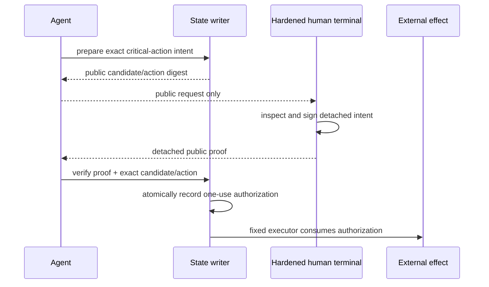

# Technical Spec — Nova human authorization and Cyborg handover extension

**Product document:** [PRD](prd_nova-human-authorization.md)
**Source evidence:** [design input](design-input.md)

## Critical-proof flow

The new generic critical-action request is separate from the existing
threat-model request. It uses the shared `pipeline.po-approval-intent.v1` and
`pipeline.po-approval-proof.v1` primitives with a closed action kind:
`push`, `deploy` or `publication`. The subject digest covers the exact
writer-owned approval object. The state writer verifies the public trust policy
and proof while it holds the durable authorization transition; an attribution
string alone cannot authorize a critical action.

## Remote provisional receipt

The receipt is a distinct, unprivileged schema containing candidate commit/tree,
scope digest, nonce digest, expiry and consumed-at state. It is accepted only
by a local continuation guard. The original code is never stored; a code hash
is compared in constant time and consumed atomically. The receipt is rejected
by every external-effect and override path independently of its status.

## Backlog reconciliation

For each of Cyborg's six rows, Nova writes a candidate-bound evidence record
with exactly `{ itemId, spec, candidateCommit, evidence }`. The reconciliation
tool previews and applies transitions using the canonical ledger writer. A
failed test, stale candidate or missing evidence records a narrow follow-up and
leaves the canonical item unchanged.

## Verification

- unit tests for intent/proof construction and durable critical-gate wiring;
- negative replay, candidate/tree, subject, kind and expiry cases;
- remote-provisional one-time, expiry, scope and final-gate rejection cases;
- the six named Cyborg handover suites and canonical reconciliation readback;
- `git diff --check`, Full Verify, Security and a fresh diff-scoped Critic.
