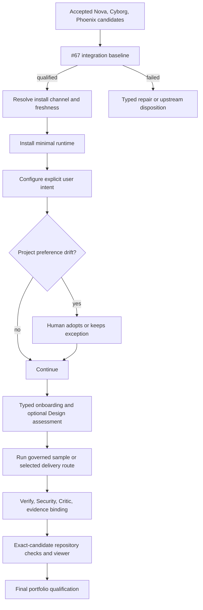

# Sprint Nightwing Epic — Product requirements

## Source evidence and authority

- Source evidence: [design-input.md](design-input.md)
- Technical realization: [spec.md](spec.md)
- Lifecycle profile: Epic
- Design baseline: Agent-Pipeline 0.4.7 `main`
- Authority status: pre-authority design proposal; not an approved execution plan

Nightwing is a last-mile product and integration Epic. It does not merely add a
documentation layer: it makes the integrated Pipeline understandable and safe
to adopt while preserving the exact governance, evidence, security, and
execution contracts produced by the prerequisite sprints.

The adopted baseline still carries an active upstream continuity feature, so
the earlier local kickoff seed cannot be promoted without overwriting canonical
remote authority. This package remains an intentionally unbound design proposal
until that upstream authority is closed and the accepted integrated baseline
can open or promote Nightwing through its then-current sanctioned lifecycle.

## Problem and users

Agent-Pipeline already contains strong deterministic governance, but its user
experience is fragmented across configuration files, lifecycle artifacts,
runner-specific setup, evidence, security controls, and deep documentation.
Meanwhile, three concurrent sprints are changing the contracts Nightwing must
present. Implementing Nightwing independently on 0.4.7 would create duplicate
authority and misleading documentation; waiting to design everything until
after integration would defer too much architectural work.

Primary users are:

- a solo developer who wants a safe first outcome quickly;
- a small team that needs portable preferences and visible review evidence;
- an organization that adds policy, audit, decision, retention, and external
  traceability requirements;
- a maintainer integrating and releasing the complete sprint portfolio.

## Product outcome

A user can decide whether Arbitheon fits, install the compatible Agent-Pipeline
artifacts, configure explicit preferences, complete a governed sample, inspect
exact-candidate evidence, update safely, and understand human authority without
needing accidental internal knowledge. Maintainers can assemble the four-sprint
portfolio without erasing provenance or inventing parallel contracts.

## Success measures

| Measure | Target |
| --- | --- |
| Issue coverage | 23/23 open Nightwing issues mapped to a package and acceptance evidence |
| Design-ahead safety | Every early design slice names its allowed output, integration-held surface, upstream dependencies, and revalidation evidence |
| Integration provenance | Exact accepted Nova, Cyborg, and Phoenix commits/trees recorded before feature implementation |
| First value | Median documented fresh-user path to a verified sample is no more than 10 minutes on the supported matrix |
| Configuration safety | 100% of declared user-mutable fields use one schema, validator, transaction, provenance readback, and rollback contract |
| Intent preservation | Install/update/adoption fixtures prove sparse preferences survive or produce an explicit adopt/keep decision |
| Candidate feedback | Repository-host status is bound to the exact reviewed commit/tree and becomes stale after candidate change |
| Claim integrity | Every material public claim has evidence coverage or a typed limitation; unknown is never rendered as zero or green |
| Documentation ownership | Every retained user document has one purpose, audience, lifecycle, authority, and owner |
| Final qualification | Full Verify, Security, installed-artifact smoke, evidence integrity, and fresh independent Critic pass on the final candidate |

## Scope

### R-0 — Qualified integrated baseline and final portfolio candidate (#67)

Nightwing SHALL begin implementation by assembling the exact accepted Nova,
Cyborg, and Phoenix candidates on the then-current accepted `main`. It SHALL
record source sprint identities, run deterministic and security qualification,
inventory shared contract changes, and resolve integration failures before any
remaining Nightwing package changes shared behavior.

Nightwing SHALL finish by qualifying the combined four-sprint candidate,
preserving per-sprint attribution, producing per-issue close accounting, and
handing off one exact candidate for main integration and release.

Acceptance:

- Entry and exit qualification are separate receipts under one #67 owner.
- Unaccepted or unverifiable upstream commits cannot enter the baseline.
- Integration never rewrites accepted sprint histories or claims their work as
  Nightwing implementation.
- The final acceptance record names every open Nightwing issue and its evidence
  or explicit non-delivery disposition.

### R-1 — Configuration, preferences, distribution, and freshness (#25, #26, #66, #96)

Provide one schema-driven configuration engine for interactive terminal and
non-interactive CLI use. It SHALL expose every explicitly mutable preference,
validate changes, preview impact, write only canonical source authority, compile
runtime projections deterministically, show effective provenance, and support
rollback. Portable non-secret intent and machine-local settings remain distinct.

Channel-aware install/update SHALL resolve Stable, Beta, Alpha, Pinned, and
Development from explicit sources; bind tags, commits, versions, and artifact
integrity; install a minimal explicit runtime; preserve sparse user intent; and
produce exact readback and rollback evidence. Meaningful portable-profile drift
requires an explicit per-project adopt-or-keep decision.

Acceptance:

- Direct editing of generated/runtime projections is neither required nor
  presented as the supported configuration path.
- Missing or ambiguous release metadata never silently falls back to default
  branch HEAD.
- Secrets, local credentials, and machine paths never enter a portable profile.
- Update and rollback tests cover all supported channels, sparse overrides,
  incompatible schema, interruption, and stale provenance.
- #66 source resolution and #25/#26 intent transactions are reused by #96,
  not reimplemented inside an installer.

### R-2 — Coherent session and onboarding experience (#3 foundation, #4, #61, #65, #68, #79, #80)

Fresh Codex onboarding SHALL expose typed, restart-safe states for seed,
runtime initialization, restart, kickoff, and ready. It SHALL use the shared
configuration transaction, materialize the canonical artifact topology, run a
safe sample, and provide actionable remediation. Re-running is idempotent.

Feature and Epic intake SHALL assess whether an optional Design pre-stage adds
value without repeating already sufficient input. Advisor capability preflight
SHALL remain model-free and distinct from a reasoned, on-demand consultation.

Eligible sessions MAY receive one Pipeline-owned disposable scratch root for
ephemeral artifacts. It is not a repository, checkout, authority root, hidden
runtime state, or persistence mechanism. An opt-in installed-artifact smoke
skill SHALL use the exact candidate and active runner in an isolated local
workspace and emit a machine-readable lifecycle receipt.

Acceptance:

- Fresh and resumed sessions agree on onboarding state and next action.
- No restart is proposed before material design input is durably captured.
- Design can be offered, skipped, stopped, or invoked later by the human.
- Advisor unavailability is reported without launching a consultation or
  fabricating advisory evidence.
- Scratch cleanup and capability expiry are deterministic; attempts to turn
  scratch into a second governed workspace fail closed.
- The golden path completes in no more than ten documented minutes on every
  claimed supported combination, with typed limitations elsewhere.

### R-3 — Human, change, and architecture authority (#11, #76, #97, #99)

The low-risk Mini route, human-authorized expedited delivery, ordinary Feature/
Epic delivery, and implementation design amendments SHALL be separate typed
contracts. Agents cannot self-select a human exception or use one route's
evidence to satisfy another.

Bounded implementation changes SHALL advance one rebase-stable Authority
Revision after an exact PO-approved Change Request while remaining in
Implementation. Material scope or risk expansion SHALL require rebaseline.

Every project SHALL receive a typed architecture-baseline assessment. Material
decisions become durable ADR authority; applicable team/organization decisions
are enforced by default and are human-waivable only through a scoped, auditable
exception that preserves the original authority.

Acceptance:

- Mini eligibility and escalation are deterministic and fail closed.
- Expedited delivery declares authorized scope, retained controls, waived or
  deferred controls, expiry, and required reconciliation before merge/release.
- Authority Revision identity is content- and path-derived, stable across
  rebase and unrelated commits, and independent of sessions or worktrees.
- Architecture assessment returns exactly one of `initial-adr-required`,
  `architecture-baseline-sufficient`, or `no-material-architecture-decision`.
- Changed material architecture without a decision, supersession, or valid
  exception fails before final acceptance.

### R-4 — Evidence, assurance, trust, and repository-host feedback (#6, #74, #75)

Supported runners SHALL emit or adapt a privacy-bounded Outcome Cost and Critic
Assurance Receipt. Unsupported observations are typed limitations, never zero.
The Human Authority and Adoption Trust Contract SHALL use that coverage to
state honestly what is enforced, what humans authorize, and what evidence does
or does not prove across solo, team, and organization use.

Repository-host checks SHALL bind deterministic verification, artifact layout,
lifecycle validity, Critic disposition, and evidence integrity to the exact PR
candidate. Untrusted verification SHALL have no write authority; any narrow
publication authority is isolated according to the accepted Cyborg security
contract.

Acceptance:

- A new commit invalidates prior green status.
- Missing, stale, mismatched, tampered, orphaned, or cancelled evidence is
  visibly non-green.
- Every workflow/job declares minimal explicit permissions and does not expose
  persisted checkout credentials to untrusted code.
- Public trust claims distinguish measured coverage, policy guarantees,
  human authority, known limitations, and future capabilities.
- No private raw prompts, private coordinates, or machine-local paths appear in
  telemetry or public check summaries.

### R-5 — Brand and governed documentation estate (#3 completion, #19, #20, #50, #78)

Adopt Arbitheon as the display brand while preserving existing repository,
plugin, marketplace, command, installation, and schema identifiers unless a
separate migration is accepted. State clearly that the project is
source-available and not OSI Open Source, and describe its dogfood-first public
positioning without unsupported enterprise or commercial claims.

Create a small role- and task-oriented documentation estate. Retained artifacts
have declared authority and ownership; superseded guidance is redirected,
archived, or removed through a previewable migration. The product front door,
capability-neutral comparison, and roadmap SHALL link to normative contracts
and dated evidence rather than duplicate them.

Acceptance:

- A first-page reader can explain the product, target users, trust model,
  license posture, and when to use or not use it.
- Happy path, Mini path, advanced governance, configuration, update, and
  evidence inspection are separately discoverable.
- Comparison claims use a consistent capability rubric and dated sources.
- The roadmap is explicitly non-binding, prioritized by user value and risk,
  and shows dependencies and evidence status.
- Link, topology, ownership, staleness, and comprehension checks pass.

## Cross-sprint contract boundaries

| Producer | Nightwing consumes | Nightwing must not create |
| --- | --- | --- |
| Nova | Runner/capability registry, execution and scheduling contracts, sandbox capability, Critic/backlog/continuation/release primitives | Runner-specific configuration fork, second worker pool, parallel backlog authority, competing release loop |
| Cyborg | Security controls, least-authority CI rules, hostile-context handling, findings/VEX/remediation, provenance | Reduced Nightwing security catalog, convenience bypass, duplicate exception/finding lifecycle |
| Phoenix | Evidence viewer, policy packs, events/replay, external traceability, human ledger, agent journal, exports | Second evidence identity, policy hierarchy, human-approval store, or event schema |
| Nightwing | UX transactions, onboarding, distribution, human-readable trust and docs, lifecycle amendments | Changes to upstream ownership merely to simplify presentation |

## Early-design safety contract

Nightwing SHALL classify pre-integration work at issue-slice granularity:

- `green-design-now`: Nightwing owns the semantics and the output has no
  physical or authority binding to a moving upstream contract;
- `amber-envelope-only`: Nightwing may define consumer-visible behavior,
  failure handling, and black-box acceptance, while upstream identifiers and
  implementation remain unresolved;
- `integration-held`: the work needs an accepted upstream schema, writer,
  evidence primitive, topology, or candidate and therefore waits for #67.

The classification grants design authority only. It never authorizes shared
implementation. A green or amber slice SHALL declare its upstream assumptions,
allowed artifact, forbidden binding, synthetic acceptance evidence, and the
exact contract evidence required at revalidation. No whole issue becomes green
merely because one slice is independently designable.

Acceptance:

- Every early block has one explicit collision-safe deliverable and one
  integration-held boundary.
- Early artifacts use capability roles and logical fields, not speculative
  upstream schema names, writers, file locations, or command surfaces.
- A changed upstream contract can invalidate only the declared seam; hidden
  dependencies or locally forked compatibility behavior fail the block.
- All early blocks return through the #67 contract-revalidation gate before
  implementation or final product claims.

## User flow

Mermaid self-check: node identifiers are unique; every decision has named
branches; no unclosed subgraph or unsupported syntax is used.

## Delivery sequence and gates

1. **Design-only preparation:** commit the Nightwing authority package and the
   sanctioned retirement of obsolete duplicate lifecycle state. Do not change
   shared implementation surfaces.
2. **Collision-safe design wave:** complete the green design blocks and the
   bounded consumer envelopes defined in the Spec. Keep every upstream-owned
   identifier and all implementation explicitly unresolved.
3. **Rebase readiness:** after all prerequisite sprints merge, record exact
   accepted commits/trees and regenerate the shared-contract inventory.
4. **NW-0 entry gate:** assemble and qualify the integrated baseline (#67).
5. **Contract-revalidation gate:** bind every Nightwing seam to the accepted
   upstream contract inventory, reconcile material design drift, and renew
   PRD/Spec approval when required. No Nightwing implementation authority
   crosses this gate on the early 0.4.7 design alone.
6. **Foundation wave:** implement NW-1 and the #80/#79 lifecycle semantics used
   by later onboarding and authority work.
7. **Authority and experience wave:** implement NW-3, then #61/#68/#4 and the
   installed-artifact path. Establish the #3 navigation skeleton before #4;
   finalize its claims later.
8. **Assurance wave:** implement #75 before #74, then exact-candidate #6 checks.
9. **Documentation completion:** perform #78 migration, finalize #3, #19, #20,
   #50, and all behavior-derived task paths.
10. **Distribution close and NW-0 exit gate:** close #96 from the final behavior,
   run #65 smoke and all gates, obtain fresh Critic evidence, complete #67
   accounting, and hand off one release candidate.

Packages may run in parallel only when they do not share authority writers or
depend on unqualified contracts. A green package does not waive later final-
candidate verification.

## Non-goals

- Implementing Nightwing behavior on top of speculative or unpublished
  upstream sprint state.
- Replacing Git as the version-control boundary or creating a second workspace.
- Rebranding compatibility identifiers without a separately approved migration.
- Reimplementing Nova, Cyborg, or Phoenix contracts.
- Claiming broad production, enterprise, cost, model-quality, or security
  evidence that has not been measured.
- Making the public roadmap a delivery promise.
- Requiring ADRs for ordinary implementation details.
- Using Mini, expedited delivery, or an Advisor as a guard bypass.

## Assumptions, risks, and decisions

- Accepted upstream sprint contracts will be available on `main` before
  Nightwing implementation. If not, NW-0 fails closed.
- The final integrated topology may require this Spec to be revised. Such a
  revision is expected and must use the reviewed authority-change path.
- Documentation architecture is designed now, but behavioral claims are frozen
  only after implementation evidence exists.
- Collision-safe early design deliberately optimizes stable Nightwing-owned
  semantics first. If an accepted upstream contract changes that semantic core,
  the block is reclassified or rebaselined rather than defended as sunk work.
- Release version, final platform matrix, and unsupported-runner limitations
  are explicit integrated-baseline decisions, not design-time guesses.

## Design-input traceability

| Design input | PRD realization | Spec realization |
| --- | --- | --- |
| DI-1, DI-2 | Problem, outcome, R-0 | Architecture context and baseline gate |
| DI-3 | Delivery sequence, Advisor review requirement | Design lifecycle and advisory review |
| DI-4 | R-0 through R-5 | Issue-to-package matrix |
| DI-5 | Cross-sprint boundaries | Contract seam inventory |
| DI-6 | Non-goals and constraints | Operational and privacy constraints |
| DI-7 | Success measures | Verification matrix and exit evidence |
| DI-8 | Risks | Failure modes and mitigations |
| DI-9 | Integrated-baseline decisions | Rebase readiness checklist |
| DI-10 | Delivery sequence | Package graph and component ownership |
| DI-11 | Early-design safety contract and collision-safe wave | Risk model, readiness matrix, and early design blocks |
