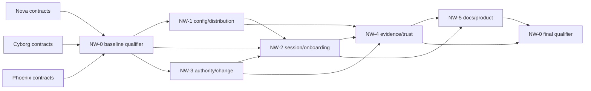
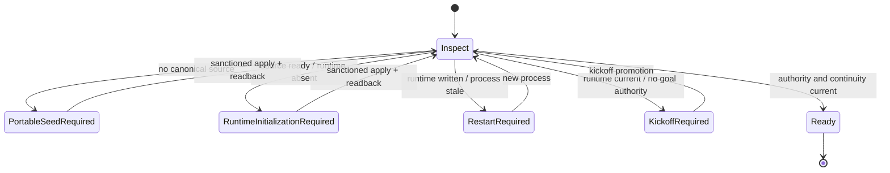

# Sprint Nightwing Epic — Technical specification

## 1. Authority and purpose

- Product requirements: [prd_sprint-nightwing-epic.md](prd_sprint-nightwing-epic.md)
- Source evidence: [design-input.md](design-input.md)
- Lifecycle profile: Epic
- Initial design baseline: Agent-Pipeline 0.4.7 `main`
- Authority status: pre-authority design proposal; implementation is not authorized

This specification defines an integration-first architecture and an executable
delivery model for all open Nightwing issues. It deliberately avoids binding
to speculative file names or schemas owned by Nova, Cyborg, or Phoenix. Those
details become concrete during the #67 integrated-baseline gate.

The pre-adoption kickoff files do not match the adopted branch's canonical
active continuity state. They must not be restored over remote authority merely
to make promotion pass. After the prerequisite work closes that authority,
Nightwing is opened through the then-current sanctioned existing-repository or
kickoff-promotion path and this package is bound by exact digest.

### Advisory review status

The requested pre-integration Advisor consultation was attempted against this
three-file evidence bundle. It produced no child and no answer: the selected
read-only sandbox was unavailable because the active Codex `0.146.0` runtime
has no matching entry in the 0.4.7 compatibility policy, whose current entries
target `0.144.6`. This is an honest `selected-sandbox-required` limitation, not
a review result. The contract-revalidation gate below repeats the consultation
after the accepted Nova sandbox-capability work creates materially new
candidate/evidence bindings, if the configured route is then available.

## 2. Architectural invariants

1. **One governed repository root.** A scratch capability is ephemeral storage,
   never a checkout, worktree, repository, or authority root.
2. **One owner per contract.** Nightwing consumes accepted upstream contracts
   through adapters/projections and does not fork their semantics.
3. **Canonical source, generated projection.** User changes target one schema
   and transaction service; generated runtime files are readback, not UI.
4. **Exact candidate identity.** Checks, evidence, smoke results, review, and
   release admission bind to commit and tree plus declared artifact revisions.
5. **Typed uncertainty.** Missing capability, telemetry, freshness, policy, or
   evidence is reported as a typed limitation/failure, never inferred green.
6. **Human authority is explicit.** A human may authorize a scoped exception;
   an agent cannot manufacture, widen, reuse, or silently normalize it.
7. **Rebase-stable design authority.** Mutable design authority advances as one
   content/path-derived revision rather than a chain of mutable cross-digests.
8. **Public evidence is privacy-bounded.** Private coordinates, credentials,
   raw prompts, and machine-local paths are excluded from portable artifacts.
9. **Documentation follows qualified behavior.** Normative sources remain
   authoritative; user docs link to them and declare staleness/ownership.

## 3. Delivery architecture



Mermaid self-check: the graph is acyclic except for the intentionally shared
NW-0 ownership represented by distinct entry and exit nodes; identifiers and
edges use supported flowchart syntax.

### 3.1 Design-ahead safety model

Pre-integration work is classified at slice level:

| Class | Meaning | Allowed now | Not allowed now |
| --- | --- | --- | --- |
| `green-design-now` | Nightwing owns the semantic decision and no moving upstream authority is needed | Domain model, UX flow, decision table, threat boundary, synthetic acceptance vectors | Shared implementation, final behavior claim, upstream schema/path/writer binding |
| `amber-envelope-only` | Nightwing owns consumer behavior but an upstream provider owns the concrete contract | Logical capability input/output, typed failure behavior, black-box fixtures, compatibility expectation | Provider identifiers, receipt shape, storage, transport, CLI, adapter, or migration implementation |
| `integration-held` | The slice depends on an accepted candidate, topology, evidence primitive, or authority writer | Dependency and acceptance-gate documentation only | Detailed binding, implementation, migration, final evidence, or completion claim |

`Risk-free` means collision-safe inside the declared boundary, not immune to
revision. Every early block remains provisional until #67 binds its external
seams and returns `design-still-valid` or an accepted revision result.

An early block is admissible only when all of these are true:

1. its semantic owner is Nightwing;
2. every upstream interaction is expressed as a capability role, not a guessed
   schema, path, command, writer, or receipt;
3. its output can be reviewed using documents, decision tables, threat cases,
   or synthetic black-box vectors without changing shared runtime behavior;
4. it names the exact integration-held surface that is intentionally absent;
5. deleting or replacing one upstream adapter would not invalidate its domain
   decisions; and
6. it names the accepted upstream evidence needed during revalidation.

### 3.2 Current public integration snapshot

This read-only snapshot was observed on 2026-08-02. It records planning inputs,
not accepted integration candidates or release authority.

| Line | Public branch | Observed head | Relationship to observed `main` |
| --- | --- | --- | --- |
| Main | `main` | `89cb12b99e3fd86ac44878d0c23b278f00538921` | protected baseline |
| Nova | `feat/sprint-nova-codex-v046` | `fa185072495739f61fa7fb567a072dddbaa8f48b` | ahead |
| Cyborg | `feat/sprint-cyborg-claude` | `377aca8f336b290250c84037bce36494e2ce57f1` | diverged |
| Phoenix | `sprint_phoenix` | `5c208e5337972ef703bb606861e41606cf00a2f9` | diverged |
| Nightwing | `feat/sprint-nightwing` | `9443ae21871eec13edd31230cb6f88893e7a6d79` | design snapshot |

The observed deltas confirm simultaneous edits around project authority,
pipeline state, onboarding, lifecycle guards, push guards, Verify, operating
model/state documentation, and release/evidence surfaces. A clean textual
rebase therefore cannot establish semantic compatibility.

### 3.3 Integration-readiness seam matrix

| Seam | Upstream owner/evidence expected | Nightwing consumers | Early status | Revalidation requirement |
| --- | --- | --- | --- | --- |
| Runner, sandbox, invocation, scheduling, Critic execution | Nova accepted capability and conformance evidence | #65, #68, #75, #80 | `amber-envelope-only` | Bind active capability identities, failure vocabulary, isolation evidence, and supported-runner matrix |
| Security controls, hostile context, provenance, findings, release security | Cyborg accepted catalog, evaluation, provenance, and completeness evidence | #6, #74, #75, #76 | `amber-envelope-only` | Bind control identifiers, non-waivable floor, CI permissions, evidence completeness, and exception semantics |
| Policy, events, evidence viewing, human decisions, journals, external traceability | Phoenix accepted policy, event, evidence, and human-ledger contracts | #74, #75, #76, #99 | `amber-envelope-only` | Bind identity, provenance, applicability, privacy, event transport, and human-decision references |
| Project authority, topology, lifecycle state, approval and change writers | Integrated Cyborg/Phoenix/Nova topology and lifecycle result | #61, #78, #79, #97, #99 | `integration-held` | Name one canonical authority boundary and writer for every transition; reject duplicate state or approval stores |
| Verify, release, publication, channel source, install/update provenance | Integrated Nova release loop plus Cyborg security and shared evidence contracts | #4, #6, #65, #66, #96 | `integration-held` | Bind exact candidate identity, channel metadata, publication authority, rollback evidence, and final gate registration |
| Product language, display brand, comparison rubric, roadmap semantics, information architecture | Nightwing; final claims consume qualified evidence | #3, #19, #20, #50, #78 | `green-design-now` | Confirm final capabilities, links, evidence coverage, ownership, and staleness before publication |
| Configuration and adoption interaction semantics | Nightwing; effective values consume integrated policy and runtime authority | #25, #26, #96 | `green-design-now` for UX, `integration-held` for binding | Bind the accepted canonical source, field registry, policy result, projector, writer, and migration |
| Delivery-route and architecture-decision semantics | Nightwing; control floors and durable decisions consume Cyborg/Phoenix | #11, #74, #76, #97, #99 | `green-design-now` for domain rules, `amber-envelope-only` for consumers | Bind control, ledger, topology, exception, and applicability evidence |

### 3.4 Collision-safe early design blocks

The following blocks are the efficient pre-integration design queue. Their
outputs stay inside this three-file package until a later governed package is
opened; they do not create new document authority.

| Block | Issue slices | Collision-safe deliverable now | Explicitly integration-held |
| --- | --- | --- | --- |
| RFD-1 Product decision layer | #3, #19, #20, #50 | Audience and task information architecture; product/brand compatibility language; symmetric comparison rubric; roadmap prioritization and staleness rules; comprehension scenarios | Final capability claims, measured strengths/limitations, live links, release/version statements, and migration completion |
| RFD-2 Configuration and adoption UX | #25, #26 plus user-intent slice of #96 | Field-metadata requirements; inspect/propose/preview/CAS/readback/rollback journey; provenance explanation; portable/local privacy classes; adopt/keep decision cases | Actual field set, canonical source paths, policy resolver, compiler/projector, writers, install schema, and migrations |
| RFD-3 Delivery-route and human-authority semantics | #11, #74, #76 | Route discriminator; eligibility and escalation examples; human-facing authorization content; expiry/reconciliation behavior; invariant that evidence remains honestly non-green | Cyborg control IDs and security floor; Phoenix decision-ledger receipt; guard wiring; close/release enforcement |
| RFD-4 Design and Advisor interaction | #79, #80 | Material-input readiness logic; offer/skip/stop/later UX; explicit consultation reason/consent/evidence flow; no-implicit-call and honest-unavailability cases | Nova selected-sandbox and invocation statuses; transport, model/provider selection, dispatch, receipt, and runner wiring |
| RFD-5 Architecture-decision semantics | #99 | Architecture-significance rubric; applicability and conflict decision tables; ADR/exception/supersession UX; semantic Critic scenarios | Phoenix policy-pack resolver and human ledger; canonical topology; lifecycle writer; inherited-source transport |
| RFD-6 Scratch negative-security contract | #68 | Capability boundaries; forbidden repository/authority markers; expiry and cleanup outcomes; adversarial property vectors; explicit non-workspace language | Nova sandbox/worktree allocator, physical root placement, cleanup writer, session binding, and platform implementation |
| RFD-7 Black-box onboarding and smoke journeys | #4, #61, #65 | Ten-minute journey budget; fresh/restart/resume decision scenarios; idempotence and remediation matrix; exact-candidate smoke lifecycle and cleanup expectations | Real onboarding state writer, install source, active-runner adapter, artifact topology, isolated execution, and receipt schema |
| RFD-8 Measurement and claim vocabulary | #74, #75 | Observable-versus-derived metric rules; units and provenance; unavailable/unknown semantics; privacy exclusions; coverage-to-public-claim admissibility table | Nova runner adapters and Critic lineage; Phoenix event/evidence schemas; storage, aggregation, and viewer projection |
| RFD-9 Repository-check trust model | #6 | Untrusted verification versus narrow publication job boundary; least-authority permission matrix; stale/tamper/cancel/rerun scenarios | Final Verify/evidence schemas, Cyborg control mapping, forge adapter, workflow/check names, branch-protection wiring |
| RFD-10 Authority Revision vectors | #97 | Rebase-stability properties; canonical ordering/path/content test vectors; bounded-versus-material change classification; invalidation decision examples | Accepted authority boundary/topology; actual hash schema version; approval/ledger writer; lifecycle and guard integration |
| RFD-11 Documentation inventory policy | #78 plus #3 completion | Artifact purpose/audience/owner/authority/staleness taxonomy; inventory and migration decision rules; link/duplicate/orphan test cases | Final file inventory, physical moves/removals, redirects, behavior-derived task paths, and authoritative link targets |

Core channel and integration work remains held:

| Hold | Issues | Reason |
| --- | --- | --- |
| HLD-1 Portfolio assembly and qualification | #67 | It requires accepted candidates and exact acceptance evidence; only its checklist and logical receipt requirements are designable now |
| HLD-2 Channel/install/update binding | #66, #96 | Source identity, release metadata, artifact provenance, runtime projection, and rollback must consume the integrated release and security contracts |
| HLD-3 Shared lifecycle and final evidence wiring | Integration portions of #4, #6, #61, #65, #74, #75, #78, #97, #99 | These surfaces share writers, topology, Verify, evidence, or final behavior and cannot be frozen from branch-local assumptions |

Recommended preparation order is RFD-1, RFD-4, RFD-5, and RFD-11 first
because they are predominantly Nightwing-owned semantics. RFD-2, RFD-3,
RFD-6, RFD-8, RFD-9, and RFD-10 follow as bounded consumer envelopes. RFD-7
then composes those decisions into black-box journeys without implementing the
held orchestration.

An RFD block is complete only when it has a decision table or flow, positive
and negative black-box examples, explicit privacy/security constraints, an
upstream seam list, and a revalidation checklist. Completion means
`design-prepared`; it never means `implemented`, `integrated`, or `accepted`.

## 4. NW-0 — Integration baseline and portfolio qualification (#67)

### 4.1 Entry manifest

Create a versioned integration-baseline receipt through the accepted release
and evidence primitives. Required logical fields:

```text
schema
baselineId
baseCommit / baseTree
sourceSprints[]:
  sprintId
  acceptedCommit
  acceptedTree
  acceptanceEvidenceRef
contractInventorySha256
qualification[]:
  gateId
  candidateCommit / candidateTree
  evidenceRef
  status
createdAt
```

The final schema and physical location must consume the integrated topology,
evidence, and provenance contracts. Nightwing must not introduce a second
release manifest if Nova or Cyborg already owns the necessary artifact.

### 4.2 Entry algorithm

1. Require a clean Nightwing worktree and accepted `main` base.
2. Resolve exact accepted Nova/Cyborg/Phoenix commit and tree identities.
3. Validate that each candidate is reachable and its acceptance evidence is
   current and unaltered.
4. Rebase the design-only Nightwing branch onto the accepted combined main.
5. Compile a contract seam inventory and compare it with this specification.
6. Run Full Verify and Security before Nightwing shared-surface edits.
7. Classify failures as integration-owned, upstream-repair-required, or
   specification-revision-required. Do not patch around a contract silently.
8. Emit the baseline receipt and begin Nightwing implementation only when all
   mandatory gates are green.

### 4.3 Contract-revalidation gate

The entry receipt proves that the prerequisite portfolio composes; it does not
prove that an early 0.4.7 Nightwing design still names the right seams. Before
any remaining Nightwing issue receives implementation authority:

1. Bind every Nightwing consumer seam to one accepted upstream owner, schema,
   version, compatibility promise, and acceptance-evidence reference.
2. Compare the integrated inventory with the PRD, this Spec, the issue matrix,
   and all proposed authority writers.
3. Return one typed result: `design-still-valid`, `bounded-revision-required`,
   or `rebaseline-required`.
4. For `bounded-revision-required`, revise the authority package through the
   accepted review/rebind path and renew exact approval before implementation.
5. For `rebaseline-required`, return the Epic to Design; no package may hide
   the drift behind an adapter or local compatibility fork.
6. Re-run the requested bounded Advisor challenge when the selected read-only
   route is available. Advisor availability alone is not a gate, and an
   unavailable consultation cannot be represented as answered.
7. Record the accepted revalidation result against the same integration
   baseline receipt used to authorize subsequent package work.

This is the smallest hard boundary that prevents the design-only branch from
becoming implementation authority merely because its rebase is mechanically
clean.

### 4.4 Exit algorithm

1. Require every Nightwing issue to have current acceptance evidence or an
   explicit PO-approved disposition.
2. Run focused package tests, then Full Verify, Security, installed-artifact
   smoke, exact-candidate checks, documentation validation, and fresh Critic.
3. Verify that all evidence binds the same final commit/tree or its declared
   pre-close/final-tail relationship.
4. Produce final sprint attribution and per-issue close accounting.
5. Hand off one exact main/release candidate without claiming merge or release
   success before readback.

## 5. NW-1 — Configuration and distribution plane (#25, #26, #66, #96)

### 5.1 Components

| Component | Responsibility |
| --- | --- |
| Preference schema registry | Declares user-mutable fields, type, validation, portability, sensitivity, defaults, compatibility, and impact |
| Effective-value resolver | Applies accepted policy precedence and returns value plus source/provenance |
| Configuration transaction | Plans, previews, CAS-applies, compiles, reads back, and rolls back one coherent change |
| Interactive terminal adapter | Renders schema choices and explanations; owns no validation semantics |
| Non-interactive CLI adapter | Supports automation against the same schema and transaction API |
| Portable-profile adapter | Synchronizes only allowlisted non-secret intent through the accepted overlay contract |
| Drift decision coordinator | Emits exact adopt/keep plan and records the human decision for one project |
| Channel source resolver | Resolves Stable/Beta/Alpha/Pinned/Development to explicit immutable source identity |
| Install/update coordinator | Installs minimal runtime, preserves intent, verifies readback, and produces rollback evidence |

### 5.2 Configuration transaction

```text
inspect -> propose -> validate -> impact preview -> authorized apply
        -> deterministic compile -> readback -> commit/rollback receipt
```

Every plan binds canonical source preimage, schema version, policy result,
selected mutations, projected effects, and redacted portability classification.
Apply requires the exact plan digest and uses compare-and-swap semantics.

### 5.3 Channel contract

- Stable resolves only from an accepted published stable release.
- Beta resolves only from declared prerelease metadata.
- Alpha resolves from explicitly configured main-tracking development authority.
- Pinned resolves the exact user-selected tag/commit/artifact tuple.
- Development resolves an explicitly selected source checkout and never
  masquerades as a published release.

Unavailable or inconsistent metadata returns typed diagnostics. No channel may
substitute another channel as success.

## 6. NW-2 — Session and onboarding plane (#3 foundation, #4, #61, #65, #68, #79, #80)

### 6.1 Shared state machine



All supported runners consume equivalent typed states. Runner adapters may
render commands differently but cannot collapse restart, runtime, authority,
or kickoff distinctions.

### 6.2 Design readiness and Advisor separation

The intake assessor receives bounded material-input metadata and returns:

- `offer-design`
- `input-sufficient`
- `design-declined`
- `design-stopped`

Advisor capability preflight returns route availability only. A consultation
requires a named reason, one bounded question, allowlisted evidence, and a
fresh read-only execution receipt. Bootstrap cannot call it implicitly.

### 6.3 Scratch capability

Logical contract:

```text
sessionBinding
capabilityId
rootClass = ephemeral-scratch
allowedOperations
denyRepositoryMetadata = true
denyAuthorityArtifacts = true
expiry
cleanupReceipt
```

Creation, use, expiry, and cleanup are Pipeline-owned. Validation rejects Git
metadata, worktree links, authority manifests, lifecycle state, or any attempt
to adopt scratch as a project root.

### 6.4 Installed-artifact smoke

The smoke skill is risk-triggered and opt-in at the capability level but may be
invoked autonomously once the accepted plan requires it. It installs the exact
candidate, uses only the active runner, completes a small governed delivery,
validates lifecycle artifacts, removes its isolated test workspace, and emits
an exact-candidate receipt. It is not a substitute for Full Verify or Critic.

## 7. NW-3 — Authority and change plane (#11, #76, #97, #99)

### 7.1 Delivery-route discriminator

One deterministic classifier selects or rejects:

| Route | Entry authority | Non-waivable floor | Escalation |
| --- | --- | --- | --- |
| Mini | Machine-checkable low-risk eligibility plus normal human scope | Candidate binding, focused verification, independent review, honest evidence | Any boundary/risk ambiguity becomes Feature |
| Feature/Epic | Approved PRD/Spec authority | Configured gates and final acceptance | Material scope change rebaseline |
| Expedited | Exact attended human authorization | Declared minimum verification, audit, expiry, reconciliation before protected consequence | Missing/ambiguous authority blocks |
| Implementation amendment | Approved current Authority Revision plus exact Change Request | Content identity, PO approval, affected-evidence invalidation | Outcome/risk expansion rebaseline |

No route inherits another route's approval or evidence.

### 7.2 Authority Revision

The integrated topology defines a closed authority boundary. Revision input is
the boundary schema version plus sorted canonical relative paths, artifact type,
and committed blob/content identity. Generated evidence, approval receipts,
runtime state, implementation output, session IDs, and worktree paths are
excluded. Canonical line-ending and path rules must make the revision stable on
all supported platforms and across rebase.

An amendment records previous revision, proposed revision, Change Request,
impact classification, affected packages/evidence, exact PO approval, and the
new effective revision. Accepting it invalidates only declared downstream work.

### 7.3 Architecture continuity

The architecture resolver consumes effective organization/team policy from the
Phoenix policy-pack contract, applicable inherited decisions, project ADRs,
advisory guidance, local preferences, and active human exceptions as distinct
layers. It selects relevant decisions by stable identity, digest, applicability,
status, and supersession—not directory location.

Every delivery close emits one architecture impact classification. A semantic
Critic verifies implementation conformance, not merely ADR file presence.

## 8. NW-4 — Evidence and assurance plane (#6, #74, #75)

### 8.1 Outcome Cost and Critic Assurance Receipt

Required logical fields:

```text
schema
runner / adapter capability identity
candidate commit / tree
delivery route and package identity
observed cost fields with unit and provenance
typed unavailable fields with reason
Critic isolation / provider / selector evidence
review disposition and candidate binding
privacy classification
receipt digest and timestamp
```

The receipt extends Nova runner conformance and Phoenix evidence/event
contracts. Raw prompts and private provider/account coordinates are excluded.

### 8.2 Repository-host checks

Use separate untrusted verification and narrowly authorized publication jobs.
The former receives no write token; the latter consumes sanitized, already
verified results and only the minimum accepted check-publication permission.
Both verify candidate identity. Branch protection consumes distinct statuses
for deterministic verification, layout/lifecycle, Critic, and policy gates.

### 8.3 Trust contract

Generate or validate a public claim register that maps each claim to normative
authority, executable evidence, measurement window, coverage, limitation, and
owner. Documentation may summarize the register but cannot turn unknown or
partial coverage into a universal claim.

## 9. NW-5 — Product and documentation plane (#3, #19, #20, #50, #78)

### 9.1 Governed document registry

Every retained text artifact declares or is deterministically associated with:

```text
artifactId
purpose
audience
authorityClass
owner
lifecycleStatus
canonicalTaskPaths[]
supersedes / supersededBy
stalenessPolicy
```

A migration command first produces an inventory and exact preview. Apply moves,
redirects, archives, or removes only reviewed targets and validates links and
authority uniqueness afterward.

### 9.2 Progressive front door

The information order is:

1. product promise, audience, trust boundary, license posture;
2. when to use / when not to use;
3. ten-minute path and configuration/update entry points;
4. Mini, normal, expedited, and advanced governance paths;
5. exact evidence and architecture overview;
6. capability comparison, roadmap, references, and normative contracts.

The display brand is Arbitheon. Technical identifiers remain compatibility
coordinates until a separately accepted migration says otherwise.

## 10. Issue-to-package and evidence matrix

| Issue | Package | Primary acceptance evidence |
| --- | --- | --- |
| #3 | NW-2 skeleton / NW-5 completion | Front-door comprehension, claims, navigation, links |
| #4 | NW-2 | Timed fresh-clone matrix, idempotence, sample close |
| #6 | NW-4 | Exact-candidate/stale/tamper/cancellation CI fixtures |
| #11 | NW-3 | Eligibility, escalation, ceremony benchmark fixtures |
| #19 | NW-5 | Dated source register and symmetric comparison rubric |
| #20 | NW-5 | Dependency/priority/staleness validation |
| #25 | NW-1 | Schema coverage and transactional UI/CLI tests |
| #26 | NW-1 | Adopt/keep CAS, scope, privacy, restart tests |
| #50 | NW-5 | Brand/compatibility identifier checks |
| #61 | NW-2 | Fresh/restart/resume cross-runner state tests |
| #65 | NW-2 | Installed exact-candidate E2E smoke receipt |
| #66 | NW-1 | Channel source, provenance, stale/missing metadata tests |
| #67 | NW-0 | Entry baseline and final portfolio receipts |
| #68 | NW-2 | Scratch isolation, expiry, cleanup, no-repository tests |
| #74 | NW-4 | Versioned trust contract and evidence-backed claim register |
| #75 | NW-4 | Cross-runner cost/assurance receipt fixtures |
| #76 | NW-3 | Authorization, control floor, expiry, reconciliation tests |
| #78 | NW-5 | Inventory, preview/apply migration, ownership/link validation |
| #79 | NW-2 | Input-readiness decisions and restart persistence |
| #80 | NW-2 | Model-free preflight and consent-gated consultation tests |
| #96 | NW-1 | Clean install/update/rollback/intent-preservation matrix |
| #97 | NW-3 | Rebase-stable revision and affected-evidence invalidation |
| #99 | NW-3 | Decision applicability, exception, supersession, runner parity |

## 11. Rebase readiness checklist

Before editing implementation code after the prerequisite merges:

- refresh the dated public snapshot and retire it as planning-only input;
- record exact accepted `main`, Nova, Cyborg, and Phoenix identities;
- confirm the Nightwing branch contains only its reviewed design/migration
  commits before rebase;
- enumerate changed shared hotspots: onboarding, authority, topology, pipeline
  state, lifecycle guard, push guard, Verify registration, release, and handover;
- diff schema versions and migration/compatibility promises;
- map each changed seam to its upstream owner and acceptance evidence;
- reclassify every RFD slice against the accepted seam matrix and reject any
  hidden schema, path, writer, command, or receipt dependency;
- replace provisional interface names in this Spec with accepted names;
- run baseline Full Verify and Security;
- complete the contract-revalidation gate and submit any material PRD/Spec
  change through reviewed authority revision;
- begin NW-1/NW-2/NW-3 implementation only after #67 entry acceptance and a
  current accepted revalidation result.

## 12. Verification strategy

| Layer | Required evidence |
| --- | --- |
| Schema/unit | Deterministic parsing, canonicalization, validation, typed errors, privacy redaction |
| State/property | CAS conflict, retry/idempotence, interruption, rollback, restart, rebase stability |
| Contract | Cross-sprint provider/consumer fixtures and backward-compatible migration |
| Security/adversarial | Untrusted repo/CI context, credential absence, policy conflicts, capability expiry, tamper detection |
| Runner/platform | Claimed Codex/Claude and supported OS matrix; limitations typed where unproven |
| Integration | Clean install, update, drift decision, onboarding, delivery, evidence, close |
| Documentation | Topology, links, authority ownership, staleness, claims, comprehension |
| Candidate | Focused suites, Full Verify, Security, installed smoke, exact-candidate checks, fresh Critic |

No focused or package-level green result is reusable as final-candidate evidence
after the candidate tree changes.

## 13. Failure modes and recovery

| Failure | Recovery |
| --- | --- |
| Upstream candidate missing/unaccepted | Stop NW-0; request exact accepted candidate or upstream repair |
| Contract mismatch after rebase | Update consumer against owner contract or revise authority; do not add parallel contract |
| Config/update preimage drift | Reject apply, re-inspect, create a fresh plan |
| Mandatory policy/evidence unavailable | Block dependent claim/action with typed diagnostic |
| Optional capability unavailable | Continue only where contract allows and record typed limitation |
| Scratch contains repository/authority markers | Deny use, quarantine/clean through owned lifecycle, emit failure receipt |
| Expedited or amendment authority expired/mismatched | Reject; require a fresh human decision or rebaseline |
| Candidate changes after green evidence | Invalidate and rerun required final gates |
| Documentation migration produces orphan/duplicate authority | Fail apply/readback and restore from preview-bound rollback |

## 14. PRD-to-Spec traceability

| PRD requirement | Spec sections |
| --- | --- |
| R-0 integration/final candidate | 3, 4, 10–13 |
| R-1 configuration/distribution | 5, 10–13 |
| R-2 session/onboarding | 6, 10–13 |
| R-3 human/change/architecture authority | 7, 10–13 |
| R-4 evidence/trust/checks | 8, 10–13 |
| R-5 product/docs | 9–13 |
| Cross-sprint boundaries | 2–4, 11 |
| Early-design safety contract | 3.1–3.4, 4.3, 11 |
| Success measures | 10, 12 |
| Privacy and public-only constraint | 2, 5, 6, 8, 13 |
