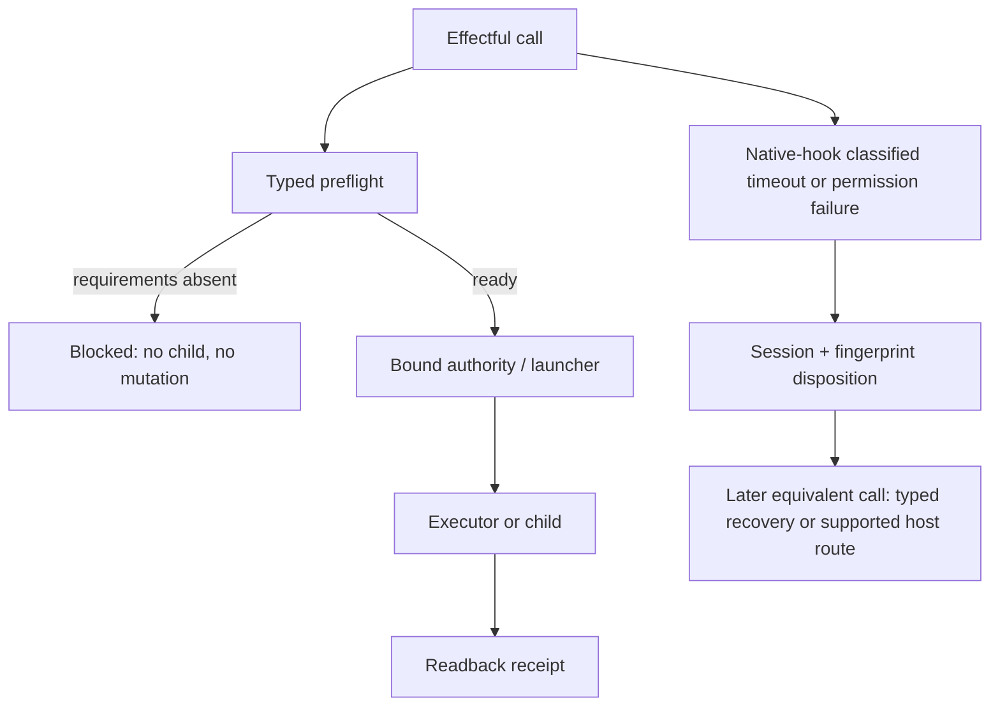

# Technical Specification — Release 0.5.2 Recovery

## Guard and preflight flow

## Hook reliability contract

`codex-pretool-guard` owns a finite end-to-end wall-clock budget.  Nested
guards receive allocations derived from the remaining budget; they may not use
independent longer timeouts that make the outer adapter inevitably time out.
The adapter reserves a final recovery window for one-time override and typed
diagnostics.

A new native-hook disposition is distinct from the existing selected-sandbox
disposition.  It is written only after a narrowly classified operational
failure, includes the session/fingerprint/tool/guard/failure tuple, and never
marks a policy denial as a sandbox failure.  A matching disposition prevents a
second failing launch in that session.

## Verification matrix

- Push Gate fixtures: absent approval, malformed approval, valid bound
  executor authorization, and raw-push rejection.
- Publication fixtures: local and external capability evidence, including
  unavailable credential/policy/ref/workflow states.
- Hook fixtures: sequential apply-patch guards finish within the enlarged
  total budget; forced timeout/permission failure is recorded once; matching
  retry performs no nested guard launch; an unclassified failure remains blocked.
- Entry-point fixtures: Critic and other selected effectful launchers fail
  preflight before child start when mandatory governance/capability paths are
  absent.
- Release-state fixture: version surface drift is blocked.
