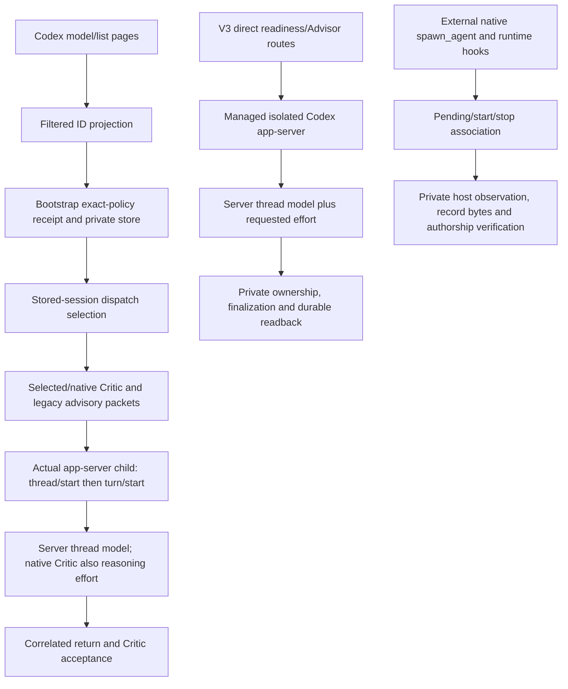

# Codex launch and identity chain inventory

Task: MODEL-FAMILY-CODEX-CHAIN-20261001. Date: 2026-10-01. Status: bounded source inventory complete with explicit unclosed evidence gaps. Independent technical review pending.

This is read-only source evidence for S2/S5/S6 ownership. It grants no production authority, changes no approval or exact-ID proof, and makes no live runner/provider qualification claim. The original partial inventory and draft design remain immutable. Machine-readable inventory `codex-chain-inventory.json` carries exact command/exit records, source byte hashes, lines and schema/test ownership.

## Findings

The native Critic launches the actual shared `codex-critic-app-server-child.mjs`, not the previously guessed child path. The child reads the model/provider from server thread responses; the native review branch additionally reads `reasoningEffort`. Its top-level model/effort result fields are request coordinates projected only after those checks. Normal Critic and legacy advisory lack an independently observed effort field. Productive isolated readiness reads the server thread model and explicitly reports effort as requested.

Productive readiness and design Advisor resolve V3 routes directly. Main-session drift remains `automatic:false`. Current discovery projects filtered IDs rather than retaining the raw complete catalogue, and current dispatch selects a held session. Those are concrete integration gaps for autonomous newest-selectable family upgrades; no per-version PO act is introduced here.

## Source evidence

Each row identifies current raw-byte SHA256 and evidence lines. Inspection means excerpt review plus raw-byte hashing; it does not mean runtime execution. Roles separate discovery, bootstrap, selection, packet sealing, launch, identity, storage and acceptance.

| ID / role | Path and evidence lines | Raw-byte SHA256 | Relevance |
|---|---|---|---|
| C01 / producer | [plugins/pipeline-core/lib/codex-model-host-observation.mjs](../../../../plugins/pipeline-core/lib/codex-model-host-observation.mjs) — 12, 21, 67, 71, 86 | `8d9587bedc9262cad15c6631da952fea571876f0e90df27b9f96c7c8f4a9e77b` | Native model/list pagination requests includeHidden:false; output is filtered selectable IDs for requested effort, not a retained complete raw catalogue. |
| C02 / producer-projection | [plugins/pipeline-core/lib/model-role-host-observations.mjs](../../../../plugins/pipeline-core/lib/model-role-host-observations.mjs) — 29, 36, 60 | `8e9af5a214534815802a21cb2a539ea3de8c8e29c031e277b50ce831b9e99b29` | Codex observations cache per effort and project available-ID slots. Family refresh needs completeness/selectability provenance beyond these IDs. |
| C03 / parser-selection | [plugins/pipeline-core/lib/model-role-session.mjs](../../../../plugins/pipeline-core/lib/model-role-session.mjs) — 26, 175, 191, 212, 297, 309 | `84a458f00ca57299cb051a9a0b61fb7db21be6f44a1abdcf23c4a9786b6a6546` | Closed v1 exact-ID session receipt validation, held-session reuse and acknowledged readback. Existing session reuse does not refresh at each dispatch. |
| C04 / bootstrap | [plugins/pipeline-core/scripts/model-role-bootstrap.mjs](../../../../plugins/pipeline-core/scripts/model-role-bootstrap.mjs) — 9, 145, 170, 185, 217, 230 | `e1ef785636d037054a6a64a9deb5725af8fe330c9f08e28674f216b9da56d488` | Bootstrap reuses stored sessions, otherwise collects observations and persists exact-policy/V3-baseline admission; current CLI can return legacy-v3. |
| C05 / store | [plugins/pipeline-core/lib/model-role-host-store.mjs](../../../../plugins/pipeline-core/lib/model-role-host-store.mjs) — 39, 55, 80, 136, 147, 172 | `a52175f11f3ed1740eb09c7ba1ca8fd7f17943b24dc2ebc4ed976bf2bc5dd3ad` | Validated private exact-policy session receipt, exclusive creation and immutable readback; no family refresh watermark/CAS is implemented. |
| C06 / policy | [plugins/pipeline-core/lib/model-role-approved-policy.mjs](../../../../plugins/pipeline-core/lib/model-role-approved-policy.mjs) — 23, 29, 45 | `e933ad66324e21e1efce28829dfbc15886b33f6c5cdb3042727a8a40e9011f08` | Exact-ID signed policy proof remains historic authority. New family semantics require explicit migration, not reinterpreting old proof bytes. |
| C07 / route-inventory | [plugins/pipeline-core/lib/model-role-route-source.mjs](../../../../plugins/pipeline-core/lib/model-role-route-source.mjs) — 122, 135, 143 | `768d8f5800d96ff33e4a7e75e03782ffa581e967cd3952912c0e602607942182` | Declared unavailable routes remain visible but do not create launch slots; inactive configuration differs from missing source adapter. |
| C08 / dispatch-selector | [plugins/pipeline-core/scripts/model-role-dispatch-select.mjs](../../../../plugins/pipeline-core/scripts/model-role-dispatch-select.mjs) — 17, 32, 60, 89 | `5d32d64a0dae56548410800ded713abd0420735a16591d35b7739f8ed18c5c57` | Stored-session selector depends on V3 route prerequisites and returns legacy-v3 on multiple failures. Active-family fail-closed behavior is future work. |
| C09 / dispatch-binding | [plugins/pipeline-core/lib/model-role-host-session.mjs](../../../../plugins/pipeline-core/lib/model-role-host-session.mjs) — 14, 49, 69, 87, 104 | `53ac47846985b078dc4145935cb11451be068ce9a778418b304c36a9949a82d3` | Bootstrap/admission/binding and stored receipt dispatch selection use held exact coordinates. |
| C10 / dispatch-binding | [plugins/pipeline-core/lib/model-role-dispatch.mjs](../../../../plugins/pipeline-core/lib/model-role-dispatch.mjs) — 12, 23, 30, 35 | `d4d881e1a54f8892a6191aa38914b0e3e05f086e1fe66c23f2dc3ba265cfc73c` | Task dispatch binding validates model/effort against admitted receipt and returns exact model, readback and receipt hash. |
| C11 / critic-route-projection | [plugins/pipeline-core/lib/critic-session-model-route.mjs](../../../../plugins/pipeline-core/lib/critic-session-model-route.mjs) — 7, 9, 20 | `fb23c5053fc58f6b4a6e553a3f2c1702892600dfac63fe8b0c9c40c2cacfd60f` | Codex ready duty selection projects model with matched effort and digest binding; otherwise retains V3 route. |
| C12 / critic-route-consumer | [plugins/pipeline-core/scripts/codex-critic-session-route.mjs](../../../../plugins/pipeline-core/scripts/codex-critic-session-route.mjs) — 3, 7, 16 | `42670f191b2d69bb99dcc5e8f484121ecc64017c7f1f5dba3a27a4e32941e8e8` | Shared selected/native Critic route calls current optional session selector before high-risk projection. |
| C13 / packet-sealing | [plugins/pipeline-core/scripts/session-critic-finalizer.mjs](../../../../plugins/pipeline-core/scripts/session-critic-finalizer.mjs) — 110, 117, 218, 227, 243, 268 | `a3adfcdc6c2614466201c36b97f593bd29028c4d7a687c19042a8e14097d60ec` | Session Critic admission binds selected route plus readback/receipt; finalization retains admitted coordinates rather than reselecting an in-flight call. |
| C14 / packet-sealing | [plugins/pipeline-core/lib/role-dispatch-preflight.mjs](../../../../plugins/pipeline-core/lib/role-dispatch-preflight.mjs) — 12, 20, 21 | `da4528ec81d39052484ffecf8434369dd192e0cecfa7b580bd632e858fbc46ea` | Closed generic role packet has prompt/candidate/path digests but no dedicated model/effort or family invocation receipt keys. |
| C15 / packet-preflight | [plugins/pipeline-core/scripts/critic-packet-preflight.mjs](../../../../plugins/pipeline-core/scripts/critic-packet-preflight.mjs) — 46, 49, 50 | `5590b6f9175ec09ea295a2aeffd6658eb9be6342611f94e5be958adb82267727` | Candidate/packet/admission schemas bind review input before transport; model selection must be included in future sealed invocation evidence. |
| C16 / native-critic-launch | [plugins/pipeline-core/scripts/codex-native-critic-host.mjs](../../../../plugins/pipeline-core/scripts/codex-native-critic-host.mjs) — 36, 272, 325, 400, 423, 425, 445, 475 | `b7ac04f7d97e0319f0b7f3bba8bb289ef2b996861a7175ea0c714f0b5a3cb5e1` | Resolves actual shared child, seals selected model/effort and candidate; validates server-backed native thread effort and response. Thread observation precedes turn start and is not atomic with it. |
| C17 / native-child-identity | [plugins/pipeline-core/scripts/codex-critic-app-server-child.mjs](../../../../plugins/pipeline-core/scripts/codex-critic-app-server-child.mjs) — 187, 243, 245, 246, 267, 370, 398, 404, 409, 440, 450, 499, 509, 524 | `6bfa846d10d48e8f76363eac39117408bc58f8ef56408605e6ded4c8859ae197` | Thread/start server fields prove observed thread model/provider; native second thread also yields reasoningEffort. Top model/effort fields echo request only after checks. Normal branch lacks independent actual effort field. |
| C18 / selected-critic-launch | [plugins/pipeline-core/scripts/codex-critic-selected-host.mjs](../../../../plugins/pipeline-core/scripts/codex-critic-selected-host.mjs) — 34, 92, 229, 407, 433, 467 | `c8894c7c6cd03d91c28c9611706a726657f0a8c8a35b993cf7347079b12575d2` | Selected host binds candidate/source/route and delegates actual transport to shared app-server wrapper. |
| C19 / selected-critic-wrapper | [plugins/pipeline-core/scripts/codex-critic-app-server.mjs](../../../../plugins/pipeline-core/scripts/codex-critic-app-server.mjs) — 21, 212, 234, 273, 293, 332 | `412dc9300a0e7ed9c7f036854917dbab06df4f437d4c9a6518e61abccd8a8a0e` | Actual shared child receives selected model/effort. Wrapper validates conditional observed projection and emits configured identity; normal effort is request echo. |
| C20 / legacy-advisory-selector | [plugins/pipeline-core/scripts/advisory-host-bridge.mjs](../../../../plugins/pipeline-core/scripts/advisory-host-bridge.mjs) — 73, 76, 92, 100, 101 | `1b6f0346d4bf8d052477817287534e525fc8e57173d3bea8b294dc6e85da5b3c` | Codex legacy advisory bridge optionally applies session selector and digest-binds exact coordinates; fallback retains V3. |
| C21 / legacy-advisory-launch | [plugins/pipeline-core/scripts/codex-advisory-app-server.mjs](../../../../plugins/pipeline-core/scripts/codex-advisory-app-server.mjs) — 11, 33, 65, 81, 93 | `877b4be63e942f32bfe879a5d84e470292829c291899c9e300d6c5e77dcac9d2` | Resolved advisory child is launched with exact route; returned identity is selected model/effort checked against child fields. |
| C22 / legacy-advisory-identity | [plugins/pipeline-core/scripts/codex-advisory-app-server-child.mjs](../../../../plugins/pipeline-core/scripts/codex-advisory-app-server-child.mjs) — 46, 102, 104, 105, 115, 120, 132, 137, 142, 168, 175 | `7b782662dd9a35fd51043ca8f047a67dcd3cc3c06f2ece1c8454927666fec0e8` | Server thread model/provider are checked; events correlate thread/turn. Successful output model/effort projects request; no independently observed effort. |
| C23 / productive-readiness-selector | [plugins/pipeline-core/scripts/codex-design-readiness-host.mjs](../../../../plugins/pipeline-core/scripts/codex-design-readiness-host.mjs) — 8, 13, 25, 39, 54, 58 | `7081eaaea6036516037876fdab040caf19a10bf72fc1e54abf7600b6579faff7` | Productive tool-free readiness resolves V3 duty directly, with no model-role selector call; must be owned separately in S5. |
| C24 / productive-advisor-selector | [plugins/pipeline-core/scripts/codex-design-advisor-host.mjs](../../../../plugins/pipeline-core/scripts/codex-design-advisor-host.mjs) — 6, 10, 23, 26, 55 | `8b2a458d19cfc552bb3b7f7d898fa7e22ee6f61ba7ed3a15452c07bb8a96adc9` | Productive design Advisor resolves V3 duty directly; no model-role selector here. Separate S5 launch consumer. |
| C25 / productive-advisor-launch | [plugins/pipeline-core/lib/codex-advisor-execution.mjs](../../../../plugins/pipeline-core/lib/codex-advisor-execution.mjs) — 8, 46, 57 | `fec1204ad5f7279c7b2eb90e483d17f82bcb6bebb7de617275eaf42915ecf878` | Runs isolated structured host using selected initial route and reads host result. Transport shares readiness actual-model and requested-effort distinctions. |
| C26 / productive-readiness-launch-consumer | [plugins/pipeline-core/lib/codex-tool-free-design-readiness.mjs](../../../../plugins/pipeline-core/lib/codex-tool-free-design-readiness.mjs) — 12, 15, 46, 91, 115, 119, 122, 131, 155, 168 | `7f9c3ecf7c5af3365e68efdbb82d1bb5deed2e31234160bcb4c5af206b6f67fb` | Binds model/effort in request digest, runs isolated host and requires registered private journal/finalization/store readback. Route effort is selected/requested evidence. |
| C27 / productive-native-launch-identity | [plugins/pipeline-core/lib/codex-isolated-structured-host.mjs](../../../../plugins/pipeline-core/lib/codex-isolated-structured-host.mjs) — 99, 194, 199, 225, 227, 239, 284, 290, 293, 295, 317, 319, 322, 387, 432, 433, 435 | `975cdba90fb05a3c1626b4491d09717c51f1de9a4bd7dd95828acbc6383879d2` | RPC responses correlate pending IDs; output events correlate thread/turn. modelObserved comes from server thread.model; returned effort is explicitly requestedEffort. No provider/OS model attestation. |
| C28 / actual-executable-launch | [plugins/pipeline-core/lib/codex-host-process-supervisor.mjs](../../../../plugins/pipeline-core/lib/codex-host-process-supervisor.mjs) — 10, 11, 13, 15, 18, 26, 41, 109 | `8023c0405eb2dbd42ae80cd6a5d47c9c6c42122afadd4f5888c0ad5dde54a9ee` | Sanctioned Linux/process.execve managed launcher binds request/executable/argv and private ownership; this proves host process provenance, not provider model semantics. |
| C29 / actual-executable-launch | [plugins/pipeline-core/lib/codex-host-process-launcher.mjs](../../../../plugins/pipeline-core/lib/codex-host-process-launcher.mjs) — 33, 41, 67, 93, 95, 110 | `34e4c85b3ffb3243d77ea643cc76f75d33b77f809b7852e82b0d44749b644f4f` | Observed registered worker execution executable/argv and terminal lifecycle link launcher to private journal. |
| C30 / actual-executable-launch | [plugins/pipeline-core/lib/codex-host-process-exec-worker.mjs](../../../../plugins/pipeline-core/lib/codex-host-process-exec-worker.mjs) — 38 | `da64eddced054475606fdf98ae36513c856723e1a0e404c8e1e4de399f07e7b0` | Exact Codex executable and argv launched through process.execve after registered ownership validation. |
| C31 / historic-process-verification | [plugins/pipeline-core/lib/codex-host-process-journal.mjs](../../../../plugins/pipeline-core/lib/codex-host-process-journal.mjs) — 31, 32, 36, 87, 95, 159, 168 | `202572a093803bb0b0376377c63e61a08d2dfe6cb453c38ffa10da1c3c284632` | Private journal stores kernel process identity, executable/argv and exact dispatch/request binding; local source contract only. |
| C32 / output-custody | [plugins/pipeline-core/lib/codex-host-output-custody.mjs](../../../../plugins/pipeline-core/lib/codex-host-output-custody.mjs) — 8 | `b8ec08ff9b4cdb564dade0e6a95da4d640808f9e1007f96093d3a5fbae2460da` | Host custody retains bounded stream/final-message evidence; custody is not provider attestation. |
| C33 / readiness-finalization | [plugins/pipeline-core/lib/codex-readiness-finalization.mjs](../../../../plugins/pipeline-core/lib/codex-readiness-finalization.mjs) — 13, 58, 64, 75, 80, 83, 84 | `ebff68a552dc15fa38528768d77cfbafd96c0962c5bb7669db876acf8091b1f2` | Closed finalization and immutable readback bind actual server thread model to expected route and registered ownership, without actual-effort observation. |
| C34 / readiness-ownership | [plugins/pipeline-core/lib/codex-readiness-ownership-verifier.mjs](../../../../plugins/pipeline-core/lib/codex-readiness-ownership-verifier.mjs) — 14, 27, 33, 57 | `4624d591383a8435621d69adafa96be97a436cca513bb4ac94ebdb6db29d1b00` | Private registered process chain/terminal/empty session checks verify OS ownership rather than family compatibility or latest authorization. |
| C35 / readiness-record | [plugins/pipeline-core/lib/codex-readiness-host-record.mjs](../../../../plugins/pipeline-core/lib/codex-readiness-host-record.mjs) — 19, 24, 31, 43, 47, 50, 61, 75 | `6bb399298e4b81bb724e602286a79be85f78b873570e6a397201662fce9cfbde` | Host receipt v2 binds requested route, actual thread model/provider and independent process receipts; explicitly no provider attestation and no observed effort field. |
| C36 / readiness-store | [plugins/pipeline-core/lib/codex-design-readiness-host-store.mjs](../../../../plugins/pipeline-core/lib/codex-design-readiness-host-store.mjs) — 11, 12, 14, 65 | `f8ac123be647522add8f51c0cc4ad1a0cf12968b26b009a00bce6089e5da3f61` | Private store joins closed record, finalization and ownership verification. Future receipt schema migration must preserve historic readability. |
| C37 / native-admission-hook | [plugins/pipeline-core/hooks/codex-hooks.json](../../../../plugins/pipeline-core/hooks/codex-hooks.json) — 32, 68, 74, 94, 100 | `dcc23075e81a254603c9b7ab96bc6e2bc046830532b1cc0535934e6af67aa010` | Configured pretool/native start/stop callbacks exist; source cannot establish runtime hook provenance or availability. |
| C38 / native-admission | [plugins/pipeline-core/hooks/guard-dispatch.mjs](../../../../plugins/pipeline-core/hooks/guard-dispatch.mjs) — 64, 143, 234 | `d6df111025a43ad21e7dd602bacbaa2adf4b22c9ab3eaebc94eaeed08788d5da` | Codex spawn_agent admission prepares marked native host state; it is not an actual native launch producer. |
| C39 / native-correlation | [plugins/pipeline-core/lib/native-goldfish-host-state.mjs](../../../../plugins/pipeline-core/lib/native-goldfish-host-state.mjs) — 119, 126, 132, 150, 166, 187, 190, 195, 198, 219 | `3af829f9a5e7a2c1be09de224d0ea4ce355c4f2ab13d1ef11a4192957a91e9ce` | Prompt marker binds configured coordinates; start correlates session/agent type/model with one unexpired pending item; stop uses immutable agent association. Actual native launch producer is external/uninspected. |
| C40 / native-return-identity | [plugins/pipeline-core/lib/native-goldfish-host-return.mjs](../../../../plugins/pipeline-core/lib/native-goldfish-host-return.mjs) — 16, 60, 131, 137, 139 | `8b6adf32d6185efdc9677e6ced46469c13c6c7e13a8e64bb9a13897e5d68ef6e` | Codex stop input.model checks pending model; effort remains briefing binding. Repo does not independently prove native callback input provenance or actual effort. |
| C41 / native-local-observation | [plugins/pipeline-core/lib/native-goldfish-host-observation.mjs](../../../../plugins/pipeline-core/lib/native-goldfish-host-observation.mjs) — 36, 49, 75, 93, 101, 118 | `6393965de7bbd51ef4cb389df6ccd70989dfffd90baf91545c6e2190eb7c8564` | Private local observation binds configured model/effort and exact record/commit bytes with explicitly non-provider-attested assurance. |
| C42 / native-host-finalizer | [plugins/pipeline-core/lib/native-goldfish-host-finalizer.mjs](../../../../plugins/pipeline-core/lib/native-goldfish-host-finalizer.mjs) — 54, 71, 82, 88, 96, 104, 108 | `dca09232cb8d110748856aadb6fd52742073cbf2234e036341b08b54b0f37ea6` | Host finalizer verifies start/stop, performs admitted host commit and persists private observation before public v4 record. Read only; no host commit performed here. |
| C43 / native-hook-consumer | [plugins/pipeline-core/hooks/native-goldfish-host.mjs](../../../../plugins/pipeline-core/hooks/native-goldfish-host.mjs) — 6, 40 | `97eab37a9dc859183df98f703060469c9271c94406c125ec4063b42a9670bb03` | Start/stop host entry consumes native callbacks; no repository-defined Codex stop injection field and no model launch. |
| C44 / historic-record-writer | [plugins/pipeline-core/scripts/dispatch-record-write.mjs](../../../../plugins/pipeline-core/scripts/dispatch-record-write.mjs) — 11, 15, 167, 175, 202, 210 | `13ff39f9627428799fcc77999c1e5ab2b26dc613fbb9a8d0d39a03319f2f64c9` | Writer checks registry binding and native private observation; public self-description alone cannot assert identity. |
| C45 / historic-model-verifier | [plugins/pipeline-core/lib/agent-model-registry.mjs](../../../../plugins/pipeline-core/lib/agent-model-registry.mjs) — 129, 133, 138 | `ccf974295061eb40ad2fc23b0c0d04adfccdb5310c9cdd60ff2f1f9b36f80e3a` | Non-Claude v4 needs trusted runner-specific binding; legacy conventions do not provide new family authority. |
| C46 / historic-authorship-consumer | [plugins/pipeline-core/scripts/dispatch-authorship-verify.mjs](../../../../plugins/pipeline-core/scripts/dispatch-authorship-verify.mjs) — 640, 643, 649, 662, 664, 673, 794 | `5ae7cd61e56cff43e18959d342814b3404b8e063cda4a6cf25d5732b7961c419` | Authorship consumer verifies exact private record/commit observation. Fresh clones without local evidence are unverifiable; claimed record overrides are not family authority. |
| C47 / critic-host-consumer | [plugins/pipeline-core/scripts/codex-critic-host.mjs](../../../../plugins/pipeline-core/scripts/codex-critic-host.mjs) — 64, 65, 66, 67, 1088, 1099, 1105, 1439, 1451, 1723 | `6e55471c7373398a29df842042a48519800127a534a5e11973dcbdd1ba740b0d` | Normal Critic route optionally selects stored receipt; closed host_return checks resolved model/effort. Contractual host fields require authenticated producer evidence; shape/equality alone is insufficient. |
| C48 / critic-packet-consumer | [plugins/pipeline-core/scripts/codex-critic-packet-host.mjs](../../../../plugins/pipeline-core/scripts/codex-critic-packet-host.mjs) — 163, 165, 224 | `90f1cccfcf4982e8762c22b418b39b01ee97738a00cc57acf4284848b36849fe` | Packet host consumes dispatch observation/effective model and digest; observation producer authenticity needs separate evidence. |
| C49 / v3-route | [plugins/pipeline-core/lib/critic-route-v3.mjs](../../../../plugins/pipeline-core/lib/critic-route-v3.mjs) — 51, 63, 64, 65 | `836269446c3f535df8c8c51235b68f8977563fb3592b37a95a99860b9313d7ab` | V3 exact coordinates persist as current configuration. Future active-family routes must not silently fall back. |
| C50 / main-session-consumer | [plugins/pipeline-core/lib/main-session-route.mjs](../../../../plugins/pipeline-core/lib/main-session-route.mjs) — 81, 84, 87, 137, 140 | `0154bc45b8c33d8906cc643e8a9a2160652aec27b34bc5d4a75934436d5718ec` | Main-session route deliberately does not infer identity from optional receipt; drift request is automatic:false. Automatic bootstrap family change requires explicit future wiring. |

## Additional future ownership

Ownership below proposes reviewable scope; it does not amend the implementation plan or authorize source edits. Exact schema/test paths and hashes are enumerated in JSON. Tests are proposed acceptance surfaces, not executed evidence.

- **S2**: Complete trusted catalogue/selectability envelope and numeric newest-selectable refresh at bootstrap and new dispatch; historic exact-ID proof bytes remain immutable. Own C01, C02, C03, C04, C05, C06, C07, C08, C09, C10 and the corresponding exact schema/test paths in JSON.
- **S5**: Bind one family selection/receipt to all Codex launch consumers, including productive readiness/Advisor and main session; preserve running-call coordinates and active-family fail-closed behavior. Own C08, C09, C10, C11, C12, C13, C14, C15, C16, C17, C18, C19, C20, C21, C22, C23, C24, C25, C26, C27, C38, C39, C40, C49, C50 and the corresponding exact schema/test paths in JSON.
- **S6**: Independent actual-model/effort distinction, immutable invocation/candidate correlation, durable readback and acceptance; preserve historic receipt verification and unavailable-runner honesty. Own C16, C17, C19, C21, C22, C26, C27, C28, C29, C30, C31, C32, C33, C34, C35, C36, C37, C39, C40, C41, C42, C43, C44, C45, C46, C47, C48 and the corresponding exact schema/test paths in JSON.

## Schema and test evidence

| Exact path | Evidence lines / inspection | Raw-byte SHA256 |
|---|---|---|
| [plugins/pipeline-core/hooks/guard-dispatch.test.mjs](../../../../plugins/pipeline-core/hooks/guard-dispatch.test.mjs) | 40, 129, 196; bounded source excerpt read; not executed | `6c7b195a12325e4c20a3fd08b8ec259cf726c7b0f80fbc604a276f9e1538ad91` |
| [plugins/pipeline-core/schemas/pipeline.design-readiness-receipt.v1.json](../../../../plugins/pipeline-core/schemas/pipeline.design-readiness-receipt.v1.json) | 2, 8, 10; bounded source excerpt read; not executed | `fc55e0ec7633c9b228c589f7306859594a07b34b92f00c47b925a53aa7f54de4` |
| [plugins/pipeline-core/lib/model-role-session.test.mjs](../../../../plugins/pipeline-core/lib/model-role-session.test.mjs) | 5, 6, 7; bounded source excerpt read; not executed | `ec4bb0ffb8483b5b04b38ed82aa5e8ded9ab0205d113633d2217ee9fff80da6a` |
| [plugins/pipeline-core/lib/model-role-v3-baseline.test.mjs](../../../../plugins/pipeline-core/lib/model-role-v3-baseline.test.mjs) | 4, 5, 9; bounded source excerpt read; not executed | `5fd2be59f7235de26c072f064e004d464a07c6e11f9b356f7ee57f726f7c8375` |
| [plugins/pipeline-core/lib/codex-design-readiness-host-store.shared-parent.test.mjs](../../../../plugins/pipeline-core/lib/codex-design-readiness-host-store.shared-parent.test.mjs) | 14, 20, 23; bounded source excerpt read; not executed | `afaaae23d3284b13b0dd4a4df670de946553cb58f85604e1803c513bd6b12ad0` |
| [plugins/pipeline-core/lib/native-goldfish-host-commit-execution.test.mjs](../../../../plugins/pipeline-core/lib/native-goldfish-host-commit-execution.test.mjs) | hash only; raw-byte hash only; semantic assertions not made | `d65249e54ab796d392758d156584fd3651e679ce335f4667370dfa7cd75a273f` |
| [plugins/pipeline-core/lib/agent-model-registry.test.mjs](../../../../plugins/pipeline-core/lib/agent-model-registry.test.mjs) | 4, 9, 10; bounded source excerpt read; not executed | `62afc1fbe7d678b11d321e3ddca5201e44f43426133279af1f6079c6b506aa1d` |
| [plugins/pipeline-core/lib/native-goldfish-host-finalizer.test.mjs](../../../../plugins/pipeline-core/lib/native-goldfish-host-finalizer.test.mjs) | 16, 17, 26; bounded source excerpt read; not executed | `44519e0103dcf337cd895469cd1d71223dd1a45a0aac09f62b19cc7ffcf4de40` |
| [plugins/pipeline-core/lib/model-role-approved-policy.test.mjs](../../../../plugins/pipeline-core/lib/model-role-approved-policy.test.mjs) | 8, 12, 15; bounded source excerpt read; not executed | `365b5f2d259f0559540f3840708320caebc405bc0caf09c0f6985ff7bcb5b3d2` |
| [plugins/pipeline-core/lib/native-goldfish-host-return.test.mjs](../../../../plugins/pipeline-core/lib/native-goldfish-host-return.test.mjs) | 13, 17, 19; bounded source excerpt read; not executed | `70f270b8847470a918b79fa6a84b3401000f0c691cdb693eced5f2b17f3f5876` |
| [plugins/pipeline-core/lib/model-role-dispatch.test.mjs](../../../../plugins/pipeline-core/lib/model-role-dispatch.test.mjs) | 4, 5, 6; bounded source excerpt read; not executed | `3fd36aa5e32da8a8925084beb86a6e212e9f605cb5ff0de88a7fcc8c3cfae1d7` |
| [plugins/pipeline-core/scripts/codex-design-readiness-host.test.mjs](../../../../plugins/pipeline-core/scripts/codex-design-readiness-host.test.mjs) | 23, 25, 32; bounded source excerpt read; not executed | `09c67066f59da742481f47af75f10f5a487694ce4149da55eca19ed1c7f76a1f` |
| [plugins/pipeline-core/scripts/dispatch-authorship-verify.test.mjs](../../../../plugins/pipeline-core/scripts/dispatch-authorship-verify.test.mjs) | 67, 68, 70; bounded source excerpt read; not executed | `a903bde738acca482a4aca9520a4ee8c491a68dc8d662549e0e56ba1b4f6e2fc` |
| [plugins/pipeline-core/lib/codex-tool-free-design-readiness.test.mjs](../../../../plugins/pipeline-core/lib/codex-tool-free-design-readiness.test.mjs) | 35, 44, 48; bounded source excerpt read; not executed | `3f35574b345137f4472a406f24dad72f4e717616d70868c423f702bd821a9e93` |
| [plugins/pipeline-core/lib/model-role-host-identity.test.mjs](../../../../plugins/pipeline-core/lib/model-role-host-identity.test.mjs) | 4, 8, 10; bounded source excerpt read; not executed | `f3897689e76a31ee534932c73b847d4c04aca10704bb470433a6792adb2f4572` |
| [plugins/pipeline-core/lib/codex-design-readiness-host-store.test.mjs](../../../../plugins/pipeline-core/lib/codex-design-readiness-host-store.test.mjs) | 30, 41, 51; bounded source excerpt read; not executed | `2120c684cdc3795b8f06b08e7ed3f03e0216298bf6e337d50abd42917b2e73d6` |
| [plugins/pipeline-core/lib/native-goldfish-host-state.test.mjs](../../../../plugins/pipeline-core/lib/native-goldfish-host-state.test.mjs) | 22, 32, 34; bounded source excerpt read; not executed | `82db259be4a4b8d81e6b827e41283489006336e2d97fa1406d35c76db80047fc` |
| [plugins/pipeline-core/lib/model-role-host-observations.test.mjs](../../../../plugins/pipeline-core/lib/model-role-host-observations.test.mjs) | 4, 5, 9; bounded source excerpt read; not executed | `3d1e7f61baf9c4d44b789eb8a2411f8cadc13a71791ded98d5adc14af1f5a85a` |
| [plugins/pipeline-core/lib/codex-host-process-journal.test.mjs](../../../../plugins/pipeline-core/lib/codex-host-process-journal.test.mjs) | 27, 30, 34; bounded source excerpt read; not executed | `3b43037ec1a6a0efa2037a2b42548e33b03428751600e04501cfe230d8184778` |
| [plugins/pipeline-core/scripts/codex-critic-shadow-receipt.schema.json](../../../../plugins/pipeline-core/scripts/codex-critic-shadow-receipt.schema.json) | 2, 7, 9; bounded source excerpt read; not executed | `c292a0c10cb0302014f7123bcff3cf58765506d58c9cc58354f910a2ce7df929` |
| [plugins/pipeline-core/lib/model-role-host-session.test.mjs](../../../../plugins/pipeline-core/lib/model-role-host-session.test.mjs) | 4, 6, 10; bounded source excerpt read; not executed | `1a6abcc01bedc8cca6a51a8f1024c0829f695ca4bb525a55db17bd9f4bafdf14` |
| [plugins/pipeline-core/lib/model-role-host-store.test.mjs](../../../../plugins/pipeline-core/lib/model-role-host-store.test.mjs) | 7, 9, 10; bounded source excerpt read; not executed | `33f676a2b30af8cfabca7214c6ebd9d82832e71f8afee2f5c7751c749e06a258` |
| [plugins/pipeline-core/scripts/codex-critic-host-return.schema.json](../../../../plugins/pipeline-core/scripts/codex-critic-host-return.schema.json) | 2, 3, 6; bounded source excerpt read; not executed | `737105cde76fb612bd68a7c1f4e0d42fb5397f4c7a099d21167113dcfe8bfb15` |
| [plugins/pipeline-core/scripts/model-role-bootstrap.test.mjs](../../../../plugins/pipeline-core/scripts/model-role-bootstrap.test.mjs) | 8, 9, 11; bounded source excerpt read; not executed | `49a180176b797bbcbd2a70a7d1ea1ddb44d59112f7750543886c4185d1b9de87` |
| [plugins/pipeline-core/scripts/codex-isolated-critic-verdict.schema.json](../../../../plugins/pipeline-core/scripts/codex-isolated-critic-verdict.schema.json) | 2, 3, 6; bounded source excerpt read; not executed | `86997b0969f9d4d18f8da5c37031f6530cbaf1d968ac35a15b70a5e3c897722c` |
| [plugins/pipeline-core/scripts/codex-critic-packet-receipt.schema.json](../../../../plugins/pipeline-core/scripts/codex-critic-packet-receipt.schema.json) | 2, 5, 7; bounded source excerpt read; not executed | `5afafc0d17f4806fe15df0c07c4e200fbb71950a545713d85f1675bf31c95cd2` |
| [plugins/pipeline-core/scripts/codex-critic-receipt.schema.json](../../../../plugins/pipeline-core/scripts/codex-critic-receipt.schema.json) | 2, 3, 7; bounded source excerpt read; not executed | `2194af00a47298d83bdcda8f0ac3f0069346bfd3d25a59cf567b773cccf52777` |
| [plugins/pipeline-core/scripts/codex-critic-dispatch.schema.json](../../../../plugins/pipeline-core/scripts/codex-critic-dispatch.schema.json) | 2, 3, 7; bounded source excerpt read; not executed | `1d447929e9f3f3c86dd8698e7bbcf7c9d8e428d3f7ddca20118a838bd4b76e3d` |
| [plugins/pipeline-core/scripts/codex-critic-session-route.test.mjs](../../../../plugins/pipeline-core/scripts/codex-critic-session-route.test.mjs) | 8, 9, 11; bounded source excerpt read; not executed | `f15b38e6313189fff3f47bc4bc8c08d89c3caebbbf24e7fdaa58c9293f393d59` |
| [plugins/pipeline-core/scripts/critic-packet-preflight.test.mjs](../../../../plugins/pipeline-core/scripts/critic-packet-preflight.test.mjs) | 67, 69, 71; bounded source excerpt read; not executed | `e6b10808ac39bf894bca243202c3e18ae2e067f7c1b00cde52edce8d8209f968` |
| [plugins/pipeline-core/scripts/critic-verdict.schema.json](../../../../plugins/pipeline-core/scripts/critic-verdict.schema.json) | 2, 3, 69; bounded source excerpt read; not executed | `e5d8070c0e6981d3175fd11361196b881993203c5a96be9f0a7bd2ba9e3ec302` |
| [plugins/pipeline-core/scripts/codex-design-readiness-bootstrap.test.mjs](../../../../plugins/pipeline-core/scripts/codex-design-readiness-bootstrap.test.mjs) | 54, 67, 74; bounded source excerpt read; not executed | `7945f2a3ce1dba91a6fc94974f8fe4de8a9b0092b685d3ac3f639eae41b538e9` |
| [plugins/pipeline-core/scripts/codex-advisory-app-server.test.mjs](../../../../plugins/pipeline-core/scripts/codex-advisory-app-server.test.mjs) | 28, 34, 59; bounded source excerpt read; not executed | `decce1d487ac5ca61d7ae8fd5cde347665337c9ce77ea0b7dba1b3769f0b9984` |
| [plugins/pipeline-core/scripts/model-role-dispatch-select.test.mjs](../../../../plugins/pipeline-core/scripts/model-role-dispatch-select.test.mjs) | 4, 5, 8; bounded source excerpt read; not executed | `1161cf2510c571abeaab8ca93f59a6d2a8f57572a75874ae48d469f1e0ebc41e` |
| [plugins/pipeline-core/scripts/codex-critic-host.test.mjs](../../../../plugins/pipeline-core/scripts/codex-critic-host.test.mjs) | 62, 96, 97; bounded source excerpt read; not executed | `54326261295a0a22ef2860aa9db6abb771c97226acdb2d623df6791b438cfa96` |
| [plugins/pipeline-core/scripts/advisory-receipt.schema.json](../../../../plugins/pipeline-core/scripts/advisory-receipt.schema.json) | 2, 7, 10; bounded source excerpt read; not executed | `f6ef2eb1d69d9e63503824265f941bb97d73b8afa4a70e241cfb819e0ea45c43` |
| [plugins/pipeline-core/scripts/codex-critic-return.schema.json](../../../../plugins/pipeline-core/scripts/codex-critic-return.schema.json) | 2, 5, 7; bounded source excerpt read; not executed | `36dafb18ffa028a839310b724b92b6c9164e36b854a83aac52b0d7efa4ebf4ea` |
| [plugins/pipeline-core/scripts/codex-critic-packet-host.test.mjs](../../../../plugins/pipeline-core/scripts/codex-critic-packet-host.test.mjs) | 28, 31, 32; bounded source excerpt read; not executed | `9d069aaf6e95b9ced223b6391a78a9e1d10ac84377f65bc448ca49c305c17c04` |

## Bounded gaps and limitations

- Read-only repository evidence, not live Source Verify, provider qualification, implementation, promotion or production authority.
- Server-native fields establish observed thread configuration. No per-turn provider model attestation or hidden/unreleased/latest-alias capability was independently qualified.
- Native Critic second review thread checks server reasoningEffort; normal Critic, legacy advisory and productive isolated host do not supply independently observed actual effort.
- Codex spawn_agent actual native launcher is outside inspected repository code. Hook input.model is consumed as runtime observation; source does not independently verify callback provenance. Hook effort remains briefing binding.
- Codex model discovery filters hidden entries and requested effort, returning IDs. It does not persist a raw complete catalogue or independently verified latest-alias contract. Grammar membership, echo, or caller flags cannot authorize latest/compatibility.
- Productive readiness/design Advisor bypass optional model-role selector through V3 route resolution. Main-session drift still requests automatic:false. Stored-session dispatch lacks family refresh/reselection.
- Normal Critic host_return shape/equality is not self-authenticating native execution evidence. The exact producer for arbitrary supplied host_execution fields was not established.
- Legacy readiness app-server wrapper/child were discovered and excerpt-read but their downstream acceptance chain was not closed here. Supplemental source entries preserve this bounded gap.
- Tests/schemas were read only in bounded excerpts or hashed; none executed. Synthetic fixtures establish no upstream schema/provider capability.
- Only relevant Codex branches were traced; generic trusted resolver/sandbox/policy dependencies and Claude/Antigravity chains were not recursively qualified.

Residual context/supplemental paths and hashes are preserved in JSON. Observed source contracts are distinguished from external native launch/runtime behavior and unclosed legacy acceptance chains. Neither absent runtime availability nor source naming establishes unsupported provider behavior.

## Checks and review

Nineteen source/search/hash shell commands exited 0. One metadata/evidence output was truncated; a bounded metadata capture then retained all 94 source/input hashes. The first artifact-validation command failed on an unmatched closing brace before performing any reads or writes; the corrected retry passed. No live process remains. Final artifact validation checks JSON structure, source byte hashes, evidence-line bounds and Markdown byte hash. Source tests, native invocations and provider calls were not run. Independent technical review remains pending.

