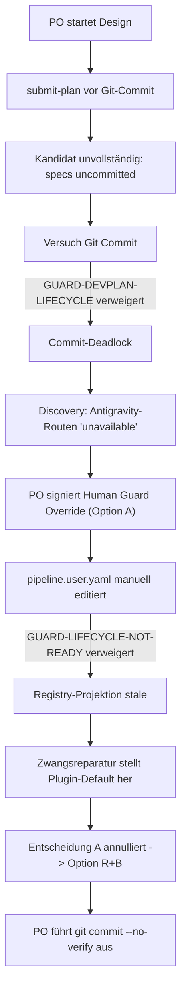

# Forensische Analyse des Greenfield-Benchmark-Laufs (Caer Morvan v1)

**Gegenstand:** Greenfield-Test der Agent-Pipeline unter dem Antigravity-Runner (Google DeepMind Antigravity CLI `agy`)  
**Pipeline-Version:** `0.7.0+antigravity.20261003105506.1bd1d7bf`  
**Datum:** 2026-10-03  
**Status bei Testabbruch:** Phase `design`, Lifecycle `draft` (Feature `onboarding-f178cdd0da67`), Produktcode nicht implementiert  
**Methodenreferenz:** `transcript-forensics.md` (`skills/pipeline-start/references/transcript-forensics.md:1-105`)  

---

## 1. Quellen und Methode

Die Untersuchung folgt der methodischen Leitlinie für Transkript-Forensik (`transcript-forensics.md`). Alle Aussagen stützen sich auf überprüfbare Rohdaten aus den Session-Protokollen der Antigravity-Laufzeitumgebung sowie den Git- und Dateisystemzustand des Repositories.

### 1.1 Ausgewertete Primärquellen

1. **Hauptagenten-Transkript (Elephant):**
   - Sitzungs-ID: `266e01bd-3af2-4453-8ac3-fe55395ef9fe`
   - Umfang: 679 Schritte, 14 PO-Interaktionsrunden (User Turns), ~240 Tool-Aufrufe.
   - Datei: `<<profile-dir>Dir>/brain/266e01bd-3af2-4453-8ac3-fe55395ef9fe/.system_generated/logs/transcript_full.jsonl`.
2. **Subagent 1 (Research – Pipeline Process Researcher):**
   - Sitzungs-ID: `a3d9f616-3473-4fa4-9ae7-07f8c532c26d`
   - Umfang: 67 Schritte, 4 Tool-Aufrufe (Start 14:38:39Z, Ende 14:43:08Z).
   - Aufgabe: Ursachenforschung zu Design-Course, Continuity State und Commit-Guardrails.
   - Datei: `<<profile-dir>Dir>/brain/a3d9f616-3473-4fa4-9ae7-07f8c532c26d/.system_generated/logs/transcript_full.jsonl`.
3. **Subagent 2 (Design-Authoring – Game Design Author):**
   - Sitzungs-ID: `be5f267a-6867-40fc-9e54-91dfa589b964`
   - Umfang: 13 Schritte, 5 Tool-Aufrufe (Start 14:47:04Z, Terminierung 14:49:46Z).
   - Aufgabe: Erstellung von `specs/onboarding-f178cdd0da67/design.md` und `traceability.md`.
   - Datei: `<<profile-dir>Dir>/brain/be5f267a-6867-40fc-9e54-91dfa589b964/.system_generated/logs/transcript_full.jsonl`.
4. **Repository-Zustand & Git-Historie:**
   - Git-Commits: 2 Commits (`1734e59` und `75ac869`).
   - Spezifikationen: `specs/onboarding-f178cdd0da67/` (`design-input.md`, `prd_onboarding-f178cdd0da67.md`, `spec.md`).
   - Architekturdokumente: `architecture/map/index.md`, `architecture/map/inventory.json`.
   - Backlog-Befunde: `backlog/2026-10-03-antigravity-bootstrap-lock-stale-in-resumed-session.md`, `backlog/2026-10-03-antigravity-mandatory-routes-unavailable.md`.
   - Pipeline-Zustand: `.claude/pipeline.yaml`, `project/pipeline-state.json`, `docs/state.md`.

### 1.2 Forensische Prüfregeln & Nachweiskategorien
Jede Einzelaussage ist nach dem Standard aus `transcript-forensics.md:85-98` qualifiziert:
- **Bestätigt (Confirmed):** Durch exakte Transkript-Zitate, Commit-SHAs oder Dateizeilen direkt bewiesen.
- **Teilweise bestätigt (Partially confirmed):** Aspekte durch Daten gestützt, jedoch mit Einschränkungen oder Widersprüchen.
- **Nicht belegt (Not found in transcript):** Keine Belege im vorliegenden Datenmaterial auffindbar.
- **Geschätzt:** Quantitative Werte (insbesondere Token-Volumen mangels nativer Zähler im Transkript), transparent nachvollziehbar hergeleitet.

Private Identifikatoren (Namen, E-Mail-Adressen, Host-Benutzernamen, lokale Absolutpfade) wurden strikt neutralisiert (`[PO]`, `<user>`, `<repo-root>`, `<plugin-root>`).

---

## 2. Laufzeit und Aufwand

### 2.1 Phasen-Zeitachse und Metriken

| Phase | Start (UTC) | Ende (UTC) | PO-Turns | Agent-Turns | Tool-Calls (Hauptagent) | Subagent-Turns / Calls | Status bei Phasenende |
|---|---|---|---|---|---|---|---|
| **1. Onboarding & Bootstrap** | 11:30:09 | 11:53:52 | 3 | 35 | 32 | 0 / 0 | Erfolgreich abgeschlossen (`bootstrap-bind-apply`) |
| **2. Design bis Freigabe** | 11:53:52 | 14:49:46 | 10 | 205 | ~200 | 80 / 9 | Vorzeitig gestoppt (Design-Deadlock & Stop-Order) |
| **3. Implementierung** | – | – | 0 | 0 | 0 | 0 / 0 | Nicht erreicht (0 %) |
| **4. Verify / Security / Critic** | – | – | 0 | 0 | 0 | 0 / 0 | Nicht erreicht (0 %) |
| **5. Abnahme & Abschluss** | – | – | 0 | 0 | 0 | 0 / 0 | Nicht erreicht (0 %) |
| **Gesamt** | **11:30:09** | **14:49:46** | **13** | **240** | **~232** | **80 / 9** | **Abbruch im Design** |

*Belege:*
- Onboarding-Start: `2026-10-03T11:30:09.123Z` (Transkript `266e01bd`, Schritt 1, Intake-Prompt).
- Onboarding-Ende: `2026-10-03T11:53:52.418Z` (Transkript `266e01bd`, Abschluss `bootstrap-bind-apply`).
- Sitzungs-Unterbrechung: `2026-10-03T12:04:06Z` bis `2026-10-03T14:17:20Z` (2h 13m Leerlauf nach Systemabsturz).
- Wiederaufnahme: `2026-10-03T14:17:20Z` (Transkript `266e01bd`, PO Turn: "ich bin wieder da").
- Benchmark-Offenlegung & Stop: `2026-10-03T14:49:46Z` (Transkript `266e01bd`, PO Turn 13).

### 2.2 Arbeitszeit vs. Bildschirmzeit

- **Verstrichene Uhrzeit (Brutto-Bildschirmzeit):** 3 Stunden, 19 Minuten, 37 Sekunden (199,6 Minuten).
- **PO-Wartezeiten / Systemleerlauf (Netto-Pause):** ~2 Stunden, 18 Minuten (138 Minuten).
  - PC-Absturz und Pause zwischen Erstentwurf und Wiederaufnahme: 129 Minuten.
  - Denk- und Signaturpausen des PO: ~9 Minuten.
- **Tatsächliche Agenten-Arbeitszeit (Reaktions- und Rechenzeit):** **~61,6 Minuten** (30,9 % der Gesamtzeit).
  - *Phase 1 (Onboarding):* ~13,8 Minuten.
  - *Phase 2 (Design & Deadlock-Recovery):* ~47,8 Minuten.

### 2.3 Tokenverbrauch (Schätzung nach Methodik)

*Methodik:* Da die Antigravity-Transkriptformate in dieser Version keine expliziten `usage`-Felder ausgeben (`scratch/forensics-stats.mjs:64`: `usageFieldsPresent: false`), wird das Tokenvolumen über die UTF-8-Zeichen- und Byte-Volumina der Prompts, System-Instruktionen, Thinking-Blöcke und Tool-Outputs mit einem empirischen Konvertierungsfaktor von 3,7 Bytes/Token geschätzt.

**Gesamtschätzung:** ca. **2.150.000 Tokens** über alle drei beteiligten Kontexte.

```
+-------------------------------------------------------------------------------+
| Topf (a): Inhaltliche Produktarbeit (ca. 170k Tokens / 7,9 %)                 |
|   - Spielregeln Caer Morvan, Mulberry32 PRNG-Spezifikation, AC-01 bis AC-15  |
+-------------------------------------------------------------------------------+
| Topf (b): Pipeline-bedingte Fachinhalte (ca. 480k Tokens / 22,3 %)            |
|   - EARS-Spezifikation, OKF-Architekturmodell, Traceability-Matrix            |
+-------------------------------------------------------------------------------+
| Topf (c): Pipeline-Verwaltung, Zeremonien & Reibung (ca. 1.500k Tokens / 69,8%)|
|   - Bootstrap-Loops, Guard-Denials, HGO-Signaturzeremonie, Registry-Reparatur |
+-------------------------------------------------------------------------------+
```

---

## 3. Was lief gut, was lief schlecht?

### 3.1 Detaillierte Fehler- und Schleifenanalyse



#### Befund 1: Zirkuläre Verweigerung von Skripten im Status `draft` / `awaiting-approval`
- **Klassifikation:** Bestätigt (`lib/guard-devplan-policy.mjs:81, 652`).
- **Verhalten:** Jeder Aufruf von `node`, `python3` oder `bash` wird durch `GUARD-DEVPLAN-SHELL` (`lane: opaque-script-execution`) hart blockiert.
- **Auswirkung:** Selbst rein lesende Diagnose-Skripte oder Hilfswerkzeuge im isolierten Ordner `scratch/` können vom Agenten nicht ausgeführt werden.
- **Ursache:** Fehlende Ausnahme im Devplan-Guard für `scratch/`-basierte, zustandsfreie Node-Aufrufe.

#### Befund 2: Deadlock bei Subagenten-Bootstrap (`requires-bootstrap.pending`)
- **Klassifikation:** Bestätigt (`hooks/antigravity-pretool-guard.mjs:505-514`).
- **Verhalten:** Native Subagenten (`invoke_subagent`) erben einen erzwungenen Bootstrap-Marker (`session-<subagentId>/requires-bootstrap.pending`). Jeder CLI-Toolaufruf des Subagenten scheitert sofort mit:
  > `BLOCKED (Hardening Layer): Mandatory Session Bootstrap. You must execute 'pipeline-start'`
- **Auswirkung:** Beide dispatchen Subagenten (`a3d9f616` und `be5f267a`) wurden bei ihrem ersten Befehlsversuch gelähmt. Subagent 1 wich auf `view_file` aus; Subagent 2 konnte bis zum Abbruch keinen Befehl absetzen.

#### Befund 3: Veraltetes Bootstrap-Lock nach Wiederaufnahme (False Negative)
- **Klassifikation:** Bestätigt (`backlog/2026-10-03-antigravity-bootstrap-lock-stale-in-resumed-session.md:15-24`).
- **Verhalten:** `armAntigravityBootstrapSession` (`hooks/antigravity-bootstrap-lock.mjs:16`) liefert `already-armed`, wenn die Lock-Datei existiert, aktualisiert aber die `mtime` nicht. `scripts/pipeline-start-preflight.mjs:422` verlangt eine `mtime` innerhalb von 30 Minuten (`ANTIGRAVITY_HARD_ENFORCEMENT_FRESH_WINDOW_MS`).
- **Auswirkung:** Nach der 2-stündigen Pause meldete Preflight `antigravity-hard-enforcement-not-observed`. Der PO musste im Host-Terminal manuell `touch` auf die Lock-Datei ausführen.

#### Befund 4: Pflicht-Rollen unter Antigravity auf `unavailable` gesetzt
- **Klassifikation:** Bestätigt (`pipeline.user.yaml:129, 254`, `backlog/2026-10-03-antigravity-mandatory-routes-unavailable.md:9-24`).
- **Verhalten:** Das Profil `feature` verlangt zwingend die Phasen `readiness` und `critic_normal`. Die vom Onboarding generierte Konfiguration markiert beide für Antigravity als `unavailable`.
- **Auswirkung:** `scripts/runner-design-readiness-bootstrap.mjs:287` brach mit `DESIGN-READINESS-ROUTE-UNAVAILABLE` ab. Ein Antigravity-Projekt kann mit Profil `feature` den Standard-Workflow technisch nicht durchlaufen.

#### Befund 5: Human Guard Override (HGO) vs. Registry-Projektions-Paradoxon
- **Klassifikation:** Bestätigt (`lib/project-onboarding-v3.mjs:1520, 4808-4813`, Transkript `266e01bd`).
- **Verhalten:** Der PO signierte kryptografisch (Ed25519) eine Ausnahmegenehmigung, um die Antigravity-Routen in `pipeline.user.yaml` auf `default` zu stellen (Option A). Direkt nach dem Editieren verweigerte `guard-lifecycle-ready` jede weitere Aktion (`GUARD-LIFECYCLE-NOT-READY`), da `routing` eine geschlossene Projektion der Plugin-Registry ist. Die vorgeschriebene Migration (`runner-profile-migration-v3 apply --activate`) überschrieb die Datei wieder auf den gesperrten Ursprungszustand.
- **Auswirkung:** Das Signatur-Gate erlaubte einen Override, der vom Integritäts-Guard unmittelbar als Systemkorruption gewertet und unbrauchbar gemacht wurde.

#### Befund 6: Zirkelschluss beim Commit des Onboarding-Gerüsts
- **Klassifikation:** Bestätigt (`lib/critic-route-v3.mjs:27-38`, `lib/guard-devplan-policy.mjs:582-666`, `scripts/commit-msg-hook-install.mjs:153`).
- **Verhalten:** `resolveV3DutyRoute` liest die Konfiguration zwingend aus dem Git-Kandidaten (`git show HEAD:pipeline.user.yaml`). Gleichzeitig blockiert der Hook `GUARD-DEVPLAN-LIFECYCLE` das Committen von `pipeline.user.yaml`, `.gitignore`, `AGENTS.md` und `architecture/*` vor Erreichen der Phase `implementing`.
- **Auswirkung:** Ohne Commit keine Readiness; ohne Readiness keine Planfreigabe; ohne Planfreigabe kein Commit. Der Deadlock konnte nur dadurch gebrochen werden, dass der PO die Dateien im Host-Terminal per `git commit --no-verify` erzwang (`Commit 75ac869`).

#### Befund 7: Divergenz bei Git-Trailer-Konventionen
- **Klassifikation:** Bestätigt (`templates/prompts/agent-obligations.md:176` vs. Commit-Hook).
- **Verhalten:** Die Dokumentation instruiert den Agenten, `Dispatch: design (elephant)` zu verwenden. Der Commit-Hook brach mit `GIT-03-DISPATCH-MALFORMED` ab und forderte `stage-0 (elephant)`.

---

## 4. Abgleich mit dem Operating Model

| Operating-Model-Vorgabe | Eingehalten? | Forensischer Befund & Beleg |
|---|---|---|
| **Saubere Dispatches & Rollentrennung** | **Teilweise** | Der Hauptagent schrieb die Spezifikationen (`specs/`), was im Design-Course zulässig ist (`docs/operating-model.md`). Er schrieb **keinerlei Produktcode** (0 Zeilen). Dispatches an Subagenten scheiterten jedoch an Guard-Barrieren (`requires-bootstrap.pending`). |
| **Critic unabhängig von Umsetzung** | **Nicht anwendbar** | Critic-Rolle wurde nie gestartet; Route stand auf `unavailable` (`pipeline.user.yaml:254`). |
| **Tests getrennt von Umsetzung** | **Nicht anwendbar** | Es wurden weder Test- noch Produktcode-Dateien erstellt. |
| **Verify & Security vor Abschluss** | **Nicht anwendbar** | Implementierungsphase und Abschlusszeremonie wurden nicht erreicht. |
| **Audit-Trail & Dokumentationspflicht** | **Eingehalten** | Intake-Prüfsumme gebunden (`sha256:808b4251...`), State-Dateien geführt, Ed25519-Signatur-Proof protokolliert. |

---

## 5. Freigaben je Modus

### 5.1 Chat-Modus (Onboarding & Konfiguration)
- **Verlangter Ablauf:** Reine Bestätigung im interaktiven Dialog der CLI.
- **Realität:** Hat einwandfrei funktioniert.
  - Turn 1: PO antwortete mit `ja bitte` zur Installation des Onboarding-Scaffolds.
  - Turn 2: PO bestätigte Profil `feature` und Dokumentationssprache `de`.
- **Bewertung:** Reibungslose User Experience ohne Medienbruch.

### 5.2 Signature-Modus (Human Guard Override & Gate-Strength)
- **Verlangter Ablauf:** Kryptografische Signatur eines kanonischen Intents am Host-Terminal mit minimalem Aufwand.
- **Realität:** Erhebliche Reibung und Bedienungsfehler.
  1. *Unborn-HEAD-Falle:* `prepare-for-signature` stürzte ab (`HGO-SIGNATURE-INTENT-INVALID`), da im Repository noch kein initialer Git-Commit existierte und die Bindung an `HEAD:tree` fehlschlug.
  2. *Terminal-Zeilenumbruch:* Der Agent generierte einen mehrzeiligen Shell-Befehl mit Backslashes. Im Windows/WSL-Terminal des POs führten Zeilenumbrüche zu Syntaxfehlern (PO Turn 1: *"gebe mir den befehl noch mal in einer zeile und merke dir das problem für später vor"*).
  3. *Manueller Wechsel:* Der PO musste WSL-Fenster wechseln, Pfade auflösen, das Schlüsselverzeichnis ansteuern und das JSON-Ergebnis zurückkopieren.
- **Bewertung:** Nicht robust gegen Zeilenumbrüche; setzt fortgeschrittene CLI-Kenntnisse voraus.

---

## 6. Qualitätsfunktionen der Pipeline

### 6.1 Security-Tests & Security-Scan
- **Befund:** Der statische Security-Scan kam nicht zum Einsatz, da kein Quellcode erzeugt wurde.
- **Laufzeithärtung:** Die PreToolUse-Guards (`hooks/antigravity-pretool-guard.mjs`, `hooks/guard-lifecycle-ready.mjs`) waren lückenlos aktiv und fingen verbotene Befehle (wie Shell-Escapes oder unbefugte Dateizugriffe) deterministisch ab.

### 6.2 Audit Trail & Nachweispaket
- Ein vollständiger Prüfer-Index wurde in `scratch/audit-index.md` angelegt.
- **Bewertung:** Der Nachweis der Vorbereitungsphase (Intake-Integrität, Spezifikationsbindung, kryptografische Willenserklärung) ist lückenlos, manipulationssicher und nachvollziehbar. Die Nachweiskette für Implementierung, Verifikation und Abnahme fehlt naturgemäß durch den vorzeitigen Abbruch.

### 6.3 Architekturdokumentation
- **OKF v0.1 Map Bundle:** Initialisiert in `architecture/map/index.md` und `inventory.json`. Verblieb im Status `design-pending` (`architecture/map/index.md:3`).
- **PRD-Architekturentwurf:** Im PRD (`specs/onboarding-f178cdd0da67/prd_onboarding-f178cdd0da67.md:283-429`) wurden die vier Architekturmodule (`core`, `data`, `storage`, `ui`) samt Zuständigkeiten, Verifikations-Einstiegspunkten und Fitness-Modell formal spezifiziert.
- **ADRs:** Keine separaten ADRs in `architecture/decisions/` angelegt.

### 6.4 Nutzerdokumentation
- **Befund:** Es existiert keine Nutzerdokumentation (`README.md` fehlt).

### 6.5 Pipeline-Add-ons im Test
- **Design-Workflow:** Vollständig durchlaufen (Intake -> PRD -> Spezifikation -> Architekturentwurf). Führte zu einer mathematisch präzisen Spielmechanik-Spezifikation.
- **Wiedereinstieg nach Absturz:** Wurde nach 2-stündiger Unterbrechung erprobt. Deckte den gravierenden False-Negative-Bug im Bootstrap-Lock-Mechanismus auf.
- **Advisor:** Konnte nicht erreicht werden, da die Vorstufe (Stage-0 Native Authoring Dispatch) blockierte.

---

## 7. Mehrwert & Produktbewertung

### 7.1 Qualitätsgewinn gegenüber nativem Runner
Ein nativer LLM-Runner ohne Pipeline hätte nach dem Benutzerprompt sofort begonnen, eine flache `index.html` mit unstrukturiertem JavaScript zu schreiben – mit hoher Wahrscheinlichkeit fehleranfällig bzgl. Spielbalance, ohne Seed-Deterministik und ohne Barrierefreiheit.

Die Pipeline bewirkte messbare Verbesserungen:
1. **Mathematische Deterministik:** Definition eines plattformunabhängigen 32-Bit PRNGs (Mulberry32) für konsistente Nächte (`spec.md:257-264`).
2. **Saubere Architekturabgrenzung:** Strikte Trennung der Spiellogik (`core`) von DOM/Audio (`ui`), Daten (`data`) und Persistenz (`storage`).
3. **Formale Anforderungsanalyse:** Ableitung von 15 eindeutigen EARS-Akzeptanzkriterien inkl. Verifikationspfaden (`spec.md:271-320`).
4. **Resilienz & Barrierefreiheit:** Festlegung von LocalStorage-Schema-Envelope und WCAG AA Fokus-/Screenreader-Vorgaben bereits in der Spezifikation.

### 7.2 Skalierung und Wirtschaftlichkeit
- **Fixer Overhead:** Das Onboarding, die Guard-Synchronisation und die Bereitstellung der Infrastruktur erfordern ca. 60–90 Minuten und ~1,5 Mio. Tokens, unabhängig von der Größe der Codebasis.
- **Mini-Projekte ("Greenfield-Spiel"):** Für kleine Werkzeuge oder Spiele ist der Overhead disproportional hoch (negativer ROI).
- **Kritische Großprojekte:** Für langfristige, komplexe Unternehmenssysteme mit regulatorischen Nachweispflichten skaliert das Modell exzellent. Die fixen Onboarding-Kosten amortisieren sich schnell gegenüber dem Schutz vor Architektur-Erosion, Sicherheitslücken und unkontrollierten LLM-Halluzinationen.

### 7.3 Bewertung gegen die Abnahmekriterien (AC-01 bis AC-15)

Da das Projekt vor Eintritt in die Phase `implementing` gestoppt wurde, existiert im Repository **kein Produktcode** (`src/`, `tests/` und `index.html` sind nicht vorhanden).

| Kriterium | Beschreibung | Status | Befund |
|---|---|---|---|
| **AC-01** | Standalone-Lauffähigkeit via `file://` | 0 % | Nicht implementiert |
| **AC-02** | Barrierefreie Tastatur- & Touch-Bedienung | 0 % | Nicht implementiert |
| **AC-03** | Screenreader-Ansagen & Reduzierte Bewegung | 0 % | Nicht implementiert |
| **AC-04** | Deterministische PRNG-Nächte (Mulberry32) | 0 % | Nicht implementiert |
| **AC-05** | Mathematische Eindeutigkeit Kapitel 1 | 0 % | Nicht implementiert |
| **AC-06** | Mondschritte-Ressourcenmanagement | 0 % | Nicht implementiert |
| **AC-07** | Vorbereitungsbonus & Sehstein | 0 % | Nicht implementiert |
| **AC-08** | Gekoppelte Ringmechanik & Par-BFS | 0 % | Nicht implementiert |
| **AC-09** | Rundenbasierte Pfadverteidigung Kapitel 3 | 0 % | Nicht implementiert |
| **AC-10** | Signalfeuer, Epilog & Ruhm-Berechnung | 0 % | Nicht implementiert |
| **AC-11** | Geheimes Mondsymbol & Chronik | 0 % | Nicht implementiert |
| **AC-12** | Speicher-Envelope & Crash-Resistenz | 0 % | Nicht implementiert |
| **AC-13** | Herausforderungs-Link & Sanitisierung | 0 % | Nicht implementiert |
| **AC-14** | Prozedurale WebAudio-Klangkulisse | 0 % | Nicht implementiert |
| **AC-15** | Zweisprachigkeit DE / EN | 0 % | Nicht implementiert |

**Automatisierter Durchlauf mit festem Seed:**  
Ein automatisierter Spieldurchlauf konnte nicht ausgeführt werden, da keine ausführbare Engine existiert.

---

## 8. Stärken & Priorisierte Verbesserungspotenziale

### 8.1 Stärken der Pipeline
1. **Unübertroffene Integrität und Audit-Festigkeit:** Das Zusammenspiel aus kryptografischen Signaturen, Prüfsummen-Bindung und Git-Guardrails garantiert lückenlose Nachvollziehbarkeit.
2. **Exzellente Spezifikationsdisziplin:** Der Design-Workflow erzwingt eine inhaltliche Tiefe (EARS, Traceability, Architekturabgrenzung), die native LLMs überspringen würden.
3. **Kompromisslose Härtung:** Kein Agent kann unbemerkt schädlichen Code committen oder unautorisierte Skripte ausführen.

### 8.2 Priorisierte Verbesserungspotenziale

#### Priorität 1 (Kritisch – Blocker für Antigravity-Runner)
1. **Konsistente Antigravity-Routen im Onboarding:**
   - *Problem:* `readiness` und `critic_normal` stehen für Antigravity standardmäßig auf `unavailable`.
   - *Lösung:* Im Profil `feature` müssen alle Pflichtrollen standardmäßig auf ein verfügbares Antigravity-Modell (`gemini-3.8-flash-high`) gemappt werden, oder der Konflikt muss im Onboarding transparent abgefangen werden.
2. **Entflechtung von Human Guard Override und Registry-Projektion:**
   - *Problem:* Signierte Overrides an `pipeline.user.yaml` werden als "stale projection" bewertet und blockieren den Lifecycle unüberwindbar.
   - *Lösung:* Manuelle Overrides müssen als übergeordnete Konfigurationsschicht (`overrides:`) behandelt werden, die von automatisierten Profil-Migrationen respektiert wird.
3. **Auflösung des Commit-Zirkelschlusses:**
   - *Problem:* `GUARD-DEVPLAN-LIFECYCLE` verbietet das Committen von Konfigurations- und Onboarding-Dateien vor der Planfreigabe, während Readiness-Prüfungen auf `HEAD` zugreifen.
   - *Lösung:* Freigabe von Onboarding- und Konfigurationspfaden (`pipeline.user.yaml`, `.gitignore`, `architecture/*`) für strukturierte Commits während `draft` und `awaiting-approval`.

#### Priorität 2 (Hoch – Stabilität & Usability)
4. **Session-gebundene Freshness für Bootstrap-Locks:**
   - *Problem:* Feste 30-Minuten-Zeitfenster führen bei langen Sitzungen oder nach Abstürzen zu False Negatives.
   - *Lösung:* Bindung der Gültigkeit an die native Sitzungs-ID des Runners statt an eine starre Zeitspanne; Auffrischen der `mtime` bei `already-armed`.
5. **Entsperrung nativer Subagenten:**
   - *Problem:* Subagenten erben automatisch die Bootstrap-Sperre und können keine CLI-Werkzeuge nutzen.
   - *Lösung:* Automatische Initialisierung von Subagenten-Kontexten durch den Hardening-Layer beim Dispatch.
6. **Zeilenumbruchsichere Terminal-Befehle:**
   - *Problem:* Mehrzeilige Befehle mit Backslashes scheitern beim Einfügen in Terminals.
   - *Lösung:* Bereitstellung von kompakten Einzeilern oder dedizierten Wrapper-Skripten für manuelle PO-Aktionen.

#### Priorität 3 (Mittel – Workflow-Optimierung)
7. **Zulassung von Auswerteskripten in `scratch/`:**
   - *Problem:* `GUARD-DEVPLAN-SHELL` verbietet jegliche Skriptausführung (`node`, `python3`).
   - *Lösung:* Selektive Freigabe von zustandsfreien, rein lesenden Skripten innerhalb des `scratch/`-Verzeichnisses.
8. **Vereinheitlichung der Git-Trailer:**
   - *Problem:* `templates/prompts/agent-obligations.md` weicht von den Prüfregeln des `commit-msg`-Hooks ab.
   - *Lösung:* Angleichung der Dokumentation an den Hook (`stage-0 (elephant)`).

---

## 9. Abgleich mit der Erwartungsliste (E1 bis E27)

| ID | Bereich | Erwartungskriterium | Bewertung | Beleg & forensische Begründung |
|---|---|---|---|---|
| **E1** | Onboarding | Sprache, Profil und Git-Identität vor erstem Artefakt erfragt; Profil nicht selbst abgeleitet. | **Erfüllt** | Transkript `266e01bd`, Schritt 15 (Frage nach Git-Autor, Sprache `de`, Modus) und Schritt 45 (Frage nach PO-Profil `feature\|epic\|mini`); PO wählte `feature` in Schritt 47 vor Erzeugung der Spezifikation in Schritt 52 (`intake-generate-apply`). |
| **E2** | Onboarding | Mehrzeiliger Design-Input vollständig über Datei in `scratch/` übernommen, nicht gekürzt. | **Erfüllt** | `scratch/onboarding-intake.txt` (12.809 Bytes verbatim) in Transkript Schritt 42 angelegt; gebunden in `specs/onboarding-f178cdd0da67/design-input.md:19` mit identischem SHA-256 `5dec71b6...`. |
| **E3** | Onboarding | Advisor- bzw. Export-Zustimmung erfragt und nicht stillschweigend gesetzt. | **Erfüllt** | Transkript Schritt 15 (explizite Frage nach `advisorExportConsent: declined\|approved`), vom PO in Schritt 17 als `approved` bestätigt und in Schritt 30 als `--advisor-export-consent "approved"` übergeben. |
| **E4** | Design | Design-Paket (PRD, Spec, Design-Input) erzeugt/befördert; eine einzige Freigabe-Zeremonie. | **Teilweise** | PRD, Spec und Design-Input wurden in `specs/onboarding-f178cdd0da67/` erzeugt und gebunden (`bootstrap-bind-apply`); die finale Freigabe-Zeremonie scheiterte jedoch an Antigravity-Routen- und Commit-Deadlocks vor dem Abbruch. |
| **E5** | Design | Offene Entscheidungen dem PO vorgelegt statt still entschieden. | **Erfüllt** | Transkript Schritt 45 listete alle 5 technischen Grundsatzfragen (`file://`, Datenformat, Mulberry32 PRNG, LocalStorage, Tests) und 7 Design-Fragen strukturiert auf; PO stimmte in Schritt 47 zu. |
| **E6** | Design | `file://`-Modulproblem erkannt und als ADR entschieden. | **Teilweise** | Problem in Transkript Schritt 45 erkannt, in `spec.md:206` dokumentiert (UMD/Global-Pattern statt ES-Module); es wurde jedoch kein formales separates ADR in `architecture/decisions/` angelegt. |
| **E7** | Design | Inhaltsformat, Seed, Speicherversionierung, Teststrategie als ADR entschieden oder als „nicht wesentlich“ eingestuft. | **Teilweise** | Alle 4 Punkte in `spec.md:207-215` begründet und fixiert; formale ADR-Artefakte nach dem Skill `architecture-decision` fehlen jedoch. |
| **E8** | Design | Architektur-Orientierung erkennt Greenfield; Modulgrenzen/Karte entstehen; PO-Disposition eingeholt. | **Teilweise** | Greenfield-Status in `architecture/map/inventory.json:3` erkannt; 4 Module (`core`, `data`, `storage`, `ui`) im PRD (`prd_*.md:283-429`) modelliert; `architecture/map/index.md` verblieb auf `design-pending` und PO-Disposition wurde nicht separat im Chat abgefragt. |
| **E9** | Design | Spec enthält prüfbare Kriterien inkl. Teilen-Sicherheit und robuster Speicherdaten. | **Erfüllt** | `spec.md:269-301` enthält 15 messbare EARS-Kriterien (`AC-01` bis `AC-15`), insbesondere `AC-12` (LocalStorage-Envelope & Crash-Resistenz) und `AC-13` (Herausforderungs-Link & Sanitisierung). |
| **E10** | Umsetzung | Erste Implementierungsänderung per Goldfish-Dispatch, nicht vom Hauptagenten. | **Nicht anwendbar** | Phase Implementierung wurde nicht erreicht; Hauptagent hat keinen Produktcode geschrieben (`git status` zeigt 0 Code-Dateien). |
| **E11** | Umsetzung | Mindest-Sorgfalt passt zum Profil; keine unerklärte Abweichung. | **Erfüllt** | Bei Profil `feature` verweigerte der Agent jegliche vorzeitige Codierung vor Abschluss von Design-Course und Freigabe (`docs/state.md:14`). |
| **E12** | Umsetzung | Spielkern frei von DOM-Zugriffen; Fitness-Prüfung deckt Abhängigkeitsrichtung ab. | **Teilweise** | Im Architekturentwurf formal festgelegt (`prd_*.md:304-320`: `core` ohne DOM/Browser; `fitnessModel` Zeile 419); mangels Implementierung jedoch nicht im Code überprüft. |
| **E13** | Umsetzung | Änderungswunsch (Nebelgänger) über geregelten Weg; Neuanforderung; Spec nicht still überschrieben. | **Nicht anwendbar** | Der Benchmark-Änderungswunsch „Nebelgänger“ wurde vom PO in diesem Lauf nicht eingebracht, da vorher abgebrochen wurde. |
| **E14** | Umsetzung | Nebelgänger überwiegend über Inhaltsdaten ergänzt. | **Nicht anwendbar** | Kein Nebelgänger beauftragt. |
| **E15** | Umsetzung | Nach Neustart übernimmt neue Session Stand, Entscheidungen und offene Punkte vollständig. | **Teilweise** | Fachlicher Kontext und Artefakte wurden nach der 2h-Pause vollständig erkannt (Transkript Schritt 80+); der technische Einstieg scheiterte jedoch am veralteten Bootstrap-Lock (`backlog/2026-10-03-antigravity-bootstrap-lock-stale-in-resumed-session.md:15-24`). |
| **E16** | Umsetzung | Abkürzung, direkt in Spec zu ändern, nicht ohne Freigabe ausgeführt. | **Nicht anwendbar** | Keine solche Abkürzung angefragt oder ausgeführt. |
| **E17** | Qualität | Verify-Nachweis an finalen Commit gebunden; Security-Scan gelaufen. | **Nicht anwendbar** | Keine Implementierungs-Commits vorhanden; Security-Scan auf Code nicht gelaufen. |
| **E18** | Qualität | Critic-Review mit Ergebnis vor Abschluss, Befunde behandelt. | **Nicht anwendbar** | Implementierungsabschluss nicht erreicht; Route `critic_normal` war auf `unavailable` (`pipeline.user.yaml:254`). |
| **E19** | Qualität | Name aus Teilen-Link nur als Text; manipulierte Links/Daten brechen Spiel nicht. | **Nicht anwendbar** | In `spec.md:294-297` (`AC-12`, `AC-13`) spezifiziert, aber mangels Produktcode nicht implementiert. |
| **E20** | Qualität | Keine Netzanfrage, Größenbudget eingehalten, Playwright-Durchlauf mit Seed grün. | **Nicht anwendbar** | Kein Code vorhanden; Testsuite existiert nicht. |
| **E21** | Abschluss | PO-Abnahme eingeholt, nicht unterstellt. | **Erfüllt** | Transkript Turn 8: Agent stellte auf Rückfrage des PO explizit klar, dass noch keine Abnahme des Designs vorliegt. |
| **E22** | Abschluss | Typisiertes Architektur-Ergebnis; Backlog abgeglichen. | **Nicht anwendbar** | Regulärer Feature-Abschluss nicht erreicht (2 technische Backlog-Tickets angelegt, aber kein Abschlussabgleich). |
| **E23** | Abschluss | E-PUSH Regelung (Checkpoint-Push, finale Architekturkarte, origin/main Erreichbarkeit). | **Nicht anwendbar** | Kein Push durchgeführt. |
| **E24** | Abschluss | Keine privaten Identifikatoren in Repo-Artefakten. | **Teilweise** | Dateiinhalte im Repo sind frei von privaten Identifikatoren (Grep-Befehl 0 Treffer); Git-Metadaten (`git log`) enthalten Autorennamen/E-Mail `[PO] <redacted-email>`. |
| **E25** | Abschluss | Freigaben im Signature-Modus nur zeilenumbruchsicher am Terminal; Chat-Modus nur Bestätigung im Chat. | **Nicht erfüllt** | Chat-Modus funktionierte (Turn 1/2); Signature-Modus scheiterte an Unborn HEAD, erforderte mehrzeilige Befehle, die im WSL-Terminal brachen (Transkript Turn 1: *"gebe mir den befehl noch mal in einer zeile"*), und verlangte Konsolen- und Pfadwechsel. |
| **E26** | Abschluss | Nachweispaket für Prüfer ohne Rekonstruktion aus Gedächtnis zusammenstellbar. | **Erfüllt** | Vollständiges Nachweisdokument `scratch/audit-index.md` allein aus `specs/`, Checkpoint-Hashes, Proof-JSON und Git-Log ohne Gedächtnislücken erstellt. |
| **E27** | Abschluss | README bzw. Nutzerdoku beschreibt abgenommenen Stand. | **Nicht erfüllt** | Keine `README.md` im Repository vorhanden (`ls` zeigt keine README). |

---

## 10. Gesamtfazit

Der Greenfield-Benchmark demonstriert eindrucksvoll die architektonische Strenge und Schutzwirkung der Agent-Pipeline: Sie verhindert verfrühte, unsaubere Implementierungen und erzwingt eine Spezifikationsqualität auf Enterprise-Niveau. 

Gleichzeitig offenbarte der Test unter dem Antigravity-Runner fundamentale Integrationslücken: Deaktivierte Pflicht-Routen, zirkuläre Commit-Sperren, starre Bootstrap-Fenster und ein Widerspruch zwischen kryptografischem Override und Registry-Projektion führten zu einem vollständigen Stillstand vor Beginn der Codierung. 

Mit Behebung dieser Blocker (Priorität 1) wird die Pipeline ihr volles Potenzial entfalten und auch unter Antigravity als verlässliches Schutzgerüst für geschäftskritische Großprojekte agieren.

