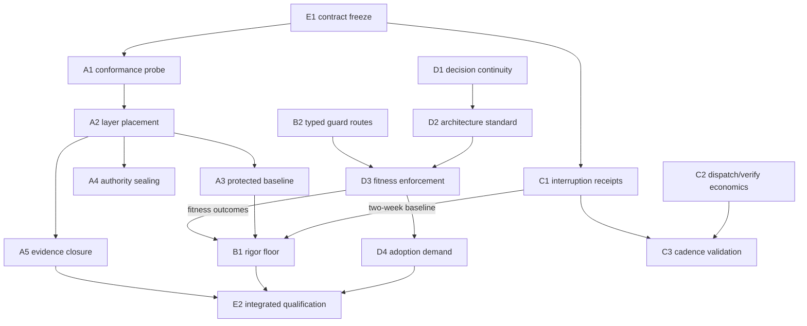

# Sprint Alfred Epic — Product Requirements

<!-- po-language: en -->
<!-- technical-spec-sha256: 301d04ee27007f8fb2e1b49b0242e1adfc82c7630bb96a393e532c3f3cb95953 -->

**Feature ID:** `sprint-alfred-epic`
**Profile / rigor / risk:** Epic / 2 / high (guard, canon, and authority
surfaces throughout)
**Gate:** PRD/Spec accepted by the PO; implementation begins only after the
sanctioned State submission/approval, the phase transition, and the Nova
rebase precondition below.
**Current design base:** `feat/sprint-alfred` at `a50c8093` (clone of the Nova
line); epic opened by PO-released `discard-feature` + `set-feature`
(2026-08-27, commit `0d0031ea`).
**Implementation base (gated):** the `origin/main` state after Sprint Nova
lands there; this branch is rebased onto it before the first implementation
dispatch. Push target: `origin/sprint_alfred`.
**Scope authority:** ADR-0043 amendment 2026-08-17 — *"Agent-first
architecture, mechanical governance, measurable rigor, and control
integrity"*; membership fixed by GitHub #108.
**Normative architecture basis:**
[`design/agent-first-architecture.md`](design/agent-first-architecture.md) is
the binding doctrine of this epic, not a background reference. Every work
package in every track is designed, implemented, and reviewed against it; its
nine property classes (§2), knowledge estate (§3), enforcement invariant
(§4), and user-facing surfaces (§5) are the standard this PRD's acceptance
requirements resolve to. A deviation is permitted only as a recorded decision
(decision register / ADR), never as silent drift — and the doctrine's own
anti-goals (§7) bound what conformance may demand.

Design inputs, analysis, and research: [`design/po-input-2026-08-27.md`](design/po-input-2026-08-27.md),
[`design/po-input-2026-08-28.md`](design/po-input-2026-08-28.md) (gate-1
rework directive), [`design/issue-intake.md`](design/issue-intake.md),
[`design/backlog-intake.md`](design/backlog-intake.md),
[`design/external-research.md`](design/external-research.md),
[`design/gap-analysis-2026-08-28.md`](design/gap-analysis-2026-08-28.md)
(per-issue audit behind the rework).

---

## 1. Problem

### 1.1 The primary problem: architecture is the one thing no agent inherits

Every governed project gets a process the Pipeline enforces. None of them get
an *architecture* the Pipeline enforces. Module boundaries, contracts,
dependency direction, where side effects may live, what a fresh session must
read before it may plan — all of that is improvised per session today, and
four consequences follow, each of them measured behavior rather than
suspicion:

1. **Fresh sessions plan blind.** An agent entering an existing repository
   has no declared entry point, no contract surface, no owned-path map. It
   reads what search happens to surface and bolts its change onto the first
   plausible seam. The next session repeats the search from zero and may pick
   a different seam.
2. **Structure silently inherits human team shape.** Greenfield projects get
   layouts optimized for human ownership and human code review — layering by
   technical kind, boundaries drawn around teams — none of which serve an
   agent that reads by contract and works in a bounded context window. The
   optimization target was never stated, so the wrong one is inherited by
   default.
3. **Decisions die with the session that made them.** An architectural choice
   argued for twenty minutes lives in a transcript. The next session cannot
   see it, so it re-decides — differently — and neither run can tell that the
   other happened. Knowledge that should be durable is stored in the most
   volatile place the system has.
4. **"Good architecture" is prose, and prose is not a control.** Instructions
   in a role file or briefing are advisory context an agent may follow,
   reinterpret, or quietly drop under budget pressure. The industry's
   spec-driven tooling has the identical gap (research §3): plenty of
   generation, no conformance.

The answer this epic owes is therefore not "more governance". It is a
**standard** (which properties an agent-first architecture must have, and
why), an **enforcement layer** (how conformance is mechanically evaluated
rather than asserted), a **knowledge estate** (documentation written for the
machine, so agents find things again instead of thinking one session at a
time), and a **user-facing representation** (how the architecture is shown to
the human who owns it). Those four are answered in
[`design/agent-first-architecture.md`](design/agent-first-architecture.md) and
carried into Track D; §2 states them as outcomes.

### 1.2 The substructure problem: the enforcement layer itself is unmeasured

A standard is only worth what its enforcement is worth — so the second half
of this epic is the substrate the first half stands on. That substrate was
falsified by live measurement in this repository on 2026-08-27, three times
over.

The Pipeline's governance claim is that agent work is *mechanically* bounded:
guards refuse what the rules forbid, evidence is digest-bound, and a later
session can trust the record instead of re-deriving it. On 2026-08-27, live
measurement in this repository falsified three load-bearing parts of that
claim at once:

1. **The enforcement layer is inert exactly where the work happens.** Plugin
   `PreToolUse` guards fire for the orchestrating session and — measured four
   independent ways on Claude Code — never inside a dispatched subagent. Every
   deterministic guard this repo relies on is registered as exactly such a
   hook. Dispatched work is currently governed by briefing prose, obeyed
   voluntarily. A second, runner-independent hole compounds it: any guard
   classifying tool-call parameter text is blind to payloads staged into a
   file and executed indirectly.
2. **Evidence integrity is checked inconsistently.** A closed feature's
   Result was amended ten hours after its close; the drifted binding stayed
   invisible for four weeks (the active-feature classifier branch never
   checks closed bindings), then surfaced as an unrepairable
   `continuity-damaged` state at the worst moment. Separately, a greenfield
   project reached approved implementation with its authority bound to a
   generated staging draft whose own banner says it must not be bound — and
   every downstream gate agreed with the wrong binding, correctly.
3. **The lifecycle is not closed under its own observers.** A sanctioned
   state transition (`discard-feature`) wrote a state one readiness observer
   rejects, stranding the session behind a guard that then blocked the exit
   command.

These three findings are why the architecture standard cannot simply be
written down and declared enforced: the layer that would enforce it does not
provably execute where the work happens, and the evidence it would produce is
checked inconsistently. Tracks A/B/C exist so that Track D's promises can be
true — they are the substructure, not a second, parallel mandate.

The common root across both halves: **rules that live as prose or as
orchestrator-session hooks, and measurements that do not exist.** Alfred's
mandate is to close it — for architecture first, and for the enforcement
substrate that makes architectural conformance more than a claim.

## 2. Outcome

One integrated delivery (#108). The architecture capability is the outcome;
the other three tracks are what make it enforceable rather than declared.

**Agent-first architecture (the catch).** Governed projects inherit a
versioned, machine-readable architecture standard by default, and the four
questions it must answer are answered concretely — doctrine sections in
brackets:

- *Which best practices, and what are the right approaches?* Nine declared
  property classes form the standard: context locality, contract sufficiency,
  change locality, dependency legibility, authority and effect locality,
  verification locality, re-entry stability, parallel safety, and
  refactorability without churn. They are agent-first properties, derived
  from what an agent needs to work correctly in a bounded context, not
  restatements of human-team layering conventions [doctrine §2].
- *How is that assured in the enforcement layer?* One invariant: a claim is
  green only when a deterministic check produced it. Ten property classes are
  mechanically evaluated by the same evaluator at planning, dispatch,
  pre-close, push, and CI; unknown, unavailable, and model-judged outcomes
  can never become `pass` — a model-judged evaluator may propose findings and
  never produce a pass — and blocking behavior is reached through a recorded
  report-only → ratchet → blocking promotion, never assumed [doctrine §4].
- *How is documentation done for the machine, so agents find things again
  instead of thinking one session at a time?* A knowledge estate with a
  declared re-entry reading order and enforced freshness: AGENTS.md as the
  human/agent entry point, an OKF-pinned navigation map, per-concept files
  carrying the contract-sufficiency fields, a module inventory, compiled
  decisions, the ADR estate, and the fitness model. A map that has gone stale
  against touched contracts fails closed rather than misleading the next
  session [doctrine §3].
- *How is architecture presented user-facing?* The map is the primary
  artifact and human views are derived from it — never maintained in
  parallel; the PO gets decision surfaces (adoption proposal, waivers,
  decision inspection) and an active optimization loop that proposes
  conformant remedies instead of only reporting violations [doctrine §5].

Architecture decisions become durable across sessions (significance rubric,
decision skill, inherited org/team decisions, typed architecture impact at
every close), conformance is evaluated with baseline-and-ratchet adoption for
existing repositories, and a repository without a baseline gets exactly one
typed, durable PO adoption decision — with this repository as the first
brownfield case, including the migration of the decision estate itself.

**What makes it true (the substructure).**

- **Control integrity:** protected control surfaces, approved design
  authority, and closed lifecycle evidence cannot be silently weakened by an
  agent through any supported mutation route — enforced through layers that
  provably execute for the acting process, with the enforcement assumptions
  themselves continuously measured, not assumed. Without this, an
  architecture gate is a gate an agent can walk around.
- **Mechanical governance:** the rigor a change owes is derived
  deterministically from its surface and evidence — the acting agent can
  propose but never lower it; guard refusals of legitimate briefed work get
  typed, human-decidable routes instead of dead ends; rules that exist only
  in prose get homes that machines check.
- **Measurable rigor:** planned gates and unplanned interruptions are
  separately measured with recovery cost; dispatch and Verify economics are
  measured before they are optimized; every mechanical claim this sprint
  makes ships with the check that would catch its violation — the
  architecture thresholds included, which is why the calibration evidence
  gates the promotion.

The human/PO remains root authority everywhere: custom profiles, overrides,
exceptions, and adoption decisions are PO acts an agent can propose,
evidence, but never perform, broaden, or infer.

## 3. Users and success measures

**Users:** the PO operating this and future governed repositories; Elephant/
Goldfish/Critic sessions on any supported runner; hosted projects
(greenfield and brownfield) consuming the Pipeline.

**Success is measured, not asserted:**

- S1. The enforcement-conformance record (A1) exists per runner and is green
  in Verify; every control names the layer that enforces it for dispatched
  work, and that layer's execution is probed, not presumed.
- S2. Zero paths by which an agent can (a) weaken a protected surface, (b)
  mutate approved PRD/Spec bytes during implementation, or (c) mutate
  closed-evidence bytes — demonstrated by fixtures per supported mutation
  route, including the payload-indirection route where the enforcing layer
  covers it, and honest typed debt where it cannot.
- S3. Every sanctioned `pipeline-state.mjs` verb's output state is accepted
  by every readiness observer (writer/observer conformance suite green).
- S4. Two weeks of interruption receipts (C1) exist before any
  threshold-dependent policy lands; the receipts distinguish planned gates
  from interruptions and record blocked wall time.
- S5. A greenfield project resolves to the inherited agent-first profile and
  produces a machine-readable architecture disposition before implementation
  authority; this repository completes the brownfield adoption flow end to
  end with a recorded PO decision.
- S6. The rigor floor derivation is deterministic (same normalized inputs →
  same floor), report-only first, and demonstrably not lowerable by prompt,
  prose, route choice, or self-attested compliance.
- S7. Each member issue closes with candidate- and evidence-bound closing
  comments; the sprint close records the exact merged commit and remaining
  debt.
- S8. **Re-entry works from declared artifacts, not from search.** A fresh
  session reaching a governed area obtains sufficient context by following
  the declared reading order (doctrine §3), measured by the C1 receipt class
  for reads outside the declared surface; the acceptable rate is *calibrated*
  from the dogfood window rather than asserted up front, per the #103 rule
  that no threshold is set from a short baseline.
- S9. **Decision parity across sessions.** Two fresh sessions on different
  supported runners, given the same governed area and the same declared
  estate, reach the same architectural disposition — or the divergence is a
  typed finding rather than a coin flip. This is the direct test of "not
  thinking only in single sessions".
- S10. **Map currency is fail-closed.** No candidate is accepted while its
  navigation map is stale against contracts the candidate touched; staleness
  produces a typed refusal or recorded push-boundary debt, never a silent
  pass.

## 4. Scope — five tracks, seventeen work packages

Track/WP detail, mechanisms, schemas, and file paths: [`spec.md`](spec.md).
Mapping to issues/backlog: intake docs. Summary:

### Track A — Enforcement ground truth and control integrity
- **A1 Enforcement conformance probe.** Typed, Verify-run measurement of
  what actually enforces where, per runner: do plugin guards fire in
  dispatched subagents; does payload indirection bypass parameter
  classification; does the git-hook layer fire for every caller. Replaces
  the falsified `hooks.json` `$comment` claim with a measured record.
- **A2 Enforcement-layer placement.** A per-control placement table across
  the four layers that execute in the acting process (git hooks; agent tool
  scoping; runner hooks where A1 proves them; Elephant-side deterministic
  post-hoc verification), consumed by every control this sprint ships.
- **A3 Protected-surface baseline (#101).** Plugin-shipped, versioned,
  immutable minimum baseline; additive project config; malformed config ⇒
  baseline-only + typed diagnostic; evidence-bound identity.
- **A4 Design-authority sealing (#102).** Approved PRD/Spec bytes immutable
  to agent mutation during implementation; `reopen-design`/amendment as sole
  transitions; approval refuses staging/pre-authority paths (the 2026-08-27
  staging-draft defect closes here).
- **A5 Lifecycle evidence closure.** Closed-evidence bindings join the
  protected set at close time; uniform binding verification across
  classifier branches; typed PO-gated drift repair; writer/observer
  conformance suite; worktree-vs-HEAD authority divergence warning.

### Track B — Mechanical governance of the process
- **B1 Minimum rigor floor (#105).** Versioned deterministic derivation from
  planned/actual surface + architecture profile + fitness/interruption
  evidence; asymmetric (human raises freely; agent never lowers); report-only
  first; Mini lane preserved.
- **B2 Typed routes where guards meet legitimate work.** Eight designed
  fixes, each with a prior PO decision or measured incident behind it:
  briefed test-change authorization; batchable TP-3 registration ceremony;
  read-only retry lane; per-key trust-on-first-use anchors; CLI-derived
  signing-command list; derived capability-inventory surfaces; repo-live vs
  runtime-live duty disclosure; gitleaks fingerprint diagnostics.
- **B3 Rules-as-code sweep.** GG-22 and ledger discipline into guardrails;
  SendMessage scope-relay rule into dispatch canon; push-flow doc corrected;
  backlog strip fixed to strip only the Triage section.

### Track C — Measurable rigor
- **C1 Interruption receipts (#103).** Five-way classification (planned-gate /
  unplanned-interrupt / external-wait / terminal-blocker / unknown), lineage
  correlation, blocked-wall-time, privacy-bounded local aggregation;
  two-week dogfood starts in the first implementation wave (it gates B1/D2
  calibration).
- **C2 Dispatch and Verify economics.** Dispatch bootstrap token breakdown
  (measure before optimizing); truncation closing-allowance (budget as
  handover, not cliff — PO direction); selective-Verify set design from the
  now-recorded per-suite durations; suite consolidation rule.
- **C3 Cadence validation.** Validate the already-encoded collection-block
  batching policy against C1 data; close the cadence item with evidence.

### Track D — Agent-first architecture capability (the epic's center of gravity)

Track D delivers the doctrine
([`design/agent-first-architecture.md`](design/agent-first-architecture.md))
as working capability. The four WPs are that doctrine's four faces: what is
declared (D2), what makes declarations durable (D1), what makes them true
(D3), and how a real repository gets there (D4).

**The standard itself (D2, from doctrine §2).** Nine property classes, each
with a definition, a first-increment evidence class, and an explicit
anti-goal boundary: *context locality* (an agent can act on one area without
reading the whole system), *contract sufficiency* (an interface's declared
surface suffices to use it correctly — the eleven derived signals are
enumerated in the spec, a floor rather than a closed set), *change locality*
(a typical change touches few, predictable places), *dependency legibility*
(direction and permitted couplings are declared and checkable), *authority
and effect locality* (where side effects, privileges, and I/O may live is
declared, not discovered), *verification locality* (an area names how it is
verified and that entry point exists), *re-entry stability* (a fresh session
reaches sufficient context by a declared route), *parallel safety* (two
concurrent agents cannot silently conflict), and *refactorability without
churn* (structure can change without invalidating the estate wholesale).

**The knowledge estate (D2, from doctrine §3) — documentation for the
machine.** AGENTS.md as entry point; an OKF v0.1-pinned map bundle as the
primary navigation artifact; concept files carrying the contract-sufficiency
fields; a module inventory with declared identities, owned paths, contract
surfaces, dependency direction, effect ownership, verification entry points,
and ADR references — never invented from directory names; compiled decisions;
the ADR estate with its status lifecycle; and the fitness model. A declared
re-entry reading order tells a fresh session what to read in which order, and
freshness is enforced rather than hoped for: this is the mechanical answer to
the PO's *Wiederfinden* — finding things again.

**Decision durability (D1, #99).** The five-axis significance rubric returns
`initial-adr-required | architecture-baseline-sufficient |
no-material-architecture-decision` and names which axis fired; a reusable,
project-neutral decision skill assesses, drafts, identifies inherited
decisions, proposes human waivers, supersedes rather than rewrites, and never
approves its own decision; inherited org/team decisions arrive through #9's
interface with seven-case conflict semantics; every close reports one typed
architecture impact; and the review side is *semantic* — the Critic verifies
conformance to applicable decisions, not the presence of ADR files, with a
token-ADR fixture that must be caught. In brownfield, the decision estate
migrates with the standard: the mechanism installs at adoption, the accepted
baseline is its first record, and inherited decisions are captured on touch,
honestly dated, never backdated.

**Enforcement (D3, #106, from doctrine §4).** The invariant — green only from
a deterministic check — applied by one evaluator at five boundaries
(planning, dispatch, pre-close, push, CI), over ten mechanically evaluated
property classes joined to the nine declared classes by an explicit mapping
table. Outcomes are typed (`pass | finding | unavailable | unsupported |
unknown | excepted`); the deterministic-pass rule blocks any other path to
green; promotion from report-only to blocking is a recorded pathway gated on
fixtures and dogfood calibration; baseline-and-ratchet means existing
violations are frozen, not retroactively fatal, while net-new ones block.

**Adoption and the user-facing surface (D4, #109, from doctrine §5/§6).**
Typed adoption states (`adoption-required | adoption-approved-scoped |
adoption-deferred | adoption-partial | adoption-complete`, where absence of
evidence is never `adoption-complete`); a decision-ready staged migration
proposal with per-figure estimation status; exactly one durable PO decision
and no nagging; derived human views (a regenerated `docs/ARCHITECTURE.md`,
never a parallel hand-maintained one); PO decision surfaces; and an active
optimization loop that proposes conformant remedies with comparison rather
than only reporting violations. This repository is the first brownfield
dogfood case, end to end.

### Track E — Integration (#108)
- **E1 Contract freeze.** Shared identifier/schema families frozen and
  versioned before any WP implementation (first implementation act).
- **E2 Integrated qualification.** One exact candidate qualified across all
  member issues plus the two 2026-08-27 incident classes; per-issue closing
  comments; sprint close evidence.

### The control loop the tracks form

## 5. Sequencing and entry conditions

Follows #108's five stages, concretized:

1. **Wave 0 (immediately after implementation authority):** E1 freeze; A1
   probe; C1 receipts (dogfood clock starts). Rebase precondition satisfied
   first: Nova on `main`, this branch rebased.
2. **Wave 1 (control foundation):** A2 → A3/A4/A5; B2 items that unblock the
   sprint's own work first (B2-ii batchable TP-3 ceremony, B2-i briefed
   test-change authorization — this sprint edits protected suites
   constantly); B3 sweep.
3. **Wave 2 (measurable default):** D1, then D2 (profile + receipts), C2
   measurements.
4. **Wave 3 (report-only integration):** D3 report-only; B1 report-only
   consuming frozen findings; prove unknown/unavailable/prompt-only cannot
   become green.
5. **Wave 4 (ratchet and blocking):** accepted baselines; net-new blocking;
   D4 adoption demand incl. this repo's dogfood decision; promotion of
   blocking behavior only after fixtures + dogfood calibration.
6. **Wave 5:** E2 qualification, member-issue closure, sprint close.

**Declared sequencing deviation (vs. #108 stage 1):** #108 places #99's
decision authority in stage 1 so #104/#106 consume accepted rather than
provisional module identities. Alfred moves D1 to the head of Wave 2, behind
the control-integrity foundation of Waves 0–1: the falsified enforcement
findings (§1) make measured control placement a precondition for trusting any
new authority surface, including D1's own decision records. The stage-1
intent survives in substance — D1 still lands before D2/D3 consume
identities, and the interim is bounded by the provisional-identity marking
(spec §7.2 module inventory). Argued in `design/issue-intake.md` (#108).

**Entry conditions (from #108, live-verified 2026-08-27):**
- **#100 (P0 push-approval fail-closed hotfix): substance already accepted on
  `main`.** The entry condition is satisfied in substance, not waived. Live
  re-verification (2026-08-28) found the hotfix landed at `2ae06d91` with its
  fixtures (PG11c, PG11e, PG28, PG29, PG30) and `guard-push-tests` registered
  in `harness/scripts/verify.mjs`; only the issue's own AC-7 (documentation)
  remains outstanding, and the issue is open for administrative reasons
  rather than missing substance. This is read-verified against the accepted
  base, not run-verified here. Per the PO's §9 decision, the evidence was
  posted as an issue comment and the PO closes the issue — Alfred neither
  owns nor waives it.
- Upstream #46 authority contracts: available on the accepted base (Nova).
- Shared schema boundaries frozen: delivered as E1 (first act).
- PO names any `sprint:NONE` items that must land first: decision below.
- **No active Sprint branch is expanded or coupled to Alfred** — reconciled
  explicitly rather than merely asserted, because Alfred's design base is a
  clone of the Nova line: the PO's 2026-08-27 switch decision fixes that all
  Nova work continues in Nova sessions only; Alfred lives on its own branch
  (`feat/sprint-alfred`, pushed to `origin/sprint_alfred`, never to a Nova
  ref); and no Alfred implementation begins before Nova has landed on `main`
  and this branch is rebased onto that state (§8 A-1). Design-time file
  inheritance from the clone base is read-only and ends at that rebase — it
  is not an expansion of, or live coupling to, an active Sprint branch.

## 6. Non-goals

Inherited from the member issues and binding here: no universal folder
layout/language/framework/module-size rule; no automatic restructuring; no
metric- or analyzer-authorized refactoring; no agent-approvable overrides,
profiles, or adoption decisions; no external/commercial service required for
core conformance; no mandatory outbound telemetry; no replacement of #9
(org policy packs), #11 (Mini lane), #97 (amendment path), #46 (task
authority); #100 stays outside Alfred; no runner-specific sprint scope
(the A1 probe *measures* runners; it does not fork the design per runner);
no preventing the human repository owner from acting outside the Pipeline.
Nightwing/Batman scope stays out, now decided rather than pending: the two
mis-labelled items (`2026-08-12-stale-checkout…`,
`2026-08-08-bootstrap-skill-grows…`) moved to Nightwing, and the four
`sprint:NONE` adapter-extension issues (#107, #92, #52, #13) to Batman, along
the PO's reusable dividing line — *test- and evidence-discipline is Alfred;
product and onboarding experience is Nightwing*. Fixing the Claude Code
subagent-hook divergence upstream is reported, not owned, here.

## 7. Acceptance requirements (PRD level)

The epic is acceptable when — testable, each backed by fixtures/evidence
named in `spec.md` §12 and `acceptance.md`:

1. S1–S7 (§3) hold with evidence bound to one exact candidate.
2. Every member issue's own acceptance-criteria list is satisfied or its
   deviations are explicitly PO-accepted at closure (the intake's argued
   deviations in `design/issue-intake.md` are the starting set).
3. The eight B2 routes exist with their refusal messages naming the route;
   the four live-measured incident receipt classes (guard-refused read-only
   command and readiness deadlock, 2026-08-27; TP ceremony, 2026-08-18;
   dispatch truncation, 2026-08-08 — provenance in `design/issue-intake.md`
   #103) are reproducible as C1 fixtures.
4. Every in-scope backlog item is closed with closure evidence, or explicitly
   re-triaged with a PO-visible rationale, by sprint close. The set is the
   **live** open `sprint: alfred` assignment — 28 as of 2026-08-28, grown
   from 24 by this design phase's own filed defects — and the live set, read
   via `check-backlog-sprint-assignment.mjs`, is authoritative over any count
   written here.
5. Report-only phases produce at least the #103-mandated two-week dogfood
   baseline before any blocking promotion; no blocking behavior lands
   without its fixture set green.
6. Documentation acceptance per member issue (user + reference docs verified
   against the exact accepted candidate) — carried as-is from the issues.
7. **Architectural conformance is reviewed semantically, not clerically.**
   The Critic verifies conformance to the applicable decisions and active
   exceptions rather than the presence of decision files; the fixture set
   includes a token ADR that does not match its implementation and must be
   caught (#99 §7). Material architecture changed without a decision,
   supersession, or exception fails closed before final acceptance.
8. **The doctrine's own promises are checked.** Each of the nine declared
   property classes has at least one first-increment evidence artifact, and
   the declared↔evaluated mapping table is complete in both directions — no
   declared property without an evaluation route, no evaluated class without
   a declared parent.

## 8. Assumptions and risks

- **A-1:** Nova lands on `main` in a shape this branch can rebase onto
  without redesign; the state-machine surfaces Alfred hardens (state writer,
  observers, guards) are Nova's shipped versions. *Risk:* rebase conflicts in
  guard/observer code → wave 0 re-verifies A1/A5 assumptions post-rebase
  before any further work. A-1 is also the reconciliation ground for #108's
  fifth entry condition (§5): the rebase is where design-time inheritance
  from the Nova clone base ends.
- **A-2:** The measured subagent-hook gap is runner-version behavior, not
  spec. *Risk either direction* — A1 makes it a measurement, so the design
  does not depend on which way it resolves.
- **A-3:** OKF v0.1 remains available and digest-pinnable. *Fallback:* the
  representation contract is pluggable by construction; the pin decision is
  an ADR that can be superseded through D1's own machinery.
- **A-4:** C1's two-week dogfood window fits the sprint's calendar. *Risk:*
  if the sprint must close earlier, threshold-dependent D2/B1 calibration
  ships report-only with the window's completion as recorded debt — the
  #103 rule (no thresholds from a short baseline) is honored, not waived.
- **A-5:** Epic scale. 17 WPs across 5 tracks is large; the design keeps
  C2's range-mode tail and parts of B2 explicitly droppable, and every wave
  ends PO-visible, so scope can be cut at wave boundaries without breaking
  the integrated outcome. *This is the PRD's honest statement that Alfred is
  a multi-week epic, not a sprint-sized batch.*

## 9. PO decisions (decided 2026-08-28 at the gate)

All six were answered by the PO; they are recorded here as binding and are
executed in the backlog, on GitHub, in `acceptance.md`, and — for decision 6
— in §5's sequencing.

1. **Sprint-assignment conflicts — moved to Nightwing.** Both
   `2026-08-12-stale-checkout…` and `2026-08-08-bootstrap-skill-grows…`
   follow their own triage prose. The PO's reusable dividing line for future
   cases: *test- and evidence-discipline is Alfred; product and onboarding
   experience is Nightwing.*
2. **Deferred item intake — accepted into Alfred**
   (`2026-07-25-managed-onboarding-success-contract`) as the A5
   acceptance-review rule, with the addition that the target set is
   re-derived after the Nova rebase because onboarding changed there.
   `regulated-document-hooks` stays Phoenix. The item's own `sprint:` field
   stays undeclared for a mechanical reason (ledger event 41 byte-pins its
   pre-Triage bytes); its Alfred membership is recorded in `acceptance.md`
   §D/AC-16 instead.
3. **#100 — comment, do not close.** The evidence was posted as an issue
   comment; the PO closes the issue personally. Alfred does not own it, and
   the entry condition is satisfied in substance (§5), not waived.
4. **`sprint:NONE` prerequisites — none beyond #100.** #107, #92, #52 and #13
   are adapter-extension topics and were moved to Batman.
5. **Scope trims — none.** C2's range-mode check and B2(viii) gitleaks
   diagnostics both stay in scope; both are small.

6. **D-track sequencing — the wave order stands.** The PO followed the
   recommendation: D-track work is *not* pulled earlier than Wave 2. The
   reason is §1.2 — A1/A2 measure whether the enforcement layer actually
   executes, and D3's conformance claims are only honest on top of that
   measurement; a D pulled ahead of it would ship an architecture gate whose
   own enforcement is unverified. The accepted cost is calendar visibility:
   the epic's headline capability starts in Wave 2, so the first visible
   architecture artifact arrives later than the emphasis alone would suggest.
   The trade that was declined was *when the work is visible*, never *whether
   it is trustworthy* — pulling D earlier would have left D3 report-only for
   longer with its promotion still gated on the same A-track evidence.
   Consequence for the plan: §5's wave order and the §5 declared sequencing
   deviation stand unchanged, and D-track substance stays off every
   droppable-tail list (§8 A-5).
   *Provenance:* this decision was promised in
   [`design/gap-analysis-2026-08-28.md`](design/gap-analysis-2026-08-28.md)
   §E, omitted from the first graduation of this section, restored by the
   graduation Critic round (F1) rather than silently defaulted, and then
   answered by the PO.

**Open at this gate:** none. The remaining gate act is the PO's
`approve-plan` on the resubmitted plan.

## 10. Traceability

| Source | Where it binds |
|---|---|
| **Architecture doctrine (normative basis)** | `design/agent-first-architecture.md` → the PO's four questions map to doctrine sections: best practices/right approaches → §2 (nine property classes); enforcement-layer assurance → §4 (invariant, five boundaries, promotion pathway); machine documentation and re-entry → §3 (knowledge estate, reading order, enforced freshness); user-facing representation → §5 (derived views, PO decision surfaces, optimization loop). Graduated into this PRD (§1.1, §2, §3 S8–S10, §4 Track D, §7) and `spec.md` §7.1–§7.4 |
| PO input 2026-08-27 | `design/po-input-2026-08-27.md` → §1–2 outcomes, §5 model economics (Haltepunkt), Critic-per-document duty (spec §12, design-phase review duty) |
| PO gate rejection 2026-08-28 | `design/po-input-2026-08-28.md` → the rework directive; `design/gap-analysis-2026-08-28.md` → per-issue audit and the integration map this graduation executed |
| GitHub #99–#109 | `design/issue-intake.md` → WP mapping table + per-issue take/add/deviate |
| 24 backlog items | `design/backlog-intake.md` → cluster tables, ⚖ PO-decided directions |
| External research | `design/external-research.md` → D2 representation pin, D3 deterministic-pass rule, A1 rationale, positioning |
| 2026-08-27 incidents | `docs/state.md` current section; the two filed items → A4/A5, C1 seed codes |

<!-- po-plan-acknowledged: content-sound-and-spec-consistent -->
