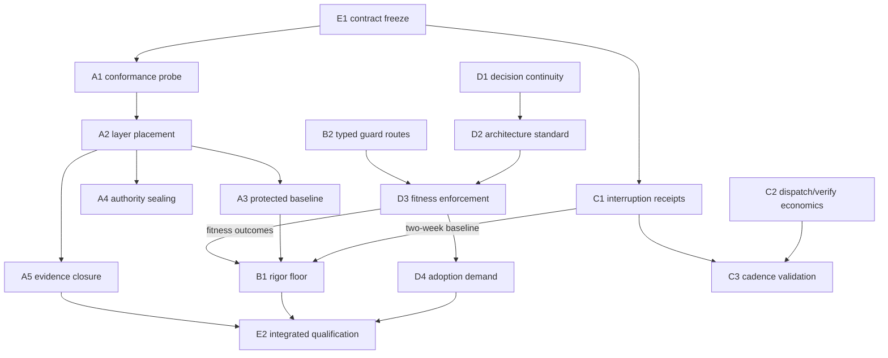

# Sprint Alfred Epic — Product Requirements

<!-- po-language: en -->
<!-- technical-spec-sha256: e57a2d1ffa9bae538078303f6f999a166ffe0bc16cbc66ab2abd77c8823e3223 -->

**Feature ID:** `sprint-alfred-epic`
**Profile / rigor / risk:** Epic / 2 / high (guard, canon, and authority
surfaces throughout)
**Gate:** PRD/Spec accepted by the PO; implementation begins only after the
sanctioned State submission/approval, the phase transition, and the Nova
rebase precondition below.
**Current design base:** `feat/sprint-alfred` at `a50c8093` (clone of the Nova
line); epic opened by PO-released `discard-feature` + `set-feature`
(2026-08-27, commit `0d0031ea`).
**Implementation base (gated):** the `origin/main` state after Sprint Nova
lands there; this branch is rebased onto it before the first implementation
dispatch. Push target: `origin/sprint_alfred`.
**Scope authority:** ADR-0043 amendment 2026-08-17 — *"Agent-first
architecture, mechanical governance, measurable rigor, and control
integrity"*; membership fixed by GitHub #108.

Design inputs, analysis, and research: [`design/po-input-2026-08-27.md`](design/po-input-2026-08-27.md),
[`design/issue-intake.md`](design/issue-intake.md),
[`design/backlog-intake.md`](design/backlog-intake.md),
[`design/external-research.md`](design/external-research.md).

---

## 1. Problem

The Pipeline's governance claim is that agent work is *mechanically* bounded:
guards refuse what the rules forbid, evidence is digest-bound, and a later
session can trust the record instead of re-deriving it. On 2026-08-27, live
measurement in this repository falsified three load-bearing parts of that
claim at once:

1. **The enforcement layer is inert exactly where the work happens.** Plugin
   `PreToolUse` guards fire for the orchestrating session and — measured four
   independent ways on Claude Code — never inside a dispatched subagent. Every
   deterministic guard this repo relies on is registered as exactly such a
   hook. Dispatched work is currently governed by briefing prose, obeyed
   voluntarily. A second, runner-independent hole compounds it: any guard
   classifying tool-call parameter text is blind to payloads staged into a
   file and executed indirectly.
2. **Evidence integrity is checked inconsistently.** A closed feature's
   Result was amended ten hours after its close; the drifted binding stayed
   invisible for four weeks (the active-feature classifier branch never
   checks closed bindings), then surfaced as an unrepairable
   `continuity-damaged` state at the worst moment. Separately, a greenfield
   project reached approved implementation with its authority bound to a
   generated staging draft whose own banner says it must not be bound — and
   every downstream gate agreed with the wrong binding, correctly.
3. **The lifecycle is not closed under its own observers.** A sanctioned
   state transition (`discard-feature`) wrote a state one readiness observer
   rejects, stranding the session behind a guard that then blocked the exit
   command.

Meanwhile, the architecture half of Alfred's mandate has no mechanism at all:
projects the Pipeline governs get *process* governance, but their
*architecture* — module boundaries, contracts, dependency direction, where
side effects live, what a fresh agent session must read to re-enter — is
whatever each session improvises. Fresh sessions in existing repositories
plan blind and bolt changes onto whatever they find first; greenfield
projects silently inherit human-team-shaped structure. Prompt instructions to
"use good architecture" are advisory context, not controls; the industry's
spec-driven tooling has the same gap (research §3).

The common root: **rules that live as prose or as orchestrator-session hooks,
and measurements that do not exist.** Alfred's mandate is to close it.

## 2. Outcome

One integrated delivery (#108) in which:

- **Control integrity:** protected control surfaces, approved design
  authority, and closed lifecycle evidence cannot be silently weakened by an
  agent through any supported mutation route — enforced through layers that
  provably execute for the acting process, with the enforcement assumptions
  themselves continuously measured, not assumed.
- **Mechanical governance:** the rigor a change owes is derived
  deterministically from its surface and evidence — the acting agent can
  propose but never lower it; guard refusals of legitimate briefed work get
  typed, human-decidable routes instead of dead ends; rules that exist only
  in prose get homes that machines check.
- **Measurable rigor:** planned gates and unplanned interruptions are
  separately measured with recovery cost; dispatch and Verify economics are
  measured before they are optimized; every mechanical claim this sprint
  makes ships with the check that would catch its violation.
- **Agent-first architecture:** a versioned, machine-readable architecture
  standard is the inherited default for governed projects; architecture
  decisions are durable across sessions; conformance is mechanically
  evaluated with baseline-and-ratchet adoption for existing repositories; a
  repository without a baseline gets exactly one typed, durable PO adoption
  decision — with this repository as the first brownfield case.

The human/PO remains root authority everywhere: custom profiles, overrides,
exceptions, and adoption decisions are PO acts an agent can propose,
evidence, but never perform, broaden, or infer.

## 3. Users and success measures

**Users:** the PO operating this and future governed repositories; Elephant/
Goldfish/Critic sessions on any supported runner; hosted projects
(greenfield and brownfield) consuming the Pipeline.

**Success is measured, not asserted:**

- S1. The enforcement-conformance record (A1) exists per runner and is green
  in Verify; every control names the layer that enforces it for dispatched
  work, and that layer's execution is probed, not presumed.
- S2. Zero paths by which an agent can (a) weaken a protected surface, (b)
  mutate approved PRD/Spec bytes during implementation, or (c) mutate
  closed-evidence bytes — demonstrated by fixtures per supported mutation
  route, including the payload-indirection route where the enforcing layer
  covers it, and honest typed debt where it cannot.
- S3. Every sanctioned `pipeline-state.mjs` verb's output state is accepted
  by every readiness observer (writer/observer conformance suite green).
- S4. Two weeks of interruption receipts (C1) exist before any
  threshold-dependent policy lands; the receipts distinguish planned gates
  from interruptions and record blocked wall time.
- S5. A greenfield project resolves to the inherited agent-first profile and
  produces a machine-readable architecture disposition before implementation
  authority; this repository completes the brownfield adoption flow end to
  end with a recorded PO decision.
- S6. The rigor floor derivation is deterministic (same normalized inputs →
  same floor), report-only first, and demonstrably not lowerable by prompt,
  prose, route choice, or self-attested compliance.
- S7. Each member issue closes with candidate- and evidence-bound closing
  comments; the sprint close records the exact merged commit and remaining
  debt.

## 4. Scope — five tracks, seventeen work packages

Track/WP detail, mechanisms, schemas, and file paths: [`spec.md`](spec.md).
Mapping to issues/backlog: intake docs. Summary:

### Track A — Enforcement ground truth and control integrity
- **A1 Enforcement conformance probe.** Typed, Verify-run measurement of
  what actually enforces where, per runner: do plugin guards fire in
  dispatched subagents; does payload indirection bypass parameter
  classification; does the git-hook layer fire for every caller. Replaces
  the falsified `hooks.json` `$comment` claim with a measured record.
- **A2 Enforcement-layer placement.** A per-control placement table across
  the four layers that execute in the acting process (git hooks; agent tool
  scoping; runner hooks where A1 proves them; Elephant-side deterministic
  post-hoc verification), consumed by every control this sprint ships.
- **A3 Protected-surface baseline (#101).** Plugin-shipped, versioned,
  immutable minimum baseline; additive project config; malformed config ⇒
  baseline-only + typed diagnostic; evidence-bound identity.
- **A4 Design-authority sealing (#102).** Approved PRD/Spec bytes immutable
  to agent mutation during implementation; `reopen-design`/amendment as sole
  transitions; approval refuses staging/pre-authority paths (the 2026-08-27
  staging-draft defect closes here).
- **A5 Lifecycle evidence closure.** Closed-evidence bindings join the
  protected set at close time; uniform binding verification across
  classifier branches; typed PO-gated drift repair; writer/observer
  conformance suite; worktree-vs-HEAD authority divergence warning.

### Track B — Mechanical governance of the process
- **B1 Minimum rigor floor (#105).** Versioned deterministic derivation from
  planned/actual surface + architecture profile + fitness/interruption
  evidence; asymmetric (human raises freely; agent never lowers); report-only
  first; Mini lane preserved.
- **B2 Typed routes where guards meet legitimate work.** Eight designed
  fixes, each with a prior PO decision or measured incident behind it:
  briefed test-change authorization; batchable TP-3 registration ceremony;
  read-only retry lane; per-key trust-on-first-use anchors; CLI-derived
  signing-command list; derived capability-inventory surfaces; repo-live vs
  runtime-live duty disclosure; gitleaks fingerprint diagnostics.
- **B3 Rules-as-code sweep.** GG-22 and ledger discipline into guardrails;
  SendMessage scope-relay rule into dispatch canon; push-flow doc corrected;
  backlog strip fixed to strip only the Triage section.

### Track C — Measurable rigor
- **C1 Interruption receipts (#103).** Five-way classification (planned-gate /
  unplanned-interrupt / external-wait / terminal-blocker / unknown), lineage
  correlation, blocked-wall-time, privacy-bounded local aggregation;
  two-week dogfood starts in the first implementation wave (it gates B1/D2
  calibration).
- **C2 Dispatch and Verify economics.** Dispatch bootstrap token breakdown
  (measure before optimizing); truncation closing-allowance (budget as
  handover, not cliff — PO direction); selective-Verify set design from the
  now-recorded per-suite durations; suite consolidation rule.
- **C3 Cadence validation.** Validate the already-encoded collection-block
  batching policy against C1 data; close the cadence item with evidence.

### Track D — Agent-first architecture capability
- **D1 Architecture decision continuity (#99).** Significance rubric; typed
  baseline assessment; reusable decision skill; inherited org/team decisions
  consumed via #9's interface; bounded session consumption; typed
  architecture-impact results at close; existing-project adoption without
  fabricated history.
- **D2 Agent-first architecture standard (#104).** Versioned machine-readable
  profile of nine property classes; OKF-pinned navigation representation
  coexisting with AGENTS.md; module inventory; interaction/contract receipts
  with honest measurement status.
- **D3 Fitness enforcement (#106).** The core enforcement invariant; ten
  mechanically evaluated property classes; baseline-and-ratchet; the same
  evaluator at planning/dispatch/pre-close/push/CI; report-only → blocking
  promotion; deterministic-pass rule (model-judged evaluators can propose
  findings, never produce `pass`).
- **D4 Adoption demand (#109).** Typed adoption states; decision-ready staged
  migration proposal with per-figure estimation status; exactly one durable
  PO decision, no nagging; this repository as first dogfood case.

### Track E — Integration (#108)
- **E1 Contract freeze.** Shared identifier/schema families frozen and
  versioned before any WP implementation (first implementation act).
- **E2 Integrated qualification.** One exact candidate qualified across all
  member issues plus the two 2026-08-27 incident classes; per-issue closing
  comments; sprint close evidence.

### The control loop the tracks form

## 5. Sequencing and entry conditions

Follows #108's five stages, concretized:

1. **Wave 0 (immediately after implementation authority):** E1 freeze; A1
   probe; C1 receipts (dogfood clock starts). Rebase precondition satisfied
   first: Nova on `main`, this branch rebased.
2. **Wave 1 (control foundation):** A2 → A3/A4/A5; B2 items that unblock the
   sprint's own work first (B2-ii batchable TP-3 ceremony, B2-i briefed
   test-change authorization — this sprint edits protected suites
   constantly); B3 sweep.
3. **Wave 2 (measurable default):** D1, then D2 (profile + receipts), C2
   measurements.
4. **Wave 3 (report-only integration):** D3 report-only; B1 report-only
   consuming frozen findings; prove unknown/unavailable/prompt-only cannot
   become green.
5. **Wave 4 (ratchet and blocking):** accepted baselines; net-new blocking;
   D4 adoption demand incl. this repo's dogfood decision; promotion of
   blocking behavior only after fixtures + dogfood calibration.
6. **Wave 5:** E2 qualification, member-issue closure, sprint close.

**Declared sequencing deviation (vs. #108 stage 1):** #108 places #99's
decision authority in stage 1 so #104/#106 consume accepted rather than
provisional module identities. Alfred moves D1 to the head of Wave 2, behind
the control-integrity foundation of Waves 0–1: the falsified enforcement
findings (§1) make measured control placement a precondition for trusting any
new authority surface, including D1's own decision records. The stage-1
intent survives in substance — D1 still lands before D2/D3 consume
identities, and the interim is bounded by the provisional-identity marking
(spec §7.2 module inventory). Argued in `design/issue-intake.md` (#108).

**Entry conditions (from #108, live-verified 2026-08-27):**
- **#100 (P0 push-approval fail-closed hotfix) is still OPEN** — required
  "accepted on `main`" before an Alfred implementation branch is cut; outside
  Alfred. PO ordering decision below.
- Upstream #46 authority contracts: available on the accepted base (Nova).
- Shared schema boundaries frozen: delivered as E1 (first act).
- PO names any `sprint:NONE` items that must land first: decision below.
- **No active Sprint branch is expanded or coupled to Alfred** — reconciled
  explicitly rather than merely asserted, because Alfred's design base is a
  clone of the Nova line: the PO's 2026-08-27 switch decision fixes that all
  Nova work continues in Nova sessions only; Alfred lives on its own branch
  (`feat/sprint-alfred`, pushed to `origin/sprint_alfred`, never to a Nova
  ref); and no Alfred implementation begins before Nova has landed on `main`
  and this branch is rebased onto that state (§8 A-1). Design-time file
  inheritance from the clone base is read-only and ends at that rebase — it
  is not an expansion of, or live coupling to, an active Sprint branch.

## 6. Non-goals

Inherited from the member issues and binding here: no universal folder
layout/language/framework/module-size rule; no automatic restructuring; no
metric- or analyzer-authorized refactoring; no agent-approvable overrides,
profiles, or adoption decisions; no external/commercial service required for
core conformance; no mandatory outbound telemetry; no replacement of #9
(org policy packs), #11 (Mini lane), #97 (amendment path), #46 (task
authority); #100 stays outside Alfred; no runner-specific sprint scope
(the A1 probe *measures* runners; it does not fork the design per runner);
no preventing the human repository owner from acting outside the Pipeline.
Nightwing/Batman scope stays out (two mis-labelled items pending the PO word
below). Fixing the Claude Code subagent-hook divergence upstream is reported,
not owned, here.

## 7. Acceptance requirements (PRD level)

The epic is acceptable when — testable, each backed by fixtures/evidence
named in `spec.md` §12 and `acceptance.md`:

1. S1–S7 (§3) hold with evidence bound to one exact candidate.
2. Every member issue's own acceptance-criteria list is satisfied or its
   deviations are explicitly PO-accepted at closure (the intake's argued
   deviations in `design/issue-intake.md` are the starting set).
3. The eight B2 routes exist with their refusal messages naming the route;
   the four live-measured incident receipt classes (guard-refused read-only
   command and readiness deadlock, 2026-08-27; TP ceremony, 2026-08-18;
   dispatch truncation, 2026-08-08 — provenance in `design/issue-intake.md`
   #103) are reproducible as C1 fixtures.
4. All 24 in-scope backlog items are closed with closure evidence, or
   explicitly re-triaged with a PO-visible rationale, by sprint close.
5. Report-only phases produce at least the #103-mandated two-week dogfood
   baseline before any blocking promotion; no blocking behavior lands
   without its fixture set green.
6. Documentation acceptance per member issue (user + reference docs verified
   against the exact accepted candidate) — carried as-is from the issues.

## 8. Assumptions and risks

- **A-1:** Nova lands on `main` in a shape this branch can rebase onto
  without redesign; the state-machine surfaces Alfred hardens (state writer,
  observers, guards) are Nova's shipped versions. *Risk:* rebase conflicts in
  guard/observer code → wave 0 re-verifies A1/A5 assumptions post-rebase
  before any further work. A-1 is also the reconciliation ground for #108's
  fifth entry condition (§5): the rebase is where design-time inheritance
  from the Nova clone base ends.
- **A-2:** The measured subagent-hook gap is runner-version behavior, not
  spec. *Risk either direction* — A1 makes it a measurement, so the design
  does not depend on which way it resolves.
- **A-3:** OKF v0.1 remains available and digest-pinnable. *Fallback:* the
  representation contract is pluggable by construction; the pin decision is
  an ADR that can be superseded through D1's own machinery.
- **A-4:** C1's two-week dogfood window fits the sprint's calendar. *Risk:*
  if the sprint must close earlier, threshold-dependent D2/B1 calibration
  ships report-only with the window's completion as recorded debt — the
  #103 rule (no thresholds from a short baseline) is honored, not waived.
- **A-5:** Epic scale. 17 WPs across 5 tracks is large; the design keeps
  C2's range-mode tail and parts of B2 explicitly droppable, and every wave
  ends PO-visible, so scope can be cut at wave boundaries without breaking
  the integrated outcome. *This is the PRD's honest statement that Alfred is
  a multi-week epic, not a sprint-sized batch.*

## 9. Open PO decisions (answer at this gate)

1. **Sprint-assignment conflicts:** move `2026-08-12-stale-checkout…` and
   `2026-08-08-bootstrap-skill-grows…` to Nightwing per their own triage
   prose (recommended), or keep in Alfred (then: B2/B3 addenda)?
2. **Deferred item intake:** accept `2026-07-25-managed-onboarding-success-
   contract` into Alfred as the A5 acceptance-review rule (recommended)?
   (`regulated-document-hooks` stays Phoenix — confirmation only.)
3. **#100 ordering:** #108 requires #100 accepted on `main` before the
   implementation branch is cut. Land it with Nova's release (recommended,
   it is P0), or explicitly waive the entry condition for Alfred?
4. **`sprint:NONE` prerequisites:** any items the PO wants on `main` first
   (per #108 entry conditions)? Recommendation: none beyond #100.
5. **Scope trims (optional):** the explicitly droppable tails are C2's
   range-mode check and B2(viii) gitleaks diagnostics. Keep (recommended —
   both are small) or drop now?

## 10. Traceability

| Source | Where it binds |
|---|---|
| PO input 2026-08-27 | `design/po-input-2026-08-27.md` → §1–2 outcomes, §5 model economics (Haltepunkt), Critic-per-document duty (spec §12, design-phase review duty) |
| GitHub #99–#109 | `design/issue-intake.md` → WP mapping table + per-issue take/add/deviate |
| 24 backlog items | `design/backlog-intake.md` → cluster tables, ⚖ PO-decided directions |
| External research | `design/external-research.md` → D2 representation pin, D3 deterministic-pass rule, A1 rationale, positioning |
| 2026-08-27 incidents | `docs/state.md` current section; the two filed items → A4/A5, C1 seed codes |
