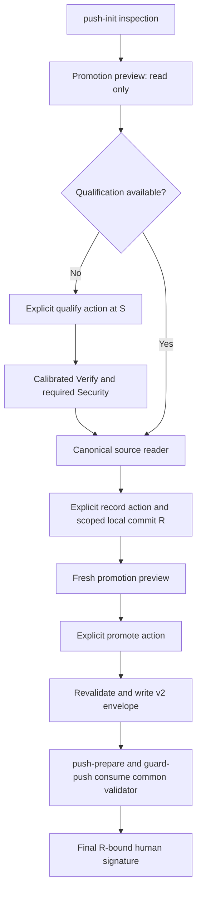

# Release promotion correction — proposed security design

**Status: proposed; not approved.** Authored 2026-09-19 for
`NVA-B-PROMOTION-PROPOSAL`. Reader review: pending. Independent high-risk
Critic: pending. PO acceptance: open. This document allocates no ADR number,
changes no approved scope, and authorizes no implementation, signature,
publication or release. Its recommendations need the ordinary design
acceptance and successor-ADR process before they can change trust semantics.

## 1. Outcome and existing authority

An operator should qualify substantive candidate **S** once, commit a narrowly
defined generated record as **R**, and receive one actionable push-readiness
report. R must be a strict descendant of S. The report names the real S
qualification, the exact S→R proof, any work still required, and the final
human-only external-key signature. It never describes an unexecuted R Verify
or Security scan as a successful run.

[D1, recorded 2026-09-18](../../../backlog/PO-TOPICS.md#po-decisions--2026-09-18),
already permits one-way `release-satisfies-push` for the same qualified source
candidate. D1 is retained and is not a question in this proposal. It permits
neither `push-satisfies-release` nor reuse after substantive source, policy,
environment class or declared-input drift. The
[requirement](../../../backlog/items/2026-09-17-release-evidence-promotion-repeats-full-qualification.md)
also requires real receipt readback, strict record-only deltas, canonical
evidence roots, and ordinary driver reachability. Its historical closure
metadata is not qualification evidence.

[ADR-0065](../../../docs/adr/0065-a-voided-gate-is-re-earned-from-declared-inputs.md)
keeps ordinary gates candidate-bound and requires runtime enforcement for
narrowed suite inputs; Security covers the complete tracked inventory.
[ADR-0081](../../../docs/adr/0081-boundary-aware-impacted-verify.md) keeps release
full and records the actual selection. [ADR-0050](../../../docs/adr/0050-candidate-bound-verify-run-journal.md)
defines private, local run evidence and its retention boundary. The proposed
promotion admission is a separate, explicit composition of S qualification
and a record proof; it must not silently rewrite any of these contracts.

## 2. Current source evidence and limits

These are source observations, not prior Critic findings. The tracked source
links and symbol anchors in the table below identify the observed contracts if
concurrent parity repairs move lines. Such repairs to existing v1 invariants do
not establish the complete qualification chain proposed here.

| Existing surface | Observed contract and consequence |
| --- | --- |
| [Promotion library](../../../plugins/pipeline-core/lib/release-promotion-envelope.mjs), `createReleasePromotionEnvelope` / `validateReleasePromotionEnvelope` | v1 stores selection fields, a Git delta, a label-derived inclusion hash and optional Security metadata. Validation has no canonical receipt/log/terminal reader. A self-consistent envelope is not proof of execution. Its broad `RECORD_ONLY_PATH_PATTERNS` includes state, backlog items and evidence directories. |
| [Selection](../../../plugins/pipeline-core/lib/verify-selection.mjs), `planVerifySelection` / `verifyEvidenceSatisfiesBoundary` | Release is full; the existing same-candidate boundary helper accepts full release for push. Serialized selection validity does not prove the selected suites ran. |
| [Verify producer](../../../plugins/pipeline-core/scripts/verify-evidence-producer.mjs), `produceVerifyEvidence`; [schema](../../../plugins/pipeline-core/scripts/verify-evidence.schema.json) | Produces v0 with candidate, selection and public run digests after execution and candidate readback. Its consumer output path is resolved from the supplied root; canonical-root behavior must be unified, not inferred from source-harness behavior. |
| [Journal](../../../plugins/pipeline-core/scripts/verify-journal.mjs), `compileVerifySuites` / `runVerifyJournal`; [resume](../../../plugins/pipeline-core/lib/verify-resume.mjs), `validateVerifySuiteReceipt` / `planVerifyResume` | Real receipts bind implementation, file/non-file inputs, environment, policy, log and case completion. The terminal binds the exact receipt-digest set and journal. Default Tier-A registrations contain `declared-tree:root`. |
| [Security producer](../../../plugins/pipeline-core/scripts/security-scan.mjs), `resolveEvidenceRoot` / `observeCandidate` / `runSecurityScan` | Uses Git common-directory resolution for ordinary linked worktrees and observes a complete tracked inventory around an immutable snapshot. Its resolver currently has a local fallback; promotion must fail closed when canonical identity cannot be established. |
| [Push preparation](../../../plugins/pipeline-core/scripts/push-prepare.mjs), `checkEvidenceFreshness` / `resolveEvidenceProjectDir`; [push guard](../../../plugins/pipeline-core/hooks/guard-push.mjs), `checkEvidenceFreshness` / `checkSecurityEvidenceBinding` | Both consume v1 promotion for summary freshness. The guard separately demands Security candidate/tree equality with the pushed commit; changing summary freshness alone cannot safely implement S-bound Security promotion. |
| [Push driver](../../../plugins/pipeline-core/scripts/push-init.mjs), `drivePushInit` | Aggregates reconciliation and readiness and ends at `signature-required`. It has no promotion producer call. `pushPrepareReport` can fold an older pending approval write, so a new genuinely read-only preview must explicitly disable that path. |

No direct-import helper test proves that an operator can reach this flow.
The regression plan therefore includes the ordinary CLI, real Git objects,
real producer-created journal artifacts, both consumers, and a detached
worktree. No private run contents were read for this design.

## 3. Threat model and authority boundary

Protect the identity and completeness of S qualification, the policy selecting
it, the physical evidence store, the exact R to be pushed, and the human's
final signature. Treat refs, JSON claims, latest-file aliases, paths, record
content and preview files as untrusted input. Missing information is a
typed refusal, not permission to use a weaker route.

| Threat | Required control |
| --- | --- |
| Fabricated green summary, selected-suite list or record claim | Load the actual producer's manifest, plan, terminal, journal, receipts and logs; cross-check complete sets and all digests. Rebuild the record from those validated facts. |
| Stale/replayed evidence, same tree with a different S, mixed runs | Bind full S commit/tree, repository, run ID, policy, environment and every declared input; reject substitution and nonterminal evidence. |
| Source or policy hidden in a record commit | Recompute the complete NUL-delimited Git delta; only the exact policy-authorized generated addition is eligible. Check intermediate ancestry as well as the endpoint. |
| An allowlisted path is also a test/Security input | Apply the declared-input rule in §4. Path membership never overrides an input dependency or whole-tree binding. |
| Envelope chooses a convenient policy, security-off mode or evidence root | Resolve effective authority independently at S and R, require equality, and resolve the physical repository root through Git. Never trust these values merely because the envelope repeats them. |
| Symlink, junction, hardlink, traversal, path alias or root substitution | Physical component/read-handle checks, containment, ownership and private-store checks; bind the repository before reading artifacts. Recheck before publication. |
| Readiness inspection runs tests, creates signing artifacts or commits audit data | Separate inspection from action; disable audit-fold in inspection. Preview has no artifact-creation authority. |
| Signature replay or a record commit after signing | Sign the final exact R/tree/remote/ref/action through the existing human route. Promotion is never a signature or approval. |

The trusted computing base remains the installed, authority-bound producer,
Git, the host's private-store controls and the accepted policy. SHA-256
detects substitution against trusted producer records; it is not a producer
signature. A hostile process with the same effective authority to rewrite the
entire private journal and its producer is outside this local integrity claim.
Do not claim remote attestation, native runner isolation or protection against
that attacker. Promotion must not add an agent-controlled “execution verified”
flag as a substitute for the journal chain.

## 4. Recommended record policy and the input-overlap constraint

**Recommendation P1:** one shipped, versioned policy owns both the narrow
record allowlist and the inclusion rule. Its proposed filename is
`plugins/pipeline-core/lib/release-promotion-policy.mjs`. It is read from the
authority-bound distribution, bound into S qualification, and compared with
the effective policy at action and consumption. A project, envelope or CLI
cannot extend it. The Pipeline policy maintainer owns version changes through
reviewed design/spec acceptance; coordinators implement accepted details.

The recommended initial allowlist admits exactly one **new** regular file:
the proposed path template `backlog/evidence/release-promotion/<S-commit>.json`,
with the placeholder replaced by the full canonical S OID. The directory is
under the existing durable-evidence kind. There is no recursive wildcard and
no allowance for arbitrary Markdown, lifecycle/state, backlog items, queue
edits, generated indexes or transitions. Existing reconciliation consumers
must learn this one closed record format through their ordinary writer/reader
contract before the driver advertises the optimized path. Do not pretend that
the current `docs/doc-reconciliation.md` flow already consumes it.

The record is a canonical, generated assertion about S, with no R OID (which
would make its own containing commit circular), prose, timestamp, author,
private path or user-supplied text. It contains only its schema, S commit/tree,
qualification digest and accepted promotion-policy digest. The producer
reconstructs its exact bytes from source readback; the validator compares the
Git blob byte-for-byte. It cannot be an invented record about an absent run.
The envelope is generated **after** R and remains a local derived artifact.

R must be the sole direct child of S in this initial policy, have one parent,
and have the single nonempty allowed addition. This bounded subset of strict
S→R ancestry excludes intermediate source edits/reverts and merges. Rename,
copy, deletion, modification, mode change, symlink and submodule deltas fail.
Future multiple-record or multi-commit support needs a new reviewed policy.

### Declared inputs are independent of directory names

A file called “evidence” may be read by a suite, selected by policy, counted
in a tracked-inventory check or scanned for secrets. `backlog/evidence` is a
storage classification, not an exclusion from qualification. Compare each
concrete file/subtree input and every non-file input with its governing
definition. An actual overlap or an unknown dependency refuses promotion and
requires re-qualification; it never becomes an “evidence-only” exception.

This exposes a material migration issue: today's Tier-A `declared-tree:root`
and Security's whole tracked inventory both change at any nonempty R. They
cannot be treated as unchanged. **The default v2 admission must therefore
refuse these overlaps.** D1's direction alone does not approve discarding them.

**Recommendation P2:** accept a separately specified output-domain contract
only where independence can be enforced. Qualify S under that contract before
writing R. Suites with narrowed inputs must be unable to read the record
namespace, using ADR-0065's enforced declaration tier; opaque commands and
child-process suites retain their full-tree dependency and remain ineligible.
The policy must record the applicable declarations and their enforcement
evidence, rather than retroactively narrowing old receipts. Full release
still executes the complete registry at S. Any changed declaration or
enforcement implementation requires a fresh S qualification.

Security requires a separate, explicit decision because its whole-inventory
contract must not be narrowed by a suite declaration. The recommended
successor contract keeps the real full-inventory scan at S and admits only
the exact generated R record through an additional deterministic
record-safety proof; it does **not** claim a scan of R. That proof permits
only the fixed schema and values reconstructed from qualified S, with no
arbitrary content or new executable bytes, and binds the record-validator
implementation and policy. Any other added content requires Security on a
new substantive candidate. Until this composition is accepted and implemented,
gate-on Security continues to reject S evidence for R.

This is an honest applicability limit, not a finished optimization claim:
the current source repository's default whole-tree suites do not yet establish
eligibility. Package Q0 below must measure the declarations and identify the
bounded enforceable migration. If it cannot, it reports that the proposed
optimized source flow is not deliverable under this contract; the coordinator
must revise the design before implementation acceptance. Do not silently
introduce a general filtered-tree hash to make the happy-path test pass.

## 5. Closed data contracts — all proposed

Every new record rejects unknown fields recursively, duplicate JSON keys,
invalid UTF-8, duplicate/unsorted IDs, unsupported versions and over-limit
input. Use lowercase full Git OIDs of the repository's object format and
64-character lowercase SHA-256 values. Canonical JSON sorts object keys;
arrays have their specified stable order. Root records are bounded to 1 MiB,
suite inventories to 4,096 entries, paths to 512 characters, and logs retain
the journal's existing bounded-log rule. Overflow refuses with a typed code.

| Proposed type | Exact fields and admission meaning |
| --- | --- |
| `Candidate` | `commit, tree`; both independently resolved Git objects. |
| `ArtifactRef` | `store, path, fileSha256`; store is `public-evidence` or `verify-run`; path is relative to that fixed store, never a caller-selected root. File hash covers bytes. |
| `Qualification` | `schema, source, repositorySha256, runId, verify, security, environmentSha256, declaredInputsSha256, policySha256, qualificationSha256`; schema is `pipeline.source-qualification.v1`. The final digest covers the other fields. |
| `verify` | `summary, manifest, resumePlan, terminal, journal, selectionSha256, registrySha256, suites`; the first five are artifact references. `suites` is sorted by ID. |
| Suite binding | `id, implementationSha256, inputsSha256, environmentContractSha256, policySha256, receipt, log, caseCompletionSha256`; receipt/log are references, case-completion hash is null only when the bound registration requires none. |
| Gate-on `security` | `mode, configurationSha256, policySha256, environmentSha256, evidenceV1, evidenceV2, verdictV2`; mode is `required`. v1 is mandatory; v2/verdict are references exactly when effective policy requires them, otherwise null. |
| Gate-off `security` | `mode, configurationSha256, policySha256, authoritySha256`; mode is `off-by-policy`. It records a resolved effective-policy observation, never `PASS`, a waiver or a fabricated scanner result. |
| Generated record | `schema, source, qualificationSha256, promotionPolicySha256`; schema is `pipeline.release-promotion-record.v1`; source is Candidate. |
| Delta entry | `path, status, beforeMode, afterMode, beforeBlob, afterBlob`; initial policy permits one `A`, zero/absent preimage and regular `100644` postimage. Exact Git object-format zero OID represents absence. |
| Inclusion proof | `edgeId, policySha256, sourceBoundary, targetBoundary, sourceRequirementsSha256, targetRequirementsSha256, matchedRequirementIds`; exact boundaries `release,push`, exact edge `release-satisfies-push`, sorted unique IDs. |
| Envelope | `schema, source, record, qualification, promotionPolicySha256, recordOnlyDelta, deltaSha256, recordProofSha256, modeInclusion, envelopeSha256`; schema is `pipeline.release-promotion-envelope.v2`, source/record are Candidate, qualification is an ArtifactRef to the validated qualification record. |

`Qualification` is a reader-produced description of existing execution, not
permission to claim a run. Its `policySha256` commits to the effective Verify
policy, selection policy, suite registry, security policy and promotion policy
as named components. Domain-separate that composite digest from each existing
receipt's `policySha256`; compare each original field with its original
producer algorithm. Never compare unrelated digests merely because their
field names match. `recordProofSha256` commits to the generated record bytes,
input-independence result and accepted record-safety checker implementation.

The local preview schema is `pipeline.release-promotion-preview.v1`, with
exact fields `schema, source, record, phase, observations, requiredWork,
nextAction, previewSha256`. Record is null before R exists. Phase is
`qualification-required`, `record-required`, `promotion-ready`, `blocked` or
`signature-required`. Each observation has `id,status,bindingSha256,reasonCode`
with a closed status enum `satisfied,required,blocked,not-applicable`.
`requiredWork` is a bounded list of those IDs. `nextAction` is null or a
structured `kind,executable,argv,cwdRole,mutation,expectedSchema` object from
the producer's closed action table, never arbitrary preview-supplied code.
The digest seals the other fields and proves no human approval.

## 6. Real S qualification readback

The plugin-local reader performs these checks from canonical stores. It must
not import the repository-only Verify harness or accept injected evidence
objects through the production CLI.

1. Resolve S's exact commit/tree and physical repository. Require clean
   qualifying worktree observations before and after the real producer run.
   Read effective authority, registered suites, selection rules, implementation
   hashes, declared file and non-file inputs, and environment classification
   from their authoritative sources. A current policy/environment mismatch
   invalidates the qualification; it does not mutate its claimed history.
2. Read v0 using its actual schema; require exit 0, exact S commit/tree,
   qualifying coverage (never `baseline-only`), a passed non-null `verifyRun`,
   and a validated full release selection with zero omitted suites. Recompute
   the selection from S's registered policy and actual Git inputs. Counts and
   a release label alone do not suffice.
3. Resolve the named private run by the safe run ID. Validate physical file
   protections, run manifest, closed terminal, resume plan and journal against
   their producer digests; match candidate, run ID, policy and terminal digest
   with v0. Terminal receipt hashes must equal the actual unique receipt set,
   and suite IDs must equal the full selected registry. Reject running,
   truncated, missing, extra, duplicate, mixed-run and failed members.
4. For every suite use `validateVerifySuiteReceipt`, then reconstruct its
   registration and log metadata for `planVerifyResume` at **S**, with
   cross-candidate reuse disabled. Verify the real log's bytes, size and
   truncation flag; implementation, dependency, input, environment and policy
   digests; exit 0; and any required case-completion attestation. A legacy
   receipt lacking required completion is not upgraded by an envelope.
5. Read the real Security v1 payload and validate candidate, complete inventory,
   repository identity, before/after immutable snapshot, policy and payload
   hash against S. Use the effective security plan and existing evaluator for
   required v2 coverage/verdict; structural validity or `aggregateVerdict`
   alone is insufficient because severity thresholds still apply. Missing
   required capability, blocked findings, ERROR, truncation or stale evidence
   blocks. Optional `SKIPPED` stays visible and is never relabelled PASS.
6. Bind immutable content-addressed references before mutable `*-latest.json`
   slots can be overwritten. Read back those bytes and the complete chain,
   then emit Qualification. Retain the original private run through promotion
   using its sanctioned cleanup owner; if it has been legitimately removed,
   re-qualify. No copying private logs into tracked records or extending
   retention/cross-host transfer silently beyond ADR-0050.

**Recommendation P3 — Security off:** preserve the effective gate policy.
When the resolved gate is off, bind explicit `off-by-policy` with its
authority/configuration digests; missing or malformed policy never counts as
off. The action cannot toggle the gate. An off→on change requires the newly
required real scan. The alternative is an always-required scan for promotion:
stronger uniform scan coverage, but a new requirement for gate-off consumers
and unavailable tools. This proposal recommends policy binding, subject to
acceptance, rather than quietly imposing that extra gate.

The committed [isolated identifier false-positive evidence](../../../backlog/evidence/2026-09-19-governance-identifier-false-positives.md)
records two public governance-identifier findings that were ignored only after
the exact correction; its synthetic-identifier and unlisted-path negative
controls still retain findings. It is not native Security, full
Security/Verify, publication, or signing acceptance, and does not justify a
hash-shaped exemption or blanket exclusion of evidence files. Any scanner
correction needs its own exact field/schema test and normal security
disposition; promotion never suppresses findings.

## 7. Inclusion proof and canonical physical roots

The policy's requirement inventory must identify each Verify suite and its
implementation/input/environment contract, selection obligation and required
Security capability. At action time derive the push requirements for the
actual base and R, including the record-validation obligation. Prove the
qualification-related push requirements are a **strict subset** of S's full
release requirements, by exact requirement identities and contract digests;
the separate record-proof obligation is discharged by the record validator.
If impact classification falls back to a set equal to the release set, this
initial strict-subset rule refuses promotion rather than inventing a weaker
edge. Missing, changed or malformed policy, an omitted required suite, a new
requirement or reverse boundary fails closed. Names and set cardinality alone
are not inclusion proofs. Human approval requirements are never in the
reusable requirement set.

Use one plugin-owned canonical-root resolver for Verify, Security, the reader,
producer and both consumers. Resolve the Git worktree, its physical common
directory, and the registered primary worktree; check they belong to the same
repository. Read public artifacts below that primary root's `evidence/`, and
private journal artifacts below the common directory's owned Verify store.
Use the existing Security resolver as the starting seam, replacing fallback
with a typed error for promotion. Do not assume every common-directory name
is `.git`, or guess a primary root from a string suffix. Bare repositories or
unresolvable layouts are explicitly unsupported until covered by a tested
policy. A detached worktree needs no second scan merely to relocate evidence.

Git paths are parsed with NUL delimiters and retain exact spelling. Reject
absolute/drive/UNC paths, backslashes in repository-relative paths, empty,
dot or parent components, control characters, and ambiguous Unicode or
case-fold aliases. Check Git modes and each on-disk component with physical
metadata, including symlink/junction/reparse escapes, regular-file/link-count
requirements and the existing platform-aware private-store ownership rules.
Do not normalize an attack path into an allowed one. Check the primary root
and exact S/R worktrees for dirty/untracked state; ignored runtime artifacts
are admitted only in their physically validated runtime stores and never as
an extra source-input channel. Revalidate open-file identity and digest across
reads to detect substitution; fail closed on a race or unavailable assurance.

## 8. Ordinary preview/action driver and call graph

All named additions in this section are **proposed**, not shipped commands.
Extend ordinary `push-init` help/readiness to expose the promotion preview and
its typed next action. A fresh installation must discover and complete the
flow from that entrypoint without an import script, hidden flag or hand-built
JSON. Existing [push/release flow](../../../docs/push-release-flow.md) remains
authoritative until its reviewed successor is accepted.

The proposed `release-promotion-producer.mjs` has three explicit mutation
actions: `qualify`, `record`, and `promote`, plus read-only `preview`.
`qualify` invokes the calibrated release-mode Verify and, if not already
emitted by that same qualification, the required Security scan in the same
driver action. It never runs an equivalent scan again merely because one
producer used a detached worktree. `record` emits only the exact generated
record; the driver describes its exact local commit path and re-observes the
resulting R. Ordinary authorized local preparation does not add PO gates.
Existing signature-intent lifecycle authority governs when an action may be
requested; this proposal does not invent an approval token.

`promote` accepts the preview digest as a drift guard and explicit local action
intent. It reconstructs all inputs, confirms the original S qualification,
checks the exact R delta/input policy/security composition and inclusion
proof, then atomically writes a content-addressed envelope and reads it back.
The latest alias is updated only after success. A repeated identical action
returns the same validated result. Drift returns a new preview, never a stale
write. Interrupted writes cannot leave an admissible partial envelope. No
preview, inspected request or stored envelope itself grants push authority.

Both `push-prepare` and `guard-push` call the same source-aware validator with
the actual pushed R/tree, effective boundary and current policy. They keep
ordinary exact-candidate checks when no promotion is used. The Security
consumer validates S via the accepted composition and R via its record proof;
it must not keep a hidden final `candidate.commit === R` check after reporting
promotion success, nor weaken that check globally. An exception in an
authority-bearing consumer returns its normal blocking exit/status.

Inspection never invokes Verify, Security, record writing, an audit-fold
commit, signing-request creation, signing or publication. It disables
`foldPendingApprovalWrite`; any required local fold is a separate named
action followed by new candidate readback. Successful preparation returns
one aggregate status with individual bindings and typed remedies. The final
external signature remains human-only, bound to R commit/tree and the actual
action/remote/ref. No commit may be slipped between signature and execution;
a changed R invalidates the subject. Existing external authorization and
remote-readback gates remain in force.

Claude, Codex and Antigravity must each complete this shared flow independently
with the other runner executables absent. Use Node path APIs, explicit runner
identity and structured executable/argv with `shell:false`; use tested POSIX
and PowerShell/cmd renderers only for human-copyable output. No shell string
concatenation, separator/case assumptions or required cross-runner launcher.
[ADR-0057](../../../docs/adr/0057-runner-platform-support-is-an-implementation-obligation.md)
requires implementation portability; it does not create a mandatory native
nine-cell release gate. Unavailable optional native hosts remain diagnostic;
an unavailable capability actually required by the selected flow is reported
for that capability, never fabricated as success.

## 9. Versioning and migration recommendation

**Recommendation P4:** retain v1 parsing only in labelled diagnostics; require
v2 for all new promotion admission in both consumers. Do not re-seal v1 as v2
from its summary fields. Reconstruct from intact real S artifacts under the
new policy or perform a new qualification. Older tools that know only v1 must
not admit a v2 promotion; installation/consumer version compatibility is
checked before preparing it. Unknown versions fail closed.

The alternative, a transitional v1 admission window, preserves historical
workflows but also preserves the missing qualification proof; it is not
recommended. Migration is atomic across producer, shared validator and both
consumers so no partial rollout reports readiness through a weaker reader.
Policy/allowlist/declaration changes invalidate old qualifications. Existing
exact-candidate flows continue to work; unavailable promotion falls back to
ordinary re-qualification, never to v1 acceptance. Public `v0.6.2`, historical
records, closed epic digests and original receipt bytes are not rewritten.
An accepted successor ADR is numbered only at acceptance under
[ADR-0069](../../../docs/adr/0069-adr-numbers-are-allocated-at-acceptance.md).

## 10. Deterministic regression matrix

The tests below are required **future implementation evidence**, not results
of this documentation task. Synthetic fixtures use public fake identities;
real-Git flow tests create their own producer artifacts and do not inspect a
developer's private runs.

| ID | Fixture/action | Required result |
| --- | --- | --- |
| R01 | Real release-mode producer at eligible S; actual journal/receipts/logs/Security; exact generated child R | Ordinary CLI reaches aggregate signature-required with a v2 proof; both consumers accept identical bindings. No second full Verify or equivalent Security run; process counts prove it. |
| R02 | Dirty tracked or untracked state at source/record/root; candidate changes during action | Refuse before publishing success; stale latest success cannot be reused. |
| R03 | S=R, alias refs resolving equal, reversed/unrelated ancestry, merge, extra intermediate source edit/revert | Refuse strict direction/one-child policy. |
| R04 | Extra source path, unknown evidence path, record edit/delete/rename/mode change; wrong generated bytes | Refuse complete-delta/record proof, including an allowed-looking path with fabricated qualification claims. |
| R05 | Missing/mixed/failed/extra receipt; absent or corrupt/truncated log; false counts; running/forged terminal | Refuse exact terminal/registry/run-chain validation with a sanitized binding code. |
| R06 | Changed selection, suite implementation, policy table, registry, dependencies, file/non-file input, environment, case completion | Refuse stale S qualification. Re-hashing an edited envelope does not repair it. |
| R07 | Allowed path is a concrete declared input, default whole-tree overlap, opaque product command, unenforced narrowing | Refuse. A policy label cannot manufacture independence. Qualifying enforced declarations have their own positive and denied-read fixtures. |
| R08 | Explicit strict release→push subset; equal/unknown/new requirement set; reverse push→release | Only the explicit strict included case succeeds. No label inference. |
| R09 | Missing/stale/tampered v1 Security; required v2/verdict missing; blocked findings/ERROR/required SKIPPED; policy off→on | Refuse each required failure; optional SKIPPED remains visible. Valid accepted off-by-policy record is never reported as scan PASS. |
| R10 | Security S inventory versus new R record; arbitrary payload that resembles an identifier or hash | No admission without accepted record-safety composition; exact generated safe record passes only that policy. Arbitrary content and blanket scanner exemption fail. |
| R11 | Real detached worktree S plus primary canonical root; consumer producer and repository producer routes | Verify/Security write and both consumers read the same canonical stores; no manual copy or second scan. Ambiguous common directory fails. |
| R12 | Traversal, symlink/junction, hardlink, case/NFKC alias, Git tab/newline path, path swap during read | Refuse physically unsafe or ambiguous evidence/delta without leaking raw payloads or host paths. |
| R13 | Ordinary preview/help plus explicit action; pending old audit fold; changed preview; interrupted/repeated write | Preview writes nothing and spawns no qualification/signing. Action is discoverable, scoped, race-safe and idempotent; stale preview cannot authorize mutation. |
| R14 | v1/unknown version, partial upgrade, absent private run after legitimate cleanup | Diagnostics only or typed re-qualification; no downgrade admission. |
| R15 | Each runner independently, other runner binaries absent; POSIX and Windows path/argv fixtures | Same semantic result without a second runner; portable copy renderings; no mandatory manual nine-cell matrix. |
| R16 | Actual guard subprocess fault and substituted destination/candidate after preparation | Blocking status/exit; human signature remains absent and cannot be generated by producer or preview. |

## 11. Bounded implementation packages and acceptance boundary

These are proposed work packages, not delegated execution authority. Proposed
new files are labelled as such; existing files are linked in §2.

| Package | Ownership and bounded deliverable | Exit evidence |
| --- | --- | --- |
| Q0 — qualification-domain readiness | Read actual registrations and Security coverage; design the enforced record-output declaration migration and exact reconciliation-reader extension. Any required new filenames are proposed in its later briefing. | Prove a real source flow can meet §4; list each root-bound blocker and the exact permitted migration. If not feasible, revise this proposal before implementation acceptance. |
| Q1 — reader and policy | Existing promotion library, Verify resume/journal seams; proposed `plugins/pipeline-core/lib/source-qualification-reader.mjs`, `plugins/pipeline-core/lib/release-promotion-policy.mjs` and corresponding `.test.mjs` files. | Closed schema/adversarial R03–R10/R14; full source-readback fixture, accepted policy and no fabricated artifacts. |
| Q2 — canonical roots and producers | Existing Verify/Security producers; proposed `plugins/pipeline-core/lib/promotion-evidence-root.mjs` and `.test.mjs`; preserve private journal ownership and retention. | R02/R11/R12, including a real detached-worktree producer run. No raw private-log export. |
| Q3 — reachable driver and record | Existing push-init and its tests; proposed `plugins/pipeline-core/scripts/release-promotion-producer.mjs` and `.test.mjs`; the exact Q0-approved reconciliation reader/writer paths. | R01/R13/R15 from the installed ordinary command, with spawn/write observations. No hidden import-only success. |
| Q4 — consumers and registration | Existing push-prepare and guard-push; proposed `plugins/pipeline-core/scripts/release-promotion-flow.test.mjs`; exact focused-suite registrations in `harness/scripts/verify.mjs` (TP-3). | Both consumers agree; R01–R16 registered and run; no weaker legacy fallback. Restore protected-path enforcement before candidate gates. |

The [standing Nova authorization](../spec.md#8-security-privacy-and-authority-boundaries)
already covers exact Nova TP-1/3/5 lifts with task/write-set/audit binding and
restoration. It is not a continuously disabled guard. The specific new
registration dependency is TP-3 at `harness/scripts/verify.mjs` for the
Q1–Q4 focused suites; it is not a request to change their expected verdicts.
The separately reported Greenfield registration is
`plugins/pipeline-core/scripts/pipeline-state-late-verify.test.mjs` in that
same manifest. Use the supported exact-path repair/lift procedure under
existing authority; a host refusal with no executable scoped route is a
technical blocker to report with its evidence, not grounds to fabricate a
fresh signature request. No protected edit is made by this proposal.

Local package validation is followed by the applicable candidate Verify and
Security, ordinary-path end-to-end evidence and independent high-risk Critic.
Reader review and independent high-risk Critic remain pending before design
acceptance. D5's retained AI-hardening code still needs spec reconciliation at
formal Nova B candidate acceptance; this proposal neither accepts that spec
nor converts a retained implementation into accepted requirements.

The [current audit decision packet](../../../backlog/evidence/2026-09-06-po-decision-queue.md#2026-09-19-audit-correction--promotion-design-and-remaining-po-topics)
collects the actual unresolved choices: record/input and Security composition,
policy-owned exact allowlist, gate-off policy treatment, v1 admission cutover,
and D5's existing acceptance obligation. Q0 feasibility, canonical roots,
driver wiring, portable argv, ordinary registrations and Nova's own-ancestry
publication-observer repair are coordinator work, not additional PO gates.
