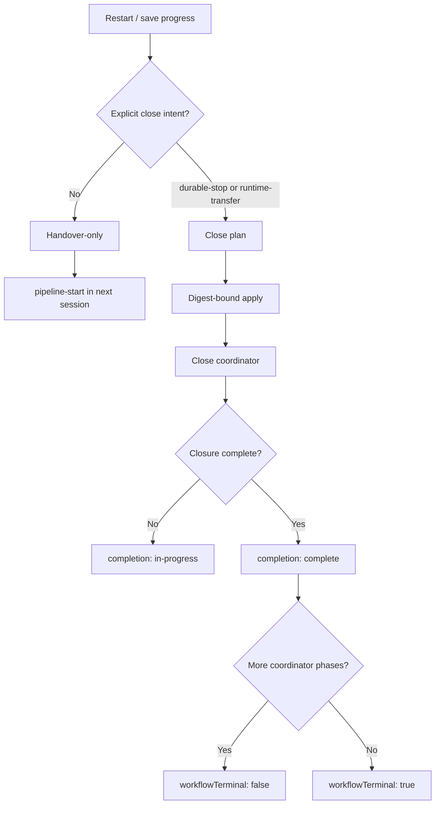

# B62 — Close boundaries and canonical readbacks

## Problem

A normal same-topic session restart was treated like a close-block checkpoint.
That can create private coordinator state, prompt unnecessary verification and
cleanup work, and falsely suggest that work is ending. Separately, coordinator
readbacks reported `terminal: true` for `closed-local` while still declaring a
successor phase (`release-eligible`), which made completion claims ambiguous.

## Scope and non-goals

- Define a handover-only path for same-topic restarts, Compact, and requests
  merely to save progress.
- Admit close-block only for an explicit `durable-stop` or
  `runtime-transfer` intent.
- Enforce that intent in the close-coordinator start plan and its digest-bound
  apply action, before private lifecycle state can be created.
- Standardize closure readbacks so operation application, closure completion,
  and workflow terminality cannot contradict one another.
- Do not reinterpret, delete, or repair an existing coordinator record.
- Do not install a plugin, push, publish, close an active feature, or alter a
  bound PRD/Spec as part of this remediation.

## Required flow

Mermaid syntax self-check: passed (flowchart TD, balanced nodes and edges).

## Canonical receipt contract

| Field | Meaning | Must not mean |
| --- | --- | --- |
| `status` | Mutation disposition: `applied` or `replayed` | Feature closure complete |
| `completion.state` | Completion of the `feature-closure` scope | The entire coordinator has no successor |
| `completion.workflowTerminal` / `terminal` | No successor in the coordinator state machine | Merely that local closure is complete |
| `phase` | Exact current coordinator phase | A user-facing success verdict by itself |
| `integrity` | Named semantic and persisted-record digests | Two competing lifecycle identities |

At `closed-local` and `delivered`, `completion.state` is `complete`, but
`workflowTerminal` is false because release eligibility remains a deliberate,
independently authorized successor. At `promoted`, both are true.

## Compatibility and rollback

The CLI readback changes from `pipeline.close-coordinator.next.v1` to
`pipeline.close-coordinator.next.v2`. This is a deliberate major-version
change: v1 emitted the contradictory pair `terminal: true` and a non-empty
`next` array at `closed-local`; no persisted coordinator record embeds this
ephemeral CLI response. The repository search identified no production v1
consumer outside the coordinator's own contract test. Consumers must select
the v2 schema and use `completion` for feature-closure progress and
`terminal` only for coordinator workflow terminality. The new schema ID
prevents a v1 parser from silently treating the corrected value as its old
contract.

Before any candidate promotion, rollback is an ordinary revert of the B62
commit; it invalidates its Verify/Critic evidence and restores v1 without
rewriting a coordinator record. After a published commit, use the same
ordinary revert rather than rewriting shared history. No record migration,
generic CAS, or repair action is permitted because B62 changes only future
readbacks.

## Acceptance criteria

1. A `plan-start` or `apply-start` with no or invalid `--close-intent` returns
   `CLOSE-INTENT` before creating a private coordinator record.
2. A valid plan binds `durable-stop` or `runtime-transfer` into its plan digest
   and returned apply argv.
3. The close-block skill refuses an ambiguous normal restart before calibration,
   extensions, Verify, cleanup, or coordinator use and directs it to
   handover-only.
4. The bootstrap skill says that a same-topic restart must not invoke
   `close-block`, `close-feature`, or the close coordinator.
5. `closed-local` exposes `completion.state: complete`, a non-empty `next`,
   and `terminal: false`; `promoted` is workflow-terminal.
6. Result bootstrap and Result-close receipts expose the same explicit
   `feature-closure` progress shape.
7. No generic CAS, SHA repair/rebinding, or tracked design-authority mutation
   is used to implement this change.

## Verification

- `node plugins/pipeline-core/scripts/close-coordinator.test.mjs`
- `node plugins/pipeline-core/scripts/pipeline-state-result-close.test.mjs`
- `node plugins/pipeline-core/skills/pipeline-start/pipeline-start-v3.test.mjs`
- Full Verify and an independent Critic review over this remediation before a
  local candidate is considered ready.
