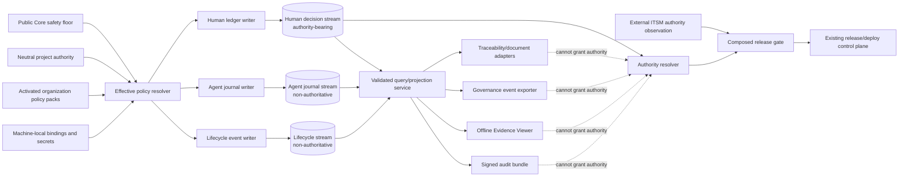
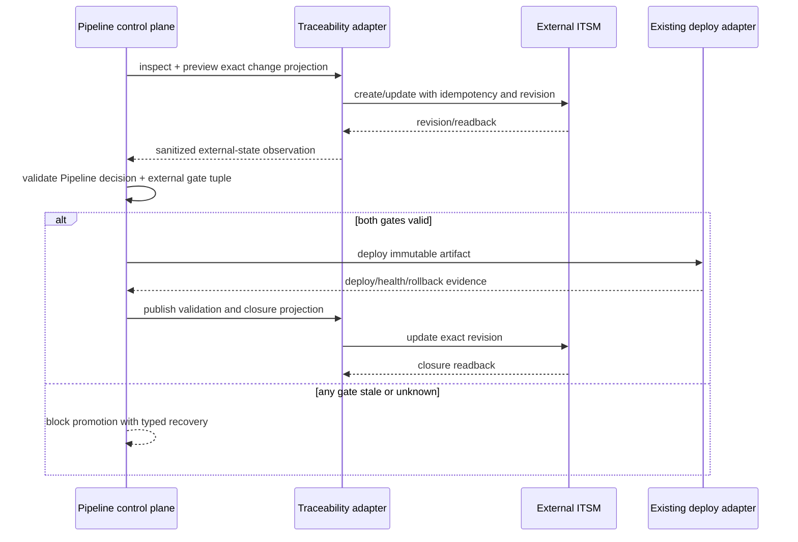
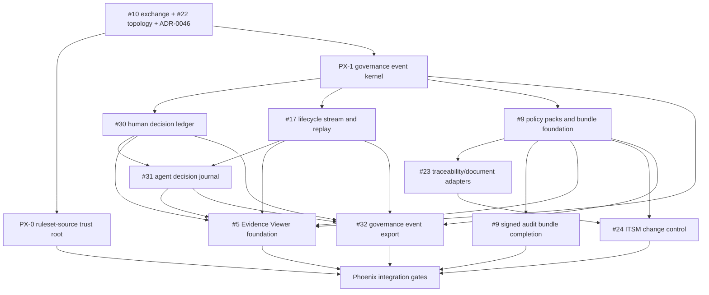

# Sprint Phoenix governance architecture

Status: draft design authority input

Date: 2026-07-26
Related: issues #5, #9, #17, #23, #24, #30, #31, #32

## 1. Architectural outcome

Phoenix adds a repository-owned governance data plane with three deliberately
separate canonical streams:

1. a **Human Governance Decision Ledger** for authority-changing human
   decisions;
2. an **Agent Decision and Assumption Journal** for material, explicitly
   declared, non-authoritative choices and assumptions; and
3. a **Lifecycle Event Stream** for deterministic and runner-observed
   coordination events.

The streams share a small envelope and correlation vocabulary. They do not
share payload schemas, retention defaults, or authority semantics.

Everything else in Phoenix is a consumer:

- organization policy packs constrain capture, retention, disclosure, external
  writes, and boundary gates;
- the Evidence Viewer renders a local human-readable projection;
- signed audit bundles package a bounded offline projection;
- traceability/document adapters project or reconcile explicitly owned fields;
- ITSM contributes a separate authenticated gate observation;
- the governance exporter produces sanitized one-way telemetry.

No projection can approve, waive, release, deploy, revoke, or repair Pipeline
authority.



Mermaid check: passed.

## 2. Binding invariants

### G-1 — One authority source per decision class

Only a valid human-ledger event can create a Pipeline human authority
transition. Mutable lifecycle state, an agent event, a viewer page, an audit
bundle, a delivery receipt, or an external status is insufficient.

External ITSM authority remains external. A composed gate proves both the
Pipeline decision and the separately authenticated external observation against
one immutable tuple; it does not copy one authority into the other.

### G-2 — Origin cannot be projected away

Every event has exactly one origin class:

- `human-decision`;
- `agent-declaration`;
- `deterministic-control`;
- `runner-observation`.

Destination mappings preserve origin and authority class. A lossy destination
must declare the loss and may be refused by policy.

### G-3 — Repository and candidate binding are explicit

Each portable event binds the repository authority root and, when material, the
feature, package, candidate commit/tree, artifact digest, environment, action,
rule, and validity window. Unknown or not-applicable values are typed; they are
never filled from ambient Git state after the event.

### G-4 — Append-only means new records

Correction, contradiction, expiry, revocation, supersession, compensation, and
recovery append new records. They never edit an earlier event.

### G-5 — Privacy precedes durability

Allowlisting, classification, size limits, and deterministic redaction happen
before portable persistence, outbox persistence, dead-letter storage,
diagnostics, metrics, preview, or export.

### G-6 — Operational state is not authority

Stream heads, query indexes, exporter cursors, adapter checkpoints, caches,
delivery queues, and search indexes are replaceable projections. Validators
reconstruct authority from immutable canonical records.

### G-7 — Unknown and unavailable are not success

Every boundary uses closed states. `unknown`, `unavailable`,
`omitted-by-policy`, `redacted`, `invalid`, and `not-applicable` remain distinct.
No adapter, replay, or UI maps one of them to a successful decision.

### G-8 — No hidden sibling dependency

Phoenix consumes #10 and #22 from the accepted base. It does not consume
unpublished Nova, Cyborg, or Nightwing commits. A later shared contract enters
only through a separately approved public integration.

## 3. Shared governance event envelope

The common envelope is intentionally smaller than any issue's proposed union of
fields. Payload schemas own domain-specific data.

### 3.1 Required core

`pipeline.governance-event-envelope.v1` contains:

- schema/version and payload schema;
- globally unique event ID and stable idempotency key;
- origin and authority class;
- event type;
- occurrence and observation time plus time-assurance class;
- repository fingerprint and public-safe source URI;
- stream ID, monotonically assigned sequence, previous event digest, and event
  digest;
- feature, package, request, session, dispatch, and trace correlation where
  available;
- candidate commit/tree and governed artifact references where material;
- policy, configuration, capture-policy, and redaction-policy digests;
- data classification, retention class, and disclosure class;
- payload digest and payload object.

Actor, agent, transport, approval, assumption, external-object, and delivery
fields belong to closed payload schemas, not the envelope.

### 3.2 Serialization and hashes

Portable records use UTF-8 JSON with:

- a closed JSON subset;
- duplicate-key rejection;
- Unicode scalar validation;
- integer-only numeric fields where possible;
- deterministic canonical serialization compatible with
  [RFC 8785 JSON Canonicalization Scheme](https://www.rfc-editor.org/rfc/rfc8785.html);
- SHA-256 for v1 record and chain digests.

The schema stores the algorithm and canonicalization profile so a future
version can migrate without reinterpreting v1 bytes. Signing does not reuse the
hash chain as proof of actor identity or trusted time.

### 3.3 Correlation

Repository, feature, package, request, dispatch, candidate, and evidence
identifiers are first-class. W3C trace identifiers may be carried only when
their provenance and privacy class are known. Phoenix aligns their representation
with the [W3C Trace Context Recommendation](https://www.w3.org/TR/trace-context/)
but does not require HTTP propagation or accept `tracestate` as governance
authority.

## 4. Canonical storage and writer

### 4.1 Physical topology

Phoenix extends ADR-0045 with a dedicated `governance-event` artifact class.
The proposed portable root is:

```text
governance/events/
  registry.json
  human/<stream-id>/<sequence>-<event-id>.json
  agent/<stream-id>/<sequence>-<event-id>.json
  lifecycle/<stream-id>/<sequence>-<event-id>.json
```

Each event is a new immutable file. A generated `heads.json` or query index may
exist, but it is explicitly a replaceable projection and cannot authenticate
itself.

This shape is chosen over a single mutable NDJSON ledger because:

- an earlier event is not rewritten by an append;
- Git merge conflicts and same-sequence forks are detectable rather than
  silently line-merged;
- individual events can carry independent retention/disclosure metadata;
- canonical records can be referenced by path and digest without byte-range
  ambiguity.

Offline NDJSON remains an export format, not the canonical repository format.

### 4.2 Writer transaction

One sanctioned writer performs:

1. resolve physical repository authority and stream registry;
2. validate the request and effective policy;
3. classify and redact the payload in memory;
4. lock the exact stream head;
5. re-read repository, policy, previous event, and candidate preconditions;
6. allocate sequence and event ID;
7. write a mode-safe same-directory temporary file;
8. fsync the file, atomically publish it, and fsync the directory where
   supported;
9. read back and revalidate exact bytes and chain;
10. update the replaceable head/index source-last;
11. return a sanitized receipt.

A concurrent writer either observes the new head and retries with the same
idempotency key or fails typed. It never creates a second valid event for the
same idempotency key.

### 4.3 Crash and fork matrix

| Observed state | Meaning | Sole recovery |
| --- | --- | --- |
| no final event, temporary present | pre-publication interruption | writer-owned cleanup after physical identity and age checks |
| final event valid, head stale | event committed; projection interrupted | rebuild/advance head after full chain validation |
| head names missing/invalid event | projection corruption | fail closed; reconstruct from last valid chain and record a recovery decision |
| two events claim one previous digest/sequence | concurrent or Git-merge fork | fail closed; human disposition plus compensating/superseding record |
| event exists with wrong repository fingerprint | cross-repository write | quarantine as invalid evidence; never consume |
| chain truncated/reordered/modified | tampering or incomplete checkout | fail verification and all dependent authority claims |
| idempotency replay matches exact event | safe retry | return existing receipt with zero write |
| idempotency replay conflicts | ambiguous duplicate | fail closed |

The writer never deletes a published canonical event as recovery.

## 5. Human Governance Decision Ledger

### 5.1 Authority model

The human stream is the historical source for:

- plan and feature approval/revocation;
- push, merge, release, promotion, and deployment consent;
- guard or policy exception, suspension, restoration, and consumption;
- risk acceptance/rejection/review/expiry;
- destructive or high-impact action consent;
- emergency and ITSM-related Pipeline decisions;
- correction, supersession, and migration observations.

A request and a decision are separate events. The authority resolver consumes
only valid authority-bearing outcomes and verifies their scope, assurance,
expiry, consumption, revocation, and policy binding.

### 5.2 Honest attribution

The payload carries:

- actor class and public-safe actor reference;
- attribution source;
- identity-assurance class;
- timestamp and time-assurance class;
- authorization source;
- outcome and stable reason code;
- bounded rationale only where policy requires it;
- exact scope tuple and evidence references;
- single-use, expiry, consumes, revokes, supersedes, and compensates links.

A local user label is not presented as cryptographically verified identity.
Signature and trusted-time references are optional, separately verified
assurance.

### 5.3 Migration

Existing approval state, override ledgers, deploy approvals, release records,
and receipts are inventoried. A legacy record becomes:

- a verified imported decision only when its original scope and authority can
  be proven; or
- an explicitly unverified migration observation.

No historical actor, time, rationale, or approval is reconstructed from chat or
mutable state.

## 6. Agent Decision and Assumption Journal

### 6.1 Materiality

An agent event is required when a declared assumption or selection can affect:

- an authority request or policy interpretation;
- security/privacy posture;
- repository, artifact, or candidate identity;
- external side effects;
- runner/model/profile/role routing;
- work decomposition or package boundaries;
- verification or review scope;
- recovery/fallback;
- release readiness or resulting implementation.

Formatting choices, token-level reasoning, routine reads, and repeated
unchanged status observations are not journal events.

### 6.2 Prohibited content

The schema rejects:

- hidden reasoning, scratchpads, or chain-of-thought;
- raw prompts or complete conversations;
- unrestricted terminal/tool logs or environment dumps;
- credentials, tokens, account details, and private paths;
- source/document bodies already available as governed artifacts;
- speculation about a person's identity or intent.

The preferred representation is stable reason codes, selected option IDs,
bounded alternatives, evidence references, uncertainty state, revalidation
trigger, and expected/observed effect.

### 6.3 Assumption lifecycle

`assumed`, `inferred`, `observed`, `verified`, `contradicted`, `unavailable`,
and `unknown` are distinct. Verification, contradiction, expiry,
invalidation, or supersession creates a linked event. A material change
identifies affected packages/candidates and invokes the existing invalidation
control rather than rewriting history.

## 7. Lifecycle event stream and replay

The lifecycle stream normalizes only governance-significant events:

- dispatch admission/rejection/status/cancellation;
- candidate and authority change/invalidation;
- verification and independent review outcomes;
- gate request/decision references;
- recovery proposal/rejection/apply/readback/rollback/cleanup;
- external projection and reconciliation outcomes.

It consumes `pipeline.control-execution-exchange.v1` for the minimum
control/execution identity. Runner-specific data appears only in registered
namespaced extensions.

The local replay:

- validates every source event before rendering;
- orders within each stream and uses correlation edges across streams;
- never invents a total order where clocks/streams cannot prove one;
- highlights gaps, forks, invalidated candidates, and unavailable observations;
- links to human decisions and agent declarations while preserving their
  classes;
- is a view, never a state writer.

## 8. Effective policy plane

### 8.1 Sources

Effective policy is assembled from:

1. Public Core safety floors and schema capabilities;
2. the neutral project authority layer;
3. explicitly activated, versioned organization packs;
4. machine-local endpoint/credential bindings.

Generated `.claude/**` and `.codex/**` files remain projections. Private
bindings do not become portable policy.

### 8.2 Merge strategies

There is no generic last-writer-wins precedence. Each policy field declares one
strategy:

- `immutable-floor` — lower layers cannot weaken it;
- `set-intersection` — effective permissions are the intersection;
- `most-restrictive` — retention/export/failure mode tightens;
- `single-owner` — exactly one layer owns the value;
- `authority-gated-exception` — only a core-declared exception class plus a
  matching human-ledger decision may change the effective value.

Unknown fields, incompatible schema versions, conflicting single-owner values,
invalid signatures, missing dependencies, or unsupported rules fail
activation. A deterministic preview shows source, effective value, conflict,
and change impact before apply.

### 8.3 Portable versus local

Policy packs may contain portable rules, mappings, required document classes,
retention classes, adapter capability requirements, and public-safe binding
IDs. Endpoints, tenant/project coordinates, credentials, private actor
resolution, client certificates, and signing keys remain machine/operator
managed.

## 9. Evidence Viewer and audit bundles

### 9.1 Evidence Viewer

One offline command builds static HTML from validated #22 artifacts and
governance streams. It renders:

- package/candidate identity;
- plan/spec/result and lifecycle state;
- human decision timeline;
- agent assumptions and verification state;
- checks, Critic outcomes, exceptions, and blockers;
- export/publication/reconciliation status;
- provenance links and integrity failures.

Rendered status labels distinguish fact, estimate, assumption, human decision,
unknown, unavailable, redacted, invalid, and not-applicable. The report has a
content security policy, no active network dependency, accessible structure,
and responsive layout.

### 9.2 Signed audit bundles

A bundle contains a closed manifest of exact source paths/digests, schema and
policy versions, candidate/release binding, integrity-chain heads, selected
sanitized records, and verification results.

Signing is optional and uses an external/operator-managed key interface.
Phoenix defines a detached-signature profile and may use the pinned
[DSSE v1.0.2 envelope](https://github.com/secure-systems-lab/dsse/blob/v1.0.2/envelope.md)
with the pinned
[in-toto Attestation Framework v1.2.0 Statement v1](https://github.com/in-toto/attestation/blob/v1.2.0/spec/v1/statement.md)
as interchange profiles. DSSE/in-toto do not provide key custody, trusted
time, legal identity, retention, or regulatory compliance by themselves.

The unsigned manifest remains offline-verifiable for content integrity. A
signature adds only the assurance proven by its key and verification policy.

## 10. External traceability and governed publication

### 10.1 Adapter contract

Every adapter declares:

- profile and conformance version;
- supported object types, relations, fields, and operations;
- ownership modes (`pipeline-owned`, `external-owned`, `projection-only`,
  `independent`, `unsupported`);
- target revision/readback capability;
- idempotency, retry, ordering, rate-limit, and conflict behavior;
- payload/response limits and authentication profile reference;
- privacy, residency, and retention metadata where known.

The operation sequence is `inspect -> preview -> authorize -> apply ->
readback`. Unknown capability, target drift, revision conflict, partial write,
or readback mismatch cannot be reported as success.

### 10.2 Authority boundary

Default mode is reference-only or outbound projection. Bidirectional fields
require explicit ownership and deterministic conflict handling. Human approval,
Critic verdict, release authority, security disposition, and candidate evidence
cannot be imported from ordinary external text/status fields.

External content and webhooks are untrusted data and never executable
instructions.

## 11. ITSM change control

The change-control contract consumes the generic adapter for mechanics but owns
its own typed lifecycle:

`not-required -> draft -> submitted -> assessment -> awaiting-approval ->
approved -> scheduled -> implementing -> validation -> completed`

and terminal/exception states:

`rejected | cancelled | expired | failed | unknown | conflict |
reconciliation-required`.

Standard, normal, emergency, and not-required classes are distinct policies.
Classification cannot be selected solely to avoid approval.

Promotion requires two separately validated inputs:

1. the existing Pipeline release authority and candidate-bound evidence;
2. the authenticated external change observation, revision, artifact,
   environment, scope, schedule, and validity.



Mermaid check: passed.

A successful deploy followed by an external update failure becomes
`reconciliation-required`; it does not erase the deploy and cannot claim fully
closed change control.

## 12. Governance event export

### 12.1 Projection boundary

The exporter reads only validated canonical events through the query service.
It applies a destination-specific, default-deny export policy before an entry
enters any queue.

The neutral envelope aligns with:

- [CloudEvents 1.0.2](https://github.com/cloudevents/spec/blob/v1.0.2/cloudevents/spec.md)
  for interoperable event identity/source/type/subject/time/data schema;
- the stable, pinned
  [OpenTelemetry 1.59.0 Logs Data Model](https://github.com/open-telemetry/opentelemetry-specification/blob/v1.59.0/specification/logs/data-model.md)
  and a pinned OTLP mapping for structured collector delivery;
- [RFC 5424](https://www.rfc-editor.org/rfc/rfc5424.html) for an explicitly
  lossy legacy syslog profile;
- canonical NDJSON for offline transfer and fixtures.

As of 2026-07-26 the referenced CloudEvents and OpenTelemetry versions are the
verified immutable source profiles. Phoenix pins their tested OTLP/protobuf and
adapter mappings in manifests; it never follows a moving specification branch
implicitly.

### 12.2 Machine-local durable outbox

Per-destination queue/cursor state lives under the physical Git common
directory or another sanctioned machine-local root. It is not committed and
not authority.

Only already-sanitized projections enter the outbox. Each destination has an
independent queue, cursor, policy digest, retry budget, health state, and
dead-letter area.

Delivery is at-least-once with stable source/event idempotency. Ordering is
claimed only within one canonical stream when the adapter supports it. Partial
acknowledgement advances only accepted events.

### 12.3 Failure modes

Destinations support:

- `disabled`;
- `advisory` (default);
- `required-at-boundary`;
- `required-continuous` only under explicit organization policy.

A required boundary names the exact event range and lifecycle boundary. A
generic destination outage does not freeze unrelated local work. Delivery
acknowledgements prove only the adapter's declared acknowledgement semantics,
not retention, immutability, analyst review, or compliance.

## 13. Runner-neutral ruleset source

Phoenix introduces `pipeline.ruleset-source.v1`, a normalized observation used
by bootstrap and freshness checks.

### 13.1 Runner adapters

- **Codex:** native `codex plugin list --json` readback supplies selected plugin
  name, version, loaded/installed identity, and sanitized marketplace source.
- **Claude:** its native installed-plugin and marketplace registries supply the
  equivalent observation.
- **Self-application:** the loaded plugin root is matched to the current Public
  checkout and exact Git/content identity.
- **Local development:** a registry-validated local source is explicit and not
  misclassified as stale remote content.

The common resolver never requires `.claude/settings.json`, `.codex` project
files, or consumer `HEAD` merely to identify the loaded plugin.

### 13.2 Freshness

The common freshness service receives the normalized loaded source and uses the
selected host network-open/read-only boundary to observe the public remote.
It distinguishes:

- loaded identity unavailable;
- installed identity unavailable;
- marketplace source unavailable;
- remote/network unavailable;
- equal, ahead, behind, diverged;
- loaded/installed mismatch;
- self-application and local-development.

A pre-HEAD consumer is valid. Diagnostics expose no token, private registry
path, home directory, private remote, or account coordinate. A private
marketplace source is classified but not exported.

## 14. Workaround and recovery audit profile

PX-B defines a correlation profile, not a new authority store.

| Required fact | Canonical record |
| --- | --- |
| trigger and evidence gap | agent journal |
| original sanctioned path and typed rejection | agent journal + lifecycle event |
| proposed alternatives and selection | agent journal |
| human exception/authorization | human ledger |
| mutation operation class and public-safe target binding | lifecycle event |
| preimage/postimage digests and candidate binding | governed evidence reference |
| private-data boundary and omitted fields | redaction-policy digest + typed omissions |
| rollback/recovery authority | human decision or existing policy reference |
| applied/read-back/rolled-back/cleaned-up result | lifecycle event |

For the bootstrap recovery that motivated this requirement, the portable audit
record may say that a protected lifecycle repair was rejected, a human
performed a bounded local restoration, exact public-safe files were restored,
the repository was re-read as ready, and no remote write occurred. It must not
retain a home-directory prefix, raw shell history, SSH key path, token,
private configuration content, or unrestricted console output.

## 15. Security and privacy posture

Threats include:

- forged or replayed human decisions;
- agent events interpreted as approval;
- stream truncation/fork/reordering;
- repository/path substitution and unsafe symlinks;
- compromised adapters or destinations;
- forged acknowledgements and schema downgrade;
- external-content prompt/command injection;
- secrets in errors, previews, metrics, queues, or dead letters;
- malicious high-cardinality fields and resource exhaustion;
- cross-repository/private-coordinate leakage;
- mutable projections authenticating themselves.

Controls include closed schemas, repository/candidate binding, canonical bytes,
hash chains, idempotency, size/count limits, allowlisted fields, redaction
before persistence, physical-path checks, endpoint scheme/allowlists, TLS
requirements, least privilege, source-last projections, exact readback, and
separate authority resolution.

Regulatory references guide controls without becoming product claims:

- [NIST SP 800-53 Rev. 5](https://csrc.nist.gov/pubs/sp/800/53/r5/final)
  Audit and Accountability controls;
- [GDPR Article 5](https://eur-lex.europa.eu/eli/reg/2016/679/2016-05-04/eng)
  purpose limitation, data minimization, storage limitation, and integrity;
- [Regulation (EU) 2024/1689](https://eur-lex.europa.eu/eli/reg/2024/1689/oj?locale=en)
  traceability, technical documentation, and logging concepts when an adopting
  system is actually in scope.

Phoenix documentation must state that technical support does not establish
legal applicability or compliance.

## 16. Dependency graph and delivery waves



Mermaid check: passed.

Delivery waves:

1. **Trust root and kernel:** PX-0 plus shared envelope, event store, policy
   hooks, integrity verifier, and topology extension.
2. **Canonical streams:** #30, #17, and #9 foundation; #5 begins with base
   artifacts.
3. **Dependent records/adapters:** #31 and #23.
4. **Enterprise consumers:** #24, #32, signed bundle completion, and full #5.
5. **Migration and integration:** existing authority paths, backlog regression
   inputs, privacy/security matrix, end-to-end Verify, Critic, and operator
   documentation.

Repository WIP remains one implementation package at a time. Parallelism is
limited to independent read-only review or testing; no two writers own the same
files or event stream.

## 17. Rejected architecture alternatives

| Alternative | Rejected because |
| --- | --- |
| One generic audit log for all events | It allows observations or agent records to be confused with human authority and forces one unsafe retention policy. |
| Store only mutable current state | It cannot reconstruct request, decision, consumption, revocation, expiry, or supersession. |
| Use Git history alone as the ledger | Commits do not provide the closed decision taxonomy, scope, assurance, or idempotency semantics. |
| Make an issue tracker, wiki, ITSM, or SIEM canonical | External status/text would become an authority bypass and offline operation would fail. |
| One provider-specific enterprise integration | It puts product names and proprietary semantics in core schemas and couples credentials/failures. |
| Bidirectional last-write-wins sync | It destroys field ownership and can overwrite authority-bearing content. |
| Export raw source records then redact at the collector | Secrets and private data would already exist in queues, logs, dead letters, and transports. |
| One mutable NDJSON file per stream | Concurrent Git writers and interrupted appends create ambiguous merge/recovery semantics. |
| Exactly-once delivery claim | The supported destinations cannot prove it uniformly; stable idempotency plus at-least-once is honest. |
| Use `.claude/settings.json` as common marketplace authority | A runner-specific project file is absent in valid Codex-only and pre-HEAD consumers. |
| Depend on Nova's unpublished executor/replay work | ADR-0043 requires independent Sprint closure; #10 is the accepted minimum exchange. |
