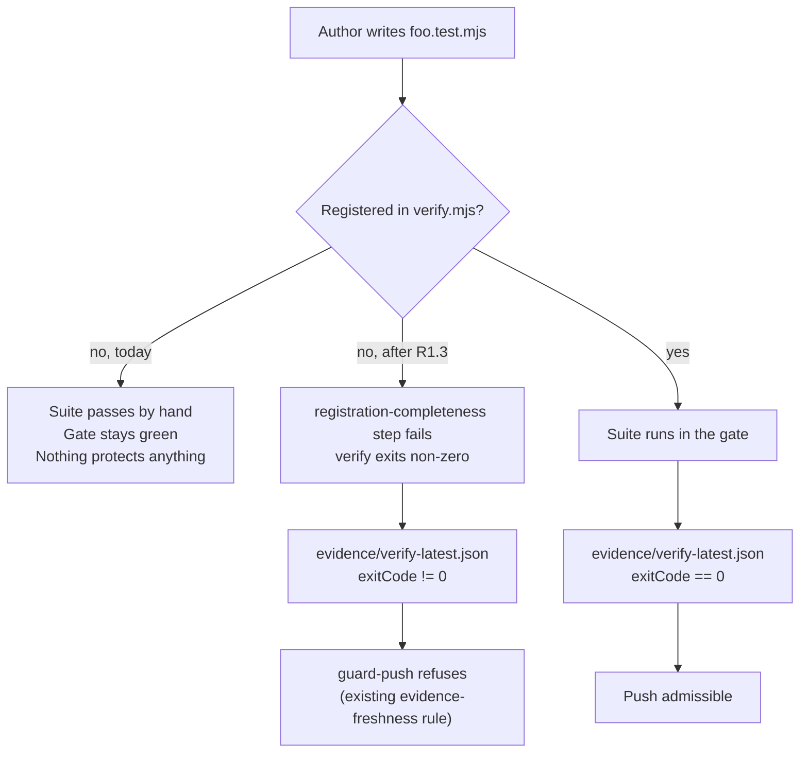

<!-- po-language: en -->

# Phase plan — Phoenix: gate integrity and residual closure

> Product-review content for the Product Owner gate, in PRD form. Status:
> `draft — awaiting PO approval`. Feature `sprint-phoenix-epic` · profile `epic` ·
> rigor 2 · risk high. Approval authorizes exactly the first implementation
> dispatch of this phase; push, merge, release, external writes, and final
> acceptance keep their own gates.
>
> **Why this is not named `prd_*.md`.** The PO gate enforces exactly one
> `prd_*.md` per active feature directory (`PO-GATE-PRD-CARDINALITY`, repair text:
> "do not create child PRDs"). The bound PRD for this feature is and remains
> [prd_phoenix-epic.md](prd_phoenix-epic.md). This document is the phase plan
> beneath it — the same content a PRD carries, without claiming the authority slot
> a second PRD file would silently contest. The lifecycle approval is recorded
> against the bound PRD; this document is what that approval is *about*, and the
> bound PRD points at it.
>
> This document does not re-open the parent PRD's scope and does not rebind the
> Spec. Where it changes a bound acceptance criterion (H-AC-11, §R4) it says so
> and treats that as its own gated step.

## Status of the preceding phase

The design phase is closed. Every design package carried into this phase passed
an independent Critic review under the four-round cap:

| Package | Rounds | Final verdict | Review artifact |
| --- | --- | --- | --- |
| R1 — bootstrap attestation gate protection | 4/4 | PASS, no findings | `evidence/phx-r1-rework-3-critic-review-21b24c4.md` |
| R2 — marketplace-install threat model | 1 | PASS | `evidence/phx-r2-threatmodel-rework-critic-review-ad5d185.md` |
| R3 — dispatch-template citation drift | 3 | PASS, no findings | transcript; rework at `faf6909`, Part III reconciled `84c5c0f` |
| PHX-LEDGER-INTAKE — GMW/HGO evidence into the human decision ledger | 4/4 | PASS, one minor | `evidence/phx-ledger-intake-rework-3-critic-review-9ba73ba.md` |

The plugin 0.5.3 merge landed as `35d9e11`, which releases the sequencing
constraint R3's sweep was waiting on.

## What

This phase closes what the design phase measured but did not repair. It has one
organizing idea: **a gate that cannot be trusted to run is worse than no gate**,
because it produces the appearance of coverage. Three of the five work streams
below exist because that failure mode was observed in this repository within the
last two days, not because it was anticipated.

1. **Verify-gate integrity.** Make the gate's coverage self-evident and make its
   current red state either green or owned.
2. **Residual closure.** Finish R1 and execute R3's PO-decided B3 sweep.
3. **Ledger intake, increment 1.** Implement the design that passed round 4.
4. **Recorded-decision hygiene.** Land four PO decisions (§R4–§R7) that are
   currently carried as open items in the handover rather than in artifacts.

## Why

On 2026-08-08 the verify gate ran end to end for the first time in some time. It
had not been slow, flaky or partially green: a single duplicated suite
registration, introduced by a *clean* auto-merge, made
`plugins/pipeline-core/lib/verify-resume.mjs:114` throw before planning
anything. **Zero suites started.** Every dispatch in that window honestly
recorded "verify not run", and nobody could say what it would have reported.

When it ran, it reported 257 of 261 steps passing and four failures — none of
them new breakage, all of them things a gate that could not start had stopped
saying out loud.

A second measurement in the same window found that **109 of 349 test files are
registered nowhere** (31%), including all four security adapters and both suites
covering the human-authorization surface. The cause is structural, not
carelessness: `harness/scripts/verify.mjs` is TP-3-protected, so an author
cannot register a test in the same dispatch that writes it, and hand-offs get
dropped. It has now happened three times in one feature area.

Neither number was discoverable by review. Both were discoverable by running one
command that had silently stopped working.

## Scope

### R1 — Verify-gate coverage becomes self-enforcing

**R1.1 — Register the green backlog.** 102 of the 109 unregistered suites pass;
total runtime for the green set is 16.8 seconds. Register them in reviewable
batches, each independently revertible. Classification report:
`evidence/unregistered-suite-classification.md`.

**R1.2 — File the red seven, do not register them.** Three fail with
`SyntaxError: … does not provide an export named …` — they are written against a
module surface this tree does not have. They are *stale*, not broken, and
registering them would turn the gate red on arrival. One,
`windows-assurance-verify-registration.test.mjs`, is itself unregistered *and*
red on exactly one check (`WAVR19`) — a suite that pins a property of the verify
entry point, outside the gate, failing.

**R1.3 — A registration-completeness check, as a verify step.** A check that
fails when a `*.test.mjs` file under the registered roots has no registration
entry, and when a registration entry names a file that does not exist. This is
the only one of the three considered options that makes the gap visible without
a reviewer.

**The push gate needs no new check, and this is the design point worth stating
explicitly.** `plugins/pipeline-core/hooks/guard-push.mjs:1577-1578` already
requires a commit-bound `evidence/verify-latest.json` with `exitCode === 0`
before any push is admitted. A registration-completeness step inside verify is
therefore *already* enforced at the push gate, transitively, with no second
implementation and no second place for the two definitions to drift apart. A
separate push-gate check would also catch the defect at the worst possible
moment — after the work is done.

**R1.4 — Prevent the duplicate-registration class.** The same check validates
that the registration arrays contain no duplicate suite id and no missing file.
`verify.mjs` auto-merged cleanly and produced an invalid registration; the cost
was total gate loss with no signal.

### R2 — The four current verify failures get owners

Filed together as one item because they became visible in one instant, for one
reason; they are triaged separately.

| # | Failure | Disposition |
| --- | --- | --- |
| 1 | `authority-tier-agreement-check` — `TIER-DRIFT`: `project/` tier carries TP-1…TP-11, `.claude/` tier only TP-1…TP-10 | **First.** Treated as a guard-family defect, not a test defect: a protected-test-path rule whose presence depends on which authority tier a project resolves to is protection by accident of layout. Adjacent to R3.2 below, which adds a row to the same list. |
| 2 | `product-capability-inventory-tests` — `HAW-A02` rejects an admissible shape (`check-product-capability-inventory.test.mjs:124`) | Read before fixing. `HAW-A00`/`A01` pass, so the validator works and one specific shape is wrongly refused. |
| 3 | `security-scan-tests` — 13 gitleaks fingerprints still pinned at `9dd9c5b1` | **PO decision, 2026-08-08: approved.** These are the repairs made while the pipeline was in the merge deadlock. They are legitimate, not unexplained suppressions. The work is therefore to record that justification and re-baseline the entries against their current commits — **not** to relax the assertion, which exists to catch suppressions nobody re-justifies. |
| 4 | `backlog-state-check` — 39 ledger events whose `evidence.commit` is unreachable | Events 14–38 are a contiguous block, which points at one episode rather than 25 mistakes. Expect one explanation and one repair. |

**Not bundled with R1.** R1 asks what *should* be in the gate; R2 is about what
the gate says now. Answering them together invites registering suites to dilute
a red.

### R3 — Residual closure

**R3.1 — R3's B3 citation sweep.** PO decision APS 2026-08-07: all 39 live
agent-facing artifacts, classes C1–C8, both language halves. The design writes
replacement text for class C1 only and line coordinates for five files; 34 files
existed as class counts, not as coordinates, and the design says so in its own
§II.5 tier 3.

**The re-measurement is done** (2026-08-08, at `84c5c0f`, in two dispatches):
`evidence/phx-r3-b3-inventory-c1-c5.md` and
`evidence/phx-r3-b3-inventory-c6-c8.md` carry the complete per-line inventory
with a drafted replacement for every citation.

| | Design (§II.1.3, pinned at `84876f1`) | Measured at `84c5c0f` |
| --- | --- | --- |
| C1–C5 | 144 | **145** |
| C6–C8 | 89 | **93** |
| **Total** | **233** | **238** |

Every delta runs in the "found more" direction and each is explained by a named
line. No file carries fewer citations than the design states. The C1–C5 grand
total converging to within one of the design's figure is coincidental — the
per-file deltas are real and offsetting, and the inventory says so rather than
presenting the total as confirmation.

Acceptance criteria AC-R3-1..AC-R3-7 already exist in the design and bind
unchanged. AC-R3-1's method requirement is load-bearing and is repeated here
because two prior measurements failed it: **search for the section sign, not for
the string `operating-model`.**

**Guard protection: none, and therefore no approval cost.** The inventory
established from `GATE_STRENGTH_PATHS` and from the resolved live-plugin root —
not by assumption — that no file in C6, C7 or C8, and not
`harness/scripts/check-claude-md-lines.mjs`, is refused by any GS-* path-table
rule, by GS-6, or by a protected-test-path rule in this checkout. The repository's
own `plugins/pipeline-core/**` is a source tree here, not the enforcing copy.
**The B3 sweep therefore adds zero human approvals.** The GS-6 half of that
result is session- and host-configuration dependent and must be re-confirmed by
whoever runs the sweep in their own session; the GS-* path-table half is a
property of the files and is not.

### R3.4 — The stage-0 fast path cites a definition that does not exist

Found by the C1–C5 inventory while drafting replacements, and escalated here
because it is not a citation-hygiene defect.

`roles/elephant.md:35` carries EL-01's only exception — the rule that permits an
interactive Elephant session to write production code itself. It scopes that
exception "**EXCLUSIVELY** to the OM §3.3 definition … do not extend it by local
judgment". `harness/checklists/small-session.md:38-40` invokes the same
definition and links the anchor `stage-0-smallfix-definition`.

**Neither exists.** `docs/operating-model.md` does not contain the criteria, and
`git log -S "25 diff lines" -- docs/operating-model.md` returns nothing — the
string has never appeared in that file's history, so this is not drift from a
restructure. The anchor `stage-0-smallfix-definition` appears nowhere in the
target either, and `check-doc-contracts.mjs` passes because it validates
Markdown links and anchors, not `§N` prose citations (the design's §II.3.1 says
exactly this about the checker's reach).

The criteria therefore exist only as parentheticals inside the two sentences that
cite the missing target — **and the two parentheticals disagree**:
`roles/elephant.md` excludes "architecture/schema/public-API/test/guardrail-hook-CI/
dependency/security-surface" changes; `harness/checklists/small-session.md`
excludes "architecture/schema/API/test/guardrail". An agent cannot check its own
eligibility against the named authority, and the two available restatements do
not bound the same set.

**Why this cannot be swept mechanically.** For roughly thirty citations in this
class, "repoint to the correct heading" has no correct heading — there is nothing
to point at. Repointing them to the nearest plausible section would convert a
kind-A defect (dead number) into a kind-B defect (resolves, wrong topic), which is
the outcome R3 exists to remove.

**Decided (PO, 2026-08-08): option (b)** — `roles/elephant.md` becomes the single
definition site, every citation is repointed there by heading title, and
`harness/checklists/small-session.md` is reduced to a reference. The surviving
text is the **broader** of the two exclusion sets, because making one canonical
decides which set the rule has and the exception should admit fewer changes, not
more. The options as presented and the rationale are in decision point 4; the
criterion is **AC-P11**.

**R3.2 — R1's remaining acceptance criteria.** AC-R1-5, AC-R1-8 (the GS-4
protected-test-path row) and the export-set half of AC-R1-1. AC-R1-8 touches the
same list as R2 failure 1 and should be sequenced with it.

**R3.3 — The coordinate-checker defect.** Bare-basename suffix resolution
produced five silent wrong-file greens, disclosed in the R3 design's §II.8 and
not yet filed as its own item.

### R4 — O-4: amend H-AC-11 for GMW

**Re-measured against the current plugin candidate `0.5.4+claude.20260808021712`
on 2026-08-08, as the PO requested. The finding stands unchanged**:
`plugins/pipeline-core/lib/guard-maintenance-window.mjs` is byte-identical
between that candidate and this tree, so the GMW machine-local record still
carries `subject.reason` in clear text plus `proof.publicKey`/`keyReference`.

The underlying result is an impossibility proof, not a gap: no identifier scheme
satisfies both clauses of H-AC-11 at once. Every candidate correlator
(`scope.candidate`, `scope.artifacts[].sha256`, `validity.expiresAtEpochMs`,
`ruleDigest`) is byte-identical to, or recomputable from, a value held by
whoever holds the machine-local record. For HGO the join reaches only digests;
for GMW it reaches clear text.

**Decision (PO, 2026-08-08): amend the criterion.** The alternative — changing
GMW's machine-local record so nothing attributing remains — edits a module the
Nova session owns, and two sessions editing one module is a collision this
project has already paid for once. Amending makes the concession auditable;
changing the record hides it in code.

*This is the one item in this phase that edits a bound acceptance artifact
(`acceptance.md`). It is called out as its own step so approval of this PRD is
not mistaken for approval of an unreviewed acceptance change.*

### R5 — O-5: the window singleton, documented rather than designed around

`window.json` is a `writeAtomic` singleton while the ledger can hold two live
grants, so two *distinct* concurrent requests diverge. **Decision (PO,
2026-08-08): leave it, documented.** Two concurrent distinct maintenance windows
are not a reachable state for a single-human PO. The cost of designing around it
today is an unrequested design change; the cost of not recording it is that
someone generalizes the mechanism later without knowing.

### R6 — P5: no kernel-list entry, and the reason recorded

P5 asked whether `plugins/pipeline-core/lib/public-core-origin-allowlist.mjs`
belongs in `NEVER_LIFTABLE_KERNEL_PATHS`. Read against the merged code, an entry
there is **inert for GS-8**: that list is consulted only on the GS-6/GMW branch,
and a path-table rule never reaches it. It would bite only where the file sits
inside the currently-enforcing plugin root — and there GS-6 matches first, before
the path table is consulted at all.

**Decision (PO, 2026-08-08): do not add it; record why.** An inert entry in a
kernel list is worse than no entry, because the next reader takes it for
protection that exists. If the self-hosted layout is to be defended, that is a
separate, named requirement.

### R7 — Backlog item taxonomy gains `requirement`

Two authors, in different sessions, independently reached for `requirement` and
`improvement`; the canonical set is
`workflow-improvement | tooling-radar | defect | idea` and has no slot for a
PO-stated obligation. **Decision (PO, 2026-08-08): add `requirement`.** A
taxonomy two writers independently miss is not a taxonomy that was used wrongly.

### R8 — Ledger intake, increment 1

The design passed Critic round 4 with one minor, which the reviewer explicitly
recommended correcting "in the next touch rather than gated on"; that correction
plus the lagging §14 correction-log entry are being made now, without a further
review round (PO decision, 2026-08-08). Implementation of increment 1 follows the
design as written, including its disclosed non-conformances (§14, O-1..O-5).

## Non-goals

- **The one-approval mechanism itself.** Assigned to the Nova session by explicit
  PO decision. This phase consumes whatever approval surface exists; it does not
  redesign it. See §"Approval budget" for what that costs here.
- **Registering the seven red suites** (R1.2) — filed, not fixed.
- **`docs/adr/**`, `specs/**`, `backlog/**` citation repair** (classes C9/C10).
  ADRs are dated records; rewriting an ADR's basis line rewrites the record.
- **Restructuring `docs/operating-model.md`.** R3 repairs citations; it does not
  move the target. The two alias anchors are reported, not removed.
- **A prose-citation lint.** Recorded as the follow-up that would make the R3
  class non-recurring, deliberately not folded into this phase.

## Approval budget — stated as a number, because that is the acceptance test

The PO's standing rule is that the pipeline must not repeatedly send a human out
of session to run commands; the measure is *how many commands, how often*, not
whether one approval is formally sufficient. This phase's honest count:

| Protected surface | Rule class | Liftable by a maintenance window? | Human commands |
| --- | --- | --- | --- |
| `harness/scripts/verify.mjs` — all R1 registrations and the new step | TP-3 | **Yes** — `TP-*` is in `LIFTABLE_RULE_IDS`' prefix set | **1** signature covers every registration in R1, in one time-boxed window |
| Protected-test-path row (R3.2 / AC-R1-8) | GS-4 | No — only `GS-6` and `TP-*` are liftable | 1 |
| `.claude/`-tier TP-11 row (R2 failure 1) | GS-class | No | 1 |
| The eventual push | push gate | n/a | 1 |

**Total: four human commands for the whole phase**, of which one covers an
unbounded number of suite registrations. That is the number to beat, and it is
recorded here so the Nova mechanism has something to be measured against.

**Confirmed against measurement, not estimated.** The largest work stream in this
phase — B3's sweep over 39 files and 238 citations, including the shipped plugin
tree and one executable — was the open risk in this table. The inventory
established that it is refused by nothing (§R3.1), so it adds **zero**. The four
above are the whole cost.

**Two observations from the 0.5.4 candidate, relevant to that mechanism.** It
adds `authorize-critical`, a single human-terminal command that prepares and
signs a critical-action request in one invocation — precisely the "collapse the
ceremony" shape the backlog item proposed, and it removes two of the three
commands from the push lane. It does **not** reach the guard-lift lane:
`guard-gate-strength.mjs:296,302` still names "the PO edits this file directly,
outside an agent session" as the escape hatch, and `LIFTABLE_RULE_IDS` is
unchanged at `["GS-6"]` plus the `TP-` prefix. The critical-action lane got the
fix; the guard-lift lane did not.

**Correction (2026-08-08, measured against this tree during implementation).**
The sentence above overstates the escape hatch, and the difference matters to the
PO's standing rule rather than to the count. Read at
`plugins/pipeline-core/hooks/guard-gate-strength.mjs:308-318`, "the PO edits this
file directly, outside an agent session" is the **GS-6 branch only** — the string
sits inside a ternary on `matched.id === "GS-6"`. Every other rule in the table,
GS-1..GS-5 and GS-7, takes the else branch and is routed through the ordinary HGO
override (`:249-300`): the guard plans the exact edit, the human authorizes that
one tool call, and the mode follows whatever `gates.push_approval` is actually
committed.

**So neither of this phase's two GS-class rows requires the PO to edit a
configuration file by hand outside a session.** Both are ordinary
signature-backed authorizations of one exact, audited edit. The *number* of human
commands is unchanged at four — HGO binds one signature to one tool call, and the
two rows live in two different files, so they cannot share one — but the *kind*
changes: four authorizations, zero hand-edits of protected configuration.

That distinction is the acceptance test the PO actually stated. It is recorded
here because the table above was written from the earlier reading and would
otherwise be cited as evidence that the guard-lift lane still demands manual file
surgery.

## Risks and mitigation

| Risk | Mitigation |
| --- | --- |
| Mass registration (R1.1) turns the gate red on arrival and a genuine regression hides among inherited failures | Only the 102 measured-green suites are registered, in independently revertible batches. The 7 red are filed, never registered. |
| The B3 sweep (R3.1) applies replacements derived from a stale inventory | The sweep opens with a re-measurement at the current tree, explicitly treating the design's C8 figures as a prior rather than a target. |
| A kind-B citation is "repaired" to another wrong section | Kind B is only detectable by reading the citing sentence against the heading; the inventory records the claimed topic and the actual heading side by side, so the judgement is reviewable rather than implicit. |
| Repairing R2 failure 3 by relaxing the assertion | Explicitly out of scope: the assertion is the thing that catches unjustified suppressions. The PO approval covers the 13 entries, not the rule. |
| Bilingual files half-corrected | AC-R3-6: both halves in the same commit, or the file is explicitly excluded. |
| Concurrent dispatches invalidate each other's measurements | While a dispatch is open, no file in its reference set is modified — including by the orchestrator. This rule was broken twice in the preceding session; the durable fix is mechanical and is recorded as a follow-up, not claimed as solved. |

## Acceptance criteria

Testable, and migrating into [acceptance.md](acceptance.md) on approval rather
than being maintained here.

- **AC-P1** `node harness/scripts/verify.mjs` exits 0, or every non-zero step has
  a named owner and a filed item. The run's registered-step count is stated.
- **AC-P2** Adding a `*.test.mjs` file under a registered root without a
  registration entry makes verify exit non-zero. Demonstrated by deliberate
  break and restore, not asserted.
- **AC-P3** A duplicate suite id in any registration array makes verify exit
  non-zero with a message naming the duplicate — rather than throwing before
  planning, as it does today.
- **AC-P4** No `§N`/`§N.M` reference to `docs/operating-model.md` remains in any
  of B3's 39 files, verified by searching for the section sign and for `OM §`.
  (AC-R3-1, unchanged.)
- **AC-P5** `node harness/scripts/check-doc-contracts.mjs` exits 0, and has been
  observed exiting non-zero for a deliberately broken fragment in the same files.
  (AC-R3-3, unchanged.)
- **AC-P6** The `protectedTestPaths` lists of both authority tiers agree, and
  `authority-tier-agreement-check` passes.
- **AC-P7** H-AC-11's amendment names GMW explicitly, states what the join
  reaches, and cites the impossibility proof rather than restating the criterion.
- **AC-P8** `requirement` is accepted by the backlog item validator, documented
  in `backlog/README.md` and the item template, and at least one existing
  mis-typed item is reclassified.
- **AC-P9** O-5 and P5 are recorded as decisions with their reasons in the
  artifacts that carry them, not only in the handover.
- **AC-P10** Every batch in R1.1 is revertible alone: reverting one batch leaves
  the gate green on the remainder.

## Definition of Done

- All acceptance criteria above hold, evidenced by machine-written artifacts.
- Each work stream carries an independent Critic review before the PO gate, per
  the self-application rule — **except** R8's design correction, which the PO has
  explicitly released from a further round.
- The handover records the phase's decisions, and no decision exists only in a
  session transcript.
- The residual is stated with counts: what was deliberately left, and how much of
  it there is.

## Decision points for the Product Owner

1. **Approve this phase** — authorizes the first implementation dispatch.
2. **Approve R4 separately** — it amends a bound acceptance criterion.
3. **Confirm the approval budget** (four human commands, now measurement-backed)
   is acceptable for this phase, or defer the two GS-class edits until the Nova
   mechanism lands.
4. **Where the stage-0 fast-path definition lives (§R3.4) — DECIDED (PO,
   2026-08-08): option (b).** `roles/elephant.md`'s statement becomes canonical,
   every citation is repointed there by heading title, and
   `harness/checklists/small-session.md` is reduced to a reference. The options
   table is kept as it was presented, because a decision that hides what it was
   chosen from cannot be audited.

   **One judgement falls out of (b) and is fixed here rather than left to the
   sweep.** The two restatements do not bound the same set, so making one
   canonical decides which set the rule has. **The broader one wins** —
   `roles/elephant.md`'s exclusion of "architecture / schema / public-API / test /
   guardrail-hook-CI / dependency / security-surface" changes, not
   `small-session.md`'s shorter "architecture / schema / API / test / guardrail".
   The rule governs when an Elephant may bypass a Goldfish dispatch and write
   production code itself; where two readings exist, the one that admits fewer
   changes to that path is the one to keep. Narrowing the exception is safe in
   the direction the guard family already fails.

   The four options as presented:

   | | Option | Cost | Consequence |
   | --- | --- | --- | --- |
   | **a** | Write the definition into `docs/operating-model.md` under a real anchor, then repoint the citations to it | one edit to the target document | Contradicts §II.6's boundary ("R3 repairs citations, it does not restructure the target") — so it is a deliberate, named exception to that boundary, not a slip |
   | **b** — **CHOSEN** | Designate `roles/elephant.md`'s statement canonical, repoint every citation there by heading title, and reduce `small-session.md` to a reference | edits inside B3's existing scope | Puts the definition where the rule it governs lives. Resolves the two disagreeing restatements into one. No change to the operating model |
   | **c** | Repoint to the nearest plausible operating-model heading | cheapest | Manufactures ~30 kind-B citations. Rejected on its face, listed so the decision is auditable |
   | **d** | Delete the criteria from the citing sentences and leave EL-01's exception unbounded | trivial | Removes the only bound on when an Elephant may write production code. Not recommended under any reading |

   (b) was chosen because it is the only option that both closes the citation and
   fixes the substantive defect — a rule whose scope is defined twice, in two
   different sets of words, in files that each say the definition is somewhere
   else.

   **Acceptance criterion for this decision.** **AC-P11** — the stage-0 fast-path
   criteria appear in exactly one place in the repository; every other mention is
   a reference to it by file and heading title with no section number; the
   surviving text is the broader exclusion set; and `roles/elephant.md`'s EL-01
   exception no longer names a target outside its own file. Verified by
   `rg -n "25 diff lines"` returning exactly one definition site.
